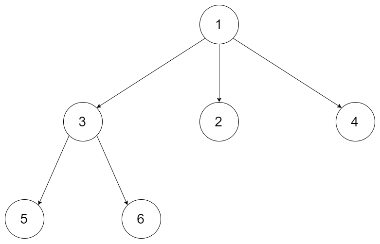

## Description

Given a `root` of an N-ary tree, return a <a href="https://en.wikipedia.org/wiki/Object_copying#Deep_copy" target="_blank">**deep copy**</a> (clone) of the tree.

Each node in the n-ary tree contains a val (`int`) and a list ($\text{List}[Node]$) of its children.

```
class Node {
    public int val;
    public List<Node> children;
}
```

*Nary-Tree input serialization is represented in their level order traversal, each group of children is separated by the null value (See examples).*
### Function Contract

**Inputs**

- `root`: The N-ary `Node` root, or `None` for an empty tree. Each node exposes `val` and an ordered `children` list.

Let $N$ be the total number of nodes in the tree and $H$ the tree height.

**Return value**

Return the root of a newly allocated N-ary tree with the same values, shape, and child ordering as the input tree. For the app-local representation, return an equal but independently allocated `Node` structure. Return `None` for an empty tree.

### Examples

#### Example 1



- **Input:** `root = [1,null,3,2,4,null,5,6]`
- **Output:** `[1,null,3,2,4,null,5,6]`
#### Example 2


- **Input:** `root = [1,null,2,3,4,5,null,null,6,7,null,8,null,9,10,null,null,11,null,12,null,13,null,null,14]`
- **Output:** `[1,null,2,3,4,5,null,null,6,7,null,8,null,9,10,null,null,11,null,12,null,13,null,null,14]`
### Constraints

- The depth of the n-ary tree is less than or equal to `1000`.

- The total number of nodes is between $[0, 10^{4}]$.

**Follow up: **Can your solution work for the <a href="https://leetcode.com/problems/clone-graph/" target="_blank">graph problem</a>?