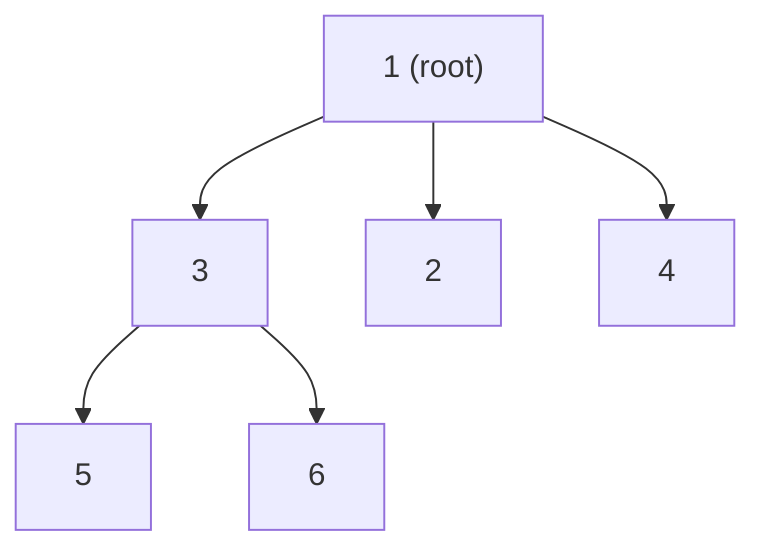
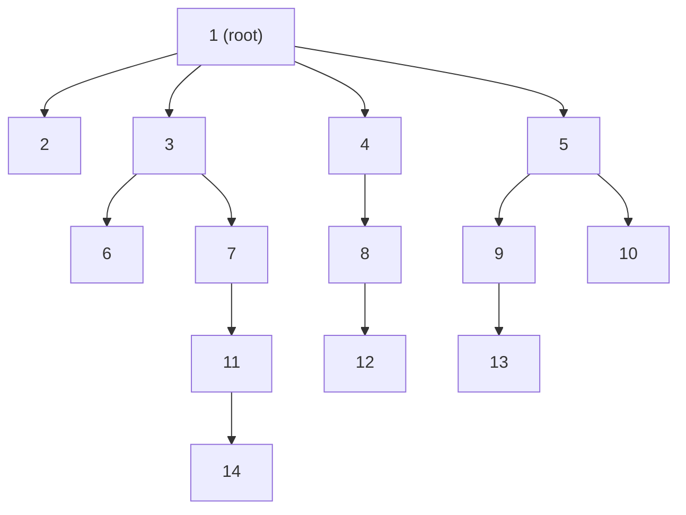

## Examples

**Example 1**

- **Input:** `root = [1,null,3,2,4,null,5,6]`

- **Output:** `[1,null,3,2,4,null,5,6]`
- **Explanation:** The cloned tree reproduces the root's child order `3, 2, 4` and the child nodes `5, 6` under node `3`, with every node object independently allocated.

**Example 2**

- **Input:** `root = [1,null,2,3,4,5,null,null,6,7,null,8,null,9,10,null,null,11,null,12,null,13,null,null,14]`

- **Output:** `[1,null,2,3,4,5,null,null,6,7,null,8,null,9,10,null,null,11,null,12,null,13,null,null,14]`
- **Explanation:** Subtrees with varying depths and branching factors are cloned in exact structural order.

**Example 3**

- **Input:** `root = []`
- **Output:** `[]`
