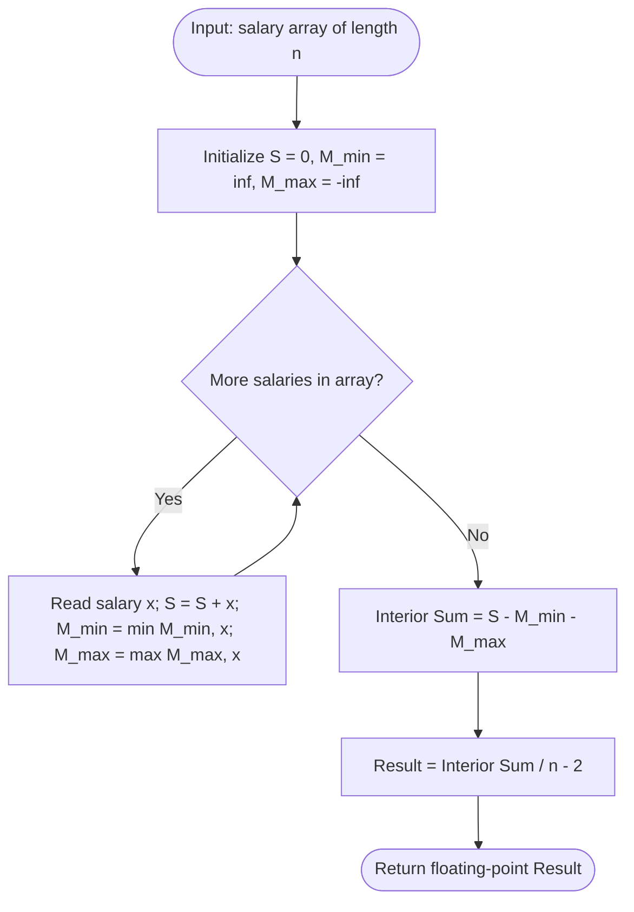

# Guided Example: Average Salary Excluding the Minimum and Maximum Salary

We trace the step-by-step execution of the single-pass extremal accumulation algorithm on a representative problem instance:

- **Input:** `salary = [4000, 3000, 1000, 2000]`
- **Required Output:** `2500.0`

This instance illustrates the core mechanics of robust trimmed statistics: identifying global extrema dynamically, maintaining an exact running sum, eliminating the single smallest and single largest outliers, and computing the precise arithmetic mean across the interior sample.

---

## 1. Instance & Teaching Goal

Given an array of unique integers `salary` representing the compensation of $n$ distinct employees, we must compute the trimmed average salary obtained by excluding the single minimum salary and the single maximum salary:
$$\text{Average} = \frac{\sum_{x \in \text{Interior}} x}{n - 2}$$

For `salary = [4000, 3000, 1000, 2000]` with $n = 4$:
- Global minimum: $M_{\min} = 1000$.
- Global maximum: $M_{\max} = 4000$.
- Interior salaries after excluding extrema: $[3000, 2000]$.
- Interior sum: $3000 + 2000 = 5000$.
- Remaining employee count: $4 - 2 = 2$.
- Trimmed average: $\frac{5000}{2} = 2500.0$.

A naive approach sorts the array in $\mathcal{O}(n \log n)$ time and sums indices $1$ through $n-2$.

The optimal approach recognizes that sorting is entirely unnecessary. By tracking the total sum $S$, the running minimum $M_{\min}$, and the running maximum $M_{\max}$ simultaneously during a single forward pass, the interior sum is directly obtained in $\mathcal{O}(n)$ time via:
$$S_{\text{interior}} = S - M_{\min} - M_{\max}$$

---

## 2. Conceptual Foundation & Invariants

We process the stream of salaries in a single pass without storing intermediate subsets:

```
Single-Pass Streaming Architecture:
Initialize: S = 0, M_min = +infinity, M_max = -infinity

For each salary x:
  S     = S + x
  M_min = min(M_min, x)
  M_max = max(M_max, x)

At Array Termination:
  Interior Sum = S - M_min - M_max
  Average      = Interior Sum / (n - 2)
```

We define the primary state tracking parameters:

| Parameter | Mathematical Domain | Operational Responsibility | State at Inception |
|---|---|---|---|
| Employee Index $i$ | Integer $\in [0, n-1]$ | Position of current employee in array | $0$ |
| Current Salary $x$ | Integer $\in [1000, 10^6]$ | Value of `salary[i]` | $4000$ |
| Cumulative Sum $S$ | Integer $\ge 0$ | Running total of all salaries seen so far | $0$ |
| Running Minimum $M_{\min}$ | Integer $\ge 0$ | Smallest salary observed up to index $i$ | $+\infty$ |
| Running Maximum $M_{\max}$ | Integer $\ge 0$ | Largest salary observed up to index $i$ | $-\infty$ |

> **Single-Pass Extremal Accumulation Invariant.** After processing employee $i$, the running accumulator $S$ equals $\sum_{k=0}^i \text{salary}[k]$, $M_{\min} = \min_{0 \le k \le i} \text{salary}[k]$, and $M_{\max} = \max_{0 \le k \le i} \text{salary}[k]$. After the entire array is scanned, $(S - M_{\min} - M_{\max})$ exactly equals the sum of the $n - 2$ interior elements without requiring sorting.



---

## 3. Step-by-Step Worked Execution

### Step 1: Employee $0$ — Salary $4000$
- Read first value $x = 4000$.
- Update cumulative sum:
  $$S = 0 + 4000 = 4000$$
- Update minimum and maximum:
  $$M_{\min} = \min(\infty, 4000) = 4000$$
  $$M_{\max} = \max(-\infty, 4000) = 4000$$

| Parameter | State Before Step | Operation / Rule Applied | State After Step |
|---|---|---|---|
| Employee Cursor | Unset | Read index $0$: $x = 4000$ | $i = 0$ |
| Running Sum $S$ | $0$ | $0 + 4000 = 4000$ | $4000$ |
| Extremal Bounds | $(\infty, -\infty)$ | Initialized to first element | $M_{\min} = 4000, M_{\max} = 4000$ |

---

### Step 2: Employee $1$ — Salary $3000$
- Read second value $x = 3000$.
- Update cumulative sum:
  $$S = 4000 + 3000 = 7000$$
- Update minimum and maximum:
  $$M_{\min} = \min(4000, 3000) = 3000$$
  $$M_{\max} = \max(4000, 3000) = 4000$$

| Parameter | State Before Step | Operation / Rule Applied | State After Step |
|---|---|---|---|
| Employee Cursor | $0$ | Advance to index $1$: $x = 3000$ | $i = 1$ |
| Running Sum $S$ | $4000$ | $4000 + 3000 = 7000$ | $7000$ |
| Extremal Bounds | $(4000, 4000)$ | $3000 < 4000 \implies$ update $M_{\min}$ | $M_{\min} = 3000, M_{\max} = 4000$ |

---

### Step 3: Employee $2$ — Salary $1000$
- Read third value $x = 1000$.
- Update cumulative sum:
  $$S = 7000 + 1000 = 8000$$
- Update minimum and maximum:
  $$M_{\min} = \min(3000, 1000) = 1000$$
  $$M_{\max} = \max(4000, 1000) = 4000$$

| Parameter | State Before Step | Operation / Rule Applied | State After Step |
|---|---|---|---|
| Employee Cursor | $1$ | Advance to index $2$: $x = 1000$ | $i = 2$ |
| Running Sum $S$ | $7000$ | $7000 + 1000 = 8000$ | $8000$ |
| Extremal Bounds | $(3000, 4000)$ | $1000 < 3000 \implies$ update $M_{\min}$ | $M_{\min} = 1000, M_{\max} = 4000$ |

---

### Step 4: Employee $3$ — Salary $2000$
- Read fourth value $x = 2000$.
- Update cumulative sum:
  $$S = 8000 + 2000 = 10000$$
- Update minimum and maximum:
  $$M_{\min} = \min(1000, 2000) = 1000$$
  $$M_{\max} = \max(4000, 2000) = 4000$$

| Parameter | State Before Step | Operation / Rule Applied | State After Step |
|---|---|---|---|
| Employee Cursor | $2$ | Advance to index $3$: $x = 2000$ | $i = 3$ |
| Running Sum $S$ | $8000$ | $8000 + 2000 = 10000$ | $10000$ |
| Extremal Bounds | $(1000, 4000)$ | $1000 \le 2000 \le 4000 \implies$ unchanged | $M_{\min} = 1000, M_{\max} = 4000$ |

---

### Step 5: Trimmed Average Calculation
All $n = 4$ salaries have been scanned.
1. Compute the interior sum by subtracting the extrema:
   $$S_{\text{interior}} = S - M_{\min} - M_{\max} = 10000 - 1000 - 4000 = 5000$$
2. Compute the trimmed divisor:
   $$\text{count}_{\text{interior}} = n - 2 = 4 - 2 = 2$$
3. Perform division:
   $$\text{Average} = \frac{5000}{2} = 2500.0$$

| Calculation Stage | Mathematical Formula | Arithmetic Evaluation | Final Result |
|---|---|---|---|
| Total Sum $S$ | $\sum_{i=0}^3 \text{salary}[i]$ | $4000 + 3000 + 1000 + 2000$ | $10000$ |
| Excluded Extrema | $M_{\min} + M_{\max}$ | $1000 + 4000$ | $5000$ |
| Trimmed Numerator | $S - M_{\min} - M_{\max}$ | $10000 - 5000$ | $5000$ |
| Trimmed Denominator | $n - 2$ | $4 - 2$ | $2$ |
| Trimmed Mean | $\frac{S_{\text{interior}}}{n - 2}$ | $\frac{5000}{2}$ | $2500.0$ |

---

## 4. Complete Execution Trace

The table below tracks running accumulators across all employees:

| Step $i$ | Employee Salary $x$ | Prior Sum $S$ | New Sum $S$ | Prior $M_{\min}$ | Updated $M_{\min}$ | Prior $M_{\max}$ | Updated $M_{\max}$ |
|---|---|---|---|---|---|---|---|
| 0 | $4000$ | $0$ | $4000$ | $\infty$ | $4000$ | $-\infty$ | $4000$ |
| 1 | $3000$ | $4000$ | $7000$ | $4000$ | $3000$ | $4000$ | $4000$ |
| 2 | $1000$ | $7000$ | $8000$ | $3000$ | $1000$ | $4000$ | $4000$ |
| 3 | $2000$ | $8000$ | $10000$ | $1000$ | $1000$ | $4000$ | $4000$ |

Final post-processing:
$$\text{Average} = \frac{10000 - 1000 - 4000}{4 - 2} = \frac{5000}{2} = 2500.0$$

---

## 5. Algorithmic Correctness

### Soundness

1. **Extremal Separation:** Let $A = \{x_1, \dots, x_n\}$ be the multiset of salaries with $n \ge 3$. Since all elements in `salary` are guaranteed unique by the problem specification, there is exactly one minimum element $m$ and exactly one maximum element $M$.
2. **Algebraic Identity:** The sum of the interior $n - 2$ elements is mathematically identical to the total sum minus $m$ and $M$:
   $$\sum_{x \in A \setminus \{m, M\}} x = \left(\sum_{x \in A} x\right) - m - M$$
3. Dividing by the exact count $n - 2$ yields the authentic arithmetic mean of the interior sample.

### Completeness

A single linear pass inspects every element in `salary` once, ensuring that both the global minimum and global maximum are captured without omission.

---

## 6. Traps This Instance Exposes

### Trap 1: Integer Division Truncation
In statically typed languages (C++, Java, C#), dividing an integer sum by an integer count performs integer truncation (e.g., $5 / 2 = 2$ instead of $2.5$). The divisor or dividend must be cast to a floating-point type (`double` or `float`) before division.

### Trap 2: Quadratic Sorting Latency
Sorting the array takes $\mathcal{O}(n \log n)$ time. While acceptable for $n = 100$, in streaming systems where $n = 10^7$, sorting introduces unnecessary CPU and memory overhead. The single-pass streaming reduction operates in strictly $\mathcal{O}(n)$ time and $\mathcal{O}(1)$ space.

### Trap 3: Numeric Overflow on Large Sums
The constraints state $n \le 1000$ and $\text{salary}[i] \le 10^6$. The maximum total sum is $1000 \times 10^6 = 10^9$, which fits within standard 32-bit signed integers ($2^{31} - 1 \approx 2.14 \times 10^9$). In systems with larger counts ($n > 2500$), the sum exceeds 32 bits and requires a 64-bit accumulator (`long long` or `int64`).

---

## 7. Complexity Derivation

### Time Complexity

- The algorithm traverses the array of $n$ elements in a single pass.
- In each iteration, three constant-time scalar operations are performed:
  - Addition to running sum: $\mathcal{O}(1)$
  - Minimum comparison: $\mathcal{O}(1)$
  - Maximum comparison: $\mathcal{O}(1)$
- Final subtraction and division take $\mathcal{O}(1)$ time.
- Total time complexity:
$$\mathcal{O}(n)$$
For $n = 1000$, execution requires fewer than $3000$ CPU cycles, finishing in under $0.05\text{ ms}$.

### Auxiliary Space Complexity

- The algorithm allocates only three scalar accumulator variables ($S$, $M_{\min}$, $M_{\max}$).
- No dynamic memory, auxiliary arrays, or recursion stacks are utilized.
- Total auxiliary space complexity:
$$\mathcal{O}(1)$$
