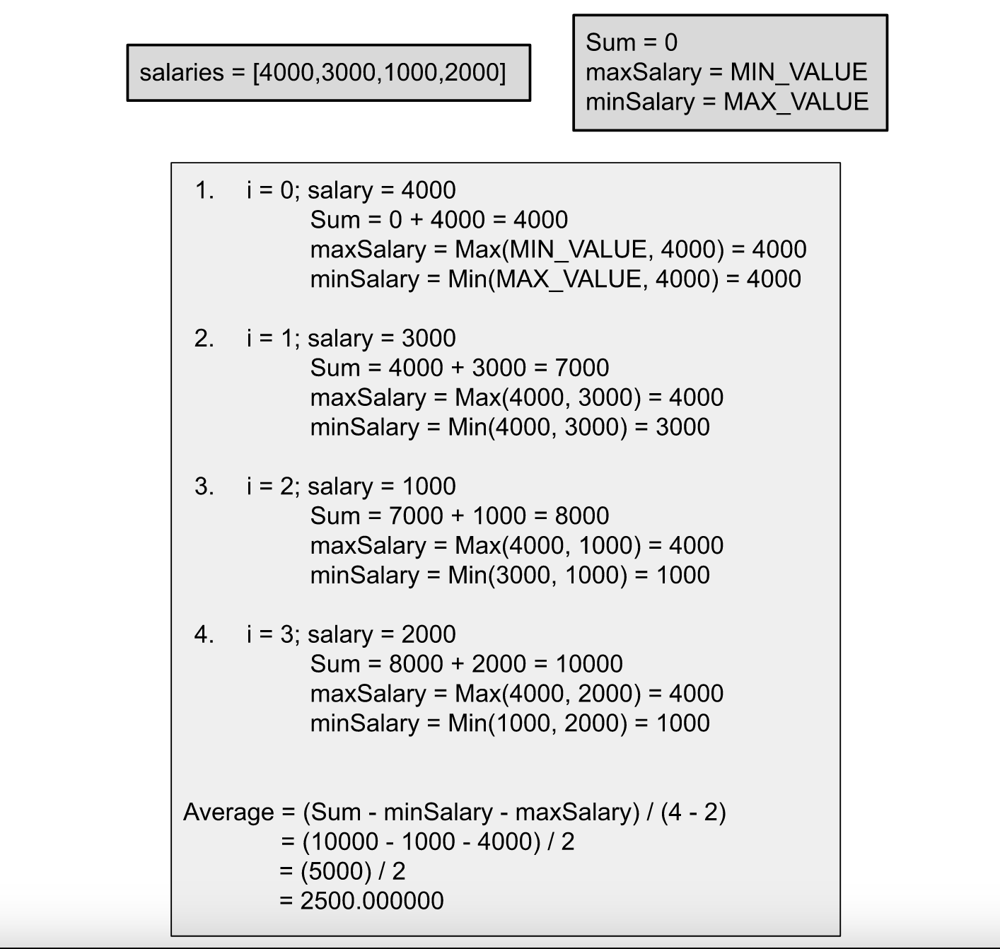

## Solution

---

### Approach:

**Intuition**

We are given $N$ unique positive integers representing the salaries of $N$ employees. We need to return the average of these salaries without including the minimum and maximum salaries.

One way to solve this problem is to first find the minimum salary by iterating over the salaries and then find the maximum salary in the same way. Then find the sum of the salaries and exclude the values that are equal to the minimum or the maximum salary (as the salaries are unique). This approach will require us to iterate over the salaries thrice or twice if we find the minimum and maximum in a single iteration.

We can solve the problem in a single iteration as well; while finding the minimum and maximum salaries, we can keep summing up all the salaries, and in the end, we can just subtract the minimum and maximum values to get the required sum. Note that to find the average, we need to divide by $N - 2$ as we have excluded two employees.



**Algorithm**

1. Initialize `minSalary` to the maximum possible value, `maxSalary` to the minimum possible value, and `sum` to `0`.
2. Iterate over `salaries` and for each `salary`:

- Add it to the variable `sum.`
- Update the variable `minSalary` if the current salary is smaller than it.
- Update the variable `maxSalary` if the current salary exceeds it.

3. Return the value $sum / (N -2)$; remember to cast the numerator and denominator to double; otherwise, the result will be an integer and won't be precise.

**Implementation**

```cpp
class Solution {
public:
    double average(vector<int>& salaries) {
        int minSalary = INT_MAX;
        int maxSalary = INT_MIN;
        int sum = 0;

        for (int salary : salaries) {
            // Sum of all the salaries.
            sum += salary;
            // Update the minimum salary.
            minSalary = min(minSalary, salary);
            // Update the maximum salary.
            maxSalary = max(maxSalary, salary);
        }

        // Divide the sum by total size - 2, as we exclude minimum and maximum values.
        return (double)(sum - minSalary - maxSalary) / (double)(salaries.size() - 2);
    }
};
```

**Complexity Analysis**

Here, $N$ is the number of salaries.

* Time complexity: $O(N)$.

  We just iterate over the salaries once, and hence the total time complexity would be $O(N)$.

* Space complexity: $O(1)$.

  We only need three variables to store the total sum, the maximum value and the minimum value. Hence, the total space complexity would be constant.
  <br/>

---