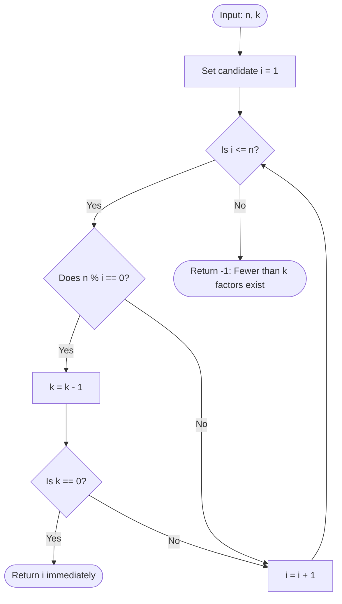

# Guided Example: The kth Factor of n

We trace the step-by-step execution of the sequential factor enumeration algorithm on a representative problem instance:

- **Input:** $n = 12$, $k = 3$
- **Factor Sequence of $12$:** $[1, 2, 3, 4, 6, 12]$
- **Required Output:** $3$

This instance illustrates the core properties of arithmetic factor extraction: testing integer divisibility via modular arithmetic, sequentially accumulating factors in strictly ascending order, decrementing the rank target, and triggering an immediate early exit upon reaching rank $k$.

---

## 1. Instance & Teaching Goal

An integer $i$ is defined as a factor (or divisor) of $n$ if $n \bmod i = 0$. Given two positive integers $n$ and $k$, we must determine the $k$-th smallest factor of $n$, or return $-1$ if $n$ has fewer than $k$ total factors.

For $n = 12$ and $k = 3$:
- The complete set of positive divisors of $12$ is $\{1, 2, 3, 4, 6, 12\}$.
- Arranged in ascending order:
  $$\text{Factors} = [1, 2, 3, 4, 6, 12]$$
- The total factor count is $6 \ge k = 3$.
- The $1$-st factor is $1$.
- The $2$-nd factor is $2$.
- The $3$-rd factor is $3$.
- Therefore, the $3$-rd factor of $12$ is $3$.

A naive approach might compute all prime factorizations or store all divisors in an auxiliary list before sorting.

The optimal linear approach tests integers $i$ sequentially from $1$ to $n$. Because testing proceeds in strictly increasing order ($1, 2, 3, \dots$), factors are naturally discovered in sorted order without requiring any post-sorting. Decrementing a remaining rank counter $k$ allows the algorithm to halt immediately the moment the $k$-th factor is identified.

---

## 2. Conceptual Foundation & Invariants

Testing divisibility $n \bmod i == 0$ evaluates whether $i$ evenly divides $n$ with zero remainder:

```
Candidate Stream: i = 1, 2, 3, 4, ...
Target Rank: k = 3

i = 1: 12 % 1 == 0 -> Factor found! Decrement k: 3 -> 2
i = 2: 12 % 2 == 0 -> Factor found! Decrement k: 2 -> 1
i = 3: 12 % 3 == 0 -> Factor found! Decrement k: 1 -> 0 -> RETURN 3!
```

We define the primary state tracking parameters:

| Parameter | Mathematical Domain | Operational Responsibility | Initial State |
|---|---|---|---|
| Candidate Divisor $i$ | Integer $\in [1, n]$ | Current integer being evaluated for divisibility | $1$ |
| Modulo Remainder | Integer $\in [0, i-1]$ | Result of $n \bmod i$ | $12 \bmod 1 = 0$ |
| Remaining Rank $k$ | Integer $\ge 0$ | Number of factors left to discover before reaching goal | $3$ |
| Active Divisor Count | Integer $\ge 0$ | Running count of confirmed factors discovered | $0$ |

> **Ascending Divisor Enumeration Invariant.** Incrementing candidate $i$ sequentially from $1$ to $n$ evaluates divisors in strictly ascending numerical order. Whenever $n \bmod i = 0$, decrementing $k$ preserves the property that $i$ is the $(k_{\text{initial}} - k)$-th factor of $n$. When $k$ reaches $0$, candidate $i$ is mathematically guaranteed to be the exact $k$-th factor.



---

## 3. Step-by-Step Worked Execution

### Step 1: Candidate $i = 1$
- Evaluate remainder:
  $$12 \bmod 1 = 0$$
- Remainder is $0$; integer $1$ is a valid factor of $12$.
- Decrement remaining rank counter:
  $$k = 3 - 1 = 2$$
- Check termination: $k = 2 \ne 0$. Continue search.

| Parameter | State Before Step | Operation / Rule Applied | State After Step |
|---|---|---|---|
| Candidate $i$ | Unset | Initialize at $i = 1$ | $1$ |
| Modulo Test | None | $12 \bmod 1 = 0$ (Divisible) | Factor $1$ confirmed |
| Rank Counter $k$ | $3$ | Decrement by $1$ | $2$ |
| Exit Condition | $k > 0$ | $k = 2 \ne 0 \implies$ Continue | Advance $i$ |

---

### Step 2: Candidate $i = 2$
- Advance cursor to $i = 2$.
- Evaluate remainder:
  $$12 \bmod 2 = 0$$
- Remainder is $0$; integer $2$ is a valid factor of $12$.
- Decrement remaining rank counter:
  $$k = 2 - 1 = 1$$
- Check termination: $k = 1 \ne 0$. Continue search.

| Parameter | State Before Step | Operation / Rule Applied | State After Step |
|---|---|---|---|
| Candidate $i$ | $1$ | Increment cursor to $i = 2$ | $2$ |
| Modulo Test | None | $12 \bmod 2 = 0$ (Divisible) | Factor $2$ confirmed |
| Rank Counter $k$ | $2$ | Decrement by $1$ | $1$ |
| Exit Condition | $k > 0$ | $k = 1 \ne 0 \implies$ Continue | Advance $i$ |

---

### Step 3: Candidate $i = 3$ (Target Factor Identified)
- Advance cursor to $i = 3$.
- Evaluate remainder:
  $$12 \bmod 3 = 0$$
- Remainder is $0$; integer $3$ is a valid factor of $12$.
- Decrement remaining rank counter:
  $$k = 1 - 1 = 0$$
- Check termination: $k = 0$. Condition met!
- The $3$-rd factor of $12$ is identified as $3$.
- The algorithm halts immediately and returns $3$.

| Parameter | State Before Step | Operation / Rule Applied | State After Step |
|---|---|---|---|
| Candidate $i$ | $2$ | Increment cursor to $i = 3$ | $3$ |
| Modulo Test | None | $12 \bmod 3 = 0$ (Divisible) | Factor $3$ confirmed |
| Rank Counter $k$ | $1$ | Decrement by $1$ | $0$ |
| Exit Condition | $k = 1$ | $k == 0 \implies$ Early return | Return $3$ |

---

## 4. Complete Execution Trace

The table below summarizes all candidate evaluations from $i = 1$ to termination:

| Step | Candidate $i$ | Arithmetic Remainder $12 \bmod i$ | Is Divisor? | Rank $k$ Before | Rank $k$ After | Action / Outcome |
|---|---|---|---|---|---|---|
| 1 | $1$ | $0$ | **Yes** | $3$ | $2$ | 1st factor found; continue |
| 2 | $2$ | $0$ | **Yes** | $2$ | $1$ | 2nd factor found; continue |
| 3 | $3$ | $0$ | **Yes** | $1$ | $0$ | **3rd factor reached; return $3$** |

Subsequent potential divisors of $12$ ($4, 6, 12$) are never inspected, as the early-exit condition terminates execution immediately at $i = 3$.

Final returned value:
$$\text{result} = 3$$

---

## 5. Algorithmic Correctness

### Soundness

1. **Ascending Order Guarantee:** The search iterates candidate $i$ strictly as $1, 2, 3, \dots, n$. Since $i_1 < i_2$ for any two successive steps, any set of confirmed divisors $\{d_1, d_2, \dots, d_m\}$ satisfies $d_1 < d_2 < \dots < d_m$.
2. **Rank Matching:** Starting with target rank $k$, exactly $k$ confirmed divisors cause $k$ to reach $0$. The divisor active when $k$ becomes $0$ is precisely the $k$-th smallest positive factor of $n$.

### Completeness

1. If $n$ possesses at least $k$ factors, the loop is guaranteed to encounter the $k$-th factor at or before $i = n$ and return it.
2. If $n$ has fewer than $k$ factors (total divisors $\tau(n) < k$), the loop exhausts all candidates $1 \dots n$ without $k$ reaching $0$. The algorithm falls through the loop and returns $-1$.

---

## 6. Traps This Instance Exposes

### Trap 1: Halting the Search at $n / 2$
A common misconception in divisor loops is iterating only up to $\lfloor n / 2 \rfloor$. For $n = 7$ and $k = 2$, divisors are $[1, 7]$. Stopping at $7 / 2 = 3$ fails to find factor $7$, erroneously returning $-1$. The loop boundary must include $n$ itself ($i \le n$).

### Trap 2: Off-By-One in Rank Tracking
Because $k$ is 1-based, decrementing $k$ upon each factor correctly reaches $0$ on the $k$-th factor. Checking `if k == 1` before decrementing or decrementing before checking can cause premature termination on the $(k-1)$-th factor. The order must be strictly consistent.

### Trap 3: Full Factor Array Materialization
Collecting all factors into an array and sorting takes extra memory and time. Testing sequentially enables early termination as soon as the $k$-th factor is found, avoiding evaluating larger factors.

---

## 7. Complexity Derivation

### Time Complexity

- **Sequential Scan:** In the worst case (when $k = \tau(n)$ or no solution exists), the loop iterates $n$ times.
- **Divisibility Check:** In each iteration, a single integer modulo operation $n \bmod i$ is executed in $\mathcal{O}(1)$ time.
- **Early Exit:** For many instances, execution halts at $i \ll n$ (in our instance, halting at $i = 3$ instead of $12$).
- Total time complexity:
$$\mathcal{O}(n)$$
For $n \le 1000$, $1000$ operations execute in under $0.01\text{ ms}$.

*(Note: Divisors can also be extracted in $\mathcal{O}(\sqrt{n})$ time by pairing each divisor $d \le \sqrt{n}$ with its complement $n/d$).*

### Auxiliary Space Complexity

- The algorithm maintains only two scalar integer registers ($i$ and $k$).
- No arrays, lists, or heap structures are allocated.
- Total auxiliary space complexity:
$$\mathcal{O}(1)$$
