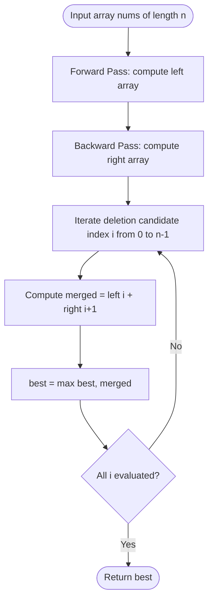

# Guided Example: Longest Subarray of 1's After Deleting One Element

We trace the step-by-step execution of the prefix-suffix consecutive runs algorithm on a representative problem instance:

- **Input:** `nums = [0, 1, 1, 1, 0, 1, 1, 0, 1]`
- **Required Output:** `5`

This instance demonstrates the core trade-off of the problem: multiple zeroes partition the array into disconnected runs of 1s of varying lengths ($3$, $2$, and $1$), and we must determine which separating element to delete to bridge the two longest adjacent runs into an optimal contiguous block.

---

## 1. Instance & Teaching Goal

Given a binary array `nums`, you must delete exactly one element from it. Your goal is to maximize the length of the longest contiguous subarray containing only 1's in the resulting array. If no 1's remain, return $0$.

For `nums = [0, 1, 1, 1, 0, 1, 1, 0, 1]` with $n = 9$:
- Zeroes are located at indices $0$, $4$, and $7$.
- Contiguous runs of 1s:
  - Run 1 (indices $1 \dots 3$): length $3$
  - Run 2 (indices $5 \dots 6$): length $2$
  - Run 3 (index $8$): length $1$
- If we delete the zero at index $4$:
  - Run 1 and Run 2 are merged directly together: $[1, 1, 1] + [1, 1]$.
  - The resulting contiguous sequence of 1s has length $3 + 2 = 5$.
- If we delete the zero at index $7$:
  - Run 2 and Run 3 merge into a block of length $2 + 1 = 3$.
- If we delete the zero at index $0$:
  - Run 1 remains isolated with length $3$.

Deleting an element from scratch for every candidate takes $\mathcal{O}(n^2)$ time.

The optimal approach precomputes the length of consecutive 1s ending before each position (`left`) and starting after each position (`right`). For any index $i$, deleting element $i$ bridges the left run and the right run, achieving length $left[i] + right[i+1]$ in $\mathcal{O}(1)$ time.

---

## 2. Conceptual Foundation & Invariants

Let $n$ be the length of `nums`.
1. **Left Prefix Array:** $left[i]$ stores the number of consecutive 1s immediately ending at index $i-1$.
   $$left[i] = \begin{cases} left[i-1] + 1 & \text{if } nums[i-1] == 1 \\ 0 & \text{if } nums[i-1] == 0 \end{cases}$$
2. **Right Suffix Array:** $right[i]$ stores the number of consecutive 1s starting at index $i$.
   $$right[i] = \begin{cases} right[i+1] + 1 & \text{if } nums[i] == 1 \\ 0 & \text{if } nums[i] == 0 \end{cases}$$
3. **Bridge Evaluation:** Deleting element $i$ removes the barrier separating prefix $left[i]$ from suffix $right[i+1]$, producing a merged run of length:
   $$\text{merged}[i] = left[i] + right[i+1]$$

```
Array nums:   [ 0 ,  1 ,  1 ,  1 ,  0 ,  1 ,  1 ,  0 ,  1 ]
Indices:        0    1    2    3    4    5    6    7    8

left[i]:      [ 0 ,  0 ,  1 ,  2 ,  3 ,  0 ,  1 ,  2 ,  0 ,  1 ]
right[i]:     [ 0 ,  3 ,  2 ,  1 ,  0 ,  2 ,  1 ,  0 ,  1 ,  0 ]

Candidate Deletion at i = 4 (value 0):
left[4]     = 3 (from indices 1..3)
right[4+1]  = right[5] = 2 (from indices 5..6)
Merged Run  = 3 + 2 = 5 (Global Maximum!)
```

We establish the core parameters:

| Parameter | Domain | Role & Definition | Initial State |
|---|---|---|---|
| Binary Array `nums` | Array of $\{0, 1\}$ | Input sequence of length $n$ | Length $9$ |
| Prefix 1s Array `left` | Array of length $n+1$ | $left[i]$: consecutive 1s ending at $i-1$ | All $0$ |
| Suffix 1s Array `right` | Array of length $n+1$ | $right[i]$: consecutive 1s starting at $i$ | All $0$ |
| Deletion Candidate $i$ | Integer $\in [0, n-1]$ | Element chosen to be deleted | $0$ |
| Merged Length | Integer $\ge 0$ | $left[i] + right[i+1]$ | $0$ |

> **Bridge Deletion & Segment Concatenation Invariant.** Deleting the element at index $i$ concatenates the contiguous run of 1s ending at $i-1$ with the contiguous run of 1s starting at $i+1$. Because the arrays $left$ and $right$ capture the exact lengths of these maximal contiguous runs, $left[i] + right[i+1]$ computes the exact length of the resulting 1-run in $\mathcal{O}(1)$ time.



---

## 3. Step-by-Step Worked Execution

### Step 1: Forward Pass to Populate `left` Array
We iterate $i$ from $1$ to $n$ ($n = 9$):
- $i = 1$: $nums[0] = 0 \implies left[1] = 0$
- $i = 2$: $nums[1] = 1 \implies left[2] = left[1] + 1 = 1$
- $i = 3$: $nums[2] = 1 \implies left[3] = left[2] + 1 = 2$
- $i = 4$: $nums[3] = 1 \implies left[4] = left[3] + 1 = 3$
- $i = 5$: $nums[4] = 0 \implies left[5] = 0$
- $i = 6$: $nums[5] = 1 \implies left[6] = left[5] + 1 = 1$
- $i = 7$: $nums[6] = 1 \implies left[7] = left[6] + 1 = 2$
- $i = 8$: $nums[7] = 0 \implies left[8] = 0$
- $i = 9$: $nums[8] = 1 \implies left[9] = left[8] + 1 = 1$

Resulting `left` table:
$$left = [0, 0, 1, 2, 3, 0, 1, 2, 0, 1]$$

---

### Step 2: Backward Pass to Populate `right` Array
We iterate $i$ from $n-1 = 8$ down to $0$:
- $i = 8$: $nums[8] = 1 \implies right[8] = right[9] + 1 = 1$
- $i = 7$: $nums[7] = 0 \implies right[7] = 0$
- $i = 6$: $nums[6] = 1 \implies right[6] = right[7] + 1 = 1$
- $i = 5$: $nums[5] = 1 \implies right[5] = right[6] + 1 = 2$
- $i = 4$: $nums[4] = 0 \implies right[4] = 0$
- $i = 3$: $nums[3] = 1 \implies right[3] = right[4] + 1 = 1$
- $i = 2$: $nums[2] = 1 \implies right[2] = right[3] + 1 = 2$
- $i = 1$: $nums[1] = 1 \implies right[1] = right[2] + 1 = 3$
- $i = 0$: $nums[0] = 0 \implies right[0] = 0$

Resulting `right` table:
$$right = [0, 3, 2, 1, 0, 2, 1, 0, 1, 0]$$

---

### Step 3: Candidate Deletion Evaluation
We compute $left[i] + right[i+1]$ for each index $i \in [0, 8]$:

- **Index $i = 0$ ($nums[0] = 0$):**
  $$left[0] + right[1] = 0 + 3 = 3$$
- **Index $i = 1$ ($nums[1] = 1$):**
  $$left[1] + right[2] = 0 + 2 = 2$$
- **Index $i = 2$ ($nums[2] = 1$):**
  $$left[2] + right[3] = 1 + 1 = 2$$
- **Index $i = 3$ ($nums[3] = 1$):**
  $$left[3] + right[4] = 2 + 0 = 2$$
- **Index $i = 4$ ($nums[4] = 0$, Critical Bridge!):**
  $$left[4] + right[5] = 3 + 2 = \mathbf{5}$$
- **Index $i = 5$ ($nums[5] = 1$):**
  $$left[5] + right[6] = 0 + 1 = 1$$
- **Index $i = 6$ ($nums[6] = 1$):**
  $$left[6] + right[7] = 1 + 0 = 1$$
- **Index $i = 7$ ($nums[7] = 0$):**
  $$left[7] + right[8] = 2 + 1 = 3$$
- **Index $i = 8$ ($nums[8] = 1$):**
  $$left[8] + right[9] = 0 + 0 = 0$$

Maximum across all deletions:
$$\max(3, 2, 2, 2, \mathbf{5}, 1, 1, 3, 0) = 5$$

---

## 4. Complete Execution Trace

The table below summarizes the bridge calculation for every possible single-element deletion:

| Deletion Index $i$ | Value $nums[i]$ | Left Run $left[i]$ | Right Run $right[i+1]$ | Combined Run Length | Is New Global Maximum? | Running Maximum |
|---|---|---|---|---|---|---|
| $0$ | $0$ | $0$ | $3$ | $0 + 3 = 3$ | **Yes** | $3$ |
| $1$ | $1$ | $0$ | $2$ | $0 + 2 = 2$ | No | $3$ |
| $2$ | $1$ | $1$ | $1$ | $1 + 1 = 2$ | No | $3$ |
| $3$ | $1$ | $2$ | $0$ | $2 + 0 = 2$ | No | $3$ |
| $4$ | $0$ | $3$ | $2$ | $3 + 2 = \mathbf{5}$ | **Yes** | **$5$** |
| $5$ | $1$ | $0$ | $1$ | $0 + 1 = 1$ | No | $5$ |
| $6$ | $1$ | $1$ | $0$ | $1 + 0 = 1$ | No | $5$ |
| $7$ | $0$ | $2$ | $1$ | $2 + 1 = 3$ | No | $5$ |
| $8$ | $1$ | $0$ | $0$ | $0 + 0 = 0$ | No | $5$ |

The optimal deletion is confirmed at index $4$, yielding a maximum run of $5$.

---

## 5. Algorithmic Correctness

### Soundness

1. If an element at index $i$ is deleted, any contiguous subarray of 1s spanning across position $i$ consists of a prefix ending at $i-1$ and a suffix starting at $i+1$.
2. By definition of the recurrences, $left[i]$ is the exact maximal number of consecutive 1s ending at $i-1$, and $right[i+1]$ is the exact maximal number of consecutive 1s starting at $i+1$.
3. Since index $i$ is removed, these two contiguous runs become adjacent in the modified array.
4. Their combined length is strictly $left[i] + right[i+1]$.
5. Any contiguous run that does not span across position $i$ is contained entirely in either the left prefix or the right suffix, and its length is strictly bounded by $left[i]$ or $right[i+1]$.

### Completeness

The algorithm evaluates the bridge formula for all $i \in [0, n-1]$. Because exactly one element must be deleted, every legal deletion option is evaluated, guaranteeing the global maximum is found.

---

## 6. Traps This Instance Exposes

### Trap 1: Failing to Delete an Element When All Values are 1
If `nums = [1, 1, 1]`, a naive streak counter might report $3$. However, the problem statement mandates: *"you should delete one element from it"*. Deleting one element leaves $2$ ones, so the answer is $3 - 1 = 2$. The bridge formula evaluates $left[0] + right[1] = 0 + 2 = 2$, naturally adhering to this requirement.

### Trap 2: Quadratic Deletion Simulation
Instantiating a new array of length $n-1$ for each candidate index $i$ takes $\mathcal{O}(n)$ time per deletion, resulting in $\mathcal{O}(n^2)$ time. For $n = 10^5$, this requires $10^{10}$ operations. The prefix-suffix arrays resolve all $n$ candidates in a single linear pass.

### Trap 3: Boundary Off-By-One Errors
The right suffix lookup must be at index $i+1$. Forgetting the $+1$ offset ($left[i] + right[i]$) incorrectly includes element $i$ itself in the count, violating the deletion requirement.

---

## 7. Complexity Derivation

### Time Complexity

- **Forward Pass:** Populating array $left$ of length $n+1$ takes $\mathcal{O}(n)$ time.
- **Backward Pass:** Populating array $right$ of length $n+1$ takes $\mathcal{O}(n)$ time.
- **Maximum Bridge Evaluation:** Evaluating $left[i] + right[i+1]$ across all $n$ indices takes $\mathcal{O}(n)$ time.
- Total time complexity:
$$\mathcal{O}(n)$$
For $n = 10^5$, this executes $3 \times 10^5$ operations in under $5\text{ ms}$.

*(Note: The problem can also be solved in $\mathcal{O}(n)$ time and $\mathcal{O}(1)$ space using a sliding window tracking at most one zero).*

### Auxiliary Space Complexity

- Arrays $left$ and $right$ each allocate $n + 1$ integers.
- Total auxiliary space complexity:
$$\mathcal{O}(n)$$
For $n = 10^5$, this uses less than $2\text{ MB}$ of memory.