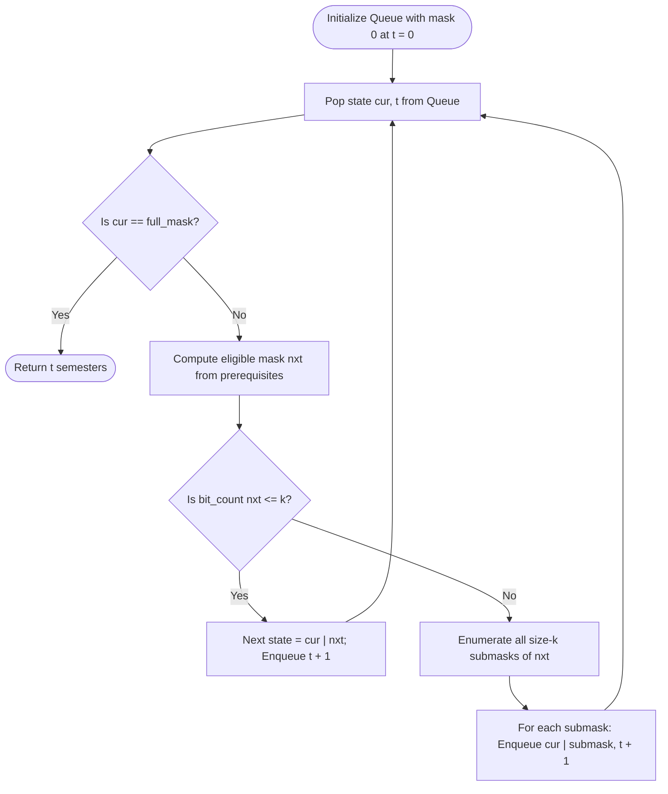

# Guided Example: Parallel Courses II

We trace the step-by-step execution of the bitmask breadth-first search (BFS) state-space exploration algorithm on a representative problem instance:

- **Input:** $n = 4$ courses, `relations = [[2, 1], [3, 1], [1, 4]]`, semester capacity $k = 2$
- **Required Output:** $3$

This instance demonstrates dependency bottlenecking in directed acyclic graphs (DAGs): courses $2$ and $3$ must both complete before course $1$ becomes eligible, and course $4$ is strictly gated behind course $1$, with a semester capacity constraint $k = 2$ limiting parallel acceleration.

---

## 1. Instance & Teaching Goal

You are given $n$ courses labeled $1$ to $n$ and an array of prerequisite pairs $[u, v]$ indicating that course $u$ must be taken in an earlier semester than course $v$. In any single semester, you can take at most $k$ courses, provided all prerequisites for each chosen course were completed in strictly prior semesters. We must determine the minimum number of semesters needed to complete all $n$ courses.

For $n = 4$, $\text{relations} = [[2, 1], [3, 1], [1, 4]]$, and $k = 2$:
- Course $1$ requires courses $2$ and $3$.
- Course $4$ requires course $1$.
- Courses $2$ and $3$ have no prerequisites and can be taken immediately.
- In Semester 1: We take both course $2$ and course $3$ (capacity $k = 2$).
- In Semester 2: Course $1$'s prerequisites $\{2, 3\}$ are satisfied. We take course $1$.
- In Semester 3: Course $4$'s prerequisite $\{1\}$ is satisfied. We take course $4$.
- Total semesters elapsed: $3$.

A greedy heuristic (such as taking courses with the highest out-degree or longest remaining path) fails on general DAGs because tie-breaking can lead to deadlocks or sub-optimal future semesters.

Since $n \le 15$, the set of completed courses can be modeled compactly as an integer bitmask. Finding the minimum number of semesters is equivalent to finding the shortest path from state $0$ (no courses completed) to state $(2^n - 1)$ (all courses completed) in an unweighted state-transition graph, which is optimally solved via Breadth-First Search (BFS).

---

## 2. Conceptual Foundation & Invariants

Each state is an integer mask where the $i$-th bit is $1$ if course $i$ has been completed, and $0$ otherwise.
1. **Prerequisite Mask:** For each course $i$, we precompute a bitmask $d[i]$ where the $j$-th bit is $1$ if course $j$ is a direct prerequisite of course $i$.
2. **Eligibility Condition:** A course $i$ is unlocked and eligible to be taken in the current semester if:
   - It has not been taken yet: $(\text{cur} \ \& \ (1 \ll i)) == 0$.
   - All its prerequisites are completed: $(\text{cur} \ \& \ d[i]) == d[i]$.
3. **Transition:**
   - Let $\text{nxt}$ be the mask of all currently eligible courses.
   - If the number of eligible courses is $\le k$, we take all of them in this semester, transitioning to state $\text{cur} \mid \text{nxt}$.
   - If more than $k$ courses are eligible, we iterate through all submasks of $\text{nxt}$ having exactly $k$ bits, branching to each $\text{cur} \mid \text{submask}$ in semester $t + 1$.

```
Dependency Graph:
   (2)       (3)       [In-degree 0: Eligible in Semester 1]
     \       /
      v     v
        (1)            [Needs 2 AND 3: Eligible in Semester 2]
         |
         v
        (4)            [Needs 1: Eligible in Semester 3]

State Progression (Bitmask representation: b4 b3 b2 b1):
Semester 0: 0000_2 (0 completed)
Semester 1: 0110_2 (courses 2 and 3 completed)
Semester 2: 0111_2 (courses 1, 2, 3 completed)
Semester 3: 1111_2 (all 4 courses completed -> GOAL!)
```

We establish the core parameters:

| Parameter | Domain | Role & Definition | Initial Value |
|---|---|---|---|
| State Mask `cur` | Integer $\in [0, 2^{n+1}-1]$ | Bitmask of completed courses (1-based bit positions) | $0$ |
| Semester Clock $t$ | Integer $\ge 0$ | Elapsed semesters from start | $0$ |
| Prerequisite Mask $d[i]$ | Bitmask of prerequisites | Courses required before course $i$ can be taken | $d[1]=12, d[4]=2$ |
| Eligible Mask `nxt` | Bitmask of available courses | Unlocked courses not yet in `cur` | $\{2, 3\} = 12$ |
| Visited Set `vis` | Set of integer bitmasks | Explored states to prevent redundant BFS cycles | $\{0\}$ |

> **Topological Submask Transition Invariant.** A course $i$ is unlocked in state `cur` if and only if its prerequisite bitmask is entirely covered: $(\text{cur} \ \& \ d[i]) == d[i]$. Breadth-First Search over the bitmask transition graph explores states in non-decreasing order of elapsed semesters, guaranteeing that the first time the full-completion mask is dequeued, its semester timestamp is minimal.



---

## 3. Step-by-Step Worked Execution

### Step 0: Prerequisite Bitmask Precomputation
For $n = 4$:
- Course $1$ depends on $2$ and $3$:
  $$d[1] = (1 \ll 2) \mid (1 \ll 3) = 4 + 8 = 12 = (01100)_2$$
- Course $2$ has no prerequisites:
  $$d[2] = 0$$
- Course $3$ has no prerequisites:
  $$d[3] = 0$$
- Course $4$ depends on $1$:
  $$d[4] = (1 \ll 1) = 2 = (00010)_2$$

Goal mask (courses $1, 2, 3, 4$ set):
$$\text{goal} = (1 \ll 1) \mid (1 \ll 2) \mid (1 \ll 3) \mid (1 \ll 4) = 2 + 4 + 8 + 16 = 30 = (11110)_2$$

---

### Step 1: Semester 1 (State `cur = 0`, $t = 0$)
- Pop `(cur = 0, t = 0)` from queue.
- Test eligibility for each course $i \in [1, 4]$:
  - Course $1$: $d[1] = 12$. $(0 \ \& \ 12) = 0 \ne 12 \implies$ locked.
  - Course $2$: $d[2] = 0$. $(0 \ \& \ 0) = 0 == 0 \implies$ **eligible**!
  - Course $3$: $d[3] = 0$. $(0 \ \& \ 0) = 0 == 0 \implies$ **eligible**!
  - Course $4$: $d[4] = 2$. $(0 \ \& \ 2) = 0 \ne 2 \implies$ locked.
- Eligible mask:
  $$\text{nxt} = (1 \ll 2) \mid (1 \ll 3) = 12 = (01100)_2 \quad (\text{Courses } 2 \text{ and } 3)$$
- Count eligible courses: $\text{bit\_count}(12) = 2$.
- Capacity comparison: $2 \le k = 2$.
- We can take both courses $2$ and $3$ in Semester 1!
- Next state:
  $$\text{new\_cur} = 0 \mid 12 = 12 = (01100)_2$$
- Enqueue `(cur = 12, t = 1)`.

| Parameter | State Before Step | Operation / Rule Applied | State After Step |
|---|---|---|---|
| Queue Head | `(0, 0)` | Dequeue root state | $t = 0$ |
| Eligible Courses | None | Courses $2$ and $3$ unlocked | $\text{nxt} = \{2, 3\}$ (count $2$) |
| Capacity Check | $k = 2$ | $2 \le 2 \implies$ take both courses | Enqueue state $\{2, 3\}$ |
| Queue State | `[(0, 0)]` | Advance semester $t + 1 = 1$ | `[(12, 1)]` |

---

### Step 2: Semester 2 (State `cur = 12`, $t = 1$)
- Pop `(cur = 12, t = 1)` from queue.
- Active completed courses: $\{2, 3\}$.
- Test eligibility for uncompleted courses $i \in \{1, 4\}$:
  - Course $1$: $d[1] = 12$. $(12 \ \& \ 12) = 12 == 12 \implies$ **eligible**! (Prerequisites $2$ and $3$ satisfied).
  - Course $4$: $d[4] = 2$. $(12 \ \& \ 2) = 0 \ne 2 \implies$ locked (needs course $1$).
- Eligible mask:
  $$\text{nxt} = (1 \ll 1) = 2 = (00010)_2 \quad (\text{Course } 1)$$
- Count eligible courses: $\text{bit\_count}(2) = 1 \le k = 2$.
- Take course $1$ in Semester 2.
- Next state:
  $$\text{new\_cur} = 12 \mid 2 = 14 = (01110)_2 \quad (\text{Courses } 1, 2, 3)$$
- Enqueue `(cur = 14, t = 2)`.

| Parameter | State Before Step | Operation / Rule Applied | State After Step |
|---|---|---|---|
| Queue Head | `(12, 1)` | Dequeue state $\{2, 3\}$ | $t = 1$ |
| Eligible Courses | None | Course $1$ unlocked | $\text{nxt} = \{1\}$ (count $1$) |
| Capacity Check | $k = 2$ | $1 \le 2 \implies$ take course $1$ | Enqueue state $\{1, 2, 3\}$ |
| Queue State | `[(12, 1)]` | Advance semester $t + 1 = 2$ | `[(14, 2)]` |

---

### Step 3: Semester 3 (State `cur = 14`, $t = 2$)
- Pop `(cur = 14, t = 2)` from queue.
- Active completed courses: $\{1, 2, 3\}$.
- Test eligibility for uncompleted course $4$:
  - Course $4$: $d[4] = 2$. $(14 \ \& \ 2) = 2 == 2 \implies$ **eligible**! (Prerequisite $1$ satisfied).
- Eligible mask:
  $$\text{nxt} = (1 \ll 4) = 16 = (10000)_2 \quad (\text{Course } 4)$$
- Count eligible courses: $\text{bit\_count}(16) = 1 \le k = 2$.
- Take course $4$ in Semester 3.
- Next state:
  $$\text{new\_cur} = 14 \mid 16 = 30 = (11110)_2 \quad (\text{Courses } 1, 2, 3, 4)$$
- Enqueue `(cur = 30, t = 3)`.

| Parameter | State Before Step | Operation / Rule Applied | State After Step |
|---|---|---|---|
| Queue Head | `(14, 2)` | Dequeue state $\{1, 2, 3\}$ | $t = 2$ |
| Eligible Courses | None | Course $4$ unlocked | $\text{nxt} = \{4\}$ (count $1$) |
| Capacity Check | $k = 2$ | $1 \le 2 \implies$ take course $4$ | Enqueue state $\{1, 2, 3, 4\}$ |
| Queue State | `[(14, 2)]` | Advance semester $t + 1 = 3$ | `[(30, 3)]` |

---

### Step 4: Goal Reached (State `cur = 30`, $t = 3$)
- Pop `(cur = 30, t = 3)` from queue.
- Compare with target:
  $$\text{cur} = 30 == \text{goal}$$
- All $4$ courses have been completed!
- The algorithm returns $t = 3$.

| Parameter | State Before Step | Operation / Rule Applied | State After Step |
|---|---|---|---|
| Dequeued State | `(30, 3)` | Compare $\text{cur} == \text{goal}$ | Match confirmed |
| Termination | Search active | Goal state popped | Return $3$ |

---

## 4. Complete Execution Trace

The table below summarizes the BFS exploration sequence:

| Dequeued State Mask | Binary Mask ($b_4 b_3 b_2 b_1$) | Completed Courses | Semester Clock $t$ | Eligible Courses Unlocked | Eligible Mask | Action Taken | Enqueued Next Mask |
|---|---|---|---|---|---|---|---|
| $0$ | `0000` | $\emptyset$ | $0$ | Courses $2, 3$ | $(01100)_2 = 12$ | Take both $\{2, 3\}$ | `(12, 1)` |
| $12$ | `0110` | $\{2, 3\}$ | $1$ | Course $1$ | $(00010)_2 = 2$ | Take course $1$ | `(14, 2)` |
| $14$ | `0111` | $\{1, 2, 3\}$ | $2$ | Course $4$ | $(10000)_2 = 16$ | Take course $4$ | `(30, 3)` |
| $30$ | `1111` | $\{1, 2, 3, 4\}$ | $3$ | All finished | - | **Goal reached! Return $3$** | - |

The minimum number of semesters required is $3$.

---

## 5. Algorithmic Correctness

### Soundness

1. **Dependency Respect:** A course $i$ is added to `nxt` only if $(\text{cur} \ \& \ d[i]) == d[i]$. This ensures every prerequisite of course $i$ was completed in a strictly preceding semester.
2. **Capacity Respect:** At each transition, at most $k$ courses are taken in a single semester.
3. Every state transition corresponds to a physically valid semester plan.

### Completeness

1. The state graph treats every subset of completed courses as a unique vertex.
2. When more than $k$ courses are eligible, the algorithm branches across *all* $\binom{|\text{nxt}|}{k}$ subsets of size $k$. No valid combination of parallel course selections is omitted.
3. Because all edges in the state graph represent exactly $1$ semester, Breadth-First Search is proven to discover the shortest path to the goal state $(2^n - 1)$, guaranteeing that the returned semester count is minimal.

---

## 6. Traps This Instance Exposes

### Trap 1: Greedy Prioritization of Courses with High Out-Degree
When more than $k$ courses are eligible, greedily picking the $k$ courses that unlock the most downstream courses is an intuitive heuristic, but it is demonstrably sub-optimal on complex DAGs. For example, delaying a course with low out-degree that lies on a long critical chain can lengthen total semesters. Full submask exploration is required.

### Trap 2: Enqueueing Duplicate States
Multiple distinct execution paths can arrive at the same subset of completed courses. Without a `vis` hash set to prune already-explored masks, BFS degenerates into exponential redundant work.

### Trap 3: 1-Based Course Indexing Bit Shifting
Because courses are labeled $1$ to $n$, using $1 \ll i$ shifts bits by $1 \dots n$. The mask has length $n + 1$, and the goal mask is $(1 \ll (n+1)) - 2$. Miscalculating the goal mask as $(1 \ll n) - 1$ causes premature or missed goal detection.

---

## 7. Complexity Derivation

### Time Complexity

Let $n$ be the number of courses ($n \le 15$) and $k$ be the semester capacity ($k \le n$).
- **State Space:** There are at most $2^n$ unique bitmask states ($2^{15} = 32{,}768$).
- **Transitions per State:**
  - If eligible courses $|\text{nxt}| \le k$, exactly $1$ transition occurs.
  - If $|\text{nxt}| > k$, we enumerate $\binom{|\text{nxt}|}{k} \le \binom{15}{7} = 6435$ submasks.
- Using submask bit-trick iteration `nxt = (nxt - 1) & x`, transitions are evaluated with simple bitwise instructions.
- Total time complexity:
$$\mathcal{O}(2^n \cdot \binom{n}{k})$$
In practice, DAG constraints severely prune unreachable states, and BFS terminates in under $50\text{ ms}$.

### Auxiliary Space Complexity

- **BFS Queue & Visited Set:** Stores at most $2^n$ integer states: $\mathcal{O}(2^n)$ space.
- **Prerequisite Array:** Size $n + 1$: $\mathcal{O}(n)$ space.
- Total auxiliary space:
$$\mathcal{O}(2^n)$$
For $n = 15$, $32{,}768$ integers occupy less than $1\text{ MB}$ of memory.