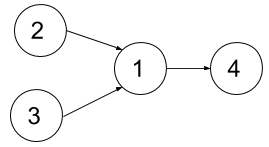
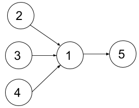

## Description

You are given an integer `n`, which indicates that there are `n` courses labeled from `1` to `n`. You are also given an array `relations` where $\text{relations}[i] = [\text{prevCourse}_{i}, \text{nextCourse}_{i}]$, representing a prerequisite relationship between course $\text{prevCourse}_{i}$ and course $\text{nextCourse}_{i}$: course $\text{prevCourse}_{i}$ has to be taken before course $\text{nextCourse}_{i}$. Also, you are given the integer `k`.

In one semester, you can take **at most** `k` courses as long as you have taken all the prerequisites in the **previous** semesters for the courses you are taking.

Return *the **minimum** number of semesters needed to take all courses*. The testcases will be generated such that it is possible to take every course.
### Function Contract

- `n`: Input parameter.
- Returns expected result.

### Examples

#### Example 1

- **Input:** $n = 4, relations = [[2,1],[3,1],[1,4]], k = 2$
- **Output:** `3`
- **Explanation:** The figure above represents the given graph.
In the first semester, you can take courses 2 and 3.
In the second semester, you can take course 1.
In the third semester, you can take course 4.
#### Example 2

- **Input:** $n = 5, relations = [[2,1],[3,1],[4,1],[1,5]], k = 2$
- **Output:** `4`
- **Explanation:** The figure above represents the given graph.
In the first semester, you can only take courses 2 and 3 since you cannot take more than two per semester.
In the second semester, you can take course 4.
In the third semester, you can take course 1.
In the fourth semester, you can take course 5.
### Constraints

- $1 \le n \le 15$

- $1 \le k \le n$

- $0 \le \text{relations.length} \le n * (n-1) / 2$

- $\text{relations}[i].length = 2$

- $1 \le \text{prevCourse}_{i}, \text{nextCourse}_{i} \le n$

- $\text{prevCourse}_{i} \neq \text{nextCourse}_{i}$

- All the pairs $[\text{prevCourse}_{i}, \text{nextCourse}_{i}]$ are **unique**.

- The given graph is a directed acyclic graph.