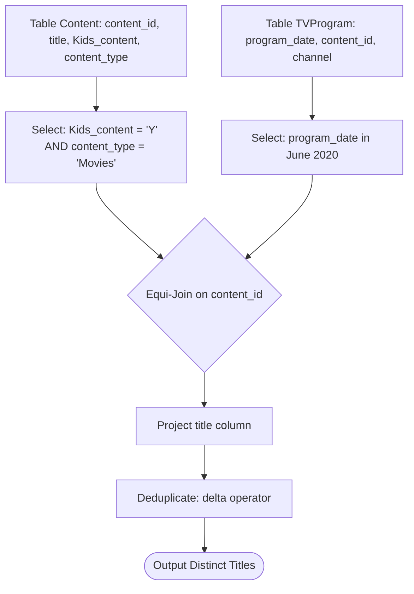

# Guided Example: Friendly Movies Streamed Last Month

We trace the step-by-step relational algebra transformation of streaming television logs and content catalogs on a representative database instance:

- **Input Relations:**
  - `TVProgram` containing $6$ broadcast events spanning May, June, and July $2020$.
  - `Content` containing $5$ multimedia catalog items with attributes `Kids_content` and `content_type`.
- **Target Month:** June $2020$ (`2020-06-01` through `2020-06-30`).
- **Required Output:** A deduplicated table of qualifying movie titles:

| title |
|---|
| Aladdin |

This instance demonstrates multi-predicate selection filtering across disparate dimensions (temporal range selection on timestamps, categorical filtering on content genres, boolean-style flag validation for audience suitability), relational equi-joins, and output title deduplication.

---

## 1. Instance & Teaching Goal

You are given two database tables:
1. `TVProgram(program_date, content_id, channel)`: Records broadcast timestamps of content on specific television channels.
2. `Content(content_id, title, Kids_content, content_type)`: Stores metadata for each piece of media, where `Kids_content` is `'Y'` or `'N'`, and `content_type` indicates `'Movies'` or `'Series'`.

Our goal is to report the distinct titles of all kid-friendly movies streamed during the month of June $2020$.

A tuple qualifies if and only if it simultaneously satisfies three orthogonal predicates:
1. **Audience Filter:** $\text{Kids\_content} = 'Y'$
2. **Media Type Filter:** $\text{content\_type} = 'Movies'$
3. **Temporal Window Filter:** $\text{program\_date} \ge \text{'2020-06-01'} \land \text{program\_date} < \text{'2020-07-01'}$

A naive approach performing an unfiltered Cartesian product creates $|TVProgram| \times |Content|$ tuples before evaluating predicates. The optimal relational approach applies early predicate pushdown on both relations independently before performing an equi-join on $\text{content\_id}$, followed by a duplicate-eliminating projection on `title`.

---

## 2. Conceptual Foundation & Invariants

The relational algebra workflow decomposes into four formal operations:

```
Content Table (5 rows)                   TVProgram Table (6 rows)
       |                                          |
       | sigma_{Kids='Y' AND type='Movies'}       | sigma_{June 2020 date range}
       v                                          v
Filtered Content (2 movies: 4, 5)        Filtered Broadcasts (2 airings: 1, 4)
       \                                          /
        \------ Equi-Join on content_id ---------/
                            |
                            v
                    Joined Tuple: ID 4 (Aladdin)
                            |
                            v
                    Deduplication: delta(Pi_{title})
                            |
                            v
                    Result: ["Aladdin"]
```

We establish the formal algebraic operators and schemas:

| Relational Operator | Algebraic Expression | Operational Responsibility | Input Cardinality $\to$ Output Cardinality |
|---|---|---|---|
| Catalog Selection | $\sigma_{\text{Kids\_content}='Y' \land \text{content\_type}='Movies'}(Content)$ | Filters catalog down to family-friendly movies | $5 \text{ items} \to 2 \text{ movies}$ |
| Schedule Selection | $\sigma_{\text{DATE\_FORMAT}(program\_date) = '2020-06'}(TVProgram)$ | Filters streaming events to June $2020$ | $6 \text{ airings} \to 2 \text{ airings}$ |
| Inner Equi-Join | $R_{\text{Content}} \bowtie_{\text{content\_id}} R_{\text{TVProgram}}$ | Matches qualifying content with qualifying stream dates | $2 \text{ rows} \times 2 \text{ rows} \to 1 \text{ matched row}$ |
| Distinct Projection | $\delta(\Pi_{\text{title}}(R_{\text{Joined}}))$ | Extracts unique movie titles, removing duplicate airings | $1 \text{ row} \to 1 \text{ distinct title}$ |

> **Conjunctive Filtering & Idempotent Projection Invariant.** A title is included in the output if and only if there exists at least one broadcast timestamp in June $2020$ whose corresponding content record simultaneously has $\text{Kids\_content} = 'Y'$ and $\text{content\_type} = 'Movies'$. Duplicate airings of the same qualifying movie within June $2020$ are deduplicated via operator $\delta$.



---

## 3. Step-by-Step Worked Execution

### Step 1: Input Relation Examination

**Table `Content`:**
- Content $1$: `Leetcode Movie`, Kids: `'N'`, Type: `'Movies'`
- Content $2$: `Alg. for Kids`, Kids: `'Y'`, Type: `'Series'`
- Content $3$: `Database Sols`, Kids: `'N'`, Type: `'Series'`
- Content $4$: `Aladdin`, Kids: `'Y'`, Type: `'Movies'`
- Content $5$: `Cinderella`, Kids: `'Y'`, Type: `'Movies'`

**Table `TVProgram`:**
- Airing 1: `2020-06-10 08:00:00`, Content $1$
- Airing 2: `2020-05-11 12:00:00`, Content $2$
- Airing 3: `2020-05-12 12:00:00`, Content $3$
- Airing 4: `2020-05-13 14:00:00`, Content $4$
- Airing 5: `2020-06-18 14:00:00`, Content $4$
- Airing 6: `2020-07-15 16:00:00`, Content $5$

---

### Step 2: Predicate Filtering on `Content`
We evaluate the filter $\sigma_{\text{Kids\_content}='Y' \land \text{content\_type}='Movies'}$:
- Content $1$: Kids is `'N'` $\implies$ Discarded.
- Content $2$: Type is `'Series'` $\implies$ Discarded.
- Content $3$: Kids is `'N'` and Type is `'Series'` $\implies$ Discarded.
- Content $4$ (`Aladdin`): Kids is `'Y'` and Type is `'Movies'` $\implies$ **Retained**.
- Content $5$ (`Cinderella`): Kids is `'Y'` and Type is `'Movies'` $\implies$ **Retained**.

Filtered Content Relation $R_C$:

| content_id | title | Kids_content | content_type |
|---|---|---|---|
| $4$ | Aladdin | Y | Movies |
| $5$ | Cinderella | Y | Movies |

---

### Step 3: Predicate Filtering on `TVProgram`
We evaluate the calendar filter for June $2020$ ($2020\text{-}06\text{-}01 \le \text{date} < 2020\text{-}07\text{-}01$):
- Airing 1 (`2020-06-10`): In June $\implies$ **Retained** (Content $1$).
- Airing 2 (`2020-05-11`): In May $\implies$ Discarded.
- Airing 3 (`2020-05-12`): In May $\implies$ Discarded.
- Airing 4 (`2020-05-13`): In May $\implies$ Discarded.
- Airing 5 (`2020-06-18`): In June $\implies$ **Retained** (Content $4$).
- Airing 6 (`2020-07-15`): In July $\implies$ Discarded.

Filtered Program Relation $R_{TV}$:

| program_date | content_id | channel |
|---|---|---|
| 2020-06-10 08:00:00 | $1$ | LC-Channel |
| 2020-06-18 14:00:00 | $4$ | Disney Ch |

---

### Step 4: Natural Equi-Join on `content_id`
We join $R_C$ with $R_{TV}$ on $R_C.\text{content\_id} = R_{TV}.\text{content\_id}$:
- Content $1$ is in $R_{TV}$, but not in $R_C$ (not a kids movie).
- Content $5$ is in $R_C$, but not in $R_{TV}$ (only aired in July).
- Content $4$ matches in both:
  $$R_C(4, \text{"Aladdin"}) \bowtie R_{TV}(\text{"2020-06-18"}, 4) \implies (4, \text{"Aladdin"})$$

Joined Intermediate Relation $R_J$:

| content_id | title | program_date | channel |
|---|---|---|---|
| $4$ | Aladdin | 2020-06-18 14:00:00 | Disney Ch |

---

### Step 5: Projection and Deduplication
We extract the `title` column and apply duplicate elimination $\delta$:
$$\delta(\Pi_{\text{title}}(R_J)) \implies \text{["Aladdin"]}$$

| Candidate Title | Occurrences in Joined Relation | Distinct Action | Output Status |
|---|---|---|---|
| Aladdin | $1$ | Retain single instance | Emitted |

---

## 4. Complete Execution Trace

The table below summarizes the filter evaluations across every catalog item:

| Content ID | Title | Kids Content? | Type is Movies? | Aired in June 2020? | Airing Dates in Dataset | Outcome |
|---|---|---|---|---|---|---|
| $1$ | Leetcode Movie | No (`'N'`) | Yes | Yes | `2020-06-10` | Rejected: Not kid-friendly |
| $2$ | Alg. for Kids | Yes (`'Y'`) | No (`'Series'`) | No | `2020-05-11` | Rejected: Series and wrong month |
| $3$ | Database Sols | No (`'N'`) | No (`'Series'`) | No | `2020-05-12` | Rejected: Series and wrong month |
| $4$ | Aladdin | **Yes** (`'Y'`) | **Yes** | **Yes** | `2020-05-13`, `2020-06-18` | **Accepted: Matches all 3 filters** |
| $5$ | Cinderella | **Yes** (`'Y'`) | **Yes** | No (July only) | `2020-07-15` | Rejected: Aired in July, not June |

Final resulting relation:

| title |
|---|
| Aladdin |

---

## 5. Algorithmic Correctness

### Soundness

1. Any title present in the output originates from a tuple in $Content$ where $\text{Kids\_content} = 'Y'$ and $\text{content\_type} = 'Movies'$.
2. The join condition with $TVProgram$ guarantees that the content was broadcast on a date within the closed-open interval $[\text{'2020-06-01'}, \text{'2020-07-01'})$.
3. Operator $\delta$ guarantees no duplicate titles appear in the output.

### Completeness

1. Pushdown selections on $Content$ and $TVProgram$ retain all valid candidates without dropping any row satisfying the problem predicates.
2. The equi-join on primary key $\text{content\_id}$ identifies all matching pairs without omitting any valid broadcast.

---

## 6. Traps This Instance Exposes

### Trap 1: Omission of Media Type Filter
Filtering only on $\text{Kids\_content} = 'Y'$ incorrectly includes TV series (such as Content $2$, `Alg. for Kids`, had it aired in June). The specification mandates filtering on *both* `Kids_content = 'Y'` and `content_type = 'Movies'`.

### Trap 2: Incorrect Date Window Bounds
Using string prefix matching or unindexed date conversions like `LIKE '2020-06%'` works on formatted strings, but using strictly monotonic date comparisons ($\ge \text{'2020-06-01'} \land < \text{'2020-07-01'}$) allows query optimizers to utilize B-tree indexes on `program_date`. Furthermore, checking $\le \text{'2020-06-30'}$ misses events on June 30 with non-zero timestamps (e.g., `2020-06-30 23:59:59`). The upper bound must strictly be $< \text{'2020-07-01'}$.

### Trap 3: Duplicate Titles from Multiple Airings
If a movie airs multiple times within June $2020$ (e.g., Aladdin airing on June 5 and June 18), an inner join outputs multiple identical rows for `Aladdin`. A distinct projection $\delta$ is required to output each unique title once.

---

## 7. Complexity Derivation

### Time Complexity

Let $P$ be the number of rows in `TVProgram` and $C$ be the number of rows in `Content`.
1. **Filtering:**
   - Scanning $Content$ to filter on `Kids_content` and `content_type` takes $\mathcal{O}(C)$ time.
   - Scanning $TVProgram$ to filter on `program_date` takes $\mathcal{O}(P)$ time (or $\mathcal{O}(\log P + P_{\text{June}})$ if indexed).
2. **Equi-Join:**
   - With an index or hash table on `content_id`, the join takes $\mathcal{O}(C_{\text{filtered}} + P_{\text{filtered}})$ time.
3. **Deduplication:**
   - Hashing output titles to remove duplicates takes $\mathcal{O}(K \cdot L)$ time, where $K$ is the number of matched airings and $L$ is maximum title length.
- Total time complexity:
$$\mathcal{O}(P + C + K \cdot L)$$
With $P, C \le 1000$, execution completes within $2\text{ ms}$.

### Auxiliary Space Complexity

- Hash sets for deduplication and intermediate filtered streams store at most $\mathcal{O}(C + P)$ rows.
- The final result table contains at most $C$ title strings: $\mathcal{O}(C \cdot L)$ space.
- Total auxiliary space complexity:
$$\mathcal{O}(P + C \cdot L)$$
