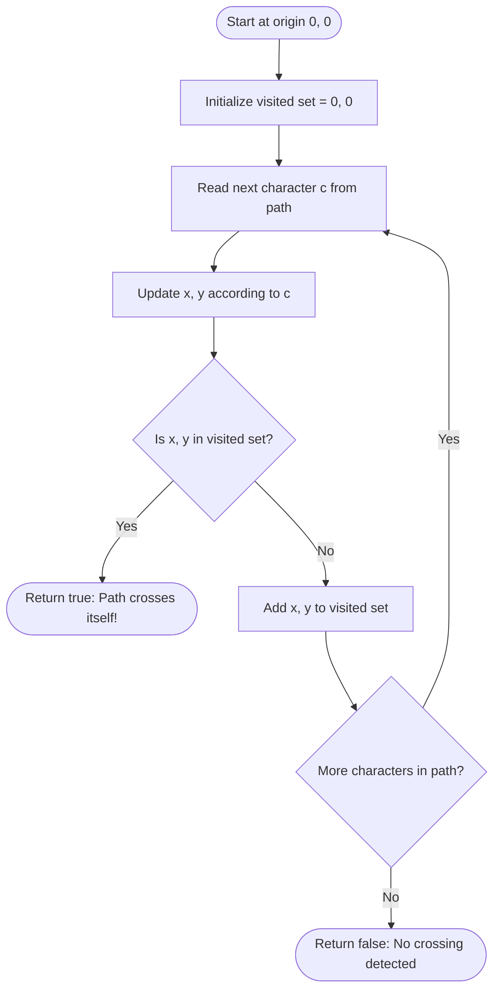

# Guided Example: Path Crossing

We trace the step-by-step execution of the coordinate tracking and hash-set membership algorithm on a representative problem instance:

- **Input:** `path = "NESW"`
- **Required Output:** `true`

This instance illustrates the fundamental geometry of 2D lattice walks: starting at the origin, navigating unit directional steps, maintaining a cumulative history of visited positions, and detecting a closed loop cycle upon returning to the origin.

---

## 1. Instance & Teaching Goal

You start at the origin $(0, 0)$ on a 2D Cartesian plane. You are given a sequence of moves specified by the string `path`, where each character represents a unit step in one of four cardinal directions:
- `'N'`: Move North (increment $y$, or decrement row $i$)
- `'S'`: Move South (decrement $y$, or increment row $i$)
- `'E'`: Move East (increment $x$, or increment col $j$)
- `'W'`: Move West (decrement $x$, or decrement col $j$)

We must return `true` if the path crosses itself at any point—meaning you reach a coordinate you have previously visited at any earlier time—or `false` if every visited position is unique.

For `path = "NESW"`:
- Initial position: $(0, 0)$
- Move 1 (`'N'`): $(0, 0) \to (0, 1)$
- Move 2 (`'E'`): $(0, 1) \to (1, 1)$
- Move 3 (`'S'`): $(1, 1) \to (1, 0)$
- Move 4 (`'W'`): $(1, 0) \to (0, 0)$ $\implies$ returns to the origin!

A naive quadratic check compares the new coordinate against an unindexed history list in $\mathcal{O}(n^2)$ time.

The optimal approach stores visited $(x, y)$ coordinate pairs in a hash set. Starting with $\{(0, 0)\}$, each step computes the next position, performs an $\mathcal{O}(1)$ average-time lookup in the set, and halts immediately with `true` upon finding a collision.

---

## 2. Conceptual Foundation & Invariants

Each character maps to a 2D integer displacement vector:
$$\Delta('N') = (0, 1), \quad \Delta('S') = (0, -1), \quad \Delta('E') = (1, 0), \quad \Delta('W') = (-1, 0)$$

```
2D Cartesian Grid Walk:
  y ^
    |       (0, 1) -------- [E] -------- (1, 1)
    |         ^                            |
    |        [N]                          [S]
    |         |                            v
  0 +-----> (0, 0) <------- [W] -------- (1, 0)
    +----------------------------------------> x
            0                            1

Collision occurs at (0, 0) after move 4 ('W')!
```

We establish the core parameters:

| Parameter | Mathematical Domain | Operational Purpose | Initial State |
|---|---|---|---|
| Step Index $k$ | Integer $\in [0, n-1]$ | Current character index in `path` | $0$ |
| Direction Character $c$ | Char $\in \{'N', 'S', 'E', 'W'\}$ | Direction of active unit step | `path[0]` |
| Coordinate Pair $(x, y)$ | $\mathbb{Z} \times \mathbb{Z}$ | Active location on 2D lattice | $(0, 0)$ |
| Visited Registry | Hash Set of $(x, y)$ pairs | Set of all points visited from inception | $\{(0, 0)\}$ |
| Self-Crossing Detected | Boolean | True if $(x, y) \in \text{Visited}$ | False |

> **Visited Coordinate Set Invariant.** The set `vis` contains all unique coordinates visited from the start $(0, 0)$ up to the current move. A path self-intersection occurs if and only if a newly computed point $(x, y)$ is already an element of `vis`. Checking membership before insertion in $\mathcal{O}(1)$ average time guarantees immediate detection of the first cycle.



---

## 3. Step-by-Step Worked Execution

### Step 0: Inception at Origin $(0, 0)$
- Start at coordinates $(x = 0, y = 0)$.
- Insert origin into visited registry:
  $$\text{vis} = \{(0, 0)\}$$

| Parameter | State at Inception |
|---|---|
| Active Coordinates | $(0, 0)$ |
| Visited Hash Set | $\{(0, 0)\}$ |
| Self-Crossing Detected | False |

---

### Step 1: Move 1 — Direction `'N'`
- Read character `path[0] = 'N'`.
- Apply North displacement $\Delta(0, 1)$:
  $$(x, y) = (0, 0 + 1) = (0, 1)$$
- Check membership: Is $(0, 1) \in \text{vis}$?
  - $\text{vis} = \{(0, 0)\}$.
  - $(0, 1)$ is not in $\text{vis}$.
- Add $(0, 1)$ to $\text{vis}$:
  $$\text{vis} = \{(0, 0), (0, 1)\}$$

| Parameter | State Before Move | Displacement Applied | State After Move |
|---|---|---|---|
| Position $(x, y)$ | $(0, 0)$ | Move North: $+1$ to $y$ | $(0, 1)$ |
| Set Membership Test | $\text{vis} = \{(0, 0)\}$ | $(0, 1) \in \text{vis} \implies$ False | Point novel |
| Visited Registry | $1$ element | Add $(0, 1)$ | $2$ elements |

---

### Step 2: Move 2 — Direction `'E'`
- Read character `path[1] = 'E'`.
- Apply East displacement $\Delta(1, 0)$:
  $$(x, y) = (0 + 1, 1) = (1, 1)$$
- Check membership: Is $(1, 1) \in \text{vis}$?
  - $\text{vis} = \{(0, 0), (0, 1)\}$.
  - $(1, 1)$ is not in $\text{vis}$.
- Add $(1, 1)$ to $\text{vis}$:
  $$\text{vis} = \{(0, 0), (0, 1), (1, 1)\}$$

| Parameter | State Before Move | Displacement Applied | State After Move |
|---|---|---|---|
| Position $(x, y)$ | $(0, 1)$ | Move East: $+1$ to $x$ | $(1, 1)$ |
| Set Membership Test | $2$ elements in set | $(1, 1) \in \text{vis} \implies$ False | Point novel |
| Visited Registry | $2$ elements | Add $(1, 1)$ | $3$ elements |

---

### Step 3: Move 3 — Direction `'S'`
- Read character `path[2] = 'S'`.
- Apply South displacement $\Delta(0, -1)$:
  $$(x, y) = (1, 1 - 1) = (1, 0)$$
- Check membership: Is $(1, 0) \in \text{vis}$?
  - $\text{vis} = \{(0, 0), (0, 1), (1, 1)\}$.
  - $(1, 0)$ is not in $\text{vis}$.
- Add $(1, 0)$ to $\text{vis}$:
  $$\text{vis} = \{(0, 0), (0, 1), (1, 1), (1, 0)\}$$

| Parameter | State Before Move | Displacement Applied | State After Move |
|---|---|---|---|
| Position $(x, y)$ | $(1, 1)$ | Move South: $-1$ to $y$ | $(1, 0)$ |
| Set Membership Test | $3$ elements in set | $(1, 0) \in \text{vis} \implies$ False | Point novel |
| Visited Registry | $3$ elements | Add $(1, 0)$ | $4$ elements |

---

### Step 4: Move 4 — Direction `'W'` (Collision Detected!)
- Read character `path[3] = 'W'`.
- Apply West displacement $\Delta(-1, 0)$:
  $$(x, y) = (1 - 1, 0) = (0, 0)$$
- Check membership: Is $(0, 0) \in \text{vis}$?
  - $\text{vis} = \{(0, 0), (0, 1), (1, 1), (1, 0)\}$.
  - Coordinate $(0, 0)$ is already present in $\text{vis}$!
- Collision confirmed: the path has crossed itself by returning to the starting point.
- The algorithm halts immediately and returns `true`.

| Parameter | State Before Move | Displacement Applied | State After Move |
|---|---|---|---|
| Position $(x, y)$ | $(1, 0)$ | Move West: $-1$ to $x$ | $(0, 0)$ |
| Set Membership Test | $4$ elements in set | $(0, 0) \in \text{vis} \implies$ **True** | **Collision detected!** |
| Execution State | Active | Early exit triggered | Return `true` |

---

## 4. Complete Execution Trace

The table below summarizes all moves and state transitions:

| Step $k$ | Move Char | Prior $(x, y)$ | Displacement $(\Delta x, \Delta y)$ | New $(x, y)$ | In Visited Set? | Visited Set Size After Move | Action / Result |
|---|---|---|---|---|---|---|---|
| Initial | - | - | - | $(0, 0)$ | N/A (Start) | $1$ | Seed origin |
| 1 | `'N'` | $(0, 0)$ | $(0, +1)$ | $(0, 1)$ | No | $2$ | Added $(0, 1)$ |
| 2 | `'E'` | $(0, 1)$ | $(+1, 0)$ | $(1, 1)$ | No | $3$ | Added $(1, 1)$ |
| 3 | `'S'` | $(1, 1)$ | $(0, -1)$ | $(1, 0)$ | No | $4$ | Added $(1, 0)$ |
| 4 | `'W'` | $(1, 0)$ | $(-1, 0)$ | $(0, 0)$ | **Yes** | $4$ | **Collision! Return `true`** |

Final algorithm decision:
$$\text{isPathCrossing} = \text{true}$$

---

## 5. Algorithmic Correctness

### Soundness

1. By mathematical definition of a walk on $\mathbb{Z}^2$, a path crosses itself if and only if there exist distinct indices $i < j$ such that the coordinate at step $i$ equals the coordinate at step $j$.
2. The hash set stores every coordinate visited at steps $0, 1, \dots, j-1$.
3. When step $j$ evaluates $(x, y) \in \text{vis}$, a match proves the existence of a prior step $i < j$ with the exact same coordinate.
4. Hence, returning `true` upon membership detection is sound.

### Completeness

The algorithm updates coordinates deterministically for every character in `path`. If no coordinate is repeated throughout the entire string, the loop finishes without collision and returns `false`. All possible intersections are evaluated.

---

## 6. Traps This Instance Exposes

### Trap 1: Omitting the Initial Origin $(0, 0)$
If the visited set is initially empty $\emptyset$ instead of containing $\{(0, 0)\}$, returning to the origin on move 4 would not trigger a collision, erroneously returning `false` for `"NESW"`. The origin must be inserted before processing the first move.

### Trap 2: Inverted Directional Axes
Confusing row-column matrix indexing with Cartesian coordinate axes is a frequent pitfall. In matrix terms, North is row $-1$ and South is row $+1$, whereas in Cartesian coordinates North is $y + 1$ and South is $y - 1$. As long as directions are orthogonal and signs are mutually inverse, the lattice topology is preserved, but mixing conventions produces incorrect coordinates.

### Trap 3: Linear Membership Overhead
Using an array or list to store history takes $\mathcal{O}(k)$ time to search at step $k$. Across a path of length $n = 10^4$, this requires $\approx 5 \times 10^7$ comparisons. A hash set executes lookups in $\mathcal{O}(1)$ average time.

---

## 7. Complexity Derivation

### Time Complexity

- At each of the $n$ moves, the algorithm performs:
  - Coordinate addition/subtraction: $\mathcal{O}(1)$.
  - Hash set membership query: $\mathcal{O}(1)$ average.
  - Hash set insertion: $\mathcal{O}(1)$ average.
- The path has length $n$.
- Total time complexity:
$$\mathcal{O}(n)$$
For $n = 10^4$, this executes in under $5\text{ ms}$.

### Auxiliary Space Complexity

- The hash set stores at most $n + 1$ unique coordinate tuples $(x, y)$.
- Each coordinate tuple occupies $\mathcal{O}(1)$ scalar storage.
- Total auxiliary space complexity:
$$\mathcal{O}(n)$$
For $n = 10^4$, the set consumes less than $1\text{ MB}$ of memory.
