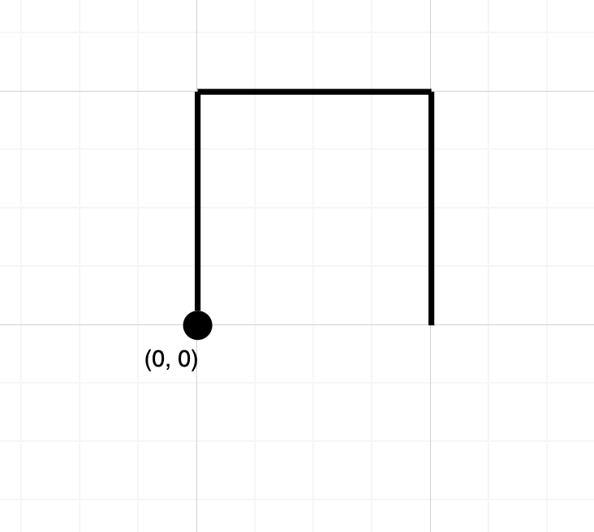
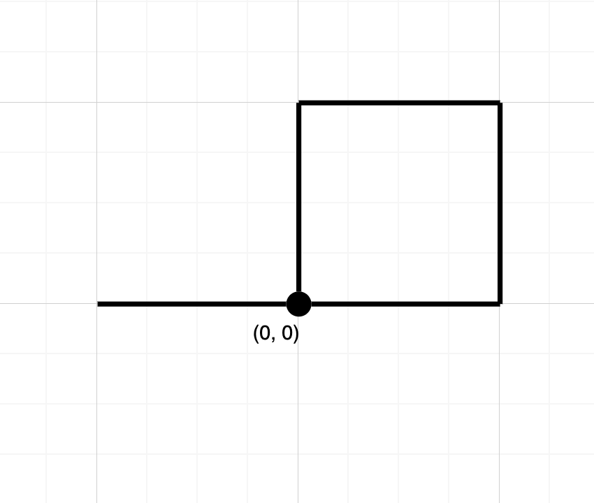

### 1. Description

Given a string `path`, where $\text{path}[i] = 'N'$, `'S'`, `'E'` or `'W'`, each representing moving one unit north, south, east, or west, respectively. You start at the origin `(0, 0)` on a 2D plane and walk on the path specified by `path`.

Return `true` *if the path crosses itself at any point, that is, if at any time you are on a location you have previously visited*. Return `false` otherwise.

### 2. Function Contract

- `n`: Input parameter.
- Returns expected result.

### 3. Examples

#### Example 1

- **Input:** $path = "NES"$
- **Output:** `false`
- **Explanation:** Notice that the path doesn't cross any point more than once.
#### Example 2

- **Input:** $path = "NESWW"$
- **Output:** `true`
- **Explanation:** Notice that the path visits the origin twice.

### 4. Constraints

- $1 \le \text{path.length} \le 10^{4}$

- $\text{path}[i]$ is either `'N'`, `'S'`, `'E'`, or `'W'`.