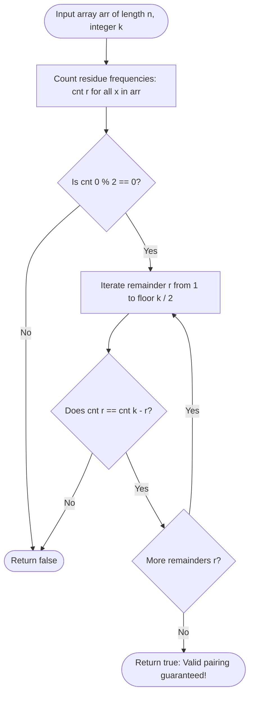

# Guided Example: Check If Array Pairs Are Divisible by k

We trace the step-by-step execution of the modular residue frequency balance algorithm on a representative problem instance:

- **Input:** `arr = [1, 2, 3, 4, 5, 10, 6, 7, 8, 9]`, $k = 5$
- **Required Output:** `true`

This instance illustrates the foundational principles of quotient ring partitioning: reducing arbitrary integers to their canonical equivalence classes in $\mathbb{Z} / k\mathbb{Z}$, verifying internal self-pairing parity for zero-remainder elements, and ensuring exact symmetric cardinality balance between complementary remainder buckets.

---

## 1. Instance & Teaching Goal

Given an integer array `arr` of even length $n$ and an integer $k$, we must determine whether the array can be partitioned into exactly $n / 2$ pairs such that the sum of each pair is strictly divisible by $k$:
$$(a + b) \bmod k = 0 \quad \text{for all pairs } (a, b)$$

For `arr = [1, 2, 3, 4, 5, 10, 6, 7, 8, 9]` and $k = 5$ with $n = 10$:
- We need to form $5$ disjoint pairs.
- By modular arithmetic, $(a + b) \bmod k = ((a \bmod k) + (b \bmod k)) \bmod k$.
- An element with remainder $1$ can only pair with an element with remainder $4$ ($1 + 4 = 5 \equiv 0$).
- An element with remainder $2$ can only pair with an element with remainder $3$ ($2 + 3 = 5 \equiv 0$).
- An element with remainder $0$ can only pair with another element with remainder $0$ ($0 + 0 = 0 \equiv 0$).

A naive brute-force approach generates all possible matchings or searches for compatible pairs dynamically, leading to exponential or quadratic overhead.

The optimal approach reduces the entire array into a frequency distribution of remainders modulo $k$. Verifying partition feasibility simplifies to checking whether the counts of complementary remainders are equal: $\text{cnt}[r] == \text{cnt}[k - r]$ for all $1 \le r < k$, and $\text{cnt}[0]$ is even.

---

## 2. Conceptual Foundation & Invariants

Every integer $x \in \text{arr}$ belongs to a unique congruence class modulo $k$:
$$r = ((x \bmod k) + k) \bmod k \quad \in [0, k-1]$$

```
Residue Pairing Requirements (modulo k = 5):
Remainder 0: [5, 10] ------ (Self-pairs: count must be EVEN)
Remainder 1: [1, 6]  <===> Remainder 4: [4, 9] (counts must be EQUAL)
Remainder 2: [2, 7]  <===> Remainder 3: [3, 8] (counts must be EQUAL)

Resulting Valid Pairs:
  (5, 10) -> 15 = 3 * 5
  (1,  9) -> 10 = 2 * 5
  (6,  4) -> 10 = 2 * 5
  (2,  8) -> 10 = 2 * 5
  (7,  3) -> 10 = 2 * 5
All 5 pairs are divisible by 5!
```

We establish the core parameters:

| Parameter | Domain | Mathematical Purpose | Initial State |
|---|---|---|---|
| Modulus $k$ | Integer $\ge 1$ | Divisibility divisor | $5$ |
| Residue $r$ | Integer $\in [0, k-1]$ | Canonical remainder $(x \bmod k)$ | Evaluated per element |
| Frequency Array `cnt` | Array of size $k$ | $\text{cnt}[r]$ stores count of elements with remainder $r$ | All $0$ |
| Complementary Residue | $(k - r) \bmod k$ | Required matching remainder for residue $r$ | Symmetrical pair |

> **Modular Residue Complementarity Invariant.** A multiset of integers can be partitioned into pairs each summing to a multiple of $k$ if and only if:
> 1. $\text{cnt}[0] \equiv 0 \pmod 2$ (elements with remainder $0$ pair exclusively among themselves).
> 2. For every $r \in [1, k-1]$, $\text{cnt}[r] == \text{cnt}[k - r]$ (each element of remainder $r$ is matched with a unique element of remainder $k - r$).



---

## 3. Step-by-Step Worked Execution

### Step 1: Compute Modulo Residues Across All Elements
We map each element $x \in \text{arr}$ to $x \bmod 5$:
- $1 \bmod 5 = 1$
- $2 \bmod 5 = 2$
- $3 \bmod 5 = 3$
- $4 \bmod 5 = 4$
- $5 \bmod 5 = 0$
- $10 \bmod 5 = 0$
- $6 \bmod 5 = 1$
- $7 \bmod 5 = 2$
- $8 \bmod 5 = 3$
- $9 \bmod 5 = 4$

---

### Step 2: Construct Residue Frequency Distribution
We tally the frequencies into array `cnt`:
- Remainder $0$: $\{5, 10\} \implies \text{cnt}[0] = 2$
- Remainder $1$: $\{1, 6\} \implies \text{cnt}[1] = 2$
- Remainder $2$: $\{2, 7\} \implies \text{cnt}[2] = 2$
- Remainder $3$: $\{3, 8\} \implies \text{cnt}[3] = 2$
- Remainder $4$: $\{4, 9\} \implies \text{cnt}[4] = 2$

| Residue Class $r$ | Contributing Array Elements | Total Count $\text{cnt}[r]$ |
|---|---|---|
| $0$ | $5, 10$ | $2$ |
| $1$ | $1, 6$ | $2$ |
| $2$ | $2, 7$ | $2$ |
| $3$ | $3, 8$ | $2$ |
| $4$ | $4, 9$ | $2$ |

---

### Step 3: Evaluate Zero-Remainder Parity
- Remainder $r = 0$:
  $$\text{cnt}[0] = 2$$
- Parity test:
  $$2 \bmod 2 = 0$$
- Elements with remainder $0$ can pair with each other (forming pair $(5, 10)$ with sum $15$, divisible by $5$).
- Condition satisfied.

| Condition Evaluated | Formula | Values Tested | Verdict |
|---|---|---|---|
| Zero-Remainder Self-Pairing | $\text{cnt}[0] \bmod 2 == 0$ | $2 \bmod 2 == 0$ | **Satisfied** |

---

### Step 4: Evaluate Complementary Remainder Pair $(1, 4)$
- Remainder $r = 1$: $\text{cnt}[1] = 2$.
- Complementary remainder $k - r = 5 - 1 = 4$: $\text{cnt}[4] = 2$.
- Symmetry test:
  $$\text{cnt}[1] == \text{cnt}[4] \implies 2 == 2$$
- Each element of remainder $1$ can pair with an element of remainder $4$:
  - $(1, 9) \implies 10 \equiv 0 \pmod 5$
  - $(6, 4) \implies 10 \equiv 0 \pmod 5$
- Condition satisfied.

| Condition Evaluated | Formula | Values Tested | Verdict |
|---|---|---|---|
| Pair $(1, 4)$ Cardinality | $\text{cnt}[1] == \text{cnt}[4]$ | $2 == 2$ | **Satisfied** |

---

### Step 5: Evaluate Complementary Remainder Pair $(2, 3)$
- Remainder $r = 2$: $\text{cnt}[2] = 2$.
- Complementary remainder $k - r = 5 - 2 = 3$: $\text{cnt}[3] = 2$.
- Symmetry test:
  $$\text{cnt}[2] == \text{cnt}[3] \implies 2 == 2$$
- Each element of remainder $2$ can pair with an element of remainder $3$:
  - $(2, 8) \implies 10 \equiv 0 \pmod 5$
  - $(7, 3) \implies 10 \equiv 0 \pmod 5$
- Condition satisfied.

| Condition Evaluated | Formula | Values Tested | Verdict |
|---|---|---|---|
| Pair $(2, 3)$ Cardinality | $\text{cnt}[2] == \text{cnt}[3]$ | $2 == 2$ | **Satisfied** |

---

## 4. Complete Execution Trace

The table below summarizes the residue balance verification across all classes:

| Residue $r$ | Complement $k - r$ | Count $\text{cnt}[r]$ | Count $\text{cnt}[k - r]$ | Verification Rule | Test Result |
|---|---|---|---|---|---|
| $0$ | $0$ (Self) | $2$ | $2$ | $\text{cnt}[0] \bmod 2 == 0$ | Pass (Even) |
| $1$ | $4$ | $2$ | $2$ | $\text{cnt}[1] == \text{cnt}[4]$ | Pass ($2 == 2$) |
| $2$ | $3$ | $2$ | $2$ | $\text{cnt}[2] == \text{cnt}[3]$ | Pass ($2 == 2$) |
| $3$ | $2$ | $2$ | $2$ | $\text{cnt}[3] == \text{cnt}[2]$ | Pass ($2 == 2$) |
| $4$ | $1$ | $2$ | $2$ | $\text{cnt}[4] == \text{cnt}[1]$ | Pass ($2 == 2$) |

All remainder classes satisfy the structural invariants. The algorithm concludes:
$$\text{canArrange} = \text{true}$$

---

## 5. Algorithmic Correctness

### Soundness

1. **Modular Sum Theorem:** For any two integers $a, b$, $(a + b) \equiv 0 \pmod k \iff (a \bmod k + b \bmod k) \equiv 0 \pmod k$.
2. Since $a \bmod k \in [0, k-1]$ and $b \bmod k \in [0, k-1]$, their sum lies in $[0, 2k - 2]$.
3. The only multiples of $k$ in this range are $0$ (requiring $a \bmod k = b \bmod k = 0$) and $k$ (requiring $b \bmod k = k - (a \bmod k)$).
4. Therefore, any valid pair must either consist of two $0$-remainder elements or one remainder-$r$ element and one remainder-$(k-r)$ element.
5. If the frequency counts satisfy $\text{cnt}[0] \bmod 2 = 0$ and $\text{cnt}[r] = \text{cnt}[k-r]$, we can form a bijective matching between complementary buckets, producing a valid pairing.

### Completeness

If $\text{cnt}[0]$ is odd, at least one element with remainder $0$ cannot pair with another remainder $0$ element; pairing it with any element of remainder $r > 0$ yields sum $0 + r = r \not\equiv 0 \pmod k$.
Similarly, if $\text{cnt}[r] \ne \text{cnt}[k-r]$, by the Pigeonhole Principle at least one element of remainder $r$ is forced to pair with an incompatible class. Thus, the conditions are both necessary and sufficient.

---

## 6. Traps This Instance Exposes

### Trap 1: Negative Number Modulo in Different Languages
In Python, `-1 % 5 = 4`, which correctly yields the canonical positive residue. In C, C++, and Java, `-1 % 5 = -1`. If negative residues are not normalized via `(x % k + k) % k`, negative remainders land in out-of-bounds indices or fail complementary matching.

### Trap 2: Even Modulus Midpoint Parity
When $k$ is even (e.g., $k = 4$), the midpoint residue $r = k / 2 = 2$ has complement $k - r = 4 - 2 = 2$. Elements with remainder $k / 2$ must pair with each other! Therefore, $\text{cnt}[k / 2]$ must be even. Checking `cnt[r] == cnt[k - r]` trivially passes ($x == x$), but if $\text{cnt}[k / 2]$ is odd, one element remains unpaired. A dedicated parity check $\text{cnt}[k/2] \bmod 2 == 0$ is required when $k$ is even.

### Trap 3: O(N^2) Greedy Pairing
Attempting to pair numbers greedily by searching for an element $(k - x \bmod k)$ in an array takes quadratic time. Transforming the array into a frequency array of size $k$ reduces the entire problem to linear time.

---

## 7. Complexity Derivation

### Time Complexity

- **Residue Counting:** Iterating across the array of length $n$ to compute remainders and populate `cnt` takes $\mathcal{O}(n)$ time.
- **Symmetry Verification:** Iterating from $r = 1$ to $k-1$ to verify count equality takes $\mathcal{O}(k)$ time.
- Total time complexity:
$$\mathcal{O}(n + k)$$
With $n \le 10^5$ and $k \le 10^5$, the algorithm executes within $15\text{ ms}$.

### Auxiliary Space Complexity

- The frequency array or hash map `cnt` stores at most $k$ integer counters.
- Total auxiliary space complexity:
$$\mathcal{O}(k)$$
For $k = 10^5$, this requires less than $1\text{ MB}$ of memory.
