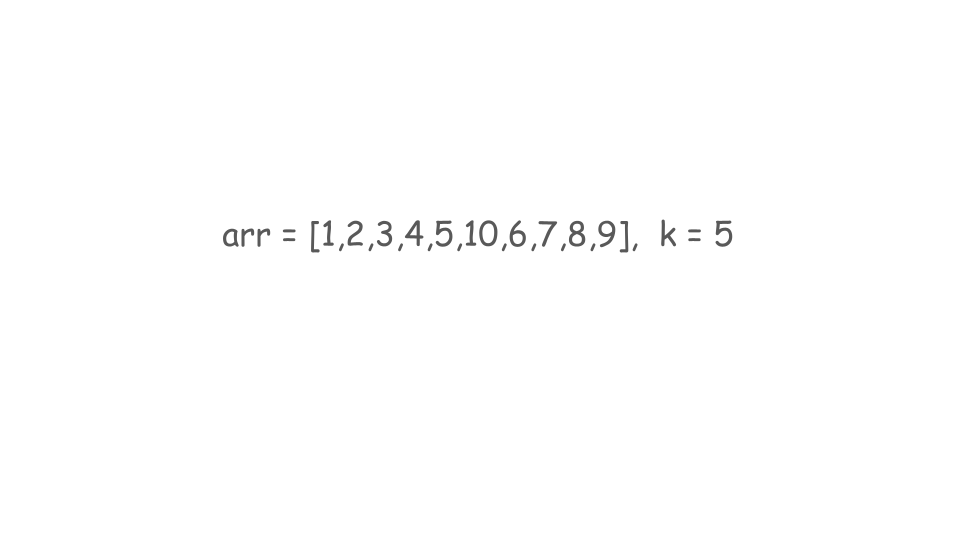
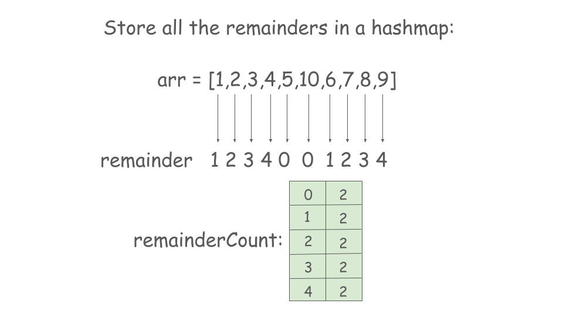
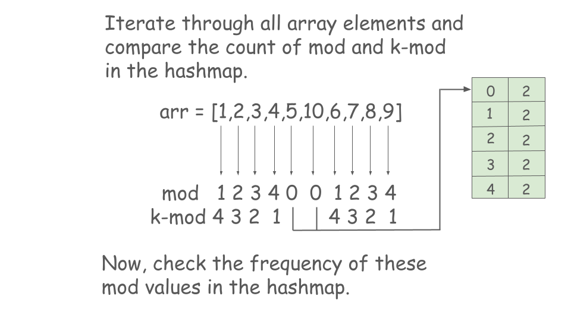
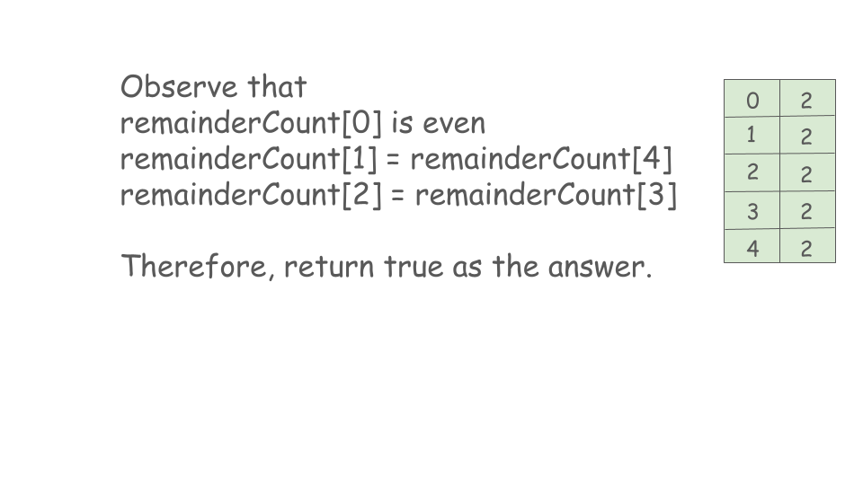

## Solution

---

### Approach 1: Hashing / Counting

#### Intuition

We have an array of size `n` and need to divide it into exactly `n/2` pairs. The goal is to ensure that the sum of each pair is divisible by `k`. We will return `true` if we can make these pairs and `false` otherwise.

To form a pair, we first pick an integer from the array and calculate its value modulo `k`, which we will call `mod`. To find a suitable partner for this integer, we look for another element with a modulo value of $k - mod$. This can be explained with the proof given below:

Let the array be $A = [a_1, a_2, ..., a_n]$ and the divisor be $k$. We need to form pairs such that:

$(ai + aj) \% k = 0$

This can be rewritten as:

$(ai \% k + aj \% k) \% k = 0$

For each element in the array, its remainder when divided by $k$ lies in the range $[0, k-1]$. Let's denote the remainder of an element $a_i$ by $mod_i = a_i \% k$. To form a valid pair $(ai, aj)$, we need:

$(mod_i + mod_j) \% k = 0$

This implies:

$mod_j = k - mod_i$

If `mod` is 0, we need to pair this element with another that is also 0. This is because the sum of two numbers divisible by `k` is also divisible by `k`. Therefore, the count of elements that yield a modulo of 0 must be even to form valid pairs.

To efficiently track the modulo values, we can use a hashmap called `remainderCount`. This hashmap will store the counts of each modulo value. We will then iterate through the array to check if we can successfully form pairs based on these counts.

#### Algorithm

1. Create a hashmap `remainderCount` to store the count of remainders when dividing elements of `arr` by `k`.
2. Iterate through the array `arr`:
- For each element `i`, compute the remainder as $(x \% k + k) \% k$ to handle both positive and negative values.
- Increment the count of this remainder in `remainderCount`.
3. Iterate through the array `arr` again:
- For each element `i`, compute the remainder as $(i \% k + k) \% k$.
- If the remainder is 0, check if the count of this remainder in `remainderCount` is even:
- If it is odd, return `false` (no valid pairs).
- For all other remainders `rem`, check if the count of `rem` is equal to the count of $k - rem$:
- If they are not equal, return `false` (no valid pairs).
4. If all checks pass, return `true` (valid pairs can be made).









#### Implementation

```python
class Solution:
    def canArrange(self, arr, k):
        remainder_count = {}

        # Store the count of remainders in a map.
        for i in arr:
            remainder_count[(i % k + k) % k] = (
                remainder_count.get((i % k + k) % k, 0) + 1
            )

        for i in arr:
            rem = (i % k + k) % k

            # If the remainder for an element is 0, then the count of numbers that give this remainder must be even.
            if rem == 0:
                if remainder_count[rem] % 2 == 1:
                    return False

            # If the remainder rem and k-rem do not have the same count then pairs cannot be made.
            elif remainder_count[rem] != remainder_count.get(k - rem, 0):
                return False
        return True
```

#### Complexity Analysis

Let $n$ be the size of the `arr` array.

- Time complexity: $O(n)$

   The loop traverses the array twice, and all search, insert operations performed on the hashmap take constant time. Therefore, the time complexity is linear.

- Space complexity: $O(k)$

   Inserting the modulo values in the hashmap requires exactly `k` unique values from `0` to `k-1`, so the space complexity is given by $O(k)$.

---

### Approach 2: Sorting and Two-Pointers

#### Intuition

In the previous approach, we focused on finding pairs with their modulo `k` values expressed as $\text{mod}$ and $k - \text{mod}$. When we sort the array by these modulo values, we notice that pairs will be located at opposite ends. For instance, after pairing elements with modulo 0, elements with modulo 1 will pair with those at $k - 1$, which are at the end of the array since modulo values range from 0 to $k - 1$.

To solve this, we can use a two-pointer technique. After handling the case for modulo 0  value, we set two pointers, `i` at the start and `j` at the end of the array. If the values at `i` and `j` form a valid pair, we move `i` to the next index and `j` to the previous index. If they do not form a pair, we return false. If `i` and `j` converge at the same index, we return true.

#### Algorithm

1. Define a custom comparator to sort the array based on the remainder when dividing elements by `k`.
- The comparator will return `true` if the modulo of the first element is less than the second, taking into account negative values by using $(k + i \% k) \% k$.
2. Sort the array `arr` using the custom comparator.
3. Initialize two pointers `start` and `end`:
- `start` starts from the beginning of the array and `end` starts from the end of the array.
4. While `start` is less than `end`:
- If the element at index `start` is not divisible by `k`, break the loop.
- If the next element ($start + 1$) is not divisible by `k`, return `false` (invalid pairing).
- Increment `start` by 2.
5. For the remaining elements:
- If the sum of the two elements is not divisible by `k`, return `false` (invalid pairing).
- Increment `start` and decrement `end` to continue pairing.
6. If all pairs are valid, return `true`.

#### Implementation

```python
class Solution:
    def canArrange(self, arr: List[int], k: int) -> bool:
        # Custom comparator to sort based on mod values.
        arr = sorted(arr, key=lambda x: (k + x % k) % k)

        # Assign the pairs with modulo 0 first.
        start = 0
        end = len(arr) - 1
        while start < end:
            if arr[start] % k != 0:
                break
            if arr[start + 1] % k != 0:
                return False
            start = start + 2

        # Now, pick one element from the beginning and one element from the
        # end.
        while start < end:
            if (arr[start] + arr[end]) % k != 0:
                return False
            start += 1
            end -= 1

        return True
```

#### Complexity Analysis

Let $n$ be the size of the `arr` array.

- Time complexity: $O(n \cdot \log n)$

   Sorting the array takes $O(n \cdot \log n)$ time. All other operations are linear or constant time.

   Therefore, the total time complexity is given by $O(n\cdot \log n)$.

- Space complexity: $O(n)$ or $O(\log n)$.

   The space complexity of the sorting algorithm depends on the programming language.
- In Python, the sort method sorts a list using the Timsort algorithm which is a combination of Merge Sort and Insertion Sort and has $O(n)$ additional space.
- In Java, `Arrays.sort()` is implemented using a variant of the Quick Sort algorithm which has a space complexity of $O( \log n )$ for sorting an array.
- In C++, the `sort()` function is implemented as a hybrid of Quick Sort, Heap Sort, and Insertion Sort, with a worse-case space complexity of $O( \log n )$.

   Therefore, the space complexity is given by $O(n)$ or $O(\log n)$.

---