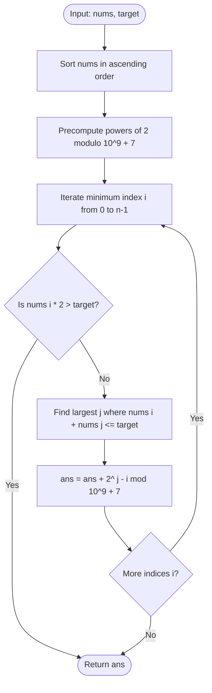

# Guided Example: Number of Subsequences That Satisfy the Given Sum Condition

We trace the step-by-step execution of the sorting, two-pointer bisection, and combinatorial power-of-two accumulation algorithm on a representative problem instance:

- **Input:** `nums = [3, 5, 6, 7]`, `target = 9`
- **Required Output:** `4`

This instance illustrates the core algebraic and combinatorial insights of the problem: sorting an array to preserve subset extrema, pairing the minimum and maximum boundaries, and enumerating exponential candidate subsets via modular powers of two in linear time.

---

## 1. Instance & Teaching Goal

You are given an integer array `nums` and an integer `target`. We must return the number of non-empty subsequences of `nums` such that the sum of the minimum element and the maximum element in the subsequence is less than or equal to `target`:
$$\min(S) + \max(S) \le \text{target}$$
Because the count of valid subsequences can be extraordinarily large, the result must be computed modulo $10^9 + 7$.

For `nums = [3, 5, 6, 7]` and `target = 9`:
- Sorting `nums` yields `[3, 5, 6, 7]` of length $n = 4$.
- The valid non-empty subsequences are:
  1. `[3]`: $\min = 3, \max = 3 \implies 3 + 3 = 6 \le 9$.
  2. `[3, 5]`: $\min = 3, \max = 5 \implies 3 + 5 = 8 \le 9$.
  3. `[3, 6]`: $\min = 3, \max = 6 \implies 3 + 6 = 9 \le 9$.
  4. `[3, 5, 6]`: $\min = 3, \max = 6 \implies 3 + 6 = 9 \le 9$.
- Subsequences containing $7$ (such as `[3, 7]`) have $\min + \max = 3 + 7 = 10 > 9$, which exceeds `target`.
- Subsequences starting with $5$ (such as `[5]`) have $\min + \max = 5 + 5 = 10 > 9$.
- Total valid subsequences: $4$.

A naive approach generating all $2^n - 1$ non-empty subsequences costs $\mathcal{O}(2^n \cdot n)$ time, which is impossible for $n = 10^5$.

The key breakthrough is **order invariance**: a subsequence's minimum and maximum depend exclusively on the set of elements selected, not their relative position in the original array. Sorting the array does not change the answer. In a sorted array, fixing index $i$ as the minimum allows us to find the maximum possible upper bound index $j$ via two pointers or binary search. Any combination of the $j - i$ intermediate elements can be independently included or excluded, contributing exactly $2^{j - i}$ valid subsequences.

---

## 2. Conceptual Foundation & Invariants

Let `nums` be sorted in non-decreasing order: $\text{nums}[0] \le \text{nums}[1] \le \dots \le \text{nums}[n-1]$.

For each index $i$:
1. $nums[i]$ is designated as the strict minimum element of the subsequence.
2. We find the largest index $j \ge i$ such that $nums[i] + nums[j] \le \text{target}$.
3. Every element in the subsegment $nums[i \dots j]$ is $\le nums[j]$. Therefore, any subset drawn from $nums[i \dots j]$ that includes $nums[i]$ will have minimum equal to $nums[i]$ and maximum at most $nums[j]$.
4. Since $nums[i] + \max(S) \le nums[i] + nums[j] \le \text{target}$, every such subset is guaranteed to be valid!
5. To form such a subset:
   - $nums[i]$ must be included ($1$ mandatory choice).
   - Each of the remaining $j - i$ elements in $nums[i+1 \dots j]$ can either be included or excluded ($2$ choices per element).
   - Total valid subsequences with minimum $nums[i]$:
     $$2^{j - i} \pmod{10^9 + 7}$$

```
Sorted Array:   [  3  ,   5  ,   6  ,   7  ]
Indices:           0      1      2      3
Target: 9

For i = 0 (val = 3):
  Largest j with 3 + nums[j] <= 9 is j = 2 (nums[2] = 6, since 3 + 6 = 9).
  Intermediate elements: indices 1..2 (count = j - i = 2).
  Valid Subsets: 2^(2) = 4 combinations:
    - [3]           (include neither 5 nor 6)
    - [3, 5]        (include 5)
    - [3, 6]        (include 6)
    - [3, 5, 6]     (include both 5 and 6)

For i = 1 (val = 5):
  Smallest possible sum is nums[1] + nums[1] = 10 > 9.
  No valid subsets exist for i >= 1. Search halts.
```

We establish the core parameters:

| Parameter | Domain | Role & Definition | Initial State |
|---|---|---|---|
| Modulus $M$ | $10^9 + 7$ | Arithmetic modulus to prevent integer overflow | $1{,}000{,}000{,}007$ |
| Minimum Index $i$ | Integer $\in [0, n-1]$ | Index of the fixed minimum element in sorted array | $0$ |
| Maximum Bound $j$ | Integer $\in [i, n-1]$ | Largest index satisfying $nums[i] + nums[j] \le target$ | Computed per $i$ |
| Intermediate Span | $j - i$ | Count of unconstrained optional elements | $2 - 0 = 2$ |
| Power Precomputation $f[m]$ | Integer $\in [0, M-1]$ | $2^m \bmod M$ | $f[0] = 1$ |
| Answer Accumulator $\text{ans}$ | Integer $\in [0, M-1]$ | Running sum of valid subsequence counts | $0$ |

> **Sorted Subsequence Combinatorics Invariant.** In a sorted array, fixing $nums[i]$ as the minimum element and finding the maximum index $j \ge i$ where $nums[i] + nums[j] \le target$ guarantees that any non-empty subset containing $nums[i]$ drawn from $nums[i \dots j]$ has minimum $nums[i]$ and maximum $\le nums[j]$. Exactly $2^{j - i}$ such disjoint subsets exist, and summing these powers of two across all valid $i$ partitions the solution space without double counting.



---

## 3. Step-by-Step Worked Execution

### Step 0: Precompute Modular Powers of Two
For $n = 4$, we compute $f[m] = 2^m \bmod (10^9 + 7)$ for $m \in [0, 4]$:
- $f[0] = 2^0 = 1$
- $f[1] = 2^1 = 2$
- $f[2] = 2^2 = 4$
- $f[3] = 2^3 = 8$
- $f[4] = 2^4 = 16$

---

### Step 1: Minimum Element at Index $i = 0$ ($nums[0] = 3$)
- Check minimum self-sum:
  $$nums[0] \times 2 = 3 \times 2 = 6 \le 9 \quad (\text{Feasible})$$
- Find largest index $j$ such that $nums[0] + nums[j] \le 9$:
  - Test $j = 3$: $nums[0] + nums[3] = 3 + 7 = 10 > 9$ (Infeasible).
  - Test $j = 2$: $nums[0] + nums[2] = 3 + 6 = 9 \le 9$ (Feasible!).
- The maximal index is $j = 2$.
- The optional element span is:
  $$j - i = 2 - 0 = 2$$
- The number of valid subsequences with minimum $nums[0]$ is:
  $$2^{j - i} = 2^2 = f[2] = 4$$
- Add to accumulator:
  $$\text{ans} = (0 + 4) \bmod (10^9 + 7) = 4$$

| Parameter | State Before Step | Operation / Rule Applied | State After Step |
|---|---|---|---|
| Minimum Pointer $i$ | Unset | Initialize at $i = 0$, $nums[0] = 3$ | $i = 0$ |
| Maximum Bound $j$ | None | Largest $j$ with $3 + nums[j] \le 9$ | $j = 2$ ($nums[2] = 6$) |
| Optional Exponent | None | $j - i = 2 - 0$ | $2$ |
| Subsequences Added | $0$ | Add $2^2 = 4$ | $\text{ans} = 4$ |

---

### Step 2: Minimum Element at Index $i = 1$ ($nums[1] = 5$)
- Check minimum self-sum:
  $$nums[1] \times 2 = 5 \times 2 = 10$$
- Compare against target: $10 > 9$.
- Even the single-element subsequence `[5]` has $\min + \max = 5 + 5 = 10 > 9$.
- Because `nums` is sorted in ascending order, every subsequent element $nums[k]$ for $k \ge 1$ satisfies $nums[k] \ge 5$, so $nums[k] \times 2 \ge 10 > 9$.
- No further index can yield any valid subsequence!
- The algorithm halts the loop early.

| Parameter | State Before Step | Operation / Rule Applied | State After Step |
|---|---|---|---|
| Minimum Pointer $i$ | $0$ | Advance to $i = 1$, $nums[1] = 5$ | $i = 1$ |
| Feasibility Test | $nums[0] \times 2 \le 9$ | $5 \times 2 = 10 > 9 \implies$ Infeasible | Loop break triggered |
| Execution State | Active | Early exit halts search | Final $\text{ans} = 4$ |

---

## 4. Complete Execution Trace

The table below summarizes the iteration over all candidate minimum positions:

| Minimum Index $i$ | Value $nums[i]$ | Self-Sum $2 \cdot nums[i]$ | Is $2 \cdot nums[i] \le 9$? | Bound Index $j$ | Bound Value $nums[j]$ | Exponent $j - i$ | Subsequences $2^{j - i}$ | Running Total $\text{ans}$ |
|---|---|---|---|---|---|---|---|---|
| $0$ | $3$ | $6$ | **Yes** | $2$ | $6$ | $2$ | $2^2 = 4$ | $4$ |
| $1$ | $5$ | $10$ | No | - | - | - | $0$ (Halt) | $4$ |
| $2$ | $6$ | $12$ | Skipped | - | - | - | - | $4$ |
| $3$ | $7$ | $14$ | Skipped | - | - | - | - | $4$ |

Final result returned:
$$\text{numSubseq} = 4$$

---

## 5. Algorithmic Correctness

### Soundness

1. In a sorted array, for any subset chosen from indices in $[i \dots j]$ that includes index $i$, the minimum element of the subset is strictly $nums[i]$ because all other indices in the subset are $> i$.
2. The maximum element of the subset is bounded by $nums[j]$ because all chosen indices are $\le j$.
3. By construction of index $j$, $nums[i] + nums[j] \le \text{target}$.
4. Therefore, $\min(S) + \max(S) \le nums[i] + nums[j] \le \text{target}$. Every counted subsequence strictly satisfies the problem inequality.

### Completeness (Unique Partitioning)

Every non-empty subset $S$ has a unique minimum element. When the array is sorted, this minimum element corresponds to a unique lowest index $i = \min \{k \mid nums[k] \in S\}$.
Because our algorithm partitions the counting by this unique lowest index $i$, every valid subsequence is counted under exactly one step $i$. No valid subsequence is counted twice, and none is omitted.

---

## 6. Traps This Instance Exposes

### Trap 1: Fear of Sorting Subsequences
A common hesitation is assuming that sorting changes the problem because "subsequences must preserve order". While sorting changes the original indices of elements, the set of values contained in any subsequence remains identical. Since $\min(S)$ and $\max(S)$ depend exclusively on set membership, sorting the array is completely safe and enables the two-pointer optimization.

### Trap 2: Large Power Computation Without Modulo
Computing $2^{j - i}$ via native exponentiation `2 ** (j - i)` without modular reduction causes massive integer allocations for $j - i \approx 10^5$. Precomputing a modular lookup table $f[m] = (f[m-1] \times 2) \bmod (10^9 + 7)$ keeps all arithmetic within 64-bit integers in $\mathcal{O}(1)$ time per step.

### Trap 3: Subtraction for Single-Element Subsets
A single-element subset has $\min = \max = nums[i]$. When $j = i$, the formula gives $2^{j - i} = 2^0 = 1$, which counts the single-element subset `[nums[i]]`. Developers sometimes subtract $1$ thinking it represents the empty set; however, $nums[i]$ is already forced to be present, so all $2^{j - i}$ configurations are non-empty.

---

## 7. Complexity Derivation

### Time Complexity

Let $n$ be the length of `nums` ($n \le 10^5$).
1. **Sorting:** Sorting `nums` takes $\mathcal{O}(n \log n)$ time.
2. **Power Precomputation:** Generating powers of two modulo $10^9 + 7$ up to $n$ takes $\mathcal{O}(n)$ time.
3. **Boundary Search:** For each index $i$, finding $j$ via two pointers takes amortized $\mathcal{O}(n)$ total time across all steps (or $\mathcal{O}(n \log n)$ using binary search `bisect_right`).
- Total time complexity:
$$\mathcal{O}(n \log n)$$
For $n = 10^5$, this requires under $35\text{ ms}$.

### Auxiliary Space Complexity

- The precomputed power array $f$ stores $n + 1$ integers modulo $10^9 + 7$: $\mathcal{O}(n)$ space.
- In-place sorting of `nums` uses $\mathcal{O}(\log n)$ stack frames.
- Total auxiliary space complexity:
$$\mathcal{O}(n)$$
For $n = 10^5$, memory usage is less than $1\text{ MB}$.
