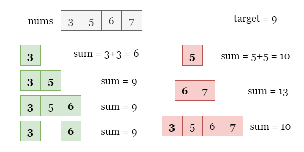
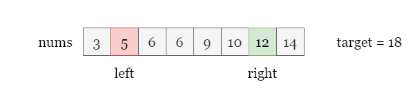
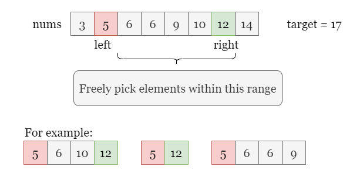
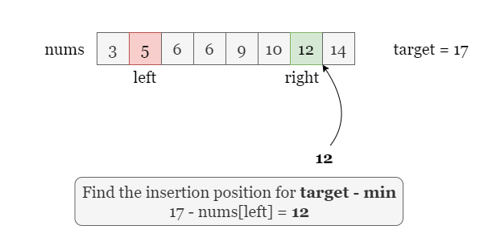
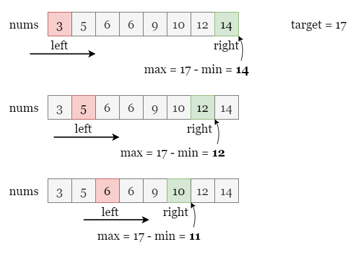
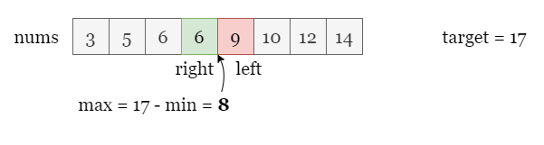
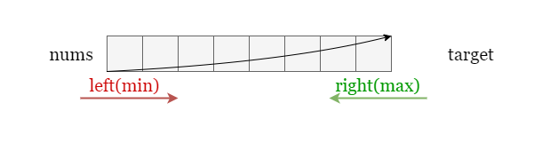
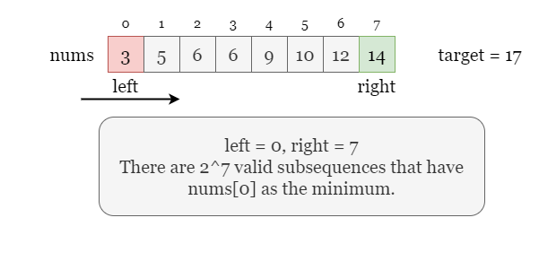
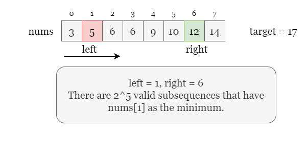
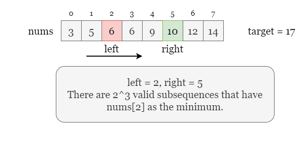

## Solution

---

### Overview

We will use the example given in the problem statement to demonstrate. As shown in the figure below, we have found a total of 4 subsequences that satisfy the given conditions (For convenience, we will call it **valid** subsequence from now on). We also list 3 **invalid** subsequences since their sum of the minimum element `min` and the maximum element `max` is greater than `target`.

Note that if the array contains only one number, we need to add `min` and `max`, so `[5]` is not valid since $5 + 5 = 10 > target$.



---

### Approach 1: Binary Search

#### Intuition

Starting from the brute-force approach, if we simply generate all possible subsequences and then iterate through each subsequence to find its maximum and minimum elements, this approach is feasible but the time complexity will be very high.

Assuming the size of the array is `n`, we will have $O(2 ^ n)$ non-empty subsequences, resulting in a time complexity of $O(2^n \cdot n)$. This method is very expensive and indicates that we need a more efficient way to traverse the subsequence.

Note that we only need to consider the minimum and maximum elements of a subsequence to determine whether it is valid, and elements with values between them do not affect our judgment. Therefore, we can traverse all possible `(minimum, maximum)` combinations and check if they are valid.

If there are `k` subsequences with `min` as the minimum value and `max` as the maximum value, we only need to check if $min + max \le target$. The number of such subsequences `k` depends on how many elements have values that are between `min` and `max`. Therefore, we need to sort `nums` first, so that the number of values between `min` and `max` can be represented by their index difference.

Here, we let `left` and `right` be the pointers to the minimum element and the maximum element. That is $\text{nums}[left] = min$.



Now we need to traverse each possible minimum value. For $min = \text{nums}[left]$, we need to ensure that the subsequences with this number as the minimum value are valid, which means the maximum element of these subsequences cannot be greater than $target-\text{nums}[left]$. In other words, we need to find the largest element that is not greater than $target-\text{nums}[left]$. As shown in the picture below, we have found that $\text{nums}[right] = 12$ is the rightmost element that is smaller than or equal to $17 - \text{nums}[left]$, then we can freely pick elements within the range `[left + 1, right]` to make valid subsequences.



Since the array is already sorted, we can use binary search to find the insertion position of $target - \text{nums}[left]$. Note that we are looking for the rightmost element that is smaller than or equal to $target - \text{nums}[left]$, and the binary search finds the index of the smallest element that is larger than $target - \text{nums}[left]$. Therefore, once we find the rightmost insertion position as `k`, we have $right = k - 1$.

Now we have the left and right indices `left` and `right`. For each number in the range `[left + 1, right]`, there are 2 options: we can either take it or not take it, so there are a total of $2 ^{\text{right - left}}$ valid subsequences that have $\text{nums}[left]$ as the minimum element.



Next, we move to the next `min` by moving the left pointer `left` one step to the right. We repeat the process by using binary search to find the new insertion position of $target - \text{nums}[left]$.



Sometimes we may encounter situations where `left > right` and we don't need to consider these subsequences because they have already been calculated before and there is no need to recalculate them again.



<br>

#### Algorithm

1) Initialize $answer = 0$ and the length of `nums` as `n`.

2) Iterate over the left index `left` from `0` to $n - 1$, for each index `left`:
- Use binary search to locate the rightmost index `right` which $\text{nums}[right] \le target - \text{nums}[left]$.
- If $left \le right$, count the total number of valid subsequences as $2 ^ {\text{right - left}}$
- Increment `answer` by the number of valid subsequences.

3) Return `answer` once the iteration ends.

#### Implementation

```python
class Solution:
    def numSubseq(self, nums: List[int], target: int) -> int:
        n = len(nums)
        mod = 10 ** 9 + 7
        nums.sort()

        answer = 0

        for left in range(n):
            # Find the insertion position for `target - nums[left]`
            # 'right' equals the insertion index minus 1.
            right = bisect.bisect_right(nums, target - nums[left]) - 1
            if right >= left:
                answer += pow(2, right - left, mod)

        return answer % mod
```

#### Complexity Analysis

Let $n$ be the length of the input string `s`.

* Time complexity: $O(n\cdot\log n)$

- We sort `nums`, which takes $O(n \cdot\log n)$ time.
- In Java, we initialize an array `power` and precompute the value of `2` to the power of each value. It takes $O(n)$ time.
- We iterate over `nums`, for each left index `left`, we use binary search to locate the rightmost element that is smaller than or equal to $target - \text{nums}[left]$.
- Binary search over array of size $n$ takes $O(\log n)$ on average.
- To sum up, the overall time complexity is $O(n\cdot\log n)$.

* Space complexity: $O(n)$.

- In Java, we initialize an array `power` and precompute the value of `2` to the power of each value. It takes $O(n)$ space.
- In Python, sorting is done with Timsort, which uses $O(n)$ space.
- During the iterate over `left`, we only need to compute `right` and update `answer`, both take constant space.
- Therefore, the space complexity is $O(n)$.

<br/>

---

### Approach 2: Two Pointers

#### Intuition

Recalling the binary search in the previous solution, we traverse `left` from `0` to $n - 1$, so the value of $target - \text{nums}[left]$ actually decreases, which means the insertion position of $target - \text{nums}[left]$ in the array also decreases.



Therefore, we do not bother applying binary search, but only need to set another pointer `right` for the largest element which is smaller than or equal to $target - \text{nums}[left]$. In the process of traversing `left`, the pointer `right` is monotonically moving to the left, and the time complexity of the algorithm post-sort is only $O(n)$ instead of $O(n \cdot\log n)$ in the previous approach (although the overall time complexity will not change due to the sort).

Take the following slides as an example:







<br>

#### Algorithm

1) Initialize $answer = 0$ and the length of `nums` as `n`. Set two pointers $left = 0$ and $right = n - 1$.
2) Iterate over `left` while $left \le right$, for each index `left`:
- If $\text{nums}[left] + \text{nums}[right] > target$, it means $\text{nums}[right]$ is too large for the right boundary, we shall move it to the left by setting $right = right - 1$.
- Otherwise, `right` is the rightmost index which $\text{nums}[right] \le target - \text{nums}[left]$, we can count the total number of valid subsequences as $2 ^ {\text{right - left}}$ and increment `answer` by this number.

    Repeat step 2.

3) Return `answer` once the iteration ends.

#### Implementation

```python
class Solution:
    def numSubseq(self, nums: List[int], target: int) -> int:
        n, mod = len(nums), 10 ** 9 + 7
        nums.sort()

        answer = 0
        left, right = 0, n - 1

        while left <= right:
            if nums[left] + nums[right] <= target:
                answer = (answer + pow(2, right - left, mod)) % mod
                left += 1
            else:
                right -= 1

        return answer
```

#### Complexity Analysis

Let $n$ be the length of the input array `nums`.

* Time complexity: $O(n \cdot\log n)$

- We sort `nums`, which takes $O(n \cdot\log n)$ time.
- In Java, we initialize an array `power` and precompute the value of `2` to the power of each value. It takes $O(n)$ time.
- During the iteration over `left`, each index is visited by `left` once and visited by `right` at most once, thus it takes $O(n)$ as well.
- To sum up, the overall time complexity is $O(n\cdot\log n)$.

* Space complexity: $O(n)$.

- In Java, we initialize an array `power` and precompute the value of `2` to the power of each value. It takes $O(n)$ space.
- In Python, sorting is done with Timsort, which uses $O(n)$ space.
- During the iterate over `left`, we only need to update `answer` and `right`, which takes constant space.
- Therefore, the space complexity is $O(n)$.

<br/>