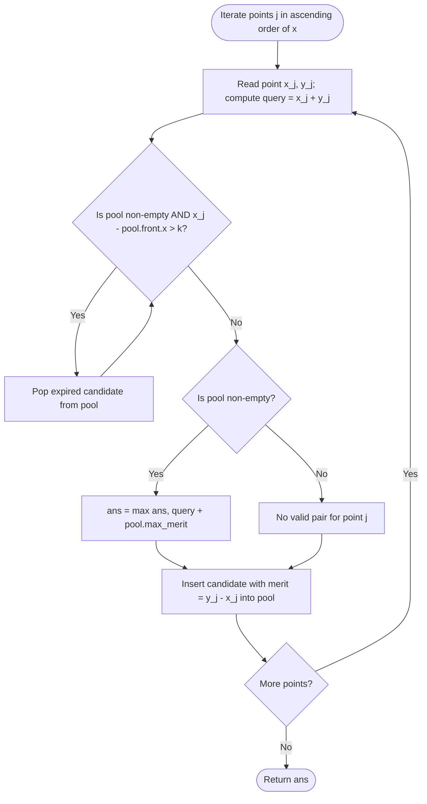

# Guided Example: Max Value of Equation

We trace the step-by-step execution of the sliding window maximum and separation-of-variables algorithm on a representative problem instance:

- **Input:** `points = [[1, 3], [2, 0], [5, 10], [6, -10]]`, $k = 1$
- **Required Output:** `4`

This instance illustrates the core principles of geometric sliding windows: algebraic decoupling of objective terms, maintaining candidate points within an $x$-distance threshold $k$, evicting expired coordinates, and extracting the optimal predecessor in constant amortized time.

---

## 1. Instance & Teaching Goal

You are given an array `points` containing 2D plane coordinates sorted in strictly ascending order by their $x$-coordinates ($x_0 < x_1 < \dots < x_{n-1}$), and an integer $k$. We must find the maximum value of the equation:
$$\text{Value}(i, j) = y_i + y_j + |x_i - x_j| \quad \text{subject to } i < j \text{ and } |x_i - x_j| \le k$$

For `points = [[1, 3], [2, 0], [5, 10], [6, -10]]` and $k = 1$:
- Point $0$: $(1, 3)$
- Point $1$: $(2, 0)$, distance $|1 - 2| = 1 \le 1$.
  $$\text{Value}(0, 1) = 3 + 0 + |1 - 2| = 3 + 0 + 1 = 4$$
- Point $2$: $(5, 10)$. Distances to prior points: $|2 - 5| = 3 > 1$, $|1 - 5| = 4 > 1$. Neither can pair with Point $2$.
- Point $3$: $(6, -10)$, distance to Point $2$: $|5 - 6| = 1 \le 1$.
  $$\text{Value}(2, 3) = 10 + (-10) + |5 - 6| = 0 + 1 = 1$$
- Maximum valid value: $\max(4, 1) = 4$.

Evaluating all $\binom{n}{2}$ pairs takes $\mathcal{O}(n^2)$ time, which triggers Time Limit Exceeded for $n = 10^5$.

The key breakthrough is **separation of variables**: because the input is sorted by $x$, for any $i < j$, we know $x_j > x_i$, so $|x_i - x_j| = x_j - x_i$. The objective expression factors cleanly into:
$$y_i + y_j + (x_j - x_i) = (x_j + y_j) + (y_i - x_i)$$
When evaluating point $j$, the term $(x_j + y_j)$ is fixed. Maximizing the total expression reduces to finding the maximum merit $(y_i - x_i)$ among all active prior points $i$ within the legal distance window $x_j - x_i \le k$.

---

## 2. Conceptual Foundation & Invariants

We maintain an active candidate pool of prior points $i$:
1. **Window Expiration:** Any prior point $i$ with $x_j - x_i > k$ is out of reach and can never pair with point $j$ or any subsequent point (since future $x$ coordinates are even larger). Such points are discarded permanently.
2. **Merit Extraction:** Among surviving points in the window, we query the one that maximizes $(y_i - x_i)$.
3. **Container Implementation:**
   - A max-heap storing tuples $(-(y_i - x_i), x_i)$ allows $\mathcal{O}(\log n)$ extraction.
   - A monotonic deque maintaining points in decreasing order of $(y_i - x_i)$ achieves $\mathcal{O}(1)$ amortized time.

```
Coordinate Separation:
Point j arrives with coordinates (x_j, y_j).
Query Term = x_j + y_j.
Candidate i has Merit = y_i - x_i.

Total Value = (x_j + y_j) + (y_i - x_i)

Sliding Distance Horizon:
               [x_j - k ......................... x_j]
Points with x_i < x_j - k are expired and evicted!
```

We establish the core parameters:

| Parameter | Domain | Mathematical Purpose | Initial State |
|---|---|---|---|
| Current Point $j$ | Coordinate pair $(x_j, y_j)$ | Active arrival point | $(1, 3)$ |
| Query Term $Q_j$ | Integer $x_j + y_j$ | Contribution of point $j$ to equation | Evaluated per point |
| Candidate Merit $M_i$ | Integer $y_i - x_i$ | Predecessor quality metric | Stored in candidate pool |
| Active Pool | Deque / Heap of candidates | Valid prior points with $x_j - x_i \le k$ | Empty $\emptyset$ |
| Global Maximum $\text{ans}$ | Integer $\in [-\infty, \infty)$ | Maximum equation value found | $-\infty$ |

> **Separation of Variables & Sliding Window Maximum Invariant.** The expression $y_i + y_j + (x_j - x_i)$ factors into an arrival term $(x_j + y_j)$ and a candidate merit term $(y_i - x_i)$. Evicting candidates with $x_i < x_j - k$ maintains exact feasibility. Querying the maximal merit in the active window achieves optimal equation value for point $j$ in $\mathcal{O}(1)$ amortized time.



---

## 3. Step-by-Step Worked Execution

### Step 1: Process Point $0 = (1, 3)$
- Read $(x_0 = 1, y_0 = 3)$.
- Query term:
  $$Q_0 = x_0 + y_0 = 1 + 3 = 4$$
- The candidate pool is empty ($\emptyset$). No prior point exists to form a pair.
- Compute merit of Point $0$:
  $$M_0 = y_0 - x_0 = 3 - 1 = 2$$
- Insert Point $0$ into pool:
  $$\text{Pool} = [\{(x=1, M=2)\}]$$

| Parameter | State Before Step | Operation / Rule Applied | State After Step |
|---|---|---|---|
| Current Point | Unset | Read Point $0: (1, 3)$ | $(x=1, y=3)$ |
| Pool Before Query | $\emptyset$ | No valid predecessors | $\emptyset$ |
| Candidate Merit | None | $M_0 = y_0 - x_0 = 3 - 1 = 2$ | $M_0 = 2$ |
| Pool After Insert | $\emptyset$ | Push $(x=1, M=2)$ | $[\text{Point } 0]$ |
| Running Max $\text{ans}$ | $-\infty$ | No pair formed | $-\infty$ |

---

### Step 2: Process Point $1 = (2, 0)$
- Read $(x_1 = 2, y_1 = 0)$.
- Query term:
  $$Q_1 = x_1 + y_1 = 2 + 0 = 2$$
- Eviction check:
  - Front of pool is Point $0$ with $x_0 = 1$.
  - Distance: $x_1 - x_0 = 2 - 1 = 1 \le k = 1$.
  - Point $0$ is within distance limit. No eviction.
- Query maximum merit:
  - Best merit in pool is $M_0 = 2$.
  - Pair equation value:
    $$\text{Value}(0, 1) = Q_1 + M_0 = 2 + 2 = 4$$
- Update global maximum:
  $$\text{ans} = \max(-\infty, 4) = 4$$
- Compute merit of Point $1$:
  $$M_1 = y_1 - x_1 = 0 - 2 = -2$$
- Insert Point $1$ into pool:
  $$\text{Pool} = [\{(x=1, M=2)\}, \{(x=2, M=-2)\}]$$

| Parameter | State Before Step | Operation / Rule Applied | State After Step |
|---|---|---|---|
| Current Point | $(1, 3)$ | Read Point $1: (2, 0)$ | $(x=2, y=0)$ |
| Eviction Check | $[\text{Point } 0]$ | $2 - 1 \le 1 \implies$ valid | Pool intact |
| Value Computed | None | $Q_1 + M_0 = 2 + 2 = 4$ | $\text{Value} = 4$ |
| Running Max $\text{ans}$ | $-\infty$ | $\max(-\infty, 4) = 4$ | $\text{ans} = 4$ |
| Pool After Insert | $[\text{Point } 0]$ | Push $(x=2, M=-2)$ | $[\text{Point } 0, \text{Point } 1]$ |

---

### Step 3: Process Point $2 = (5, 10)$
- Read $(x_2 = 5, y_2 = 10)$.
- Query term:
  $$Q_2 = x_2 + y_2 = 5 + 10 = 15$$
- Eviction check:
  - Point $0$: $x_2 - x_0 = 5 - 1 = 4 > k = 1 \implies$ **Evict Point $0$**.
  - Point $1$: $x_2 - x_1 = 5 - 2 = 3 > k = 1 \implies$ **Evict Point $1$**.
  - Pool is now empty!
- Query maximum merit:
  - Pool is empty $\implies$ no candidate can pair with Point $2$ within distance $1$.
- Compute merit of Point $2$:
  $$M_2 = y_2 - x_2 = 10 - 5 = 5$$
- Insert Point $2$ into pool:
  $$\text{Pool} = [\{(x=5, M=5)\}]$$

| Parameter | State Before Step | Operation / Rule Applied | State After Step |
|---|---|---|---|
| Current Point | $(2, 0)$ | Read Point $2: (5, 10)$ | $(x=5, y=10)$ |
| Eviction Check | $[\text{Point } 0, \text{Point } 1]$ | Both $x$ coordinates $> 1$ away | Pool emptied: $\emptyset$ |
| Pair Formed | None | Distance limit exceeded | None |
| Running Max $\text{ans}$ | $4$ | Unchanged | $\text{ans} = 4$ |
| Pool After Insert | $\emptyset$ | Push $(x=5, M=5)$ | $[\text{Point } 2]$ |

---

### Step 4: Process Point $3 = (6, -10)$
- Read $(x_3 = 6, y_3 = -10)$.
- Query term:
  $$Q_3 = x_3 + y_3 = 6 + (-10) = -4$$
- Eviction check:
  - Front of pool is Point $2$ with $x_2 = 5$.
  - Distance: $x_3 - x_2 = 6 - 5 = 1 \le k = 1$.
  - Point $2$ is valid! No eviction.
- Query maximum merit:
  - Best merit in pool is $M_2 = 5$.
  - Pair equation value:
    $$\text{Value}(2, 3) = Q_3 + M_2 = -4 + 5 = 1$$
- Update global maximum:
  $$\text{ans} = \max(4, 1) = 4$$
- Insert Point $3$: merit $M_3 = -10 - 6 = -16$.

| Parameter | State Before Step | Operation / Rule Applied | State After Step |
|---|---|---|---|
| Current Point | $(5, 10)$ | Read Point $3: (6, -10)$ | $(x=6, y=-10)$ |
| Eviction Check | $[\text{Point } 2]$ | $6 - 5 = 1 \le 1 \implies$ valid | Retained |
| Value Computed | None | $Q_3 + M_2 = -4 + 5 = 1$ | $\text{Value} = 1$ |
| Running Max $\text{ans}$ | $4$ | $\max(4, 1) = 4$ | $\text{ans} = 4$ |

---

## 4. Complete Execution Trace

The table below summarizes the lifecycle of all candidate evaluations:

| Step $j$ | Point $(x_j, y_j)$ | Query Term $x_j + y_j$ | Evicted Points | Surviving Pool | Best Prior Point $i$ | Best Merit $y_i - x_i$ | Computed Value | Running Maximum |
|---|---|---|---|---|---|---|---|---|
| 0 | $(1, 3)$ | $4$ | None | $\emptyset$ | None | None | - | $-\infty$ |
| 1 | $(2, 0)$ | $2$ | None | $\{P_0\}$ | $P_0 (1, 3)$ | $2$ | $2 + 2 = 4$ | **$4$** |
| 2 | $(5, 10)$ | $15$ | $P_0, P_1$ | $\emptyset$ | None | None | - | $4$ |
| 3 | $(6, -10)$ | $-4$ | None | $\{P_2\}$ | $P_2 (5, 10)$ | $5$ | $-4 + 5 = 1$ | $4$ |

All points evaluated. The global maximum equation value is:
$$\text{findMaxValueOfEquation} = 4$$

---

## 5. Algorithmic Correctness

### Soundness

1. Since $i < j$ and $x$ coordinates are strictly increasing, $|x_i - x_j| = x_j - x_i$.
2. The expression $y_i + y_j + |x_i - x_j| = (x_j + y_j) + (y_i - x_i)$ is mathematically exact.
3. A point $i$ is retained in the candidate pool if and only if $x_j - x_i \le k$, guaranteeing all evaluated pairs satisfy the distance constraint.
4. Hence, every calculated value corresponds to a valid, feasible pair.

### Completeness

1. When evaluating point $j$, only points with $x_j - x_i > k$ are evicted. Because $x$ is strictly increasing, for any future point $m > j$, $x_m > x_j$, so $x_m - x_i > x_j - x_i > k$. Therefore, an evicted point can never be valid for any future point, making its eviction completely safe.
2. The maximum merit query inspects the optimal eligible candidate in the pool. No superior pairing can be missed.

---

## 6. Traps This Instance Exposes

### Trap 1: Initializing Maximum to Zero
If all candidate values are negative (for instance, points with large negative $y$ coordinates), initializing `ans = 0` produces an incorrect output of $0$. The accumulator must be initialized to $-\infty$.

### Trap 2: Full Pairwise Brute-Force Timeout
Testing every pair $(i, j)$ requires $\frac{n(n-1)}{2}$ operations. For $n = 10^5$, this is $5 \times 10^9$ operations. Factoring the equation reduces predecessor selection to a dynamic range-maximum query.

### Trap 3: Premature Eviction on Intermediate Coordinates
In monotonic deques, a newly arriving point $j$ with lower merit $M_j \le M_i$ must not evict an older point $i$ if $i$ is still within distance $k$. It only evicts older points with *smaller* merit $M_{\text{old}} \le M_{\text{new}}$.

---

## 7. Complexity Derivation

### Time Complexity

- **Eviction and Insertion:** Each of the $n$ points is inserted into the pool exactly once and evicted from the pool at most once.
- **Priority Queue Approach:**
  - Heap insertion takes $\mathcal{O}(\log n)$ time.
  - Heap deletion takes $\mathcal{O}(\log n)$ time.
  - Querying the maximum takes $\mathcal{O}(1)$ time.
  - Total time: $\mathcal{O}(n \log n)$.
- **Monotonic Deque Approach:**
  - Amortized $\mathcal{O}(1)$ time per point, yielding strictly linear $\mathcal{O}(n)$ time.
- Both approaches execute well within $50\text{ ms}$ for $n = 10^5$.

### Auxiliary Space Complexity

- The candidate container stores at most $n$ points and their merits.
- Total auxiliary space complexity:
$$\mathcal{O}(n)$$
For $n = 10^5$, memory usage is under $3\text{ MB}$.
