# Guided Example: Design a File Sharing System

We trace the step-by-step execution of the min-heap ID recycling and peer-to-peer chunk registry algorithm on a representative problem instance:

- **Total Chunks in System:** $m = 4$
- **Operation Sequence:**
  1. `join([1, 2])`
  2. `join([2, 3])`
  3. `join([4])`
  4. `request(1, 3)`
  5. `request(2, 2)`
  6. `leave(1)`
  7. `request(2, 1)`
  8. `leave(2)`
  9. `join([])`
- **Required Output:** `[1, 2, 3, [2], [1, 2], null, [], null, 1]`

This instance exercises every protocol transition in the P2P network: sequential user registration, multi-peer chunk querying, acquiring chunk ownership upon successful download, user departure revoking all seedings, handling failed downloads when all seeders have left, and reclaiming the minimal free user ID via a min-heap.

---

## 1. Instance & Teaching Goal

We are tasked with designing a peer-to-peer (P2P) file sharing system for a file split into $m$ chunks numbered $1$ to $m$. The system must support three core operations:
1. `join(ownedChunks)`: A new peer joins the system with a set of initially owned chunks. The system assigns the peer the **smallest unused positive integer** as their `userID` and returns it.
2. `leave(userID)`: The peer exits the network. They immediately stop sharing all their chunks, and their `userID` becomes available for reuse.
3. `request(userID, chunkID)`: The user requests to download `chunkID`. The system queries all currently active peers who possess `chunkID`, sorts their IDs in ascending order, and returns this list. If at least one active peer possessed the chunk, the requesting user downloads it and becomes a seeder for this chunk in all future requests.

Evaluating peer membership dynamically requires maintaining two synchronized views:
- An ID allocation manager that always dispenses the smallest available integer.
- A mapping between active users and their owned chunk sets.

Using a monotonic counter without recycling wastes IDs and violates the minimal-ID rule. Using a stack or FIFO queue for recycled IDs can assign larger recycled IDs before smaller ones. A min-heap (`reused`) guarantees that when peers depart, their released IDs are reassigned in strictly ascending order.

---

## 2. Conceptual Foundation & Invariants

We maintain:
1. **Fresh ID Counter (`cur`):** Tracks the highest continuous integer ID generated so far.
2. **Recycled ID Min-Heap (`reused`):** A priority queue holding released IDs from departed users.
3. **User-Chunks Map (`user_chunks`):** Maps each active `userID` to its `set` of possessed chunks.

```
ID Allocation Protocol:
  Is recycled min-heap non-empty?
    YES -> Pop smallest ID from heap: userID = heappop(reused)
    NO  -> Increment counter: cur = cur + 1, userID = cur

Chunk Download Protocol:
  Collect all active userIDs possessing chunkID -> res = sorted(owners)
  If res is non-empty:
    Add chunkID to requesting user's set (peer becomes a seeder)
  Return res
```

We define the primary state tracking parameters:

| Parameter | Domain / Type | Operational Responsibility | Initial State |
|---|---|---|---|
| Total Chunks $m$ | Integer $\ge 1$ | Upper bound on valid chunk indices | $4$ |
| Monotonic Counter `cur` | Integer $\ge 0$ | High-water mark of sequentially allocated IDs | $0$ |
| Recycled Min-Heap | Min-Heap of integers | Preserves departed IDs, yielding smallest on demand | Empty `[]` |
| Active Ownership Map | Map: $\text{userID} \to \text{Set}(\mathbb{Z})$ | Records active peers and their owned chunk IDs | Empty `{}` |

> **Minimal ID Assignment & Active Ownership Invariant.** The assigned `userID` is strictly the smallest positive integer not currently held by any active peer. The min-heap `reused` guarantees recycled IDs take precedence over incrementing `cur`. A user provides a chunk to peers if and only if they are currently active in the system, and departing users immediately revoke all shared chunks.

```mermaid
flowchart TD
    accTitle: File Sharing System Architecture
    accDescr: Flowchart illustrating ID allocation, chunk querying and downloading, and user departure.
    subgraph join operation
        J1([New user joins with ownedChunks]) --> J2{Is reused heap non-empty?}
        J2 -- Yes --> J3[userID = heappop reused]
        J2 -- No --> J4[cur = cur + 1; userID = cur]
        J3 --> J5[user_chunks userID = set ownedChunks]
        J4 --> J5
        J5 --> J6([Return userID])
    end
    subgraph request operation
        R1([User requests chunkID]) --> R2[Find all active users owning chunkID]
        R2 --> R3[res = sorted list of owners]
        R3 --> R4{Is res non-empty?}
        R4 -- Yes --> R5[Add chunkID to requesting user set]
        R4 -- No --> R6[Do not add chunkID]
        R5 --> R7([Return res])
        R6 --> R7
    end
    subgraph leave operation
        L1([User leaves with userID]) --> L2[Push userID to reused heap]
        L2 --> L3[Delete userID from user_chunks]
        L3 --> L4([Return null])
    end
```



---

## 3. Step-by-Step Worked Execution

### Operation 1: `join([1, 2])`
- `reused` heap is empty.
- Increment counter: $\text{cur} = 0 + 1 = 1 \implies \text{userID} = 1$.
- Record ownership: $\text{user\_chunks}[1] = \{1, 2\}$.
- Return assigned ID: $1$.

| Parameter | State Before Operation | Transition Rule | State After Operation |
|---|---|---|---|
| ID Counter `cur` | $0$ | Increment to $1$ | $1$ |
| Recycled Heap | `[]` | Empty | `[]` |
| Active Peers | `{}` | Register User $1 \to \{1, 2\}$ | $\{1: \{1, 2\}\}$ |
| Output Value | None | Return allocated ID | $1$ |

---

### Operation 2: `join([2, 3])`
- `reused` heap is empty.
- Increment counter: $\text{cur} = 1 + 1 = 2 \implies \text{userID} = 2$.
- Record ownership: $\text{user\_chunks}[2] = \{2, 3\}$.
- Return assigned ID: $2$.

| Parameter | State Before Operation | Transition Rule | State After Operation |
|---|---|---|---|
| ID Counter `cur` | $1$ | Increment to $2$ | $2$ |
| Active Peers | $\{1: \{1, 2\}\}$ | Register User $2 \to \{2, 3\}$ | $\{1: \{1, 2\}, 2: \{2, 3\}\}$ |
| Output Value | None | Return allocated ID | $2$ |

---

### Operation 3: `join([4])`
- `reused` heap is empty.
- Increment counter: $\text{cur} = 2 + 1 = 3 \implies \text{userID} = 3$.
- Record ownership: $\text{user\_chunks}[3] = \{4\}$.
- Return assigned ID: $3$.

| Parameter | State Before Operation | Transition Rule | State After Operation |
|---|---|---|---|
| ID Counter `cur` | $2$ | Increment to $3$ | $3$ |
| Active Peers | $2$ users | Register User $3 \to \{4\}$ | $\{1: \{1, 2\}, 2: \{2, 3\}, 3: \{4\}\}$ |
| Output Value | None | Return allocated ID | $3$ |

---

### Operation 4: `request(1, 3)`
- User $1$ requests chunk $3$.
- Query active owners of chunk $3$:
  - User $1$: owns $\{1, 2\} \implies$ No.
  - User $2$: owns $\{2, 3\} \implies$ **Yes!**
  - User $3$: owns $\{4\} \implies$ No.
- Owners found: $[2]$.
- Since owners list is non-empty, User $1$ downloads chunk $3$!
- Update ownership: $\text{user\_chunks}[1] = \{1, 2, 3\}$.
- Return owners list: `[2]`.

| Parameter | State Before Operation | Transition Rule | State After Operation |
|---|---|---|---|
| Request Query | User $1$ requests chunk $3$ | Peer $2$ owns chunk $3$ | Owners: `[2]` |
| User 1 Ownership | $\{1, 2\}$ | Download chunk $3$ | $\{1, 2, 3\}$ |
| Output Value | None | Return sorted owners | `[2]` |

---

### Operation 5: `request(2, 2)`
- User $2$ requests chunk $2$.
- Query active owners of chunk $2$:
  - User $1$: owns $\{1, 2, 3\} \implies$ **Yes!**
  - User $2$: owns $\{2, 3\} \implies$ **Yes!**
  - User $3$: owns $\{4\} \implies$ No.
- Owners found: $[1, 2]$.
- User $2$ already owned chunk $2$.
- Return owners list: `[1, 2]`.

| Parameter | State Before Operation | Transition Rule | State After Operation |
|---|---|---|---|
| Request Query | User $2$ requests chunk $2$ | Peers $1$ and $2$ own chunk $2$ | Owners: `[1, 2]` |
| Output Value | None | Return sorted owners | `[1, 2]` |

---

### Operation 6: `leave(1)`
- User $1$ departs from the system.
- Push released ID to recycled min-heap: $\text{heappush}(\text{reused}, 1)$.
- Remove User $1$ from active map: $\text{user\_chunks}.\text{pop}(1)$.
- Chunks $\{1, 2, 3\}$ are no longer shared by User $1$.
- Return: `null`.

| Parameter | State Before Operation | Transition Rule | State After Operation |
|---|---|---|---|
| Recycled Heap | `[]` | Insert released ID $1$ | `[1]` |
| Active Peers | $3$ users | Delete User $1$ | $\{2: \{2, 3\}, 3: \{4\}\}$ |
| Output Value | None | Void procedure | null |

---

### Operation 7: `request(2, 1)` (Failed Download)
- User $2$ requests chunk $1$.
- Query active owners of chunk $1$:
  - User $1$ previously owned chunk $1$, but User $1$ has left the network!
  - User $2$: owns $\{2, 3\} \implies$ No.
  - User $3$: owns $\{4\} \implies$ No.
- Owners found: `[]` (empty list).
- Since no active peer owns chunk $1$, User $2$ cannot download it.
- Return empty list: `[]`.

| Parameter | State Before Operation | Transition Rule | State After Operation |
|---|---|---|---|
| Request Query | User $2$ requests chunk $1$ | No active peer owns chunk $1$ | Owners: `[]` |
| User 2 Ownership | $\{2, 3\}$ | Download failed; unchanged | $\{2, 3\}$ |
| Output Value | None | Return empty list | `[]` |

---

### Operation 8: `leave(2)`
- User $2$ departs from the system.
- Push released ID to recycled min-heap: $\text{heappush}(\text{reused}, 2)$.
- Remove User $2$ from active map.
- Recycled heap now contains: `[1, 2]`.
- Return: `null`.

| Parameter | State Before Operation | Transition Rule | State After Operation |
|---|---|---|---|
| Recycled Heap | `[1]` | Insert released ID $2$ | `[1, 2]` |
| Active Peers | $\{2: \{2, 3\}, 3: \{4\}\}$ | Delete User $2$ | $\{3: \{4\}\}$ |
| Output Value | None | Void procedure | null |

---

### Operation 9: `join([])` (ID Recycling Verification)
- A new user joins with no initial chunks `[]`.
- Inspect `reused` min-heap: `[1, 2]`.
- Non-empty heap! Pop the smallest available ID:
  $$\text{userID} = \text{heappop}(\text{reused}) = 1$$
- Record ownership: $\text{user\_chunks}[1] = \emptyset$.
- Return assigned ID: $1$.

| Parameter | State Before Operation | Transition Rule | State After Operation |
|---|---|---|---|
| Recycled Heap | `[1, 2]` | Pop minimum root: $1$ | `[2]` |
| ID Counter `cur` | $3$ | Not incremented | $3$ |
| Active Peers | $\{3: \{4\}\}$ | Register User $1 \to \emptyset$ | $\{1: \emptyset, 3: \{4\}\}$ |
| Output Value | None | Reused ID $1$ dispensed | $1$ |

---

## 4. Complete Execution Trace

The table below tracks the complete lifecycle across all 9 operations:

| Step | Method Call | Arguments | Active Peers in System | Heap `reused` | Action / Transition | Return Value |
|---|---|---|---|---|---|---|
| 1 | `join` | `[1, 2]` | $\{1: \{1, 2\}\}$ | `[]` | Increment `cur` $\to 1$ | $1$ |
| 2 | `join` | `[2, 3]` | $\{1: \{1, 2\}, 2: \{2, 3\}\}$ | `[]` | Increment `cur` $\to 2$ | $2$ |
| 3 | `join` | `[4]` | $\{1, 2, 3\}$ registered | `[]` | Increment `cur` $\to 3$ | $3$ |
| 4 | `request` | `(1, 3)` | User 1 gains chunk 3 | `[]` | Peer 2 owns chunk 3 | `[2]` |
| 5 | `request` | `(2, 2)` | Unchanged | `[]` | Peers 1 and 2 own chunk 2 | `[1, 2]` |
| 6 | `leave` | `(1)` | User 1 removed | `[1]` | Push ID 1 to heap | null |
| 7 | `request` | `(2, 1)` | No active seeder | `[1]` | Search fails | `[]` |
| 8 | `leave` | `(2)` | User 2 removed | `[1, 2]` | Push ID 2 to heap | null |
| 9 | `join` | `[]` | User 1 re-registered | `[2]` | Pop smallest ID (1) from heap | $1$ |

Final sequence of returned results:
$$[1, 2, 3, [2], [1, 2], \text{null}, [], \text{null}, 1]$$

---

## 5. Algorithmic Correctness

### Soundness

1. **Smallest Available ID:** If `reused` is non-empty, the heap root is guaranteed to be the minimum among all freed IDs. If `reused` is empty, all integers from $1$ to `cur` are currently occupied, so $\text{cur} + 1$ is the smallest unused integer.
2. **Dynamic Peer Discovery:** Because `user_chunks` removes a user immediately upon `leave`, only active peers are scanned during `request`.
3. **Download Grant:** A user acquires `chunkID` only when the query list is non-empty, ensuring that phantom chunks are never fabricated.

### Completeness

Every registered user is present in `user_chunks`, and all owned chunks are stored in standard sets with $\mathcal{O}(1)$ membership checks. No active peer possessing a requested chunk can be omitted.

---

## 6. Traps This Instance Exposes

### Trap 1: Acquiring Chunks on Failed Requests
In Step 7, User $2$ requests chunk $1$. Since no active peer owns chunk $1$, `request` returns `[]`. If the implementation blindly executes `user_chunks[userID].add(chunkID)` without checking `if res:`, User $2$ would erroneously acquire chunk $1$ from thin air!

### Trap 2: Using a LIFO Stack for Recycled IDs
If freed IDs are placed on a stack or list and popped from the tail, then when User $1$ leaves (Step 6) and User $2$ leaves (Step 8), a stack pop would dispense ID $2$ instead of ID $1$. The specification strictly mandates the *smallest* available ID, requiring a min-heap.

### Trap 3: Orphaned Data on User Departure
If `leave` adds the ID to the pool but fails to delete the entry from `user_chunks`, subsequent requests will treat the departed user as an active seeder, returning phantom peers. The user entry must be purged on departure.

---

## 7. Complexity Derivation

### Time Complexity

Let $U$ be the number of active users, and $m$ be the number of chunks ($m \le 100$).
- **`join`:**
  - Popping from min-heap or incrementing counter takes $\mathcal{O}(\log U)$ time.
  - Converting `ownedChunks` to a set takes $\mathcal{O}(C)$ time where $C \le m$.
  - Total time: $\mathcal{O}(\log U + C)$.
- **`leave`:**
  - Pushing to min-heap takes $\mathcal{O}(\log U)$ time.
  - Removing key from hash map takes $\mathcal{O}(1)$ time.
  - Total time: $\mathcal{O}(\log U)$.
- **`request`:**
  - Checking chunk presence across $U$ active users takes $\mathcal{O}(U)$ set membership queries.
  - Sorting the matched peers takes $\mathcal{O}(P \log P)$ time, where $P \le U$.
  - Total time: $\mathcal{O}(U + P \log P)$.
- With operation count $\le 10^4$ and $m \le 100$, all operations execute in under $30\text{ ms}$.

### Auxiliary Space Complexity

- **Heap `reused`:** Stores at most $U$ integer IDs: $\mathcal{O}(U)$ space.
- **Map `user_chunks`:** Stores at most $U$ user entries, each with up to $m$ integers: $\mathcal{O}(U \cdot m)$ space.
- Total auxiliary space complexity:
$$\mathcal{O}(U \cdot m)$$
