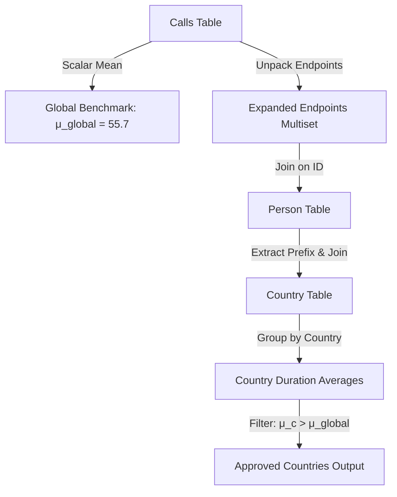

# Guided Example: Countries You Can Safely Invest In

## 1. Instance & Teaching Goal

We examine a relational database instance containing user profiles, country mappings, and phone call logs to identify which countries exhibit an average call duration strictly exceeding the global benchmark.

```text
Table: Person
+----+----------+--------------+
| id | name     | phone_number |
+----+----------+--------------+
| 3  | Jonathan | 051-1234567  |
| 12 | Elvis    | 051-7654321  |
| 1  | Moncef   | 212-1234567  |
| 2  | Maroua   | 212-6523651  |
| 7  | Meir     | 972-1234567  |
| 9  | Rachel   | 972-0011100  |
+----+----------+--------------+

Table: Country
+----------+--------------+
| name     | country_code |
+----------+--------------+
| Peru     | 051          |
| Israel   | 972          |
| Morocco  | 212          |
| Germany  | 049          |
| Ethiopia | 251          |
+----------+--------------+

Table: Calls
+-----------+-----------+----------+
| caller_id | callee_id | duration |
+-----------+-----------+----------+
| 1         | 9         | 33       |
| 2         | 9         | 4        |
| 1         | 2         | 59       |
| 3         | 12        | 102      |
| 3         | 12        | 330      |
| 12        | 3         | 5        |
| 7         | 9         | 13       |
| 7         | 1         | 3        |
| 9         | 7         | 1        |
| 1         | 7         | 7        |
+-----------+-----------+----------+
```

Our objective is to calculate the global average duration across all logged calls, unpack each call record into two participating endpoints (the initiator and the receiver), assign each endpoint to its respective sovereign territory via the telephone prefix, compute the territory-specific mean duration, and project all territories exceeding the global mean.

## 2. Conceptual Foundation & Invariants

Each phone call records a bilateral interaction between two endpoints: a caller and a callee. A call contributes its duration to the country of the caller, and independently contributes its duration to the country of the callee. When both participants reside within the same country, that single phone conversation generates two country-specific call participations, both carrying the identical duration.

```text
+-------------------------------------------------------------------------------+
|                      RELATIONAL PARTICIPATION EXPANSION                       |
|                                                                               |
|  Calls Record: (caller_id, callee_id, duration)                               |
|        |                                                                      |
|        +---> Endpoint 1: person_id = caller_id, duration = duration           |
|        +---> Endpoint 2: person_id = callee_id, duration = duration           |
|                                                                               |
|  Join with Person: person_id -> prefix = substring(phone_number, 1, 3)        |
|  Join with Country: prefix = country_code -> country_name                     |
|                                                                               |
|  Country Mean: SUM(duration) / COUNT(endpoints)                               |
|  Global Benchmark: SUM(Calls.duration) / COUNT(Calls.rows)                    |
+-------------------------------------------------------------------------------+
```

The mathematical transformation is expressed through standard relational algebra operations:

1. **Global Baseline**: The scalar global duration average $\mu_{\text{global}}$ is defined by:
   $$\mu_{\text{global}} = \Pi_{\text{avg\_duration}}\left(\gamma_{\text{avg}(duration) \to \text{avg\_duration}}(\text{Calls})\right)$$
2. **Endpoint Expansion**: We project two symmetrical streams of endpoints and unite them:
   $$E = \Pi_{\text{caller\_id} \to \text{person\_id}, duration}(\text{Calls}) \cup_{\text{all}} \Pi_{\text{callee\_id} \to \text{person\_id}, duration}(\text{Calls})$$
3. **Country Resolution**: We attach territorial identity via equi-join with $\text{Person}$ and $\text{Country}$:
   $$R = E \bowtie_{\text{person\_id} = \text{Person.id}} \text{Person} \bowtie_{\text{prefix}(\text{phone\_number}, 3) = \text{Country.country\_code}} \text{Country}$$
4. **Aggregation and Selection**: Grouping by country name yields the country-level mean:
   $$A = \gamma_{\text{name}, \text{avg}(duration) \to \mu_c}(R)$$
   $$\text{Result} = \Pi_{\text{name} \to \text{country}}\left(\sigma_{\mu_c > \mu_{\text{global}}}(A)\right)$$

The evaluation maintains the following relational state attributes:

| Relational Operator Stage | Input Relations | Output Attributes | Invariant Property |
|---|---|---|---|
| Scalar Aggregation | $\text{Calls}$ | $\mu_{\text{global}}$ | Computes the arithmetic mean over all raw call durations. |
| Multiset Union ($\cup_{\text{all}}$) | $\text{Calls}$ | $\text{person\_id}, duration$ | Cardinality is exactly $2 \times |\text{Calls}|$, duplicating domestic calls. |
| Equi-Join Composite | $E, \text{Person}, \text{Country}$ | $\text{country\_name}, duration$ | Associates every participating endpoint with its sovereign name. |
| Territorial Grouping | Composite stream | $\text{country\_name}, \mu_c$ | Computes local arithmetic mean per distinct nation. |
| Predicate Filter | Grouped stream | $\text{country}$ | Retains only nations satisfying $\mu_c > \mu_{\text{global}}$. |

> [!IMPORTANT]
> **Endpoint Invariant**: Every call represents two participant events. A domestic call where both parties reside in the same country contributes two independent samples of that duration to the country's tally, precisely matching its contribution to the country's communications volume.



## 3. Step-by-Step Worked Execution

### Phase 1: Global Benchmark Calculation

The $\text{Calls}$ table contains 10 rows. We calculate the sum of all durations:
$$\sum_{r \in \text{Calls}} duration = 33 + 4 + 59 + 102 + 330 + 5 + 13 + 3 + 1 + 7 = 557$$
The global benchmark is:
$$\mu_{\text{global}} = \frac{557}{10} = 55.7000$$

### Phase 2: Prefix and Country Mapping

From $\text{Person}$ and $\text{Country}$, we establish the territorial membership of each person:
- Jonathan (id 3): phone `051-1234567` $\to$ prefix `051` $\to$ Peru
- Elvis (id 12): phone `051-7654321` $\to$ prefix `051` $\to$ Peru
- Moncef (id 1): phone `212-1234567` $\to$ prefix `212` $\to$ Morocco
- Maroua (id 2): phone `212-6523651` $\to$ prefix `212` $\to$ Morocco
- Meir (id 7): phone `972-1234567` $\to$ prefix `972` $\to$ Israel
- Rachel (id 9): phone `972-0011100` $\to$ prefix `972` $\to$ Israel

### Phase 3: Processing Call Endpoints

We examine each call and resolve both endpoints to their respective countries:

- **Call 1**: $(1, 9, 33)$
  - Caller: Person 1 (Morocco) $\to$ Morocco records 33
  - Callee: Person 9 (Israel) $\to$ Israel records 33
- **Call 2**: $(2, 9, 4)$
  - Caller: Person 2 (Morocco) $\to$ Morocco records 4
  - Callee: Person 9 (Israel) $\to$ Israel records 4
- **Call 3**: $(1, 2, 59)$
  - Caller: Person 1 (Morocco) $\to$ Morocco records 59
  - Callee: Person 2 (Morocco) $\to$ Morocco records 59 (Domestic Morocco call)
- **Call 4**: $(3, 12, 102)$
  - Caller: Person 3 (Peru) $\to$ Peru records 102
  - Callee: Person 12 (Peru) $\to$ Peru records 102 (Domestic Peru call)
- **Call 5**: $(3, 12, 330)$
  - Caller: Person 3 (Peru) $\to$ Peru records 330
  - Callee: Person 12 (Peru) $\to$ Peru records 330 (Domestic Peru call)
- **Call 6**: $(12, 3, 5)$
  - Caller: Person 12 (Peru) $\to$ Peru records 5
  - Callee: Person 3 (Peru) $\to$ Peru records 5 (Domestic Peru call)
- **Call 7**: $(7, 9, 13)$
  - Caller: Person 7 (Israel) $\to$ Israel records 13
  - Callee: Person 9 (Israel) $\to$ Israel records 13 (Domestic Israel call)
- **Call 8**: $(7, 1, 3)$
  - Caller: Person 7 (Israel) $\to$ Israel records 3
  - Callee: Person 1 (Morocco) $\to$ Morocco records 3
- **Call 9**: $(9, 7, 1)$
  - Caller: Person 9 (Israel) $\to$ Israel records 1
  - Callee: Person 7 (Israel) $\to$ Israel records 1 (Domestic Israel call)
- **Call 10**: $(1, 7, 7)$
  - Caller: Person 1 (Morocco) $\to$ Morocco records 7
  - Callee: Person 7 (Israel) $\to$ Israel records 7

## 4. Complete Execution Trace

We collect all endpoint participation events by country into a comprehensive aggregation trace.

| Country | Endpoint Durations Recorded | Total Duration Sum | Endpoint Count | Territorial Average ($\mu_c$) | Status vs $\mu_{\text{global}} = 55.7$ |
|---|---|---|---|---|---|
| Peru | $102, 102, 330, 330, 5, 5$ | $874$ | $6$ | $\frac{874}{6} \approx 145.6667$ | **Accepted** ($145.6667 > 55.7$) |
| Morocco | $33, 4, 59, 59, 3, 7$ | $165$ | $6$ | $\frac{165}{6} = 27.5000$ | **Rejected** ($27.5 \le 55.7$) |
| Israel | $33, 4, 13, 13, 3, 1, 1, 7$ | $75$ | $8$ | $\frac{75}{8} = 9.3750$ | **Rejected** ($9.375 \le 55.7$) |
| Germany | None | $0$ | $0$ | Undefined / Null | **Rejected** (No activity) |
| Ethiopia | None | $0$ | $0$ | Undefined / Null | **Rejected** (No activity) |

Applying the predicate $\sigma_{\mu_c > 55.7}$ filters out Morocco and Israel, retaining solely Peru.

Final projected relation $\text{Result}$:
```text
+----------+
| country  |
+----------+
| Peru     |
+----------+
```

## 5. Algorithmic Correctness

### Soundness

Every tuple in the output satisfies the selection condition $\mu_c > \mu_{\text{global}}$.
By expanding each bilateral call $(c_1, c_2, d)$ into two endpoints $(c_1, d)$ and $(c_2, d)$, we account for the full duration experienced by each participant. If both participants are in country $C$, both citizens engaged in a conversation of length $d$, correctly attributing $2d$ to the total minutes and $2$ to the participant count of country $C$. The country mean $\mu_c = \frac{\sum_{e \in C} d_e}{|E_C|}$ accurately reflects the average duration of a call event involving that country's populace. Comparing this directly against the scalar benchmark $\mu_{\text{global}} = \frac{\sum_{r \in \text{Calls}} duration}{|\text{Calls}|}$ guarantees that any returned country has an average duration strictly exceeding the global mean.

### Completeness

Suppose a country $C^*$ has an average call duration strictly greater than $\mu_{\text{global}}$. Because equi-joins on unique keys ($\text{Person.id}$ and $\text{Country.country\_code}$) preserve all valid participating endpoints without loss, the grouping operator $\gamma$ aggregates every call event involving residents of $C^*$. The selection predicate $\sigma_{\mu_{C^*} > \mu_{\text{global}}}$ evaluates to true, ensuring $C^*$ is included in the projection. Countries with zero logged calls are excluded by the inner join semantics, matching the requirement that only countries with observed calls exceeding the threshold are viable investments.

## 6. Traps This Instance Exposes

- **Domestic Call Single-Counting Trap**: Treating a domestic call (where caller and callee share the same country code) as a single event with duration $d$ rather than two endpoints with duration $d$ each distorts the country's average. For Peru, if domestic calls were counted once, the sum would be $102 + 330 + 5 = 437$ over $3$ calls, yielding $145.6667$ by coincidence of symmetry, but for asymmetric patterns, omitting callee endpoints invalidates the weighted mean.
- **Global Denominator Confusion**: Attempting to compute the global benchmark by averaging over endpoints ($2 \times 10 = 20$) rather than raw call rows ($10$). Since each call has two endpoints, the sum of endpoint durations is $2 \times 557 = 1114$, and $\frac{1114}{20} = 55.7$, which numerically matches $\frac{557}{10}$. However, formulating the global subquery as `SELECT AVG(duration) FROM Calls` computes $\frac{\sum duration}{|\text{Calls}|}$ directly without needing endpoint duplication.
- **Prefix Substring Boundary**: Assuming country codes are fixed length integers rather than character strings. A country code such as `051` contains a leading zero; integer conversion would strip the zero to `51`, causing equi-join failure against a string column `country_code = '051'`.
- **Inverted Comparison Trap**: Using $\ge$ instead of strictly $>$ excludes border cases where a country's average exactly equals the global average, violating the requirement for strictly greater duration.

## 7. Complexity Derivation

### Time Complexity

Let $P$ denote the cardinality of $\text{Person}$, $C$ denote the cardinality of $\text{Country}$, and $K$ denote the cardinality of $\text{Calls}$.
1. **Global Mean Computation**: Scanning $\text{Calls}$ to evaluate $\gamma_{\text{avg}(duration)}$ requires $\mathcal{O}(K)$ time.
2. **Endpoint Expansion and Joins**:
   - Projecting endpoints produces $2K$ records.
   - Hashing or indexing $\text{Person}$ on `id` takes $\mathcal{O}(P)$ time.
   - Hashing $\text{Country}$ on `country_code` takes $\mathcal{O}(C)$ time.
   - Probing the hash maps for each of the $2K$ endpoints takes $\mathcal{O}(K)$ time.
3. **Grouping and Selection**:
   - Aggregating the $2K$ joined records by country name takes $\mathcal{O}(K)$ time using a hash table with at most $C$ buckets.
   - Filtering the $C$ country summaries against $\mu_{\text{global}}$ takes $\mathcal{O}(C)$ time.

Total time complexity is $\mathcal{O}(P + C + K)$ in an indexed relational engine.

### Auxiliary Space Complexity

- The hash index for $\text{Person}$ occupies $\mathcal{O}(P)$ space.
- The hash index for $\text{Country}$ occupies $\mathcal{O}(C)$ space.
- The intermediate grouped accumulator for countries requires $\mathcal{O}(C)$ space.
- The global scalar average requires $\mathcal{O}(1)$ space.

Total auxiliary space complexity is $\mathcal{O}(P + C)$ working memory beyond the base tables.
