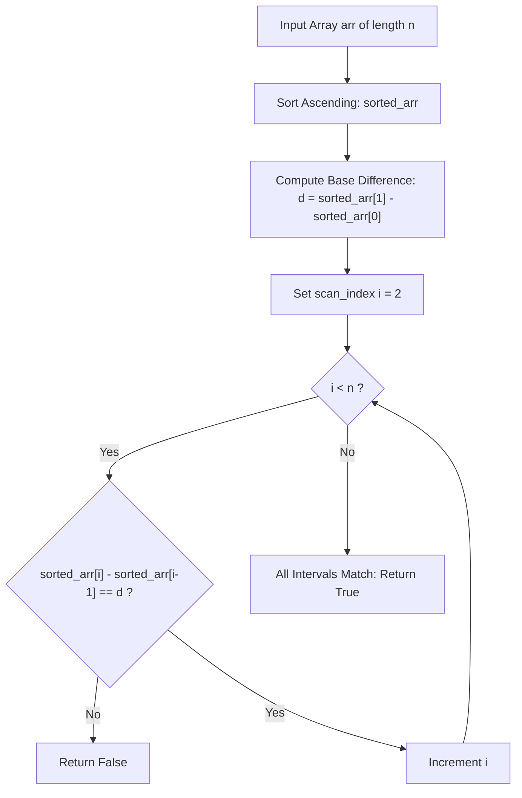

# Guided Example: Can Make Arithmetic Progression From Sequence

## 1. Instance & Teaching Goal

We are provided an unordered collection of numbers:
$$\text{arr} = [7, 1, 5, 3]$$

Our teaching goal is to determine whether the multiset of values can be permuted into an arithmetic sequence where the difference between every consecutive pair of adjacent terms is constant. We illustrate both the sorting-based decision procedure and the linear-time extremal projection method, tracing the exact state transitions, pairwise difference verifications, and structural edge cases.

## 2. Conceptual Foundation & Invariants

An arithmetic progression of length $n$ with initial term $a_0$ and common difference $d$ takes the form:
$$a_k = a_0 + k \cdot d \quad \text{for } k \in \{0, 1, \dots, n-1\}$$

When sorted in non-decreasing order:
1. The smallest element is $\min(\text{arr}) = a_0$.
2. The largest element is $\max(\text{arr}) = a_{n-1}$.
3. If $d = 0$, all elements in the array must be identical ($\min = \max$).
4. If $d \ne 0$, the total span $\max(\text{arr}) - \min(\text{arr})$ must be evenly divisible by $n - 1$, fixing the unique mandatory common step size:
   $$d = \frac{\max(\text{arr}) - \min(\text{arr})}{n - 1}$$
5. Under the sorting paradigm, arranging elements such that $a_0 \le a_1 \le \dots \le a_{n-1}$ reduces the problem to verifying that every adjacent gap satisfies $a_{i+1} - a_i = d$.

```text
+-------------------------------------------------------------------------------+
|                      ARITHMETIC PROGRESSION VERIFICATION                      |
|                                                                               |
|  Unordered Array: [7, 1, 5, 3],  n = 4                                        |
|                                                                               |
|  Step 1: Sort ascending -> [1, 3, 5, 7]                                       |
|  Step 2: Base difference d = a[1] - a[0] = 3 - 1 = 2                          |
|  Step 3: Pairwise validation:                                                 |
|          Index 1 to 2: a[2] - a[1] = 5 - 3 = 2  (Matches d)                   |
|          Index 2 to 3: a[3] - a[2] = 7 - 5 = 2  (Matches d)                   |
|                                                                               |
|  Status: Invariant holds across all intervals -> return True                  |
+-------------------------------------------------------------------------------+
```

The algorithm maintains the following state variables during the adjacent inspection pass:

| State Variable | Domain | Initial Value | Transition / Role |
|---|---|---|---|
| `sorted_arr` | Sequence of length $n$ | Permutation of $\text{arr}$ | Monotonically non-decreasing sorted copy of input numbers. |
| `target_diff` | Integer | $\text{sorted\_arr}[1] - \text{sorted\_arr}[0]$ | Common step size $d$ required between every adjacent pair. |
| `scan_index` | Integer $\in [1, n-1]$ | $1$ | Pointer traversing adjacent pairs $(\text{scan\_index}-1, \text{scan\_index})$. |
| `is_valid` | Boolean | True | Flips to False immediately upon observing an adjacent difference $\ne \text{target\_diff}$. |

> [!IMPORTANT]
> **Total Span Divisibility Invariant**: For any valid progression, the gap between the global extrema must equal $(n - 1) \times d$. If $(\max - \min) \bmod (n - 1) \ne 0$, no reordering can ever form an arithmetic progression.



## 3. Step-by-Step Worked Execution

We walk through the representative instance $\text{arr} = [7, 1, 5, 3]$.

### Step 1: Array Length and Extremal Bounds

- Array length $n = 4$. Since $n \ge 2$, at least one adjacent pair exists.
- The global minimum is $1$ and the global maximum is $7$.
- Potential span: $7 - 1 = 6$.
- Expected common difference if valid: $d = \frac{6}{4 - 1} = \frac{6}{3} = 2$.

### Step 2: Sorting Transformation

We sort the array in non-decreasing order:
$$\text{sorted\_arr} = [1, 3, 5, 7]$$

### Step 3: Base Difference Determination

We extract the difference between the first two elements:
$$\text{target\_diff} = \text{sorted\_arr}[1] - \text{sorted\_arr}[0] = 3 - 1 = 2$$

### Step 4: Pairwise Interval Verifications

We inspect each subsequent consecutive pair $(i-1, i)$:

- **Iteration $i = 2$**:
  - Current element: $\text{sorted\_arr}[2] = 5$
  - Preceding element: $\text{sorted\_arr}[1] = 3$
  - Interval delta: $5 - 3 = 2$
  - Test: $2 == \text{target\_diff}$ ($2 == 2$, holds)
- **Iteration $i = 3$**:
  - Current element: $\text{sorted\_arr}[3] = 7$
  - Preceding element: $\text{sorted\_arr}[2] = 5$
  - Interval delta: $7 - 5 = 2$
  - Test: $2 == \text{target\_diff}$ ($2 == 2$, holds)

All adjacent differences equal $2$. The sequence forms a valid arithmetic progression.

## 4. Complete Execution Trace

The complete step trace across all index transitions is summarized below.

| Step | Scan Index $i$ | Pair Inspected $(a_{i-1}, a_i)$ | Observed Difference | Target Difference $d$ | Condition $a_i - a_{i-1} == d$ | Verdict |
|---|---|---|---|---|---|---|
| Initialization | $1$ | $(1, 3)$ | $3 - 1 = 2$ | $2$ | Baseline definition | Base established |
| Check 1 | $2$ | $(3, 5)$ | $5 - 3 = 2$ | $2$ | $2 == 2$ | Valid |
| Check 2 | $3$ | $(5, 7)$ | $7 - 5 = 2$ | $2$ | $2 == 2$ | Valid |
| Termination | $4$ | Boundary reached | — | $2$ | All $n-1$ intervals satisfied | **Return True** |

### Counter-Example Demonstration: $\text{arr} = [1, 2, 4]$

For contrast, consider the invalid instance $\text{arr} = [1, 2, 4]$:
1. Array is already sorted: $[1, 2, 4]$.
2. Base difference at $i = 1$: $d = 2 - 1 = 1$.
3. Check at $i = 2$: pair $(2, 4)$ yields $4 - 2 = 2$.
4. Comparison: $2 \ne 1$.
5. The loop short-circuits immediately, returning False.

## 5. Algorithmic Correctness

### Soundness

Suppose the algorithm returns True. That implies that for the sorted array $a$, every adjacent difference satisfies $a_i - a_{i-1} = d$ for all $i \in \{1, \dots, n-1\}$. By mathematical induction:
- Base step: $a_1 = a_0 + d$.
- Inductive hypothesis: assume $a_k = a_0 + k \cdot d$.
- Inductive step: $a_{k+1} = a_k + d = (a_0 + k \cdot d) + d = a_0 + (k+1) \cdot d$.
Thus, the sorted permutation satisfies the definition of an arithmetic progression.

### Completeness

Suppose $\text{arr}$ can be permuted into an arithmetic progression $P = (p_0, p_1, \dots, p_{n-1})$ with common difference $d^*$.
- If $d^* > 0$, $P$ is already strictly increasing, so sorting $\text{arr}$ uniquely recovers $P$, and all adjacent differences will equal $d^*$.
- If $d^* < 0$, $P$ is strictly decreasing; sorting $\text{arr}$ produces the reversed sequence $P' = (p_{n-1}, \dots, p_0)$ with common difference $-d^* > 0$, where all adjacent differences equal $-d^*$.
- If $d^* = 0$, all elements are identical; sorting leaves them identical with difference $0$.
In all cases, the sorted array exhibits a uniform adjacent difference. Thus, the algorithm never outputs False for a valid progression.

## 6. Traps This Instance Exposes

- **Unsorted False Discrepancy Trap**: Checking adjacent differences on the raw input without sorting first. For $[7, 1, 5, 3]$, raw differences are $1-7 = -6$, $5-1 = 4$, which falsely flags the array as invalid even though a valid permutation exists.
- **Zero Difference Edge Case**: Arrays with identical elements like $[0, 0, 0]$. Here $d = 0$, which is a valid arithmetic progression. If an algorithm attempts to divide by $d$ without checking $d = 0$, a division-by-zero runtime fault occurs.
- **Floating-Point Precision Leak**: Using floating-point division $(\max - \min) / (n - 1)$ without verifying exact integer divisibility. If $\max - \min = 7$ and $n = 4$, $7/3 \approx 2.3333$, which is not an integer and therefore cannot form an integer arithmetic progression.
- **Duplicate Non-Zero Step Hazard**: In the linear hash-set approach, having duplicate values when $d \ne 0$ (such as $[1, 3, 3, 5]$) must be detected. Each bucket $(x - \min) / d$ must be occupied exactly once.

## 7. Complexity Derivation

### Time Complexity

- **Comparison-Based Sorting**: Sorting the array of length $n$ requires $\mathcal{O}(n \log n)$ time using standard introsort or mergesort.
- **Linear Scan**: Inspecting the $n-1$ adjacent intervals requires a single pass of $n-1$ subtractions and equality checks, consuming $\mathcal{O}(n)$ time.
- **Total Time**: $\mathcal{O}(n \log n) + \mathcal{O}(n) = \mathcal{O}(n \log n)$.
- *(Alternative Linear Method)*: Finding $\min$ and $\max$ takes $\mathcal{O}(n)$. Inserting into a hash set or marking a boolean presence array takes $\mathcal{O}(n)$ time, yielding an optimal $\mathcal{O}(n)$ alternative.

### Auxiliary Space Complexity

- Standard sorting requires $\mathcal{O}(\log n)$ auxiliary space for recursive call frames (or $\mathcal{O}(1)$ in-place heapsort).
- The linear scan uses $\mathcal{O}(1)$ scalar variables (`target_diff`, `scan_index`).
- Total auxiliary space is $\mathcal{O}(1)$ beyond the in-place sorting buffer.
