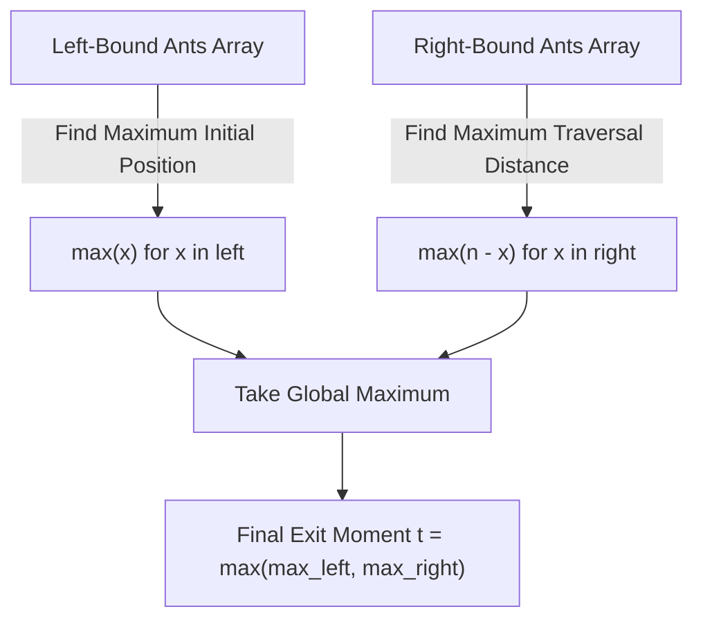

# Guided Example: Last Moment Before All Ants Fall Out of a Plank

## 1. Instance & Teaching Goal

We examine a wooden plank of length $n = 4$ units spanning coordinates $[0, 4]$. Multiple ants are placed at integer coordinates walking at constant speed $v = 1$ unit per second:
- Ants moving toward the left: $\text{left} = [4, 3]$
- Ants moving toward the right: $\text{right} = [0, 1]$

When two ants collide, they instantaneously reverse directions and continue moving at $1$ unit per second. An ant falls off the plank immediately upon reaching coordinate $0$ (left boundary) or coordinate $4$ (right boundary).

Our teaching goal is to determine the exact moment $t$ when the final ant falls off the plank. We demonstrate the profound physical symmetry known as the **collision transparency equivalence**, proving why complex microscopic direction reversals can be replaced by non-interacting straight paths, reducing an otherwise intricate simulation to extremal range bounds.

## 2. Conceptual Foundation & Invariants

Consider two ants, $A$ moving right and $B$ moving left, that collide at position $p$ at time $t_c$:
1. **Physical Reality**: Upon collision, $A$ reverses and moves left; $B$ reverses and moves right.
2. **Identity Equivalence**: Because all ants are identical point masses moving at identical speeds, swapping directions is mathematically equivalent to $A$ continuing to move right and $B$ continuing to move left, with their labels swapped.
3. **Trajectory Preservation**: The multiset of trajectories across the entire system is completely invariant under collision. Every ant moving left from initial position $x$ will travel a total distance of $x$ units to reach the left terminus $0$, requiring exactly $x / 1 = x$ seconds.
4. Every ant moving right from initial position $x$ will travel a total distance of $n - x$ units to reach the right terminus $n$, requiring exactly $(n - x) / 1 = n - x$ seconds.

```text
+-------------------------------------------------------------------------------+
|                       COLLISION TRANSPARENCY PRINCIPLE                        |
|                                                                               |
|  Actual Collision:                                                            |
|    Ant A (->) at p  <==>  (<-) Ant B at p                                     |
|    After bounce:  (<-) A       B (->)                                         |
|                                                                               |
|  Equivalent Transparent Pass-Through:                                         |
|    Path 1 continues right:  -----------> (Travels to n)                       |
|    Path 2 continues left:   <----------- (Travels to 0)                       |
|                                                                               |
|  Conclusion: The set of exit times is IDENTICAL in both models.               |
+-------------------------------------------------------------------------------+
```

The algorithm monitors the following state variables during the extremal reductions:

| State Variable | Domain | Initial Value | Transition / Role |
|---|---|---|---|
| `plank_length` | Positive integer | $n$ | Total span $[0, n]$ across which ants traverse. |
| `max_left_duration` | Integer $\ge 0$ | $0$ | Maximum initial coordinate among all left-bound ants ($\max(x)$ for $x \in \text{left}$). |
| `max_right_duration` | Integer $\ge 0$ | $0$ | Maximum distance to right boundary among right-bound ants ($\max(n - x)$ for $x \in \text{right}$). |
| `final_exit_moment` | Integer $\ge 0$ | $0$ | Global maximum fall moment $\max(\text{max\_left\_duration}, \text{max\_right\_duration})$. |

> [!IMPORTANT]
> **Permutation Invariance**: Elastic collisions between identical 1D particles preserve the velocity spectrum. The set of times at which ants fall off the plank is identical whether ants bounce or pass straight through each other.



## 3. Step-by-Step Worked Execution

We trace the representative instance: $n = 4$, $\text{left} = [4, 3]$, $\text{right} = [0, 1]$.
Let us label the ants:
- Ant $R_0$ at $0$, moving right.
- Ant $R_1$ at $1$, moving right.
- Ant $L_3$ at $3$, moving left.
- Ant $L_4$ at $4$, moving left.

### Phase 1: Microscopic Collision Simulation (Physical Model)

To appreciate the transparency principle, let us observe the physical collisions step by step:

1. **Time $t = 0.0$**: Positions are $R_0=0, R_1=1, L_3=3, L_4=4$.
2. **Time $t = 1.0$**:
   - $R_0$ advances to $1$.
   - $R_1$ advances to $2$.
   - $L_3$ advances to $2$.
   - $L_4$ advances to $3$.
   - **Collision Event 1**: $R_1$ and $L_3$ collide at position $2.0$. They reverse directions: $R_1$ now moves left; $L_3$ now moves right.
3. **Time $t = 1.5$**:
   - Ant at $1$ (formerly $R_0$) reaches $1.5$ moving right.
   - Ant at $2$ moving left (formerly $R_1$) reaches $1.5$.
   - **Collision Event 2**: They collide at position $1.5$. They bounce.
   - Ant at $2$ moving right (formerly $L_3$) reaches $2.5$.
   - Ant at $3$ moving left (formerly $L_4$) reaches $2.5$.
   - **Collision Event 3**: They collide at position $2.5$. They bounce.
4. Following this chain of microscopic collisions, the last ant leaves the plank at $t = 4.0$.

### Phase 2: Transparent Pass-Through Calculation (Macroscopic Model)

Instead of tracking every collision event, we apply the transparency theorem:

#### Step 1: Evaluate Left-Moving Ants

Left-moving ants walk directly to position $0$:
- Ant at position $4$: distance to $0$ is $4 - 0 = 4$ units $\implies 4$ seconds.
- Ant at position $3$: distance to $0$ is $3 - 0 = 3$ units $\implies 3$ seconds.
- Maximum duration among left-moving ants:
  $$\text{max\_left} = \max(4, 3) = 4$$

#### Step 2: Evaluate Right-Moving Ants

Right-moving ants walk directly to position $n = 4$:
- Ant at position $0$: distance to $4$ is $4 - 0 = 4$ units $\implies 4$ seconds.
- Ant at position $1$: distance to $4$ is $4 - 1 = 3$ units $\implies 3$ seconds.
- Maximum duration among right-moving ants:
  $$\text{max\_right} = \max(4 - 0, 4 - 1) = \max(4, 3) = 4$$

#### Step 3: Global Extremum

The moment when the final ant departs is:
$$\text{final\_exit\_moment} = \max(\text{max\_left}, \text{max\_right}) = \max(4, 4) = 4$$

Both models yield the identical result: $t = 4$.

## 4. Complete Execution Trace

We tabulate each ant's independent transparent trajectory and exit time.

| Ant Identifier | Initial Coordinate $x$ | Direction | Trajectory Span | Required Travel Time | System Fall Time |
|---|---|---|---|---|---|
| $R_0$ | $0$ | Right ($\to$) | $[0, 4]$ | $4 - 0 = 4$ | $t = 4$ |
| $R_1$ | $1$ | Right ($\to$) | $[1, 4]$ | $4 - 1 = 3$ | $t = 3$ |
| $L_3$ | $3$ | Left ($\leftarrow$) | $[3, 0]$ | $3 - 0 = 3$ | $t = 3$ |
| $L_4$ | $4$ | Left ($\leftarrow$) | $[4, 0]$ | $4 - 0 = 4$ | $t = 4$ |

Comparative reduction across both groups:

| Evaluation Stage | Elements Considered | Formula Evaluated | Result |
|---|---|---|---|
| Left Group Reduction | $\text{left} = [4, 3]$ | $\max_{x \in \text{left}} x$ | $4$ |
| Right Group Reduction | $\text{right} = [0, 1]$ | $\max_{x \in \text{right}} (4 - x)$ | $4$ |
| Global Maximum Selection | $\{\text{max\_left}, \text{max\_right}\}$ | $\max(4, 4)$ | **$4$** |

At moment $t = 4$, the last ants reach the borders and fall off.

## 5. Algorithmic Correctness

### Soundness

Let $S(t) = \{x_1(t), x_2(t), \dots, x_k(t)\}$ denote the multiset of ant positions at time $t$.
When two ants at positions $x_i$ and $x_j$ meet at time $t^*$, $x_i(t^*) = x_j(t^*)$, and their velocities swap: $v_i' = -v_i$ and $v_j' = -v_j$.
Because the ants are indistinguishable, the multiset of positions $S(t)$ and the multiset of velocities $V(t)$ are identical whether velocities swap or the trajectories cross:
$$\{ (x_i(t), v_i(t)) \}_{i=1}^k = \{ (x_i^{\text{trans}}(t), v_i^{\text{trans}}(t)) \}_{i=1}^k$$
Since each transparent path with velocity $+1$ starting at $x$ exits at $t = n - x$, and each transparent path with velocity $-1$ starting at $x$ exits at $t = x$, the multiset of exit times under physical collisions is identical to the multiset of exit times under transparent pass-through. The maximum exit time is therefore soundly given by $\max(\max(\text{left}), \max(n - \text{right}))$.

### Completeness

Every ant on the plank must belong either to $\text{left}$ or $\text{right}$.
Because speed is strictly $1$ unit per second, an ant starting at $x$ requires at least $x$ seconds to reach $0$, and at least $n - x$ seconds to reach $n$. No ant can exit in less time than its direct distance to the nearest boundary. The latest exit time over all ants is guaranteed to be attained by the ant whose transparent path covers the greatest distance. Thus, the reduction examines the entire support set and never underestimates the duration.

## 6. Traps This Instance Exposes

- **Simulation Trap**: Attempting to run a discrete-event simulation tracking pairwise collision positions and direction reversals. With up to $10^4$ ants and fractional meeting times ($t = 1.5$), a step-by-step simulator suffers from $\mathcal{O}(n^2)$ time complexity and floating-point rounding errors.
- **Empty Array Trap**: Either $\text{left}$ or $\text{right}$ can be completely empty (as seen in Examples 2 and 3). Taking $\max(\text{left})$ on an empty list without a default base value ($0$) triggers an empty sequence runtime exception.
- **Direction Misattribution**: Calculating $n - x$ for left-moving ants or $x$ for right-moving ants. A left-moving ant walks toward coordinate $0$, so its distance is $x - 0 = x$; a right-moving ant walks toward coordinate $n$, so its distance is $n - x$.
- **Simultaneous Multiple Collisions**: Believing that three or more ants meeting near the same coordinate requires special higher-order collision resolution physics. By the transparent trajectory theorem, multiple simultaneous meetings simply correspond to multiple independent paths intersecting at the same spacetime coordinate.

## 7. Complexity Derivation

### Time Complexity

- **Left Scan**: Finding the maximum value in array $\text{left}$ requires a single linear scan of $|\text{left}|$ elements, taking $\mathcal{O}(|\text{left}|)$ time.
- **Right Scan**: Finding the maximum value of $n - x$ across array $\text{right}$ requires a single linear scan of $|\text{right}|$ elements, taking $\mathcal{O}(|\text{right}|)$ time.
- **Overall Time**: $\mathcal{O}(|\text{left}| + |\text{right}|) \le \mathcal{O}(n)$, which is optimal since every ant's initial position must be read at least once.

### Auxiliary Space Complexity

- The algorithm only maintains scalar accumulators (`max_left`, `max_right`, `ans`).
- No auxiliary arrays, sets, or queues are allocated.
- Auxiliary space complexity is strictly $\mathcal{O}(1)$.
