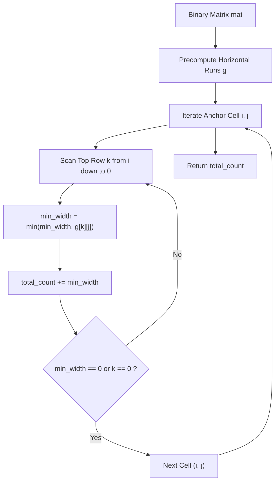

# Guided Example: Count Submatrices With All Ones

## 1. Instance & Teaching Goal

We are given a binary matrix of dimensions $3 \times 3$:
$$\text{mat} = \begin{pmatrix} 1 & 0 & 1 \\ 1 & 1 & 0 \\ 1 & 1 & 0 \end{pmatrix}$$

Our teaching goal is to determine the total count of rectangular submatrices consisting entirely of ones. We formulate the counting problem through histogram projection, demonstrating how precomputing horizontal runs enables exact, overlap-free enumeration of all valid bounding boxes anchored at each cell as the bottom-right corner.

## 2. Conceptual Foundation & Invariants

A submatrix spanning rows $[r_1, r_2]$ and columns $[c_1, c_2]$ contains all ones if and only if every cell $(r, c)$ in the rectangle has $\text{mat}[r][c] = 1$.
Direct brute-force enumeration of all pairs of top-left $(r_1, c_1)$ and bottom-right $(r_2, c_2)$ corners would examine $\mathcal{O}(m^2 n^2)$ candidates, each taking $\mathcal{O}(m n)$ to verify.

To optimize, we anchor each possible submatrix by its **bottom-right corner** $(i, j)$:
1. **Horizontal Run Precomputation**:
   Let $g[i][j]$ denote the length of the contiguous streak of ones ending at $(i, j)$ in row $i$:
   $$g[i][j] = \begin{cases} 0 & \text{if } \text{mat}[i][j] = 0 \\ 1 & \text{if } \text{mat}[i][j] = 1 \text{ and } j = 0 \\ 1 + g[i][j-1] & \text{if } \text{mat}[i][j] = 1 \text{ and } j > 0 \end{cases}$$
2. **Upward Vertical Extrusion**:
   For any submatrix with bottom-right corner $(i, j)$ extending upwards to row $k$ ($0 \le k \le i$):
   - The width of the rectangle cannot exceed the horizontal streak of ones on any intermediate row between $k$ and $i$.
   - Thus, the maximal permissible width spanning rows $k$ through $i$ is:
     $$W(k, i, j) = \min_{k \le r \le i} g[r][j]$$
   - For this fixed vertical span of height $h = i - k + 1$, there exist exactly $W(k, i, j)$ valid rectangles ending at column $j$ (having widths $1, 2, \dots, W(k, i, j)$).
3. **Total Submatrices**:
   Summing over all bottom-right corners $(i, j)$ and all top rows $k \le i$:
   $$\text{Total} = \sum_{i=0}^{m-1} \sum_{j=0}^{n-1} \sum_{k=i}^{0} \min_{k \le r \le i} g[r][j]$$

```text
+-------------------------------------------------------------------------------+
|                    HISTOGRAM EXTRUSION AT BOTTOM-RIGHT (i, j)                 |
|                                                                               |
|  Row k=0:  [ . . 1 ]          g[0][j] = 1   -> min width = 0 (breaks)         |
|  Row k=1:  [ 1 1 . ]          g[1][j] = 2   -> min width = min(2, 2) = 2      |
|  Row k=2:  [ 1 1 . ] <(i, j)  g[2][j] = 2   -> min width = 2                  |
|                                                                               |
|  At anchor (2, 1):                                                            |
|    - Extends to k=2: height 1, width in {1, 2}  => 2 submatrices              |
|    - Extends to k=1: height 2, width in {1, 2}  => 2 submatrices              |
|    - Extends to k=0: g[0][1]=0 => min width 0   => 0 submatrices              |
|  Total submatrices anchored at (2, 1) = 2 + 2 = 4                             |
+-------------------------------------------------------------------------------+
```

The algorithm maintains the following state variables during execution:

| State Variable | Domain | Initial Value | Transition / Role |
|---|---|---|---|
| `g[i][j]` | 2D array of integers $\ge 0$ | Zeros | Horizontal length of consecutive 1s terminating at $(i, j)$. |
| `anchor_cell` | Coordinates $(i, j)$ | $(0, 0)$ | Designated bottom-right corner of candidate rectangles. |
| `min_width` | Integer $\ge 0$ | $g[i][j]$ | Running minimum of $g[k][j]$ as top boundary $k$ scans upward from $i$ down to $0$. |
| `total_count` | Integer $\ge 0$ | $0$ | Accumulator of all valid submatrices across the entire grid. |

> [!IMPORTANT]
> **Monotonic Width Invariant**: As the top boundary $k$ moves upward from $i$ toward $0$, the maximum permissible width $W(k, i, j) = \min(W(k+1, i, j), g[k][j])$ is monotonically non-increasing. Once $W(k, i, j) = 0$, all higher vertical spans $k' < k$ have width $0$ and can be immediately pruned.



## 3. Step-by-Step Worked Execution

We walk through the representative instance $\text{mat} = \begin{pmatrix} 1 & 0 & 1 \\ 1 & 1 & 0 \\ 1 & 1 & 0 \end{pmatrix}$.

### Phase 1: Precomputing Horizontal Runs ($g$)

We scan each row from left to right:
- **Row 0**:
  - $j = 0: \text{mat}[0][0] = 1 \implies g[0][0] = 1$
  - $j = 1: \text{mat}[0][1] = 0 \implies g[0][1] = 0$
  - $j = 2: \text{mat}[0][2] = 1 \implies g[0][2] = 1$
  - Row 0 horizontal runs: $[1, 0, 1]$
- **Row 1**:
  - $j = 0: \text{mat}[1][0] = 1 \implies g[1][0] = 1$
  - $j = 1: \text{mat}[1][1] = 1 \implies g[1][1] = 1 + g[1][0] = 2$
  - $j = 2: \text{mat}[1][2] = 0 \implies g[1][2] = 0$
  - Row 1 horizontal runs: $[1, 2, 0]$
- **Row 2**:
  - $j = 0: \text{mat}[2][0] = 1 \implies g[2][0] = 1$
  - $j = 1: \text{mat}[2][1] = 1 \implies g[2][1] = 1 + g[2][0] = 2$
  - $j = 2: \text{mat}[2][2] = 0 \implies g[2][2] = 0$
  - Row 2 horizontal runs: $[1, 2, 0]$

Precomputed matrix $g$:
$$g = \begin{pmatrix} 1 & 0 & 1 \\ 1 & 2 & 0 \\ 1 & 2 & 0 \end{pmatrix}$$

### Phase 2: Anchor Enumeration and Upward Scans

We evaluate every cell $(i, j)$ as the bottom-right corner:

#### Row $i = 0$
- Cell $(0, 0)$: $k = 0 \implies \text{min\_width} = g[0][0] = 1$. Added: $1$. (Total: $1$)
- Cell $(0, 1)$: $k = 0 \implies \text{min\_width} = g[0][1] = 0$. Added: $0$. (Total: $1$)
- Cell $(0, 2)$: $k = 0 \implies \text{min\_width} = g[0][2] = 1$. Added: $1$. (Total: $2$)

#### Row $i = 1$
- Cell $(1, 0)$:
  - $k = 1: \text{min\_width} = g[1][0] = 1$. Added: $1$.
  - $k = 0: \text{min\_width} = \min(1, g[0][0]) = \min(1, 1) = 1$. Added: $1$.
  - Submatrices anchored at $(1, 0)$: $1 + 1 = 2$. (Total: $4$)
- Cell $(1, 1)$:
  - $k = 1: \text{min\_width} = g[1][1] = 2$. Added: $2$ (widths $1$ and $2$, height $1$).
  - $k = 0: \text{min\_width} = \min(2, g[0][1]) = \min(2, 0) = 0$. Added: $0$.
  - Submatrices anchored at $(1, 1)$: $2 + 0 = 2$. (Total: $6$)
- Cell $(1, 2)$:
  - $k = 1: \text{min\_width} = g[1][2] = 0$. Added: $0$. (Total: $6$)

#### Row $i = 2$
- Cell $(2, 0)$:
  - $k = 2: \text{min\_width} = g[2][0] = 1$. Added: $1$.
  - $k = 1: \text{min\_width} = \min(1, g[1][0]) = \min(1, 1) = 1$. Added: $1$.
  - $k = 0: \text{min\_width} = \min(1, g[0][0]) = \min(1, 1) = 1$. Added: $1$.
  - Submatrices anchored at $(2, 0)$: $1 + 1 + 1 = 3$ ($1\times 1, 2\times 1, 3\times 1$). (Total: $9$)
- Cell $(2, 1)$:
  - $k = 2: \text{min\_width} = g[2][1] = 2$. Added: $2$ ($1\times 1, 1\times 2$).
  - $k = 1: \text{min\_width} = \min(2, g[1][1]) = \min(2, 2) = 2$. Added: $2$ ($2\times 1, 2\times 2$).
  - $k = 0: \text{min\_width} = \min(2, g[0][1]) = \min(2, 0) = 0$. Added: $0$.
  - Submatrices anchored at $(2, 1)$: $2 + 2 + 0 = 4$. (Total: $13$)
- Cell $(2, 2)$:
  - $k = 2: \text{min\_width} = g[2][2] = 0$. Added: $0$. (Total: $13$)

## 4. Complete Execution Trace

We collect the complete grid traversal in the trace table below.

| Bottom-Right Anchor $(i, j)$ | Matrix Value $\text{mat}[i][j]$ | Upward Rows $k$ | Sequence of $\text{min\_width}$ | Submatrices Count at Anchor | Cumulative Total |
|---|---|---|---|---|---|
| $(0, 0)$ | $1$ | $0$ | $1$ | $1$ | $1$ |
| $(0, 1)$ | $0$ | $0$ | $0$ | $0$ | $1$ |
| $(0, 2)$ | $1$ | $0$ | $1$ | $1$ | $2$ |
| $(1, 0)$ | $1$ | $1, 0$ | $1, 1$ | $2$ | $4$ |
| $(1, 1)$ | $1$ | $1, 0$ | $2, 0$ | $2$ | $6$ |
| $(1, 2)$ | $0$ | $1$ | $0$ | $0$ | $6$ |
| $(2, 0)$ | $1$ | $2, 1, 0$ | $1, 1, 1$ | $3$ | $9$ |
| $(2, 1)$ | $1$ | $2, 1, 0$ | $2, 2, 0$ | $4$ | $13$ |
| $(2, 2)$ | $0$ | $2$ | $0$ | $0$ | **$13$** |

### Decomposition by Dimension

The $13$ submatrices correspond precisely to:
- Side $1 \times 1$: $6$ rectangles ($(0,0), (0,2), (1,0), (1,1), (2,0), (2,1)$)
- Side $1 \times 2$: $2$ rectangles (Row 1 cols $[0,1]$, Row 2 cols $[0,1]$)
- Side $2 \times 1$: $3$ rectangles (Col 0 rows $[0,1]$, Col 0 rows $[1,2]$, Col 1 rows $[1,2]$)
- Side $2 \times 2$: $1$ rectangle (Rows $[1,2]$, Cols $[0,1]$)
- Side $3 \times 1$: $1$ rectangle (Col 0 rows $[0,2]$)
Total count: $6 + 2 + 3 + 1 + 1 = 13$.

## 5. Algorithmic Correctness

### Soundness

Every submatrix counted is bounded by top-left corner $(k, j - w + 1)$ and bottom-right corner $(i, j)$ for some $0 \le k \le i$ and $1 \le w \le \text{min\_width}$.
By definition of $\text{min\_width} = \min_{k \le r \le i} g[r][j]$, every row $r \in [k, i]$ has $g[r][j] \ge w$. This guarantees that row $r$ contains consecutive ones from column $j - w + 1$ to column $j$. Thus, every single cell inside the rectangle $[k, i] \times [j - w + 1, j]$ equals $1$. Because every counted rectangle has a unique bottom-right coordinate and a unique dimension $(i - k + 1, w)$, no duplicate rectangles are counted, ensuring soundness.

### Completeness

Suppose there exists a valid all-ones submatrix $R$ spanning rows $[r_1, r_2]$ and columns $[c_1, c_2]$.
$R$ has a uniquely defined bottom-right cell $(i, j) = (r_2, c_2)$ and top row $k = r_1$.
Its width is $W = c_2 - c_1 + 1$. Because all cells in $R$ are $1$, every row $r \in [r_1, r_2]$ has at least $W$ consecutive ones ending at column $c_2$, meaning $g[r][c_2] \ge W$.
Consequently, $\text{min\_width} = \min_{r_1 \le r \le r_2} g[r][c_2] \ge W$.
Since the inner loop increments the count by $\text{min\_width}$, it includes all integer widths from $1$ up to $\text{min\_width}$, which includes $W$. Therefore, every valid submatrix is counted, ensuring completeness.

## 6. Traps This Instance Exposes

- **Overcounting via Multiple Anchors**: Attempting to count submatrices by expanding around centers or allowing multiple corners to generate the same bounding box. Anchoring strictly at the bottom-right corner guarantees a bijection between rectangles and generation events.
- **Missing Early Termination**: Failing to break the upward scan when $\text{min\_width} = 0$. Since subsequent values $\min(0, g[k][j]) = 0$, continuing the loop wastes computation without changing the accumulator.
- **Transposition Asymmetry**: For matrices with $m \gg n$ versus $n \gg m$, iterating along the larger dimension in the inner loop increases asymptotic runtime. If $m > n$, transposing the matrix or using column runs reduces complexity from $\mathcal{O}(m^2 n)$ to $\mathcal{O}(n^2 m)$.
- **Integer Overflow**: For a $150 \times 150$ grid of all ones, the total number of submatrices is $\frac{150 \times 151}{2} \times \frac{150 \times 151}{2} = 11325^2 = 128,255,625$, which comfortably fits inside standard 32-bit signed integer range, but larger grids ($N > 1000$) require 64-bit storage.

## 7. Complexity Derivation

### Time Complexity

- **Horizontal Run Precomputation**: Filling the $m \times n$ table $g$ takes a single pass over all cells:
  $$\mathcal{O}(m \cdot n)$$
- **Anchor and Upward Scans**: For each of the $m \cdot n$ cells $(i, j)$, the inner loop scans at most $i + 1 \le m$ rows upward:
  $$\sum_{i=0}^{m-1} \sum_{j=0}^{n-1} (i + 1) = n \cdot \sum_{i=0}^{m-1} (i + 1) = n \cdot \frac{m(m+1)}{2} = \mathcal{O}(m^2 \cdot n)$$
- With $m, n \le 150$, $m^2 \cdot n \le 150^3 = 3.375 \times 10^6$ operations, executing in a few milliseconds.
- *(Note: A monotonic stack variation can achieve $\mathcal{O}(m \cdot n)$ time, matching the optimal maximal rectangle bound).*

### Auxiliary Space Complexity

- The precomputed matrix $g$ requires an $m \times n$ 2D array of integers, taking $\mathcal{O}(m \cdot n)$ space.
- The iteration uses $\mathcal{O}(1)$ scalar registers (`col`, `ans`, `k`, `i`, `j`).
- Auxiliary space is $\mathcal{O}(m \cdot n)$ (which can be optimized to $\mathcal{O}(n)$ by maintaining only the active running histogram).
