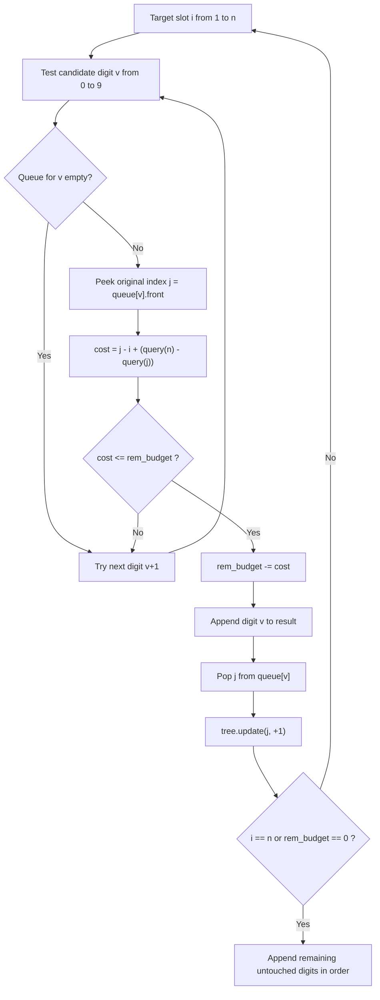

# Guided Example: Minimum Possible Integer After at Most K Adjacent Swaps on Digits

## 1. Instance & Teaching Goal

We are given a numerical string of length $n = 4$ and a swap allowance $k = 4$:
$$\text{num} = \text{"4321"}, \quad k = 4$$

Our teaching goal is to determine the lexicographically smallest numerical string achievable by performing at most $k$ adjacent pairwise transpositions. We demonstrate the greedy selection rule across digits $0$ through $9$ and the dynamic coordinate adjustment tracked by a Fenwick tree (Binary Indexed Tree) to account for shifting elements in logarithmic time.

## 2. Conceptual Foundation & Invariants

To make a multi-digit number as small as possible, the most significant (leftmost) positions must be assigned the smallest possible digits.
1. **Greedy Priority**:
   For each target index $i \in \{1, 2, \dots, n\}$ from left to right, we want to place the smallest digit $d \in \{0, 1, \dots, 9\}$ that can be transported to position $i$ using at most the remaining swap budget $k$.
2. **Dynamic Distance Calculation**:
   Suppose candidate digit $d$ currently occupies original index $j$. If no elements had been previously moved, bringing $j$ to target position $i$ would require exactly $j - i$ adjacent swaps.
   However, every element with original index $j' > j$ that has already been moved to an earlier position $< i$ had to cross over $j$ from right to left, shifting index $j$ one position further to the right.
   Conversely, every element with original index $j' < j$ moved earlier was already to the left of $j$.
   Therefore, the true current effective position of the element originally at $j$ is:
   $$\text{current\_pos}(j) = j + \sum_{j' > j, j' \text{ moved}} 1$$
   The number of adjacent swaps required to slide this digit into target slot $i$ is:
   $$\text{cost}(j, i) = \text{current\_pos}(j) - i = (j - i) + \sum_{j' > j, j' \text{ moved}} 1$$
3. **Logarithmic Accounting via Fenwick Tree**:
   We record each transferred element by adding $+1$ at its original index in a Fenwick tree. The number of transferred elements with original index $> j$ is efficiently computed as:
   $$\text{transferred\_after}(j) = \text{query}(n) - \text{query}(j)$$
   This reduces the cost calculation to:
   $$\text{cost}(j, i) = j - i + \text{query}(n) - \text{query}(j)$$

```text
+-------------------------------------------------------------------------------+
|                      GREEDY SELECTION & SHIFT TRACKING                        |
|                                                                               |
|  Target slot i = 1: Candidate digits 0..9 tested ascending                    |
|    - Digit '1' found at original index j = 4                                  |
|    - Prior elements moved after j: query(4) - query(4) = 0                    |
|    - Cost: (4 - 1) + 0 = 3 swaps <= k (4)                                     |
|    - Action: Deduct 3 from k (remains 1), place '1', mark index 4 in tree     |
|                                                                               |
|  Target slot i = 2: Test candidate digits 0..9                                |
|    - Digit '2' at j = 3: cost = (3-2) + (1-0) = 2 > k (1) -> unaffordable     |
|    - Digit '3' at j = 2: cost = (2-2) + (1-0) = 1 <= k (1) -> accepted!       |
+-------------------------------------------------------------------------------+
```

The algorithm maintains the following state variables:

| State Variable | Domain | Initial Value | Transition / Role |
|---|---|---|---|
| `target_pos` | Integer $\in [1, n]$ | $1$ | Leftmost unfilled output slot being greedily resolved. |
| `rem_budget` | Integer $\ge 0$ | $k$ | Remaining adjacent swap capacity. |
| `digit_queues` | Array of 10 FIFO queues | 1-based indices of digits | Preserves original positions of unused occurrences of each digit $0 \dots 9$. |
| `fenwick_tree` | Prefix sum tree of size $n$ | All zeros | Tracks cumulative count of original indices that have already been relocated forward. |
| `out_digits` | Array of characters | Empty | Prefix of finalized digits of the optimal numerical string. |

> [!IMPORTANT]
> **Greedy Monotonicity Invariant**: Placing a smaller digit at a more significant position always produces a smaller overall numerical string than placing any larger digit, regardless of whatever transpositions might occur in all subsequent lower-order positions.



## 3. Step-by-Step Worked Execution

We walk through the representative instance $\text{num} = \text{"4321"}$, $k = 4$, with length $n = 4$.

### Initialization Phase

- 1-based character positions:
  - Position 1: `'4'`
  - Position 2: `'3'`
  - Position 3: `'2'`
  - Position 4: `'1'`
- Position queues for each digit:
  - $\text{pos}[1] = [4]$
  - $\text{pos}[2] = [3]$
  - $\text{pos}[3] = [2]$
  - $\text{pos}[4] = [1]$
  - $\text{pos}[0], \text{pos}[5 \dots 9] = []$
- Swap budget: $k = 4$.
- Fenwick tree $\text{tree}$ initialized to zeros over $[1, 4]$.

---

### Slot 1: $i = 1$

We search for the smallest affordable digit $v \in [0, 9]$:
- $v = 0$: empty queue.
- $v = 1$: queue head is $j = 4$.
  - Shifting cost formula:
    $$\text{cost} = (j - i) + (\text{query}(4) - \text{query}(4)) = (4 - 1) + (0 - 0) = 3$$
  - Comparison: $\text{cost} = 3 \le k = 4$. Affordable!
- Selection action:
  - Budget consumed: $k \leftarrow 4 - 3 = 1$.
  - Append `'1'` to output.
  - Remove $4$ from $\text{pos}[1]$.
  - Update Fenwick tree: $\text{tree.update}(4, +1)$.
  - Array state conceptually: `'1'` is pulled to slot 1; remaining elements are `'4', '3', '2'`.

---

### Slot 2: $i = 2$

We search for the smallest affordable digit $v \in [0, 9]$ with budget $k = 1$:
- $v = 0, 1$: queues empty.
- $v = 2$: queue head is $j = 3$.
  - Shifting cost formula:
    $$\text{cost} = (3 - 2) + (\text{query}(4) - \text{query}(3)) = 1 + (1 - 0) = 2$$
  - Comparison: $\text{cost} = 2 > k = 1$. Unaffordable! Must reject digit 2 for slot 2.
- $v = 3$: queue head is $j = 2$.
  - Shifting cost formula:
    $$\text{cost} = (2 - 2) + (\text{query}(4) - \text{query}(2)) = 0 + (1 - 0) = 1$$
  - Comparison: $\text{cost} = 1 \le k = 1$. Affordable!
- Selection action:
  - Budget consumed: $k \leftarrow 1 - 1 = 0$.
  - Append `'3'` to output.
  - Remove $2$ from $\text{pos}[3]$.
  - Update Fenwick tree: $\text{tree.update}(2, +1)$.
  - Array state conceptually: output prefix is `"13"`.

---

### Slot 3: $i = 3$

With budget $k = 0$, only zero-cost shifts are possible:
- $v = 0, 1, 3$: empty.
- $v = 2$: queue head is $j = 3$.
  - Cost: $(3 - 3) + (\text{query}(4) - \text{query}(3)) = 0 + (2 - 1) = 1 > 0$. Unaffordable.
- $v = 4$: queue head is $j = 1$.
  - Cost: $(1 - 3) + (\text{query}(4) - \text{query}(1)) = -2 + (2 - 0) = 0 \le 0$. Affordable!
- Selection action:
  - Append `'4'` to output.
  - Remove $1$ from $\text{pos}[4]$.
  - Update Fenwick tree: $\text{tree.update}(1, +1)$.

---

### Slot 4: $i = 4$

Only digit `'2'` remains at original index $j = 3$:
- Cost: $(3 - 4) + (\text{query}(4) - \text{query}(3)) = -1 + (3 - 2) = 0 \le 0$.
- Append `'2'` to output.

Final constructed string: `"1342"`.

## 4. Complete Execution Trace

The table below traces each target slot decision, candidate verification, Fenwick queries, and state mutations.

| Target Slot $i$ | Candidate Tested $v$ | Original Index $j$ | Fenwick Query $\Delta$ | Computed Cost | Budget $k$ Before $\to$ After | Outcome | Output String |
|---|---|---|---|---|---|---|---|
| $1$ | $1$ | $4$ | $\text{Q}(4)-\text{Q}(4) = 0$ | $4 - 1 + 0 = 3$ | $4 \to 1$ | **Selected** (Tree+1 at 4) | `"1"` |
| $2$ | $2$ | $3$ | $\text{Q}(4)-\text{Q}(3) = 1$ | $3 - 2 + 1 = 2$ | $1 \to 1$ | Rejected ($2 > 1$) | `"1"` |
| $2$ | $3$ | $2$ | $\text{Q}(4)-\text{Q}(2) = 1$ | $2 - 2 + 1 = 1$ | $1 \to 0$ | **Selected** (Tree+1 at 2) | `"13"` |
| $3$ | $2$ | $3$ | $\text{Q}(4)-\text{Q}(3) = 1$ | $3 - 3 + 1 = 1$ | $0 \to 0$ | Rejected ($1 > 0$) | `"13"` |
| $3$ | $4$ | $1$ | $\text{Q}(4)-\text{Q}(1) = 2$ | $1 - 3 + 2 = 0$ | $0 \to 0$ | **Selected** (Tree+1 at 1) | `"134"` |
| $4$ | $2$ | $3$ | $\text{Q}(4)-\text{Q}(3) = 1$ | $3 - 4 + 1 = 0$ | $0 \to 0$ | **Selected** (Tree+1 at 3) | **`"1342"`** |

### Step-by-Step Swap Verification

The 4 physical adjacent swaps performed:
1. `"4321"` $\to$ swap index 3 and 4: `"4312"` (1 swap)
2. `"4312"` $\to$ swap index 2 and 3: `"4132"` (2 swaps)
3. `"4132"` $\to$ swap index 1 and 2: `"1432"` (3 swaps, digit '1' placed)
4. `"1432"` $\to$ swap index 2 and 3: `"1342"` (4 swaps, digit '3' placed)
Result: `"1342"`, with total swaps $= 4 \le 4$.

## 5. Algorithmic Correctness

### Soundness

Every digit chosen at slot $i$ is verified to require $\text{cost} \le k$ adjacent swaps.
The cost formula $(j - i) + \sum_{j' > j} 1$ precisely counts the net rightward displacement of the element originally at $j$ caused by prior leftward moves of other elements, plus its distance to slot $i$.
Because each chosen digit is physically pulled leftward across adjacent elements to slot $i$, exactly $\text{cost}$ adjacent swaps are executed.
Subtracting $\text{cost}$ from $k$ maintains the invariant that the remaining budget is non-negative.
Since all $n$ original characters are uniquely selected and placed, the output represents a permutation reachable within at most $k$ swaps.

### Completeness (Lexicographical Optimality)

Let $S$ be any string reachable within $k$ swaps, and let $O$ be the string produced by our greedy algorithm.
Suppose for contradiction that $S < O$, and let $i$ be the first index where $S[i] \ne O[i]$.
Then $S[i] < O[i]$.
This means there exists a digit $d = S[i]$ in the suffix of the array that was moved to slot $i$ using at most $k'$ swaps.
However, our algorithm checked all digits in strictly ascending order $0, 1, \dots, 9$.
Before selecting $O[i]$, it tested digit $d$. The only reason $d$ was not selected is if $\text{cost}(d, i) > k$, meaning $d$ could not reach slot $i$ within the remaining budget.
This contradicts the premise that $S$ placed $d$ at slot $i$ within the budget.
Therefore, no strictly smaller string can be reached, proving optimality.

## 6. Traps This Instance Exposes

- **Static Index Decay Trap**: Calculating swap distance as simply $j - i$. When elements originally situated to the right of $j$ have already been moved past $j$ to the left, index $j$ is pushed to the right. Neglecting this displacement underestimates swap costs, causing the algorithm to overspend its budget $k$.
- **Duplicate Digit Positional Order**: If multiple identical digits exist (e.g. two `'2'`s), always taking the leftmost available occurrence (the head of that digit's FIFO queue) is optimal. The leftmost occurrence is strictly closer to the target slot, requiring fewer swaps.
- **Budget Depletion Early Exit**: When $k = 0$, continuing to evaluate costs for all 10 digits is redundant. The remaining unused elements can simply be collected in their natural current order.
- **Large Budget Saturation**: When $k \ge \frac{n(n-1)}{2}$, any permutation is reachable. The answer is simply the sorted string of digits. Recognizing this allows an instantaneous $\mathcal{O}(n \log n)$ or $\mathcal{O}(n)$ counting sort shortcut.

## 7. Complexity Derivation

### Time Complexity

- **Queue Initialization**: Distributing the $n$ characters into 10 queues takes $\mathcal{O}(n)$ time.
- **Slot Assignment Loop**: For each of the $n$ target slots:
  - We test at most $10$ candidate digit values ($0 \dots 9$).
  - For each non-empty digit queue, evaluating the Fenwick query takes $\mathcal{O}(\log n)$ operations.
  - Updating the Fenwick tree when a digit is selected takes $\mathcal{O}(\log n)$ operations.
  - Total per slot: at most $10 \times \mathcal{O}(\log n) = \mathcal{O}(\log n)$.
- Over all $n$ slots, the total time is:
  $$\mathcal{O}(n \cdot \log n)$$
- With $n \le 30,000$, $n \log_2 n \approx 30,000 \times 15 = 4.5 \times 10^5$ operations, completing in well under $50$ milliseconds.

### Auxiliary Space Complexity

- **Position Queues**: The 10 queues store exactly $n$ integer indices in aggregate: $\mathcal{O}(n)$.
- **Fenwick Tree**: Size $n + 1$ integers: $\mathcal{O}(n)$.
- **Output Buffer**: Stores the $n$ characters: $\mathcal{O}(n)$.
- Total auxiliary space is strictly $\mathcal{O}(n)$.
