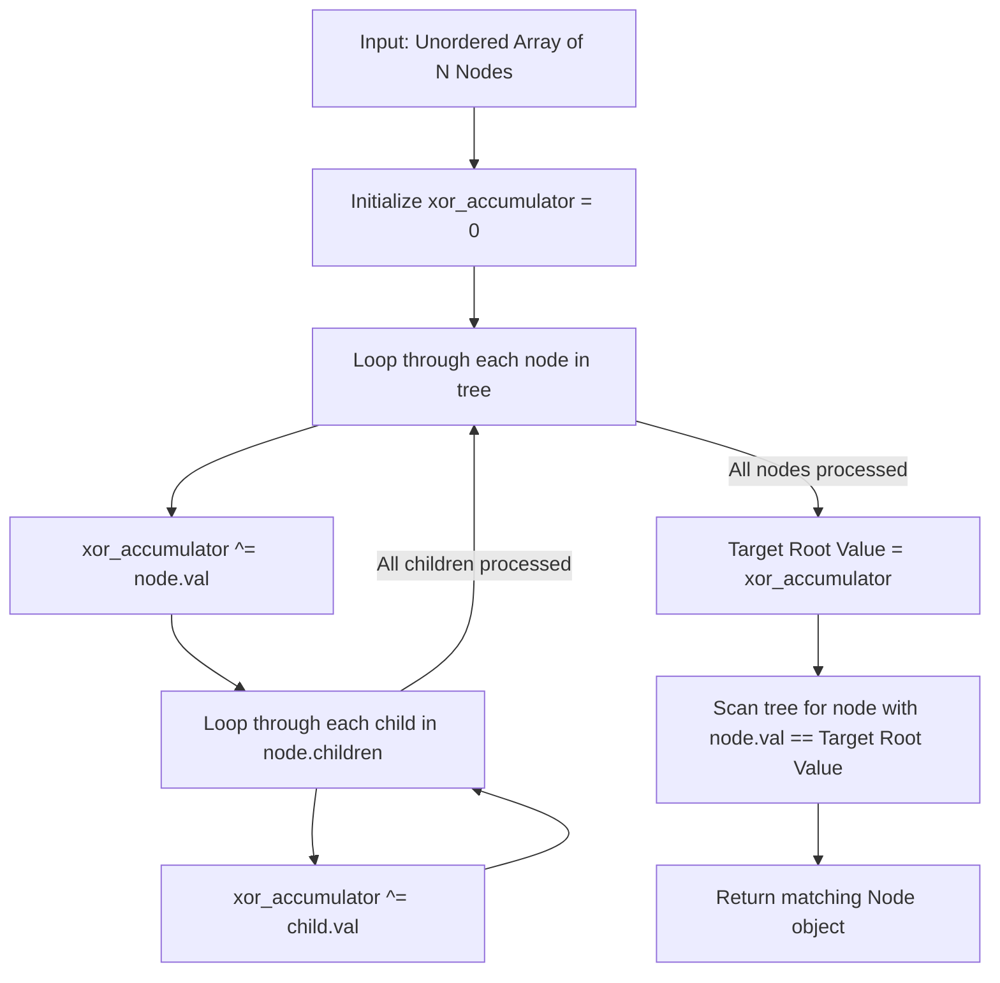

# Guided Example: Find Root of N-ary Tree

## 1. Instance & Teaching Goal

We are given all $N = 6$ nodes of an N-ary tree presented as an unordered array of node objects. Each node contains a unique integer value and a list of references to its direct children:
- Node with value $1$: children $[3, 2, 4]$
- Node with value $3$: children $[5, 6]$
- Node with value $2$: children $[]$
- Node with value $4$: children $[]$
- Node with value $5$: children $[]$
- Node with value $6$: children $[]$

The array is shuffled arbitrarily, for example:
$$\text{tree} = [\text{Node}(5), \text{Node}(4), \text{Node}(3), \text{Node}(6), \text{Node}(2), \text{Node}(1)]$$

Our teaching goal is to locate and return the unique root node. We show how the graph-theoretic in-degree property of rooted trees allows identification in linear time, and specifically demonstrate the optimal $\mathcal{O}(1)$ auxiliary space technique using bitwise XOR parity cancellation.

## 2. Conceptual Foundation & Invariants

In an N-ary tree containing $N$ nodes:
1. **Tree Topography**:
   - The tree contains exactly $N - 1$ directed edges from parents to children.
   - The root node has an in-degree of $0$: it is never the child of any node.
   - Every non-root node has an in-degree of exactly $1$: it has precisely one parent.
2. **Frequency of Value Occurrences**:
   If we count how many times each node's value is encountered across:
   - The primary node collection $\text{tree}$, and
   - All `children` lists across all nodes:
   $$\text{count}(v) = \begin{cases} 1 & \text{if } v = \text{root.val} \quad (\text{appears only in the array}) \\ 2 & \text{if } v \ne \text{root.val} \quad (\text{appears in the array AND in its parent's children list}) \end{cases}$$
3. **Bitwise XOR Parity Invariant**:
   The bitwise XOR operation ($\oplus$) is associative, commutative, and satisfies:
   $$x \oplus x = 0 \quad \text{and} \quad x \oplus 0 = x$$
   Accumulating every node value and every child value into a single XOR register:
   $$X = \bigoplus_{u \in \text{tree}} u.\text{val} \oplus \bigoplus_{u \in \text{tree}} \bigoplus_{c \in u.\text{children}} c.\text{val}$$
   Every non-root node value appears exactly twice and evaluates to $v \oplus v = 0$.
   The root value appears exactly once, isolating:
   $$X = \text{root.val}$$
4. **Object Recovery**:
   A final linear scan identifies the node object in $\text{tree}$ whose value equals $X$.

```text
+-------------------------------------------------------------------------------+
|                    PARITY CANCELLATION ACROSS TREE TOPOLOGY                   |
|                                                                               |
|             (1)  <-- Root (In-degree 0: Never listed as a child)              |
|           /  |  \                                                             |
|         (3) (2) (4)                                                           |
|        /  \                                                                   |
|      (5)  (6)                                                                 |
|                                                                               |
|  Node values in array:   { 1, 2, 3, 4, 5, 6 }  (all occur once)               |
|  Child values in lists:  { 2, 3, 4, 5, 6 }     (all non-roots occur once)     |
|                                                                               |
|  Total XOR Accumulation:                                                      |
|    X = (1) ^ (2 ^ 2) ^ (3 ^ 3) ^ (4 ^ 4) ^ (5 ^ 5) ^ (6 ^ 6) = 1             |
+-------------------------------------------------------------------------------+
```

The algorithm maintains the following state variables:

| State Variable | Domain | Initial Value | Transition / Role |
|---|---|---|---|
| `xor_accumulator` | Integer | $0$ | Running XOR sum $X \leftarrow X \oplus \text{node.val} \oplus \bigoplus \text{child.val}$. |
| `curr_node` | Node object | First element in `tree` | Pointer iterating through the unordered array of nodes. |
| `child_node` | Node object | First element in `children` | Pointer traversing each child list of `curr_node`. |
| `target_val` | Integer | $0$ | Final isolated root value used to match the root object. |

> [!IMPORTANT]
> **In-Degree Parity Invariant**: In any valid directed tree, the sum of in-degrees over all nodes is $N - 1$. Since the root is the unique node with in-degree $0$, it is the only node whose value is visited an odd number of times (exactly once).



## 3. Step-by-Step Worked Execution

We walk through the representative shuffled instance:
$$\text{tree} = [\text{Node}(5), \text{Node}(4), \text{Node}(3), \text{Node}(6), \text{Node}(2), \text{Node}(1)]$$

### Phase 1: XOR Parity Accumulation

We initialize `xor_accumulator` = $0$.

- **Step 1: Inspect $\text{Node}(5)$**
  - Node value: $5$. Accumulator: $0 \oplus 5 = 5$.
  - Children: $[]$. No children to process.
  - Accumulator after step 1: $5$.
- **Step 2: Inspect $\text{Node}(4)$**
  - Node value: $4$. Accumulator: $5 \oplus 4 = 1$.
  - Children: $[]$.
  - Accumulator after step 2: $1$.
- **Step 3: Inspect $\text{Node}(3)$**
  - Node value: $3$. Accumulator: $1 \oplus 3 = 2$.
  - Child $\text{Node}(5)$: Accumulator: $2 \oplus 5 = 7$.
  - Child $\text{Node}(6)$: Accumulator: $7 \oplus 6 = 1$.
  - Accumulator after step 3: $1$.
- **Step 4: Inspect $\text{Node}(6)$**
  - Node value: $6$. Accumulator: $1 \oplus 6 = 7$.
  - Children: $[]$.
  - Accumulator after step 4: $7$.
- **Step 5: Inspect $\text{Node}(2)$**
  - Node value: $2$. Accumulator: $7 \oplus 2 = 5$.
  - Children: $[]$.
  - Accumulator after step 5: $5$.
- **Step 6: Inspect $\text{Node}(1)$**
  - Node value: $1$. Accumulator: $5 \oplus 1 = 4$.
  - Child $\text{Node}(3)$: Accumulator: $4 \oplus 3 = 7$.
  - Child $\text{Node}(2)$: Accumulator: $7 \oplus 2 = 5$.
  - Child $\text{Node}(4)$: Accumulator: $5 \oplus 4 = 1$.
  - Accumulator after step 6: $1$.

End of accumulation pass. Target root value isolated:
$$X = 1$$

### Phase 2: Root Object Matching Scan

We scan the array $\text{tree}$ to locate the node whose value equals $1$:
1. $\text{Node}(5)$: value $5 \ne 1$.
2. $\text{Node}(4)$: value $4 \ne 1$.
3. $\text{Node}(3)$: value $3 \ne 1$.
4. $\text{Node}(6)$: value $6 \ne 1$.
5. $\text{Node}(2)$: value $2 \ne 1$.
6. $\text{Node}(1)$: value $1 == 1$. **Match found!**

The algorithm returns $\text{Node}(1)$.

## 4. Complete Execution Trace

We record each step of the traversal, tracking the contributions of node values and child values.

| Step Index | Node Inspected | Operation Type | Value Applied | Binary Representation | Running Accumulator Value | Running Accumulator Hex |
|---|---|---|---|---|---|---|
| 0 | — | Initial state | $0$ | `0000_0000` | $0$ | `0x0` |
| 1a | $\text{Node}(5)$ | Node entry | $5$ | `0000_0101` | $5$ | `0x5` |
| 2a | $\text{Node}(4)$ | Node entry | $4$ | `0000_0100` | $1$ | `0x1` |
| 3a | $\text{Node}(3)$ | Node entry | $3$ | `0000_0011` | $2$ | `0x2` |
| 3b | Child of 3 | Child entry | $5$ | `0000_0101` | $7$ | `0x7` |
| 3c | Child of 3 | Child entry | $6$ | `0000_0110` | $1$ | `0x1` |
| 4a | $\text{Node}(6)$ | Node entry | $6$ | `0000_0110` | $7$ | `0x7` |
| 5a | $\text{Node}(2)$ | Node entry | $2$ | `0000_0010` | $5$ | `0x5` |
| 6a | $\text{Node}(1)$ | Node entry | $1$ | `0000_0001` | $4$ | `0x4` |
| 6b | Child of 1 | Child entry | $3$ | `0000_0011` | $7$ | `0x7` |
| 6c | Child of 1 | Child entry | $2$ | `0000_0010` | $5$ | `0x5` |
| 6d | Child of 1 | Child entry | $4$ | `0000_0100` | **$1$** | `0x1` |

### Cancellation Summary

Grouping the values together highlights the exact cancellations:
$$\begin{aligned}
X &= (5 \oplus 5) \oplus (4 \oplus 4) \oplus (3 \oplus 3) \oplus (6 \oplus 6) \oplus (2 \oplus 2) \oplus 1 \\
  &= 0 \oplus 0 \oplus 0 \oplus 0 \oplus 0 \oplus 1 \\
  &= 1
\end{aligned}$$

## 5. Algorithmic Correctness

### Soundness

Let $V = \{u.\text{val} \mid u \in \text{tree}\}$ be the set of all node values, which are guaranteed to be pairwise distinct.
In any directed tree, every node except the root has an in-degree of $1$, meaning it is referenced as a child by exactly one parent.
The root has an in-degree of $0$, so it is referenced as a child by $0$ parents.
Let $M$ be the multiset of all values encountered in the execution:
$$M = \{ u.\text{val} \mid u \in \text{tree} \} \cup \{ c.\text{val} \mid u \in \text{tree}, c \in u.\text{children} \}$$
For the root, its multiplicity in $M$ is $1 + 0 = 1$.
For any non-root node $w$, its multiplicity in $M$ is $1 + 1 = 2$.
By the self-inverse property of XOR ($v \oplus v = 0$), all elements with multiplicity $2$ vanish, leaving:
$$\bigoplus_{v \in M} v = \text{root.val} \oplus \bigoplus_{w \ne \text{root}} (w.\text{val} \oplus w.\text{val}) = \text{root.val} \oplus 0 = \text{root.val}$$
The second scan finds the unique node whose value equals $X$, which is guaranteed to be the root.

### Completeness

Because all node values are distinct, no non-root node can share the value $X$ with the root.
The second pass scans the entire input list `tree`, guaranteeing that the root node object is found and returned without omission.

## 6. Traps This Instance Exposes

- **Auxiliary Hash Set Space Violation**: Creating a hash set of all child nodes and finding the element in `tree` not in the set achieves $\mathcal{O}(N)$ time, but consumes $\mathcal{O}(N)$ auxiliary memory. The follow-up explicitly demands $\mathcal{O}(1)$ auxiliary space.
- **Arithmetic Summation Overflow**: Using arithmetic sum $\sum u.\text{val} - \sum c.\text{val} = \text{root.val}$ is mathematically valid, but in languages with bounded integer types (e.g. 32-bit signed integers), summing $5 \times 10^4$ values up to $10^4$ can cause integer overflow if values are large. Bitwise XOR avoids overflow entirely.
- **Returning the Integer Value Instead of the Object**: The problem contract requires returning the `Node` reference itself, not merely its integer value. Failing to run the second pass to locate the object produces a type mismatch.
- **Single-Node Base Case**: When $N = 1$, the tree consists solely of the root with no children. The child loop never executes, and the accumulator directly preserves the single node's value, correctly handling the boundary without branching.

## 7. Complexity Derivation

### Time Complexity

- **Pass 1 (XOR Accumulation)**: Iterating through each of the $N$ nodes takes $\mathcal{O}(N)$ steps. Across all nodes, the inner loop iterates through all child pointers. Since a tree of $N$ nodes has exactly $N - 1$ edges, the inner loop executes exactly $N - 1$ times in total. Total time for Pass 1 is:
  $$\mathcal{O}(N + (N - 1)) = \mathcal{O}(N)$$
- **Pass 2 (Matching Scan)**: A linear scan through the $N$ nodes in `tree` takes at most $N$ comparisons:
  $$\mathcal{O}(N)$$
- Overall time complexity is strictly $\mathcal{O}(N)$, which is optimal.

### Auxiliary Space Complexity

- The algorithm maintains a single integer accumulator `x` and loop iteration pointers.
- No dynamic memory, hash tables, or recursive stacks are allocated.
- Auxiliary space complexity is strictly $\mathcal{O}(1)$, fulfilling the optimal follow-up specification.
