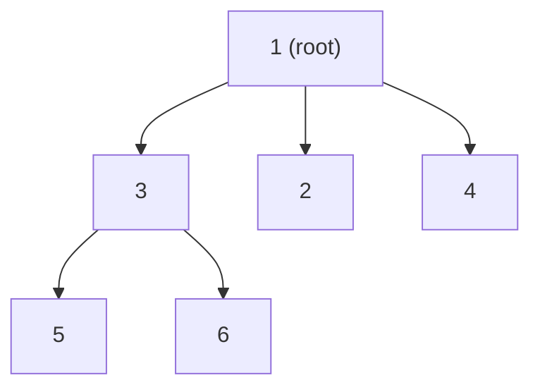
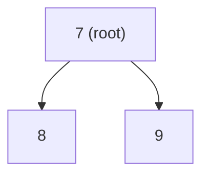

## Examples

**Example 1**

- **Input:** `tree = [[3, [5, 6]], [2, []], [4, []], [1, [3, 2, 4]], [5, []], [6, []]]`

- **Output:** `1`
- **Explanation:** Every node value except `1` appears as a child in another node's `children` list. Node `1` is not a child of any other node, so node `1` is the root.

**Example 2**

- **Input:** `tree = [[8, []], [9, []], [7, [8, 9]]]`

- **Output:** `7`
- **Explanation:** Nodes `8` and `9` appear as children of node `7`. Node `7` has no parent, so node `7` is the root.

**Example 3**

- **Input:** `tree = [[42, []]]`
- **Output:** `42`
- **Explanation:** The single-node tree has root `42`.
