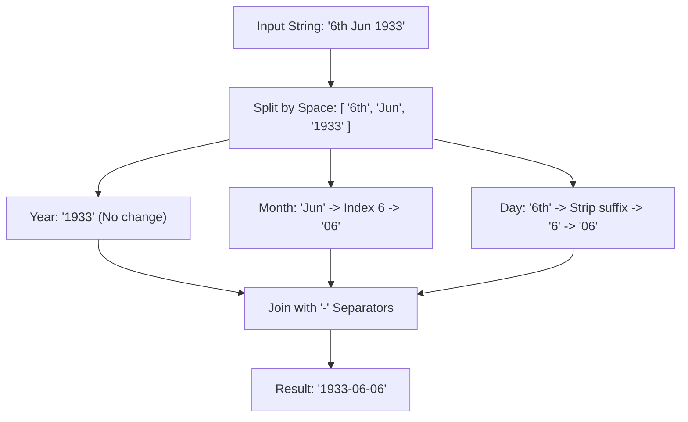

# Guided Example: Reformat Date

## 1. Instance & Teaching Goal

We are given a natural language date string adhering to the format `Day Month Year`:
$$\text{date} = \text{"6th Jun 1933"}$$

Our teaching goal is to normalize this representation into the ISO-8601 standard calendar date string `YYYY-MM-DD`. We walk through token segmentation, ordinal suffix removal, categorical month lookup, two-digit zero-padding, and hyphen-delimited formatting.

## 2. Conceptual Foundation & Invariants

The input string represents three distinct chronological components separated by single whitespace characters:
$$\text{date} = d_{\text{raw}} \mathbin{\sqcup} m_{\text{raw}} \mathbin{\sqcup} y_{\text{raw}}$$

1. **Year Component ($y_{\text{raw}}$)**:
   - Guaranteed to be a four-digit integer in $[1900, 2100]$.
   - Directly maps to `YYYY` without modification.
2. **Month Component ($m_{\text{raw}}$)**:
   - A three-letter abbreviation drawn from the ordered calendar sequence:
     $$\mathcal{M} = (\text{Jan}, \text{Feb}, \text{Mar}, \text{Apr}, \text{May}, \text{Jun}, \text{Jul}, \text{Aug}, \text{Sep}, \text{Oct}, \text{Nov}, \text{Dec})$$
   - Its 1-based position in $\mathcal{M}$ defines month number $M \in \{1, 2, \dots, 12\}$.
   - Padded with a leading zero if $M < 10$, yielding a two-digit string `MM`.
3. **Day Component ($d_{\text{raw}}$)**:
   - Composed of one or two digits followed by a two-letter English ordinal suffix (`"st"`, `"nd"`, `"rd"`, or `"th"`).
   - Stripping the final two characters extracts the numerical day $D \in \{1, \dots, 31\}$.
   - Padded with a leading zero if $D < 10$, yielding a two-digit string `DD`.
4. **Final Assembly**:
   Concatenated with hyphens:
   $$\text{Result} = \text{YYYY} \mathbin{\Vert} \text{"-"} \mathbin{\Vert} \text{MM} \mathbin{\Vert} \text{"-"} \mathbin{\Vert} \text{DD}$$

```text
+-------------------------------------------------------------------------------+
|                       DATE STRING NORMALIZATION PIPELINE                      |
|                                                                               |
|  Input String: "6th Jun 1933"                                                 |
|                                                                               |
|  1. Tokenize by space -> [ "6th",  "Jun",  "1933" ]                           |
|                            |         |       |                                |
|  2. Year:                  |         |       +---> "1933"                     |
|  3. Month lookup:          |         +---> Index 6 -> pad -> "06"             |
|  4. Day strip suffix:      +---> "6" ----> pad -----------> "06"             |
|                                                                               |
|  5. Assemble ISO Format: "1933-06-06"                                         |
+-------------------------------------------------------------------------------+
```

The algorithm maintains the following string processing state attributes:

| Processing Stage | Source Fragment | Target Attribute | Transformation Rule |
|---|---|---|---|
| Whitespace Splitting | Entire string | `tokens` triplet | Segment string by whitespace into exactly three tokens. |
| Year Normalization | `tokens[2]` | `year_str` | Verbatim 4-character string representation. |
| Month Conversion | `tokens[1]` | `month_str` | 1-based index in month dictionary, zero-padded to width 2. |
| Day Suffix Trimming | `tokens[0]` | `day_str` | Strip final two suffix characters, zero-padded to width 2. |
| Composite Assembly | Normalised components | `formatted_date` | Concatenate `year_str`, `month_str`, `day_str` with hyphen separators. |

> [!IMPORTANT]
> **Width Padding Invariant**: Both month and day fields in the ISO-8601 specification must be exactly two characters wide. Single-digit values $1 \dots 9$ must always receive a single leading zero prefix (`"01"` through `"09"`).



## 3. Step-by-Step Worked Execution

We walk through the execution on $\text{date} = \text{"6th Jun 1933"}$.

### Step 1: Whitespace Tokenization

The input string contains two space characters. Splitting produces a list of three string tokens:
- $\text{token}[0] = \text{"6th"}$
- $\text{token}[1] = \text{"Jun"}$
- $\text{token}[2] = \text{"1933"}$

### Step 2: Year Extraction

- The year token is $\text{token}[2] = \text{"1933"}$.
- It is already a 4-digit number.
- $\text{year\_str} = \text{"1933"}$.

### Step 3: Month Decoding and Padding

We consult the calendar month registry:
- $\text{Jan} \to 1$
- $\text{Feb} \to 2$
- $\text{Mar} \to 3$
- $\text{Apr} \to 4$
- $\text{May} \to 5$
- $\text{Jun} \to 6$
- $\text{Jul} \to 7$
- $\text{Aug} \to 8$
- $\text{Sep} \to 9$
- $\text{Oct} \to 10$
- $\text{Nov} \to 11$
- $\text{Dec} \to 12$

The input month is `"Jun"`, corresponding to month index $6$.
- Because $6 < 10$, we prepend a leading zero:
  $$\text{month\_str} = \text{"06"}$$

### Step 4: Day Suffix Stripping and Padding

The day token is $\text{token}[0] = \text{"6th"}$.
- The length of the string is $3$.
- Suffix removal: We strip the last two characters (`"th"`), leaving the numerical prefix `"6"`.
- Because the numerical length is $1$ ($< 2$), we prepend a leading zero:
  $$\text{day\_str} = \text{"06"}$$

### Step 5: String Concatentation

We join the three standardized tokens with hyphen delimiters:
$$\text{formatted\_date} = \text{"1933"} + \text{"-"} + \text{"06"} + \text{"-"} + \text{"06"} = \text{"1933-06-06"}$$

## 4. Complete Execution Trace

The normalization process across all three tokens is summarized in the table below.

| Processing Stage | Extracted Token | Intermediate Value | Length Before / After | Applied Rule | Output Segment |
|---|---|---|---|---|---|
| Split Component 0 | `"6th"` | Numeric day `"6"` | $3 \to 1$ | Strip suffix `[:-2]` | `"6"` |
| Format Day | `"6"` | Pad leading zero | $1 \to 2$ | Width normalization | `"06"` |
| Split Component 1 | `"Jun"` | Calendar rank $6$ | $3 \to 1$ | Dictionary map $\mathcal{M}$ | `"6"` |
| Format Month | `"6"` | Pad leading zero | $1 \to 2$ | Width normalization | `"06"` |
| Split Component 2 | `"1933"` | Calendar year $1933$ | $4 \to 4$ | Verbatim preservation | `"1933"` |
| Final Reassembly | `["1933", "06", "06"]` | Hyphen-delimited join | $10$ characters | ISO-8601 formatting | **`"1933-06-06"`** |

### Additional Contrast Case: Two-Digit Day and Month

Consider $\text{date} = \text{"20th Oct 2052"}$:
- Day: `"20th"` $\to$ strip `"th"` $\to$ `"20"` (length 2, no padding needed) $\implies \text{"20"}$.
- Month: `"Oct"` $\to$ index $10$ (length 2, no padding needed) $\implies \text{"10"}$.
- Year: `"2052"` $\implies \text{"2052"}$.
- Result: `"2052-10-20"`.

## 5. Algorithmic Correctness

### Soundness

The input contract guarantees that all input strings strictly conform to the grammar:
$$\text{Day} \in \{1\text{st}, \dots, 31\text{st}\}, \quad \text{Month} \in \{\text{Jan}, \dots, \text{Dec}\}, \quad \text{Year} \in [1900, 2100]$$
- Every day token ends with an English ordinal suffix of exactly two letters (`st`, `nd`, `rd`, `th`). Slicing off the last two characters leaves solely the numeric digits of the day.
- Every month is one of the 12 valid calendar abbreviations, each uniquely mapping to an integer $1 \dots 12$.
- Zero-padding guarantees that both month and day fields have length exactly $2$.
- Joining with hyphens in the order $(\text{Year}, \text{Month}, \text{Day})$ produces a valid string of length exactly $4 + 1 + 2 + 1 + 2 = 10$, strictly satisfying the ISO-8601 standard.

### Completeness

Every valid input string contains exactly two whitespace characters separating the three semantic fields. The splitting operation partitions the input without dropping characters, ensuring no date information is lost. Every branch of the mapping is deterministic and covers all $12$ calendar months and all $31$ days of the month.

## 6. Traps This Instance Exposes

- **Variable-Length Day Token**: Forgetting that days $1 \dots 9$ produce tokens of length 3 (e.g. `"1st"`), while days $10 \dots 31$ produce tokens of length 4 (e.g. `"21st"`). Hardcoding an absolute character slice like `token[0][:2]` incorrectly includes the letter `'s'` for `"1st"`, yielding `"1s"`. Slicing relative to the end `[:-2]` reliably removes the suffix regardless of whether the numeric prefix has 1 or 2 digits.
- **Single-Digit Month Omission of Leading Zero**: Mapping `"Jun"` to `"6"` and outputting `"1933-6-6"` violates the ISO-8601 requirement where months and days must be two digits (`"06"`).
- **1-Based vs 0-Based Month Indexing**: Using 0-based programming array indices without adding $1$ maps `"Jan"` to `0` and `"Dec"` to `11`, producing invalid calendar dates like `"1933-00-06"`.
- **Locale-Dependent Parsing**: Relying on system-specific runtime date parsing utilities whose behavior varies based on operating system locale rather than deterministic manual string manipulation.

## 7. Complexity Derivation

### Time Complexity

- **Splitting**: Scanning the input string of length $\le 13$ characters takes $\mathcal{O}(1)$ time.
- **Month Lookup**: Probing a hash map or fixed array of 12 elements takes $\mathcal{O}(1)$ time.
- **Day Slicing**: Slicing the 3 or 4 character day string takes $\mathcal{O}(1)$ time.
- **String Formatting**: Concatenating a fixed 10-character string takes $\mathcal{O}(1)$ time.
- Overall time complexity is strictly $\mathcal{O}(1)$.

### Auxiliary Space Complexity

- The intermediate token list contains 3 short strings.
- The month lookup table contains 12 static string mappings.
- The formatted output string contains exactly 10 characters.
- Auxiliary space complexity is strictly $\mathcal{O}(1)$.
