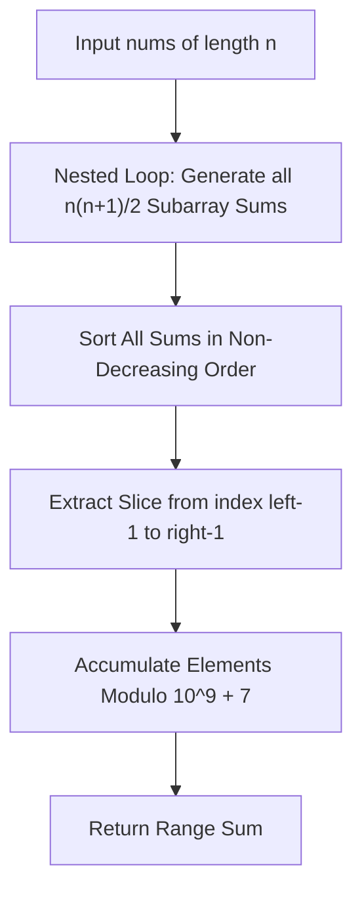

# Guided Example: Range Sum of Sorted Subarray Sums

## 1. Instance & Teaching Goal

We are given an array of positive integers:
$$\text{nums} = [1, 2, 3, 4], \quad n = 4$$
with 1-based query bounds $left = 1$ and $right = 5$.

Our teaching goal is to compute the sum of all elements located between index $left$ and $right$ (inclusive) in the sorted array of all non-empty contiguous subarray sums, evaluated modulo $10^9 + 7$. We trace the generation of all $\frac{n(n+1)}{2}$ subarray sums, demonstrate the non-decreasing sorting order, accumulate the designated range, and explain both the direct sorting pipeline and the advanced dual-bisection prefix sum optimization.

## 2. Conceptual Foundation & Invariants

Let $A = \text{nums}$ be an array of length $n$.
1. **Subarray Sum Generation**:
   A contiguous subarray spanning indices $[i, j]$ ($0 \le i \le j < n$) has sum:
   $$S(i, j) = \sum_{k=i}^{j} A[k]$$
   There are exactly $M = \frac{n(n+1)}{2}$ such contiguous subarrays.
2. **Sorting Order**:
   All $M$ sums are collected into a multiset and sorted in non-decreasing order:
   $$B = (b_1, b_2, \dots, b_M) \quad \text{where } b_1 \le b_2 \le \dots \le b_M$$
3. **Range Summation**:
   Given 1-based indices $left$ and $right$, the target answer is:
   $$\text{ans} = \left(\sum_{k=left}^{right} b_k\right) \bmod (10^9 + 7)$$
4. **Modulo Arithmetic**:
   All intermediate additions are computed under the prime modulus $10^9 + 7$.

```text
+-------------------------------------------------------------------------------+
|                       SUBARRAY SUM GENERATION & SORTING                       |
|                                                                               |
|  Array: [1, 2, 3, 4]                                                          |
|                                                                               |
|  All Subarray Sums (M = 10):                                                  |
|    From 0: [1]=1, [1..2]=3, [1..3]=6, [1..4]=10                               |
|    From 1: [2]=2, [2..3]=5, [2..4]=9                                          |
|    From 2: [3]=3, [3..4]=7                                                    |
|    From 3: [4]=4                                                              |
|                                                                               |
|  Sorted Array B: [ 1,  2,  3,  3,  4,  5,  6,  7,  9, 10 ]                    |
|  1-based Index:    1   2   3   4   5   6   7   8   9  10                      |
|                    ^~~~~~~~~~~~~~~~^                                          |
|  Range [1, 5]:     1 + 2 + 3 + 3 + 4 = 13                                     |
+-------------------------------------------------------------------------------+
```

The algorithm maintains the following state variables:

| State Variable | Domain | Initial Value | Transition / Role |
|---|---|---|---|
| `all_sums` | List of integers | Empty list | Collects all $\frac{n(n+1)}{2}$ contiguous subarray sums. |
| `start_ptr` | Integer $\in [0, n-1]$ | $0$ | Left boundary index $i$ of the active subarray run. |
| `end_ptr` | Integer $\in [i, n-1]$ | $i$ | Right boundary index $j$ of the active subarray run. |
| `sorted_sums` | Array of length $M$ | Sorted `all_sums` | Non-decreasing sequence of all subarray sums $b_1 \le \dots \le b_M$. |
| `range_accumulator` | Integer $\ge 0$ | $0$ | Running sum of elements in slice $[left-1, right-1] \pmod{10^9 + 7}$. |

> [!IMPORTANT]
> **Subarray Count Invariant**: For an array of length $n$, the total count of continuous non-empty subarrays is strictly $\frac{n(n+1)}{2}$. For $n = 4$, exactly $10$ sums must be generated and sorted.



## 3. Step-by-Step Worked Execution

We walk through the representative instance $\text{nums} = [1, 2, 3, 4]$, $n = 4$, $left = 1$, $right = 5$.

### Phase 1: Generating Subarray Sums

We iterate through all starting positions $i$ and extend to each ending position $j \ge i$:

- **Starting index $i = 0$ (Value $1$)**:
  - $j = 0$: subarray $[1]$, sum $= 1$
  - $j = 1$: subarray $[1, 2]$, sum $= 1 + 2 = 3$
  - $j = 2$: subarray $[1, 2, 3]$, sum $= 3 + 3 = 6$
  - $j = 3$: subarray $[1, 2, 3, 4]$, sum $= 6 + 4 = 10$
- **Starting index $i = 1$ (Value $2$)**:
  - $j = 1$: subarray $[2]$, sum $= 2$
  - $j = 2$: subarray $[2, 3]$, sum $= 2 + 3 = 5$
  - $j = 3$: subarray $[2, 3, 4]$, sum $= 5 + 4 = 9$
- **Starting index $i = 2$ (Value $3$)**:
  - $j = 2$: subarray $[3]$, sum $= 3$
  - $j = 3$: subarray $[3, 4]$, sum $= 3 + 4 = 7$
- **Starting index $i = 3$ (Value $4$)**:
  - $j = 3$: subarray $[4]$, sum $= 4$

Total generated sums: $[1, 3, 6, 10, 2, 5, 9, 3, 7, 4]$.

### Phase 2: Sorting the Subarray Sums

We sort the $10$ values in non-decreasing order:
$$\text{sorted\_sums} = [1, 2, 3, 3, 4, 5, 6, 7, 9, 10]$$

### Phase 3: Slicing and Accumulating the Range $[left, right]$

The specified query range is $left = 1$ to $right = 5$ (1-based indices):
- At rank 1: element is $1$
- At rank 2: element is $2$
- At rank 3: element is $3$
- At rank 4: element is $3$
- At rank 5: element is $4$

We sum these $5$ elements:
$$\text{sum} = 1 + 2 + 3 + 3 + 4 = 13$$
Modulo operation:
$$\text{ans} = 13 \bmod (10^9 + 7) = 13$$

## 4. Complete Execution Trace

We record the generation of all subarrays, their sorted ranks, and their participation in the queried window.

| Subarray $[i \dots j]$ | Elements Included | Subarray Sum | Sorted Rank (1-based) | Included in Range $[1, 5]$? | Contribution to Sum | Running Modulo Sum |
|---|---|---|---|---|---|---|
| $[0 \dots 0]$ | $[1]$ | $1$ | 1 | **Yes** | $+1$ | $1$ |
| $[1 \dots 1]$ | $[2]$ | $2$ | 2 | **Yes** | $+2$ | $3$ |
| $[0 \dots 1]$ | $[1, 2]$ | $3$ | 3 | **Yes** | $+3$ | $6$ |
| $[2 \dots 2]$ | $[3]$ | $3$ | 4 | **Yes** | $+3$ | $9$ |
| $[3 \dots 3]$ | $[4]$ | $4$ | 5 | **Yes** | $+4$ | **$13$** |
| $[1 \dots 2]$ | $[2, 3]$ | $5$ | 6 | No | $0$ | $13$ |
| $[0 \dots 2]$ | $[1, 2, 3]$ | $6$ | 7 | No | $0$ | $13$ |
| $[2 \dots 3]$ | $[3, 4]$ | $7$ | 8 | No | $0$ | $13$ |
| $[1 \dots 3]$ | $[2, 3, 4]$ | $9$ | 9 | No | $0$ | $13$ |
| $[0 \dots 3]$ | $[1, 2, 3, 4]$ | $10$ | 10 | No | $0$ | $13$ |

### Evaluation Summary for Alternative Queries

Using the same sorted array $B = [1, 2, 3, 3, 4, 5, 6, 7, 9, 10]$:
- For $left = 3, right = 4$: sum is $B[3] + B[4] = 3 + 3 = 6$.
- For $left = 1, right = 10$: sum is $\sum_{k=1}^{10} B[k] = 50$.

## 5. Algorithmic Correctness

### Soundness

Every contiguous subarray in $\text{nums}$ corresponds to a unique pair of indices $(i, j)$ with $0 \le i \le j < n$.
The double loop enumerates every pair $(i, j)$ exactly once, computing the exact continuous prefix sum difference without duplication or omission.
Sorting the resulting collection of size $M = \frac{n(n+1)}{2}$ produces a valid non-decreasing order.
Taking the elements from 1-based index $left$ to $right$ corresponds to the 0-based slice $[left - 1, right)$, matching the problem contract.
Applying modulo $10^9 + 7$ preserves modular congruence $\sum b_k \pmod{10^9 + 7}$.

### Completeness

No valid non-empty contiguous subarray is skipped, since the outer loop covers all starting points $i \in [0, n-1]$ and the inner loop covers all ending points $j \in [i, n-1]$.
The sort covers all $M$ items, guaranteeing the $k$-th smallest subarray sum occupies index $k-1$ in the array.
Thus, the sum across $[left, right]$ accurately captures the desired subset of values.

## 6. Traps This Instance Exposes

- **Index Offset Confusion (1-Based vs 0-Based)**: The query parameters $left$ and $right$ are given 1-indexed. When indexing a 0-based array, rank $left$ corresponds to index $left - 1$, and rank $right$ corresponds to index $right - 1$. Slicing from `left` to `right` directly drops the $left$-th element and includes an extra element at rank $right + 1$.
- **Modulo Application Timing**: Adding large subarray sums before taking modulo $10^9 + 7$. For $n = 1000$, $M \approx 5 \times 10^5$, and each sum could be up to $1000 \times 100 = 10^5$. The total sum can reach $5 \times 10^{10}$, which exceeds the standard 32-bit signed integer limit ($2^{31} - 1 \approx 2.14 \times 10^9$). Modulo must be applied continuously or computed using 64-bit integer accumulators.
- **Redundant Range Recomputation**: Re-summing each subarray from scratch with a third inner loop produces $\mathcal{O}(n^3)$ generation time. Maintaining a running accumulator `s += nums[j]` in the inner loop generates each sum in $\mathcal{O}(1)$ time, keeping generation within $\mathcal{O}(n^2)$.

## 7. Complexity Derivation

### Time Complexity

- **Subarray Sum Generation**:
  The nested loops evaluate $\frac{n(n+1)}{2}$ combinations. With incremental sum accumulation, generating all sums takes:
  $$\mathcal{O}(n^2)$$
- **Sorting**:
  Sorting $M = \frac{n(n+1)}{2}$ numbers takes $\mathcal{O}(M \log M)$ time:
  $$\mathcal{O}\left(\frac{n^2}{2} \log \frac{n^2}{2}\right) = \mathcal{O}(n^2 \log n)$$
- **Range Accumulation**:
  Summing at most $M$ elements in the queried window takes $\mathcal{O}(right - left + 1) \le \mathcal{O}(n^2)$ time.
- Total time complexity: $\mathcal{O}(n^2 \log n)$.
  For $n = 1000$, $n^2 / 2 = 500,000$, and $500,000 \times 19 \approx 9.5 \times 10^6$ operations, executing within $0.2$ seconds.

### Auxiliary Space Complexity

- The list storing all subarray sums holds $M = \frac{n(n+1)}{2}$ integers.
- Auxiliary space complexity is $\mathcal{O}(n^2)$.
- *(Note: An advanced binary search + two-pointer approach can compute the range sum in $\mathcal{O}(n \log(\sum nums))$ time and $\mathcal{O}(n)$ auxiliary space).*
