## Solution

---

### Approach 1: Brute Force

#### Intuition

This problem requires us to calculate all subarray sums of the given array, store the totals in a new array, sort this new array in non-decreasing order, and then sum the elements between the given `left` and `right` indices.

To achieve this, we'll create a new array called `storeSubarray` to store the sums of each subarray. Once we've iterated through the entire given array to calculate the subarray sums, we'll sort `storeSubarray` to be in non-decreasing order. Finally, we'll calculate and return the sum of the elements between the given `left` and `right` indices of `storeSubarray`, inclusive.

#### Algorithm

1. Initialize an array given by `storeSubarray` to store all the subarray sums.
2. Iterate `i` through `nums`:
  - Initialize an integer `sum` with 0, to store the subarray sums starting at `i`.
  - Iterate `j` from `i` to the end of `nums`:
- Increment `sum` with $\text{nums}[j]$.
- Append `sum` to the `storeSubarray` array.
3. Sort `storeSubarray` in non-decreasing order.
4. Initialize `rangeSum` with 0 and mod with 1000000009.
5. Iterate all elements in `storeSubarray` between `left-1` and `right-1`:
  - Add the current value of `storeSubarray` to rangeSum and take its modulo with `mod`.
6. Return `rangeSum`.

#### Implementation

```python
class Solution:
    def rangeSum(self, nums: List[int], n: int, left: int, right: int) -> int:
        store_subarray = []
        for i in range(len(nums)):
            sum = 0
            # Iterate through all indices ahead of the current index.
            for j in range(i, len(nums)):
                sum += nums[j]
                store_subarray.append(sum)

        # Sort all subarray sum values in increasing order.
        store_subarray.sort()

        # Find the sum of all values between left and right.
        range_sum = 0
        mod = 10**9 + 7
        for i in range(left - 1, right):
            range_sum = (range_sum + store_subarray[i]) % mod
        return range_sum
```

#### Complexity Analysis

Let $n$ be the size of the `nums` array.

- Time complexity: $O(n^2 \cdot \log n)$

   We iterate through `nums` twice to store all the subarray sums. This operation takes $O(n^2)$ time. Then, we sort this array storing all the subarray sums. The time complexity for this operation is $O(n^2\cdot \log n)$. Iterating all indices between `left` and `right` also takes $O(n^2)$ time in the worst case.

   Therefore, the total time complexity is given by $O(n^2 \cdot \log n)$.

- Space complexity: $O(n^2)$

   We create a `storeSubarray` array with size proportional to $O(n^2)$. Apart from this, no additional memory is used.

   Therefore, the total space complexity is given by $O(n^2)$.

---

### Approach 2: Priority Queue

#### Intuition

We can maintain the sorted order of subarray sums using a priority queue, which stores elements in a sorted order using a heap data structure. By inserting all the subarray sums into the priority queue, we ensure that the smallest sums are always easily accessible.

Inserting all subarray sums into the priority queue results in the same time and space complexity as the previous approach, but it's possible to refine this strategy to optimize space complexity.

In our first approach, we created an array to store all possible subarray sums. In this approach, we'll use the priority queue to store pairs. The first element of each pair will represent the sum of the current subarray and the second element will represent the end index of that subarray. We'll initialize the priority queue with pairs representing all one-sized subarrays.

As we process the queue, we repeatedly pop the smallest element, which represents the smallest subarray sum. However, this subarray could be part of a larger subarray. To account for this, we expand the subarray by one element (incrementing the end index), update its sum, and push the updated pair back into the priority queue.

Once we have performed exactly `left` pop operations, we start accumulating the subarray sums. The process continues until we reach the `right` pop operation, at which point we return the accumulated sum.

#### Algorithm

- Initialize a priority queue `pq` of pairs, where each pair contains:
  - The value of the current sum of subarray.
  - The ending index of that subarray.
- The priority queue is ordered by the smallest sums first.

- Populate the priority queue with the initial values:
  - Iterate through the first `n` elements of `nums` and push pairs of each element and its index into the priority queue.

- Initialize `ans` to 0 to store the result and `mod` to \($10^{9}$ + 7\) for the modulo operation.

- Iterate from `1` to `right`:
  - Extract the smallest sum from the priority queue (top of the queue).
  - If the current index `i` is greater than or equal to `left`, add the value of the current pair to `ans`, taking modulo `mod` to avoid overflow.
  - If the index of the extracted pair is less than the last index (`n-1`):
- Increment the index.
- Update the pair's value by adding the next element to the array `nums`.
- Push the updated pair back into the priority queue.

- Return `ans` as a result.

#### Implementation

```python
class Solution:
    import heapq

    def rangeSum(self, nums, n, left, right):
        pq = []
        for i in range(n):
            heapq.heappush(pq, (nums[i], i))

        ans = 0
        mod = 1e9 + 7
        for i in range(1, right + 1):
            p = heapq.heappop(pq)
            # If the current index is greater than or equal to left, add the
            # value to the answer.
            if i >= left:
                ans = (ans + p[0]) % mod
            # If index is less than the last index, increment it and add its
            # value to the first pair value.
            if p[1] < n - 1:
                p = (p[0] + nums[p[1] + 1], p[1] + 1)
                heapq.heappush(pq, p)
        return int(ans)
```

#### Complexity Analysis

Let $n$ be the size of the `nums` array.

- Time complexity: $O(n^2 \cdot \log n)$

   We iterate through `nums` once to store all the one-sized subarray sums. This operation takes $O(n)$ time. Then, we iterate all indices between `left` and `right`, performing pop operation in each iteration, which takes $O(n^2 \cdot \log n)$ time total in the worst case.

   Therefore, the total time complexity is given by $O(n^2\cdot \log n)$.

- Space complexity: $O(n)$

   The size of `pq` never exceeds `n`. Apart from this, no additional memory is used.

   Therefore, the total space complexity is given by $O(n)$.

---

### Approach 3: Binary Search and Sliding Window

#### Intuition

Can we use binary search to solve this problem? We can apply binary search if the search space is sorted. Here, our search space can be defined as the sum of the first `k` smallest subarray sums. To find the sum of all subarrays in this range, we calculate the difference between this sum at `right` and `left-1`.

We will create a binary search function that calculates the sum of the first `k` smallest subarray sums. The minimum and maximum possible values for this search space are the minimum array value and the total sum of the array, respectively. In our binary search function, for a particular `mid` value, we calculate the number of subarrays with a sum less than or equal to `mid`. If this count is greater than `k`, we need to search in the left part of the search space. Conversely, if it is less than `k`, we move to the right side.

To find the number of subarrays with a sum less than or equal to `mid`, we use the sliding window approach. We initialize two pointers, `left` and `right`, representing the ends of the window. If the sum of the window exceeds `mid`, we decrease the size of the window from the left side. We increment the count of windows for every valid `left` and `right` pair.

While counting subarrays, we also need to calculate their sum. To do this, we can determine the number of windows an element is part of by calculating $right - left + 1$. We then multiply the current element by this number and add it to a sum variable. This sum is maintained along with the count in the binary search process.

#### Algorithm

**Main function - `rangeSum(nums,n,left,right)`**

1. Calculate `result` as the difference of $sumOfFirstK(nums,n,right) - sumOfFirstK(nums,n,left-1)$. Return this `result` after taking modulo with `mod`.

**`sumOfFirstK(nums,n,k)`**

1. Initialize `minSum` and `maxSum` with minimum element value in `nums` and the total sum of `nums`, respectively.
2. Initialize `left` with `minSum` and `right` with `maxSum`.
3. Iterate while $left \le right$:
- Initialize `mid` as the mean of `left` and `right`.
- If `countAndSum(nums,n,mid)`'s count value is greater than or equal to `k`:
- Set `right` as $mid - 1$.
- Otherwise, set `left` as $mid + 1$.
4. Return the difference of `sum` and $left * (count - k)$, where `count` is the calculated count value.

**`countAndSum(nums,n,target)`**

1. Initialize $count = 0$, $currentSum = 0$, $totalSum = 0$ and $windowSum = 0$.
2. Iterate through `nums` while `j < n` and initialize `j` and `i` with 0:
- Add $\text{nums}[j]$ to `currentSum`.
- Add $\text{nums}[j]*(j-i+1)$ to `windowSum`.
- While `currentSum` > `target`:
- Decrement `currentSum` from `windowSum`.
- Decrement $\text{nums}[i]$ from `currentSum` and increment `i`.
- Add `j-i+1` to `count`.
- Add `windowSum` to `totalCount`.
3. Return `{count,totalSum}`.

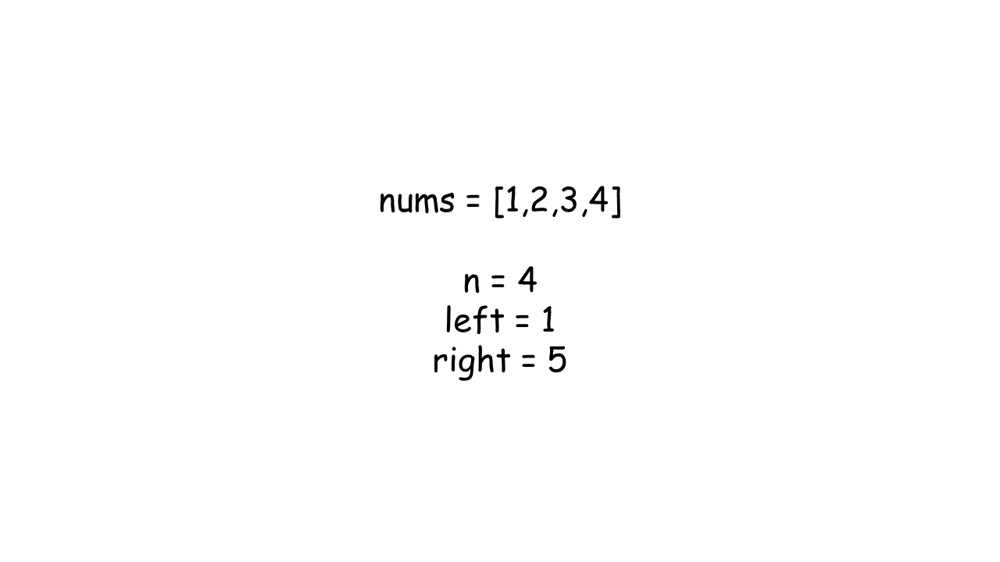

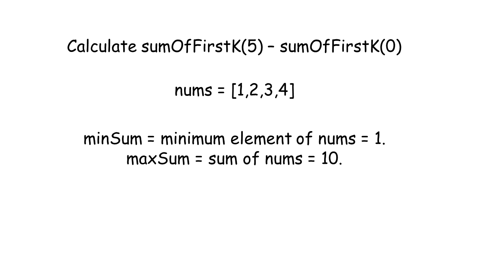

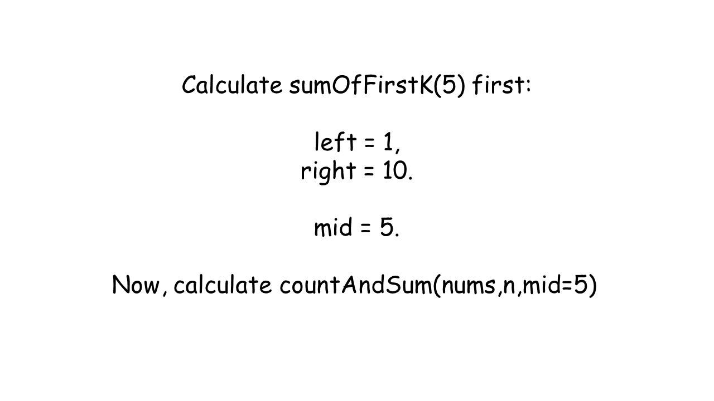

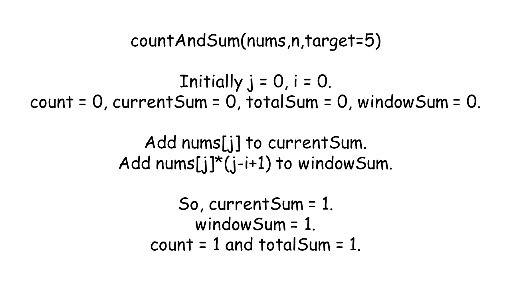

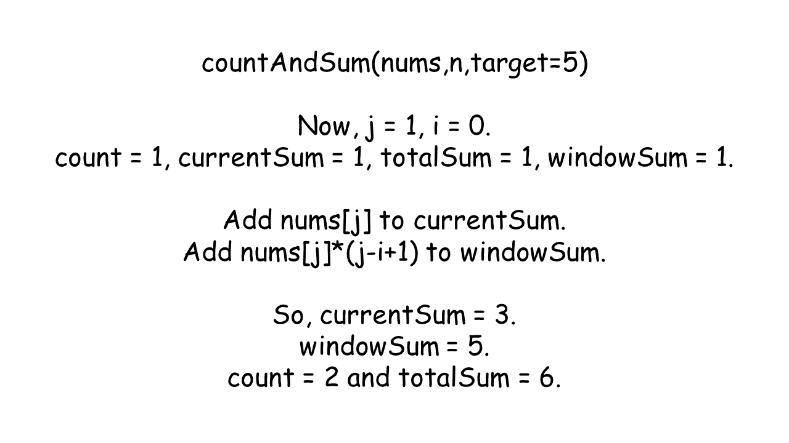

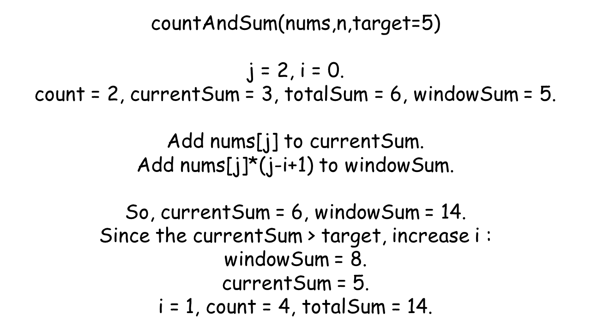

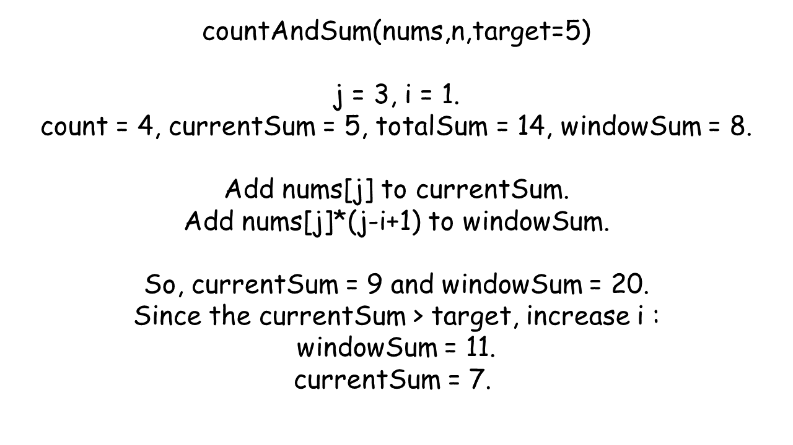

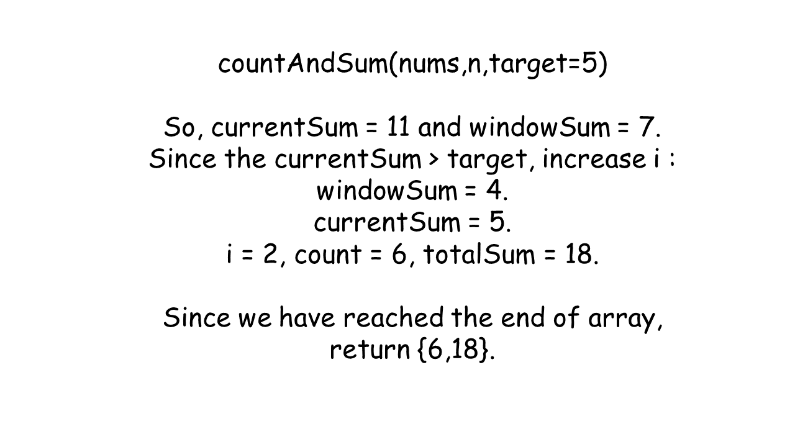

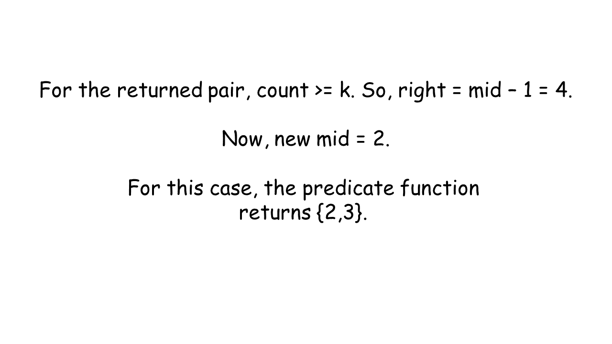

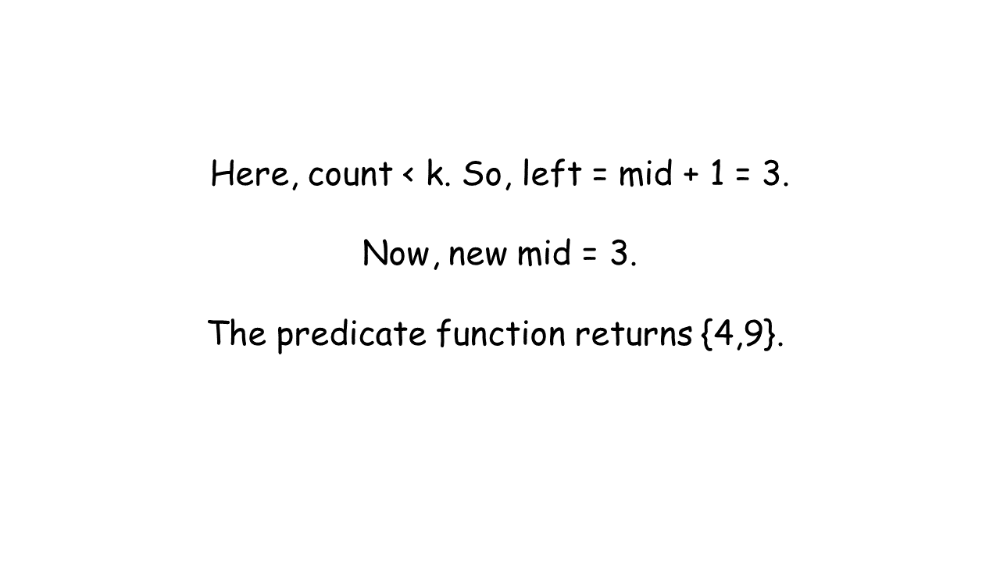

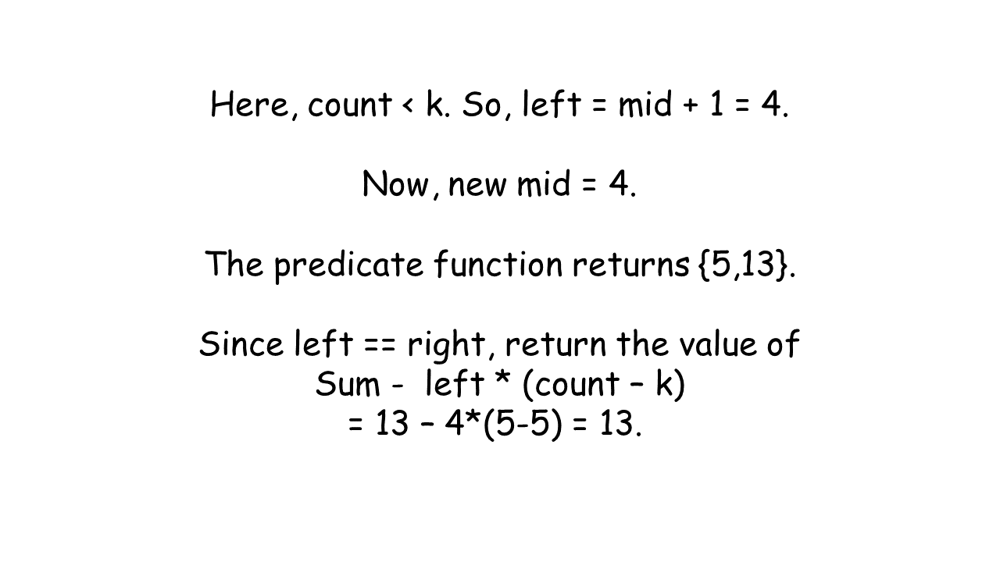

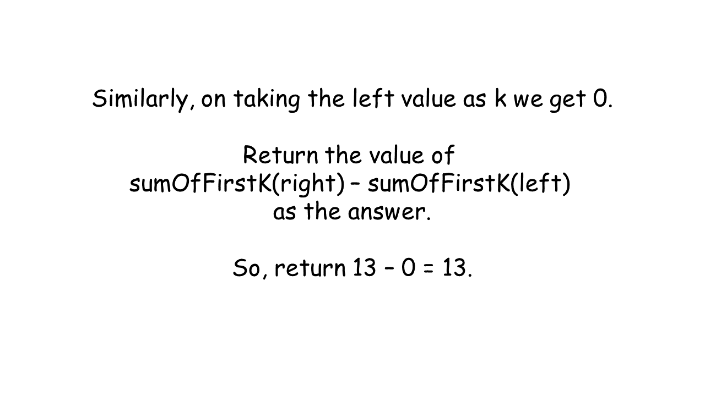

#### Implementation

```python
class Solution:
    def rangeSum(self, nums, n, left, right):
        mod = 10**9 + 7

        def count_and_sum(nums, n, target):
            count = 0
            current_sum = 0
            total_sum = 0
            window_sum = 0
            i = 0
            for j in range(n):
                current_sum += nums[j]
                window_sum += nums[j] * (j - i + 1)
                while current_sum > target:
                    window_sum -= current_sum
                    current_sum -= nums[i]
                    i += 1
                count += j - i + 1
                total_sum += window_sum
            return count, total_sum

        def sum_of_first_k(nums, n, k):
            min_sum = min(nums)
            max_sum = sum(nums)
            left = min_sum
            right = max_sum

            while left <= right:
                mid = left + (right - left) // 2
                if count_and_sum(nums, n, mid)[0] >= k:
                    right = mid - 1
                else:
                    left = mid + 1
            count, total_sum = count_and_sum(nums, n, left)
            # There can be more subarrays with the same sum of left.
            return total_sum - left * (count - k)

        result = (
            sum_of_first_k(nums, n, right) - sum_of_first_k(nums, n, left - 1)
        ) % mod
        # Ensure non-negative result
        return (result + mod) % mod
```

#### Complexity Analysis

Let $n$ be the size and `sum` be the total sum of the `nums` array.

- Time complexity: $O(n \log sum)$

   The total size of the search space is $O(sum)$. Therefore, time complexity for binary search is $O(\log sum)$. Inside each binary search operation, the `countAndSum` function takes $O(n)$ time.

   Therefore, the total time complexity is given by $O(n \cdot \log sum)$.

- Space complexity: $O(1)$

   Apart from some constant sized variables, no additional memory is used. Therefore, the total space complexity is given by $O(n)$.

---