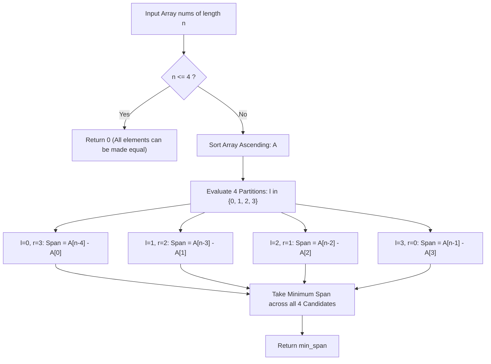

# Guided Example: Minimum Difference Between Largest and Smallest Value in Three Moves

## 1. Instance & Teaching Goal

We are given an array of $n = 5$ integers:
$$\text{nums} = [1, 5, 0, 10, 14]$$

In one move, any element can be changed to any arbitrary integer. We are allowed at most $3$ such modifications.
Our teaching goal is to find the minimum possible difference between the maximum and minimum elements in the modified array. We establish the mathematical equivalence between modifying elements and pruning extremal boundaries, reducing an infinite continuous optimization problem over real numbers to an exact evaluation of $4$ discrete boundary-trimming configurations.

## 2. Conceptual Foundation & Invariants

Let $A$ be the array $\text{nums}$ sorted in non-decreasing order:
$$A[0] \le A[1] \le \dots \le A[n-1]$$

1. **Equivalence of Modification and Deletion**:
   When we modify an element $x$, we can choose to set $x = A[k]$ for any untouched element $A[k]$.
   By doing so, $x$ is placed inside the bounding range $[\min(\text{untouched}), \max(\text{untouched})]$ and will never dictate the new minimum or maximum.
   Therefore, changing up to $3$ values is mathematically identical to **deleting up to $3$ elements** from the sorted array and measuring the span between the remaining extrema.
2. **Boundary Pruning Optimality**:
   To minimize the range $A_{\text{max}} - A_{\text{min}}$, deleting an interior element $A[i]$ (where $A_{\text{min}} < A[i] < A_{\text{max}}$) achieves nothing, because the global extrema remain unchanged.
   Hence, every deletion move must strictly remove either the current smallest element (from the left) or the current largest element (from the right).
3. **Finite Partition Configurations**:
   With at most $3$ deletions, any optimal strategy removes $l$ elements from the left ($0 \le l \le 3$) and $r = 3 - l$ elements from the right.
   The remaining contiguous subarray spans indices $[l, n - 1 - r]$, with amplitude:
   $$\Delta(l) = A[n - 1 - (3 - l)] - A[l] = A[n - 4 + l] - A[l]$$
   There are exactly $4$ possible integer partitions of $3$ deletions:
   - Case 0: $l = 0, r = 3 \implies \Delta(0) = A[n - 4] - A[0]$ (Remove 3 largest)
   - Case 1: $l = 1, r = 2 \implies \Delta(1) = A[n - 3] - A[1]$ (Remove 1 smallest, 2 largest)
   - Case 2: $l = 2, r = 1 \implies \Delta(2) = A[n - 2] - A[2]$ (Remove 2 smallest, 1 largest)
   - Case 3: $l = 3, r = 0 \implies \Delta(3) = A[n - 1] - A[3]$ (Remove 3 smallest)
4. **Base Triviality for Small Arrays ($n \le 4$)**:
   If the array contains $4$ or fewer elements, we can change up to $3$ of them to match the single remaining element, achieving a difference of $0$.

```text
+-------------------------------------------------------------------------------+
|                      EXTREMAL PRUNING PARTITIONS (3 MOVES)                    |
|                                                                               |
|  Sorted Array A: [ 0,  1,  5, 10, 14 ],  n = 5                                |
|                                                                               |
|  Partition (l, r)   Pruned Left   Pruned Right   Remaining Range    Span      |
|  ----------------   -----------   ------------   ---------------    ----      |
|  (0, 3)             none          10, 14, 5      [0, 1]             1 - 0 = 1 |
|  (1, 2)             0             14, 10         [1, 5]             5 - 1 = 4 |
|  (2, 1)             0, 1          14             [5, 10]           10 - 5 = 5 |
|  (3, 0)             0, 1, 5       none           [10, 14]          14 - 10= 4 |
|                                                                               |
|  Optimal Choice: (0, 3) yields minimum span = 1                               |
+-------------------------------------------------------------------------------+
```

The evaluation maintains the following state variables:

| State Variable | Domain | Initial Value | Transition / Role |
|---|---|---|---|
| `sorted_nums` | Array of length $n$ | Permutation of `nums` | Elements arranged in non-decreasing order $A[0] \le \dots \le A[n-1]$. |
| `left_cuts` | Integer $\in \{0, 1, 2, 3\}$ | $0$ | Number of smallest elements $l$ removed from the left boundary. |
| `right_cuts` | Integer $\in \{0, 1, 2, 3\}$ | $3$ | Number of largest elements $r = 3 - l$ removed from the right boundary. |
| `candidate_span` | Integer $\ge 0$ | Undefined | Span of remaining window $A[n - 1 - r] - A[l]$. |
| `min_span` | Integer $\ge 0$ | $+\infty$ | Running minimum of all evaluated candidate spans. |

> [!IMPORTANT]
> **Extremal Modification Invariant**: Because any arbitrary replacement value is allowed, an element can be cloned to match any retained value without widening the range. Thus, changing an element is mathematically isomorphic to removing it from the extrema calculation.



## 3. Step-by-Step Worked Execution

We walk through the instance $\text{nums} = [1, 5, 0, 10, 14]$ with $n = 5$.

### Step 1: Base Dimension Check

The length of the array is $n = 5$. Since $n > 4$, the result is not trivially zero, so we proceed to partition analysis.

### Step 2: Sorting the Elements

Sorting the array in non-decreasing order gives:
$$A = [0, 1, 5, 10, 14]$$
Indexing:
- $A[0] = 0$
- $A[1] = 1$
- $A[2] = 5$
- $A[3] = 10$
- $A[4] = 14$

### Step 3: Evaluating the 4 Partition Options

We test each allocation of the 3 available moves:

#### Option 0: $l = 0, r = 3$ (Zero Left Cuts, Three Right Cuts)
- Cut elements: $A[4] = 14, A[3] = 10, A[2] = 5$.
- Remaining elements: $[A[0], A[1]] = [0, 1]$.
- New minimum: $A[0] = 0$.
- New maximum: $A[5 - 1 - 3] = A[1] = 1$.
- Computed difference:
  $$\Delta(0) = 1 - 0 = 1$$
- Running minimum: $\text{min\_span} = 1$.

#### Option 1: $l = 1, r = 2$ (One Left Cut, Two Right Cuts)
- Cut elements: Left: $A[0] = 0$. Right: $A[4] = 14, A[3] = 10$.
- Remaining elements: $[A[1], A[2]] = [1, 5]$.
- New minimum: $A[1] = 1$.
- New maximum: $A[5 - 1 - 2] = A[2] = 5$.
- Computed difference:
  $$\Delta(1) = 5 - 1 = 4$$
- Running minimum: $\text{min\_span} = \min(1, 4) = 1$.

#### Option 2: $l = 2, r = 1$ (Two Left Cuts, One Right Cut)
- Cut elements: Left: $A[0] = 0, A[1] = 1$. Right: $A[4] = 14$.
- Remaining elements: $[A[2], A[3]] = [5, 10]$.
- New minimum: $A[2] = 5$.
- New maximum: $A[5 - 1 - 1] = A[3] = 10$.
- Computed difference:
  $$\Delta(2) = 10 - 5 = 5$$
- Running minimum: $\text{min\_span} = \min(1, 5) = 1$.

#### Option 3: $l = 3, r = 0$ (Three Left Cuts, Zero Right Cuts)
- Cut elements: Left: $A[0] = 0, A[1] = 1, A[2] = 5$. Right: None.
- Remaining elements: $[A[3], A[4]] = [10, 14]$.
- New minimum: $A[3] = 10$.
- New maximum: $A[5 - 1 - 0] = A[4] = 14$.
- Computed difference:
  $$\Delta(3) = 14 - 10 = 4$$
- Running minimum: $\text{min\_span} = \min(1, 4) = 1$.

### Step 4: Final Selection

Comparing all candidate differences:
$$\min(\{1, 4, 5, 4\}) = 1$$
The minimum difference achievable is $1$.

## 4. Complete Execution Trace

We tabulate the full comparative matrix of the four candidate strategies.

| Configuration Rank | Left Cuts $l$ | Right Cuts $r$ | Elements Pruned | Remaining Subarray Range | New Minimum | New Maximum | Resulting Span $\Delta$ | Status |
|---|---|---|---|---|---|---|---|---|
| Case 0 | $0$ | $3$ | $\{14, 10, 5\}$ | $A[0 \dots 1] = [0, 1]$ | $0$ | $1$ | $1 - 0 = 1$ | **Optimal ($\Delta = 1$)** |
| Case 1 | $1$ | $2$ | $\{0, 14, 10\}$ | $A[1 \dots 2] = [1, 5]$ | $1$ | $5$ | $5 - 1 = 4$ | Suboptimal |
| Case 2 | $2$ | $1$ | $\{0, 1, 14\}$ | $A[2 \dots 3] = [5, 10]$ | $5$ | $10$ | $10 - 5 = 5$ | Suboptimal |
| Case 3 | $3$ | $0$ | $\{0, 1, 5\}$ | $A[3 \dots 4] = [10, 14]$ | $10$ | $14$ | $14 - 10 = 4$ | Suboptimal |

### Physical Replacement Correspondence

To physically realize the optimal difference of $1$:
- Move 1: Change $5 \to 0$ $\implies [0, 1, 0, 10, 14]$
- Move 2: Change $10 \to 0$ $\implies [0, 1, 0, 0, 14]$
- Move 3: Change $14 \to 1$ $\implies [0, 1, 0, 0, 1]$
In the modified array $[0, 1, 0, 0, 1]$, minimum is $0$ and maximum is $1$, difference $= 1 - 0 = 1$.

## 5. Algorithmic Correctness

### Soundness

Let $S \subseteq \{0, 1, \dots, n-1\}$ be the set of indices of the unmodified elements after at most 3 moves, where $|S| \ge n - 3$.
For any such set, the maximum element is $\max_{i \in S} A[i]$ and the minimum is $\min_{i \in S} A[i]$.
The three modified elements can always be set to any value in the interval $[\min_{i \in S} A[i], \max_{i \in S} A[i]]$, such as $\min_{i \in S} A[i]$.
Then the global minimum and maximum of the full modified array are exactly $\min_{i \in S} A[i]$ and $\max_{i \in S} A[i]$, achieving the difference $\max_{i \in S} A[i] - \min_{i \in S} A[i]$.
Because each of the 4 evaluated options corresponds to a valid choice of $S$ with $|S| = n - 3$, every candidate span is soundly achievable.

### Completeness

Suppose there existed an index set $S^*$ with $|S^*| = n - 3$ achieving a strictly smaller difference than all 4 candidates.
Let $i_{\text{min}} = \min(S^*)$ and $i_{\text{max}} = \max(S^*)$.
Then the difference is $A[i_{\text{max}}] - A[i_{\text{min}}]$.
Since $|S^*| = n - 3$, at most 3 indices lie outside $S^*$.
The number of excluded indices strictly smaller than $i_{\text{min}}$ is $l = i_{\text{min}}$, and the number of excluded indices strictly greater than $i_{\text{max}}$ is $r = n - 1 - i_{\text{max}}$.
Because the total number of excluded indices is at most 3:
$$l + r \le 3$$
Thus, $i_{\text{min}} = l$ and $i_{\text{max}} \le n - 1 - (3 - l)$.
Since $A$ is non-decreasing:
$$A[i_{\text{max}}] - A[i_{\text{min}}] \ge A[n - 1 - (3 - l)] - A[l] = \Delta(l)$$
This implies that the difference achieved by $S^*$ is bounded below by $\Delta(l)$, which is one of our 4 evaluated cases.
Thus, no valid modification can achieve a smaller difference, proving completeness.

## 6. Traps This Instance Exposes

- **Internal Modification Trap**: Attempting to change an internal value (e.g. changing $5$ when $0$ and $14$ are present) without modifying the extrema. Modifying interior values leaves $\max - \min$ unchanged and wastes moves.
- **Greedy Move-by-Move Selection**: Greedily eliminating the larger gap (e.g., comparing $14 - 10 = 4$ versus $1 - 0 = 1$ and choosing moves iteratively). Individual greedy choices can lead to suboptimal local minima; all 4 global partitions must be evaluated simultaneously.
- **Short Array Out-of-Bounds Crash**: Attempting to access $A[n - 4]$ on arrays with length $n < 4$ without the $n \le 4$ early return check triggers an index out-of-bounds runtime error.
- **Full Sort Overhead**: Sorting the entire array requires $\mathcal{O}(n \log n)$. Since only the 4 smallest and 4 largest elements ever participate, using partial selection (`heapq.nsmallest` and `heapq.nlargest`) achieves $\mathcal{O}(n)$ time.

## 7. Complexity Derivation

### Time Complexity

- **Sorting Method**:
  Sorting the array of length $n$ takes:
  $$\mathcal{O}(n \log n)$$
  Evaluating the 4 candidate configurations takes $\mathcal{O}(1)$ time.
  Total time: $\mathcal{O}(n \log n)$.
- **Partial Selection Method**:
  Finding the 4 smallest and 4 largest elements via a min/max heap takes $\mathcal{O}(n \log 4) = \mathcal{O}(n)$ time.
  Sorting those 8 elements takes $\mathcal{O}(8 \log 8) = \mathcal{O}(1)$ time.
  Optimal total time: $\mathcal{O}(n)$.

### Auxiliary Space Complexity

- In-place sorting requires $\mathcal{O}(\log n)$ stack space (or $\mathcal{O}(1)$ with heapsort).
- Partial selection uses $\mathcal{O}(1)$ auxiliary storage for the 8 extreme numbers.
- Auxiliary space complexity is $\mathcal{O}(1)$.
