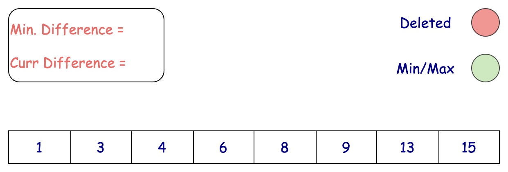
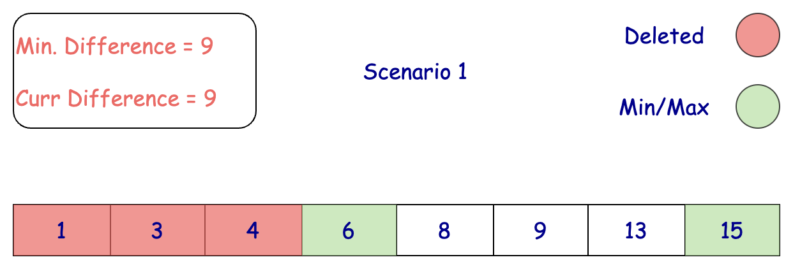
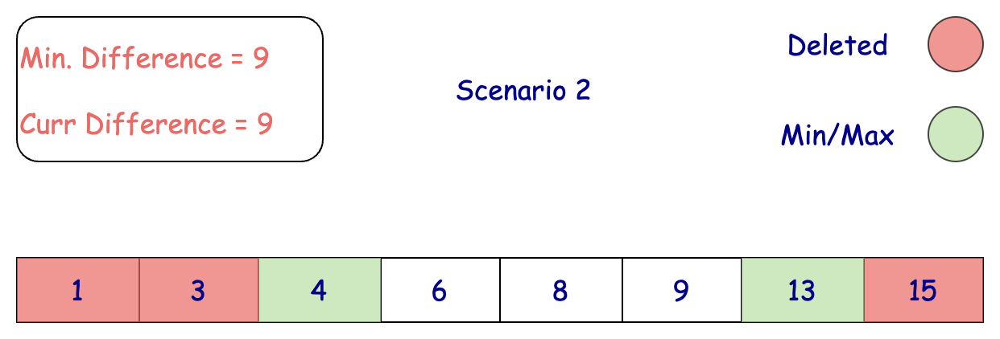
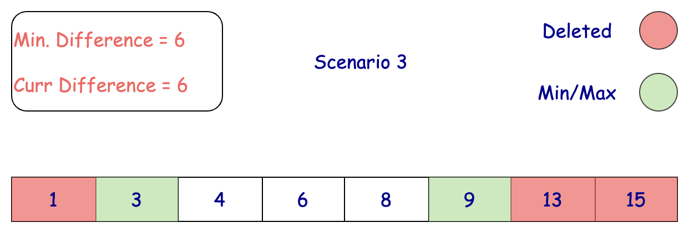
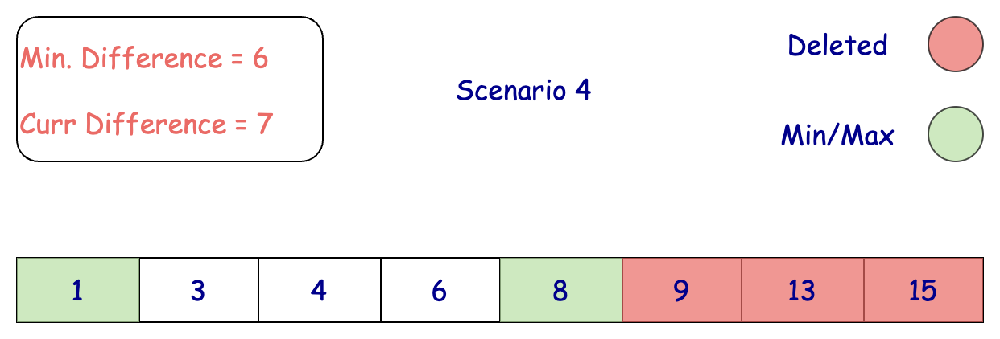

## Solution

---

### Overview

As you can see from the examples, we'll approach this problem by changing up to 3 values to an existing value in the array. Once changed, these values won't factor into the final calculation of the difference. This makes our changes the equivalent of deleting the values.

Now, we need to determine which three elements to delete to minimize this difference.

It's important to understand that deleting elements that are not the largest or smallest won't reduce the overall difference and is a waste of moves. Let's sort our array to evaluate the values more effectively.

For example, in the array `nums = [1, 3, 6, 8, 10, 14]`, the difference between the largest and smallest values is $14 - 1 = 13$. Deleting `8` does not change the difference, wasting a move.

We should focus on removing elements at the ends of the sorted array since the largest and smallest values are there. By removing these elements, we can reduce the range and minimize the difference effectively.

---

### Approach 1: Sort + Greedy Deletion

#### Intuition

Once we sort the array, how do we know which three values to target? There are four possible optimal scenarios:

* Removing the three largest elements.
* Removing the two largest and one smallest elements.
* Removing one largest and two smallest elements.
* Removing the three smallest elements.

With this approach, our only way to identify the three most impactful values to delete is to evaluate each scenario and choose the result that leads to the least difference between the smallest and largest values.











> Edge Case: If the array's length is less than or equal to `4`, we can return `0`. Removing up to three elements from this array would leave at most one element, resulting in a difference of zero between the largest and smallest values.

The rigorous proof that the greedy choice is optimal is done using proof by contradiction.

Assume that there exists a better strategy than removing three elements from either end of the sorted array to minimize the difference between the maximum and minimum elements. We will call this value difference from now on for simplicity.

Let's first sort the array `nums` with size `n` such that, $\text{nums}[0] \le \text{nums}[1] \le ... \le nums[n - 1]$.

Suppose that the optimal solution is removing the elements with indices `{i, j, k}`.

Let's assume for the sake of argument that $3 \le i < n - 3$, meaning that index `i` is outside the range that the greedy choice suggests.

Three cases have to be considered:

1. `j, k < 3`:

In this case, the difference is $nums[n - 1] - \text{nums}[l]$, where $l \le 3$ is the index of the smallest element in the modified array.

Notice that such an index is guaranteed to exist because we know $i \ge 3$, so exactly one of the three smallest elements in `nums` haven't been flagged for deletion.

We can decrease this difference by removing `l` instead of `i` because $\text{nums}[l] \le \text{nums}[3]$, and so $nums[n - 1] - \text{nums}[l] \ge nums[n - 1] - \text{nums}[3]$.

> Note: By removing `l`, the smallest element in `nums` will now be located at index `3`.

2. `j < 3` and $k \ge n - 3$ (or vice versa):

In this case, the difference is $\text{nums}[m] - \text{nums}[l]$, where $l \le 3$ is the index of the smallest element in the modified array and $m \ge n - 3$ is the index of the largest element in the modified array.

Again, these two indices are guaranteed to exist because at least one of the three smallest and one of the three largest values in `nums` haven't been flagged for deletion.

If we were to remove `m` instead of `i`, the new largest element in `nums` is guaranteed to be smaller than $\text{nums}[m]$. So we have effectively reduced the difference.

The argument for deleting `l` is similar to case 1. So we can reduce the difference in this case as well.

3. $j, k \ge n - 3$:

In this case, the difference is $\text{nums}[m] - \text{nums}[0]$, where $m \ge n - 3$ is the index of the largest element in the modified array.

Similarly, this index is guaranteed to exist because exactly one of the three largest elements in `nums` haven't been flagged for deletion.

If we were to remove `m` instead of `i`, the new largest element in `nums` is guaranteed to be smaller than $\text{nums}[m]$. So we have effectively reduced the difference here as well.

In all cases, we can find a solution that's at least as good by only removing elements from the ends. This contradicts our assumption that there's a better strategy involving removing elements not from the ends.

Therefore, the optimal strategy must involve removing elements only from the ends of the sorted array `nums`.

#### Algorithm

1. Initialization:
- Determine the size of the array `nums` and store it in `numsSize`.
- If `numsSize` is less than or equal to 4, return 0.
- Sort the array `nums`.
- Initialize `minDiff` to a very large number to store the minimum difference.
2. Iterate through the first four elements of the sorted array:
- For each index `left` from 0 to 3:
- Calculate the corresponding `right` index as $numsSize - 4 + left$.
- Compute the difference between the elements at indices `right` and `left` in the sorted array.
- Update `minDiff` with the minimum value between `minDiff` and the computed difference.
3. Return `minDiff`, which stores the minimum difference between the largest and smallest values after removing up to three elements.

#### Implementation

```python
class Solution:
    def minDifference(self, nums: List[int]) -> int:
        nums_size = len(nums)

        # If the array has 4 or fewer elements, return 0
        if nums_size <= 4:
            return 0

        nums.sort()

        min_diff = float("inf")

        # Four scenarios to compute the minimum difference
        for left in range(4):
            right = nums_size - 4 + left
            min_diff = min(min_diff, nums[right] - nums[left])

        return min_diff
```

#### Complexity Analysis

Let $n$ be the length of the array `nums`.

- Time Complexity: $O(n \cdot \log n)$

  Sorting the array `nums` takes $O(n \log n)$ time. The for loop runs a fixed number of 4 iterations, taking $O(1)$ time. Thus, the overall time complexity is $O(n \log n)$.

- Space Complexity: $O(n)$ or $O( \log n )$

    When we sort the `nums` array, some extra space is used. The space complexity of the sorting algorithm depends on the programming language.

    In Python, the `sort` method sorts a list using the Timsort algorithm, which combines Merge Sort and Insertion Sort and has $O(n)$ additional space.

    In Java, `Arrays.sort()` is implemented using a variant of the Quick Sort algorithm, with a space complexity of $O( \log n)$ for sorting two arrays.

    In C++, the `sort()` function is implemented as a hybrid of Quick Sort, Heap Sort, and Insertion Sort, with a worse-case space complexity of $O( \log n )$.

---

### Approach 2: Partial Sort + Greedy Deletion

#### Intuition

Considering the four scenarios we discussed in the previous approach, we only care about the `4` smallest elements and the `4` largest elements of the array `nums`. Sorting the entire array is inefficient when we only need to concern ourselves with `8` total elements, so it will significantly improve our performance if we identify and sort only the relevant elements.

Modern programming languages have built-in functionalities to partially sort an array. After these operations, the array will have the four smallest elements at the start and the four largest elements at the end, both sorted in ascending order.

In C++, we can use $std::\text{partial}_{sort}$ and $std::\text{nth}_{element}$.

- $std::\text{partial}_{sort}$ rearranges the elements in such a way that the smallest `k` elements are sorted at the beginning of the range.
- $std::\text{nth}_{element}$ rearranges the elements such that the element at the `n`-th position is the one that would be in that position in a fully sorted array, and all elements before it are less than or equal to it, and all elements after it are greater than or equal to it.

For Java and Python, we can utilize heaps to achieve similar results. A heap is a very powerful data structure that allows us to efficiently find the maximum or minimum value in a dynamic dataset.

Here are some similar problems that use partial sorting and involve finding the `k`th smallest or largest elements:

* [506. Relative Ranks](https://leetcode.com/problems/relative-ranks/description/)
* [215. Kth Largest Element in an Array](https://leetcode.com/problems/kth-largest-element-in-an-array/description/)

If you have a LeetCode Premium subscription, you can learn more about heaps using this [heap explore card](https://leetcode.com/explore/learn/card/heap/).

The rest of the logic discussed in the last approach remains the same.

#### Algorithm

1. Initialization:
- Determine the size of the array `nums` and store it in `numsSize`.
- If `numsSize` is less than or equal to 4, return 0.
- Initialize `minDiff` to a very large number to store the minimum difference.

2. Partially Sort and Find Elements:
- Partially sort the first four elements of `nums` to get the smallest four elements in the beginning.
- Find the 4th largest element using an appropriate method to partition the array around this element.
- Sort the last four elements of `nums` to get the largest four elements at the end.

3. Compute Minimum Difference:
- Iterate through the first four elements of the array:
- For each index `left` from 0 to 3:
- Calculate the corresponding `right` index as $numsSize - 4 + left$.
- Compute the difference between the elements at indices `right` and `left`.
- Update `minDiff` with the minimum value between `minDiff` and the computed difference.

4. Return Result:
- Return `minDiff`, which stores the minimum difference between the largest and smallest values after removing up to three elements.

#### Implementation

```python
class Solution:
    def minDifference(self, nums: List[int]) -> int:
        nums_size = len(nums)
        if nums_size <= 4:
            return 0

        # Find the four smallest elements
        smallest_four = sorted(heapq.nsmallest(4, nums))

        # Find the four largest elements
        largest_four = sorted(heapq.nlargest(4, nums))

        min_diff = float("inf")
        # Four scenarios to compute the minimum difference
        for i in range(4):
            min_diff = min(min_diff, largest_four[i] - smallest_four[i])

        return min_diff
```

#### Complexity Analysis

Let $n$ be the length of the array `nums`.

- Time Complexity: $O(n)$

  - Java and Python:

- Finding the 4 smallest elements using a max heap takes $O(n)$ time because maintaining a fixed-size heap of 4 elements results in $O(n \cdot \log 4) = O(n)$.

- Sorting the 4 smallest elements takes $O(1)$ time because sorting a constant number of elements is constant time.

- Finding the 4 largest elements using a min heap also takes $O(n)$ time because maintaining a fixed-size heap of 4 elements results in $O(n \cdot \log 4) = O(n)$.

- Sorting the 4 largest elements takes $O(1)$ time.

  - C++:

- The $\text{partial}_{sort}$ function runs in $O(n \cdot \log 4) = O(n)$ time as it sorts only the first four elements and ensures the smallest four elements are in place.

- The $\text{nth}_{element}$ function, which partitions the array around the 4th largest element, also runs in $O(n)$ time.

- The `sort` function, which sorts the last four elements, runs in $O(4 \cdot \log 4) = O(1)$ time because sorting a constant number of elements is constant time.

    The for loop that runs a fixed number of 4 iterations takes $O(1)$ time.

    Therefore, the total time complexity is $O(n)$.

- Space Complexity: $O(1)$

  - Java and Python: The algorithm uses constant space to store the heaps and intermediate results, which do not grow with the input size. This includes space for the heaps (each with a maximum size of 4) and any additional variables.

  - C++: The algorithm uses constant space regardless of the input size, as it only requires a few variables for indexing and storing intermediate results.

  Therefore, the total space complexity is $O(1)$.

---