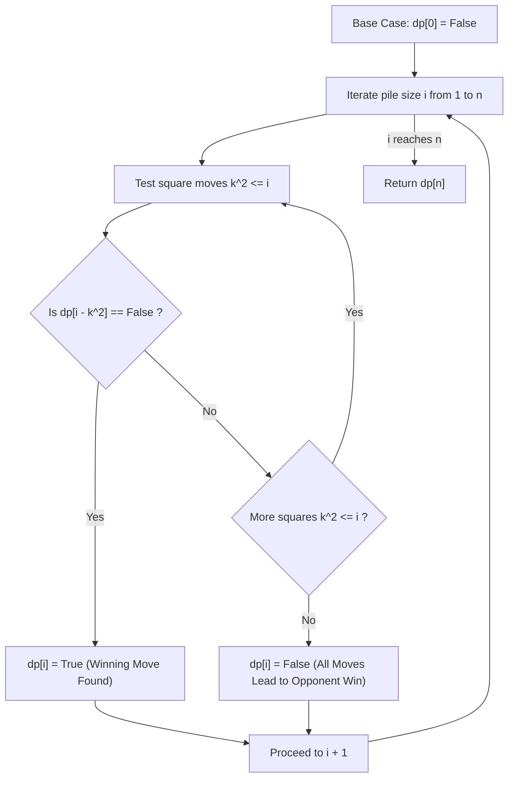

# Guided Example: Stone Game IV

## 1. Instance & Teaching Goal

We examine an instance of the square-subtraction stone game initialized with:
$$n = 7 \text{ stones}$$

Alice and Bob take turns removing any positive square number of stones ($1, 4, 9, 16, \dots$). Alice moves first. A player who confronts a pile of $0$ stones and cannot make a legal move immediately loses. Assuming both players play with perfect adversarial rationality, our goal is to determine whether Alice has a guaranteed winning strategy. We formulate the game as a classic impartial game under normal play convention, constructing the backward induction dynamic programming table over states $0$ through $7$.

## 2. Conceptual Foundation & Invariants

Under combinatorial game theory and the Sprague-Grundy framework:
1. **State Space**:
   A state $i \in \{0, 1, \dots, n\}$ represents the current number of stones in the pile.
2. **Transition Rules**:
   From state $i$, a player can transition to any state $i - k^2$ such that $k \ge 1$ and $k^2 \le i$.
3. **Outcome Classification**:
   - **Terminal State ($i = 0$)**: The player facing $0$ stones has no legal move and loses. Thus, state $0$ is a losing state ($\mathcal{P}$-position, evaluated to $\text{False}$).
   - **Winning State ($\mathcal{N}$-position / $\text{True}$)**: A state $i$ is winning for the active player if there exists at least one legal square transition $k^2$ leading to a losing state:
     $$\text{dp}[i] = \text{True} \iff \exists k \ge 1 \text{ with } k^2 \le i \text{ such that } \text{dp}[i - k^2] = \text{False}$$
   - **Losing State ($\mathcal{P}$-position / $\text{False}$)**: A state $i$ is losing if every legal square transition forces the game into a winning state for the opponent:
     $$\text{dp}[i] = \text{False} \iff \forall k \ge 1 \text{ with } k^2 \le i, \, \text{dp}[i - k^2] = \text{True}$$

```text
+-------------------------------------------------------------------------------+
|                      COMBINATORIAL GAME DYNAMICS (n = 7)                      |
|                                                                               |
|  Current Pile i                                                               |
|        |                                                                      |
|        +---> Subtract 1^2 = 1 ---> Next state: i - 1                          |
|        +---> Subtract 2^2 = 4 ---> Next state: i - 4 (if i >= 4)              |
|        +---> Subtract 3^2 = 9 ---> Next state: i - 9 (if i >= 9)              |
|                                                                               |
|  Rule: If ANY reachable next state is False, state i is TRUE.                 |
|        If ALL reachable next states are True, state i is FALSE.               |
|                                                                               |
|  Base: dp[0] = False                                                          |
+-------------------------------------------------------------------------------+
```

The algorithm maintains the following state variables:

| State Variable | Domain | Initial Value | Transition / Role |
|---|---|---|---|
| `dp[i]` | Boolean | `dp[0] = False` | Evaluates whether a pile of $i$ stones is a winning state for the active player. |
| `pile_size` | Integer $\in [1, n]$ | $1$ | Outer induction cursor advancing from $1$ up to $n$. |
| `square_root` | Integer $\ge 1$ | $1$ | Candidate base $k$ where $k^2 \le \text{pile\_size}$. |
| `outcome` | Boolean | False | Set to True immediately upon finding any $k$ such that $\text{dp}[i - k^2] == \text{False}$. |

> [!IMPORTANT]
> **Adversarial Existence Invariant**: A player only needs **one** winning move to make the state winning: shifting to any state where the opposing player is guaranteed to lose. A state is only losing if **every** possible move leaves the opponent with a winning response.



## 3. Step-by-Step Worked Execution

We trace the bottom-up evaluation of $\text{dp}[i]$ from $i = 0$ to $i = 7$.

### Base Condition
- $i = 0$: Pile is empty. No legal moves.
  $$\text{dp}[0] = \text{False}$$

---

### Step 1: Pile Size $i = 1$
- Legal square moves: $k = 1 \implies k^2 = 1$.
- Target state: $1 - 1 = 0$.
- State inspection: $\text{dp}[0] = \text{False}$.
- Alice can remove $1$ stone, leaving Bob with $0$ stones where Bob loses.
- Result: $\text{dp}[1] = \text{True}$.

---

### Step 2: Pile Size $i = 2$
- Legal square moves: $k = 1 \implies k^2 = 1$. (Note: $2^2 = 4 > 2$, illegal).
- Target state: $2 - 1 = 1$.
- State inspection: $\text{dp}[1] = \text{True}$.
- Any move leaves Bob in state $1$, which is winning for Bob.
- Result: $\text{dp}[2] = \text{False}$.

---

### Step 3: Pile Size $i = 3$
- Legal square moves: $k = 1 \implies k^2 = 1$.
- Target state: $3 - 1 = 2$.
- State inspection: $\text{dp}[2] = \text{False}$.
- Alice removes $1$ stone, passing state $2$ to Bob. Since state $2$ is losing, Bob loses.
- Result: $\text{dp}[3] = \text{True}$.

---

### Step 4: Pile Size $i = 4$
- Legal square moves:
  - $k = 1 \implies 4 - 1 = 3 \implies \text{dp}[3] = \text{True}$.
  - $k = 2 \implies 4 - 4 = 0 \implies \text{dp}[0] = \text{False}$.
- Transition $k = 2$ leads directly to losing state $0$.
- Result: $\text{dp}[4] = \text{True}$.

---

### Step 5: Pile Size $i = 5$
- Legal square moves:
  - $k = 1 \implies 5 - 1 = 4 \implies \text{dp}[4] = \text{True}$.
  - $k = 2 \implies 5 - 4 = 1 \implies \text{dp}[1] = \text{True}$.
- Both legal moves lead to winning states for the next player. Alice has no move to a losing state.
- Result: $\text{dp}[5] = \text{False}$.

---

### Step 6: Pile Size $i = 6$
- Legal square moves:
  - $k = 1 \implies 6 - 1 = 5 \implies \text{dp}[5] = \text{False}$.
- Move $k = 1$ transitions to state $5$, which is losing. Alice takes this move.
- Result: $\text{dp}[6] = \text{True}$.

---

### Step 7: Pile Size $i = 7$
- Legal square moves:
  - $k = 1 \implies 7 - 1 = 6 \implies \text{dp}[6] = \text{True}$.
  - $k = 2 \implies 7 - 4 = 3 \implies \text{dp}[3] = \text{True}$.
- (Note: $3^2 = 9 > 7$).
- Both available transitions ($k = 1, 2$) lead to states where the opponent wins ($6$ and $3$).
- Alice cannot force a win from $7$ stones.
- Result: $\text{dp}[7] = \text{False}$.

Final verdict: Alice loses when $n = 7$; the algorithm returns $\text{False}$.

## 4. Complete Execution Trace

We collect the complete state induction table across all sizes up to $n = 7$.

| Pile Size $i$ | Available Squares $k^2$ | Transitions Evaluated $i - k^2$ | Opponent States Observed | Winning Move Found? | State Status $\text{dp}[i]$ | Optimal Strategy |
|---|---|---|---|---|---|---|
| $0$ | None | None | None | No | **$\text{False}$** | Terminal loss |
| $1$ | $\{1\}$ | $1 - 1 = 0$ | $\text{dp}[0] = \text{False}$ | **Yes** ($k=1$) | **$\text{True}$** | Remove 1 stone $\to$ win |
| $2$ | $\{1\}$ | $2 - 1 = 1$ | $\text{dp}[1] = \text{True}$ | No | **$\text{False}$** | Trapped: Bob takes remaining stone |
| $3$ | $\{1\}$ | $3 - 1 = 2$ | $\text{dp}[2] = \text{False}$ | **Yes** ($k=1$) | **$\text{True}$** | Remove 1 stone $\to$ pass state 2 |
| $4$ | $\{1, 4\}$ | $4-4=0, 4-1=3$ | $\text{dp}[0]=\text{False}, \text{dp}[3]=\text{True}$ | **Yes** ($k=2$) | **$\text{True}$** | Remove 4 stones $\to$ instant win |
| $5$ | $\{1, 4\}$ | $5-1=4, 5-4=1$ | $\text{dp}[4]=\text{True}, \text{dp}[1]=\text{True}$ | No | **$\text{False}$** | All moves hand opponent a win |
| $6$ | $\{1, 4\}$ | $6-1=5, 6-4=2$ | $\text{dp}[5]=\text{False}$ | **Yes** ($k=1$) | **$\text{True}$** | Remove 1 stone $\to$ pass state 5 |
| $7$ | $\{1, 4\}$ | $7-1=6, 7-4=3$ | $\text{dp}[6]=\text{True}, \text{dp}[3]=\text{True}$ | No | **$\text{False}$** | Alice loses under optimal play |

### Game Tree for $n = 7$

```text
               (Alice at 7)
              /            \
       take 1 /              \ take 4
            v                v
      (Bob at 6)           (Bob at 3)
         |                    |
       take 1 (leaves 5)    take 1 (leaves 2)
         v                    v
      (Alice at 5)         (Alice at 2)
       [Losing]             [Losing]
```
Because both branches lead to states from which Bob can force a win, Alice is trapped.

## 5. Algorithmic Correctness

### Soundness

The game is finite, deterministic, impartial, and contains no cycles (since $k^2 \ge 1$ guarantees strictly decreasing pile size $i - k^2 < i$).
By Zermelo's theorem for finite games of perfect information, every position is either a winning position or a losing position.
- Base: In state $0$, the player whose turn it is has no moves and loses by definition; $\text{dp}[0] = \text{False}$ is sound.
- Step: If $\text{dp}[i - k^2] = \text{False}$, the player receiving pile $i - k^2$ has no strategy to win. Thus, the player at state $i$ can choose move $k^2$ to leave the opponent in an inescapable losing position, guaranteeing victory.
- Conversely, if $\text{dp}[i - k^2] = \text{True}$ for all legal $k$, whatever move the current player makes leaves the opponent in a state from which the opponent can force a win. Thus the current player must lose.
Therefore, the recurrence correctly mirrors optimal adversarial play.

### Completeness

Every integer $i$ from $1$ to $n$ evaluates all square moves $k^2 \le i$. Since $k$ starts at $1$ and increments until $k^2 > i$, every legal option is tested before declaring a state $\text{False}$. No winning move can be overlooked.

## 6. Traps This Instance Exposes

- **Greedy Largest-Square Trap**: Believing that a player should always remove the largest possible square $k^2 \le i$. For example, at $i = 8$, the largest square is $4$ (leaving $4$, which is a winning state for the opponent). However, removing $1$ leaves $7$, which is a losing state for the opponent! The greedy move loses, whereas the non-greedy move wins.
- **Unbounded Search**: Continuing the square test past $\lfloor\sqrt{i}\rfloor$. Because $k^2 > i$ results in negative pile sizes, loop bounds must strictly enforce $k \times k \le i$.
- **Call-Stack Overflow in Unmemoized Recursion**: Implementing naive recursion without memoization leads to exponential complexity $\mathcal{O}(2^n)$, crashing on $n = 10^5$. Bottom-up iterative DP or memoized recursion guarantees each state is computed once.

## 7. Complexity Derivation

### Time Complexity

- For each state $i \in \{1, 2, \dots, n\}$, the algorithm tests candidate squares $k^2 \le i$.
- The number of squares $\le i$ is $\lfloor\sqrt{i}\rfloor$.
- Summing over all states:
  $$\sum_{i=1}^{n} \sqrt{i} \approx \int_{1}^{n} x^{1/2} \, dx = \left[ \frac{2}{3} x^{3/2} \right]_{1}^{n} = \mathcal{O}(n^{1.5}) = \mathcal{O}(n \sqrt{n})$$
- For $n = 10^5$, $n \sqrt{n} \approx 10^5 \times 316 \approx 3.16 \times 10^7$ iterations. With early loop break on the first winning move, empirical operations are substantially fewer (typically $< 10^7$), executing in approximately $0.1$ seconds.

### Auxiliary Space Complexity

- The dynamic programming table requires a 1D boolean array of length $n + 1$.
- Total auxiliary space is $\mathcal{O}(n)$.