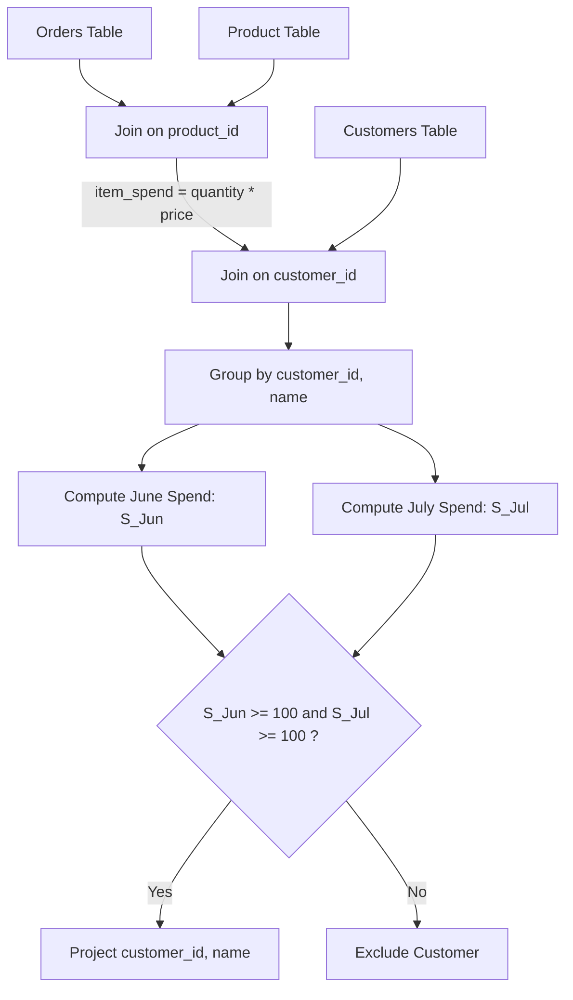

# Guided Example: Customer Order Frequency

## 1. Instance & Teaching Goal

We examine an enterprise commerce database containing customer registries, product pricing catalogs, and fulfillment order histories across multiple calendar months:

```text
Table: Customers
+--------------+-----------+-------------+
| customer_id  | name      | country     |
+--------------+-----------+-------------+
| 1            | Winston   | USA         |
| 2            | Jonathan  | Peru        |
| 3            | Moustafa  | Egypt       |
+--------------+-----------+-------------+

Table: Product
+--------------+-------------+-------------+
| product_id   | description | price       |
+--------------+-------------+-------------+
| 10           | LC Phone    | 300         |
| 20           | LC T-Shirt  | 10          |
| 30           | LC Book     | 45          |
| 40           | LC Keychain | 2           |
+--------------+-------------+-------------+

Table: Orders
+--------------+-------------+-------------+-------------+-----------+
| order_id     | customer_id | product_id  | order_date  | quantity  |
+--------------+-------------+-------------+-------------+-----------+
| 1            | 1           | 10          | 2020-06-10  | 1         |
| 2            | 1           | 20          | 2020-07-01  | 1         |
| 3            | 1           | 30          | 2020-07-08  | 2         |
| 4            | 2           | 10          | 2020-06-15  | 2         |
| 5            | 2           | 40          | 2020-07-01  | 10        |
| 6            | 3           | 20          | 2020-06-24  | 2         |
| 7            | 3           | 30          | 2020-06-25  | 2         |
| 9            | 3           | 30          | 2020-05-08  | 3         |
+--------------+-------------+-------------+-------------+-----------+
```

Our teaching goal is to identify all customers who spent at least $\$100$ in June 2020 and simultaneously at least $\$100$ in July 2020. We formulate the multi-table joining, date windowing, line-item monetary valuation, conditional monthly aggregation, and conjunction filtering using formal relational algebra.

## 2. Conceptual Foundation & Invariants

A purchase event is recorded as a tuple in $\text{Orders}$. To determine customer expenditure:
1. **Monetary Valuation via Equi-Join**:
   Each order item specifies $\text{product\_id}$ and $\text{quantity}$. Joining with $\text{Product}$ on $\text{product\_id}$ attaches unit $\text{price}$, defining the line-item spend:
   $$\text{item\_spend} = \text{quantity} \times \text{price}$$
2. **Customer Demographics Join**:
   Joining with $\text{Customers}$ on $\text{customer\_id}$ attaches customer attributes ($\text{name}$).
3. **Temporal Partitioning**:
   Orders outside the targeted observation windows are filtered out or evaluated through indicator functions:
   - June 2020 Indicator: $I_{\text{Jun}}(\text{order\_date}) = 1$ if $\text{order\_date} \in [\text{2020-06-01}, \text{2020-06-30}]$, else $0$.
   - July 2020 Indicator: $I_{\text{Jul}}(\text{order\_date}) = 1$ if $\text{order\_date} \in [\text{2020-07-01}, \text{2020-07-31}]$, else $0$.
4. **Relational Algebra Specification**:
   We define the enriched order stream:
   $$R = \text{Orders} \bowtie_{\text{Orders.product\_id} = \text{Product.product\_id}} \text{Product} \bowtie_{\text{Orders.customer\_id} = \text{Customers.customer\_id}} \text{Customers}$$
   We group by $(\text{customer\_id}, \text{name})$ and compute the conditional monthly sums:
   $$G = \gamma_{\text{customer\_id}, \text{name}, \sum(I_{\text{Jun}} \cdot \text{quantity} \cdot \text{price}) \to S_{\text{Jun}}, \sum(I_{\text{Jul}} \cdot \text{quantity} \cdot \text{price}) \to S_{\text{Jul}}}(R)$$
   We filter for the dual qualification predicate:
   $$\text{Result} = \Pi_{\text{customer\_id}, \text{name}}\left(\sigma_{S_{\text{Jun}} \ge 100 \land S_{\text{Jul}} \ge 100}(G)\right)$$

```text
+-------------------------------------------------------------------------------+
|                       RELATIONAL QUERY EVALUATION FLOW                        |
|                                                                               |
|  Orders (quantity, date)  <--Join-->  Product (price)                         |
|             \                                                                 |
|              +--> Joined Stream: (customer_id, spend, date)                   |
|             /                                                                 |
|  Customers (name)                                                             |
|                                                                               |
|  Aggregation by customer_id:                                                  |
|    - Sum(spend where date in June 2020) -> June_Spend                         |
|    - Sum(spend where date in July 2020) -> July_Spend                         |
|                                                                               |
|  Filter: June_Spend >= 100 AND July_Spend >= 100                              |
|  Project: customer_id, name                                                   |
+-------------------------------------------------------------------------------+
```

The evaluation maintains the following relational state components:

| Relational Stage | Input Relations | Derived Attributes | Invariant Property |
|---|---|---|---|
| Line Item Valuation | $\text{Orders} \bowtie \text{Product}$ | $\text{item\_spend}$ | Multiplies unit price by quantity purchased. |
| Entity Resolution | Valuation stream $\bowtie \text{Customers}$ | $\text{customer\_id}, \text{name}$ | Links purchase transaction to customer name. |
| Temporal Disjunction | Enriched stream | $I_{\text{Jun}}, I_{\text{Jul}}$ | Partitions spending into independent calendar months. |
| Group Aggregation | Grouped stream | $S_{\text{Jun}}, S_{\text{Jul}}$ | Accumulates total spend per customer per month. |
| Dual Threshold Filter | Aggregated stream | $\text{customer\_id}, \text{name}$ | Preserves only records satisfying $S_{\text{Jun}} \ge 100 \land S_{\text{Jul}} \ge 100$. |

> [!IMPORTANT]
> **Independent Monthly Threshold Invariant**: The condition requires spending $\ge \$100$ in **each** month independently ($S_{\text{Jun}} \ge 100 \land S_{\text{Jul}} \ge 100$). A combined two-month total of $\$200$ is insufficient if either individual month falls below $\$100$.



## 3. Step-by-Step Worked Execution

We walk through the representative database instance across all 8 logged orders.

### Phase 1: Line Item Valuation

For each order in $\text{Orders}$, we look up the product price and compute total expenditure:
- **Order 1**: Customer 1, Product 10, Date `2020-06-10`, Quantity 1.
  - Price of Product 10: $\$300$.
  - Expenditure: $1 \times 300 = \$300$.
  - Period: June 2020.
- **Order 2**: Customer 1, Product 20, Date `2020-07-01`, Quantity 1.
  - Price of Product 20: $\$10$.
  - Expenditure: $1 \times 10 = \$10$.
  - Period: July 2020.
- **Order 3**: Customer 1, Product 30, Date `2020-07-08`, Quantity 2.
  - Price of Product 30: $\$45$.
  - Expenditure: $2 \times 45 = \$90$.
  - Period: July 2020.
- **Order 4**: Customer 2, Product 10, Date `2020-06-15`, Quantity 2.
  - Price of Product 10: $\$300$.
  - Expenditure: $2 \times 300 = \$600$.
  - Period: June 2020.
- **Order 5**: Customer 2, Product 40, Date `2020-07-01`, Quantity 10.
  - Price of Product 40: $\$2$.
  - Expenditure: $10 \times 2 = \$20$.
  - Period: July 2020.
- **Order 6**: Customer 3, Product 20, Date `2020-06-24`, Quantity 2.
  - Price of Product 20: $\$10$.
  - Expenditure: $2 \times 10 = \$20$.
  - Period: June 2020.
- **Order 7**: Customer 3, Product 30, Date `2020-06-25`, Quantity 2.
  - Price of Product 30: $\$45$.
  - Expenditure: $2 \times 45 = \$90$.
  - Period: June 2020.
- **Order 9**: Customer 3, Product 30, Date `2020-05-08`, Quantity 3.
  - Price of Product 30: $\$45$.
  - Expenditure: $3 \times 45 = \$135$.
  - Period: May 2020 (Outside target months).

### Phase 2: Customer Aggregation and Verification

We aggregate by customer:

#### Customer 1: Winston
- June 2020 Spending:
  - Order 1: $\$300$
  - Total $S_{\text{Jun}} = \$300$ (Satisfies $300 \ge 100$)
- July 2020 Spending:
  - Order 2: $\$10$
  - Order 3: $\$90$
  - Total $S_{\text{Jul}} = 10 + 90 = \$100$ (Satisfies $100 \ge 100$)
- Evaluation: Both conditions hold. **Winston qualifies**.

#### Customer 2: Jonathan
- June 2020 Spending:
  - Order 4: $\$600$
  - Total $S_{\text{Jun}} = \$600$ (Satisfies $600 \ge 100$)
- July 2020 Spending:
  - Order 5: $\$20$
  - Total $S_{\text{Jul}} = \$20$ (Fails $20 < 100$)
- Evaluation: July threshold unmet. **Jonathan rejected**.

#### Customer 3: Moustafa
- June 2020 Spending:
  - Order 6: $\$20$
  - Order 7: $\$90$
  - Total $S_{\text{Jun}} = 20 + 90 = \$110$ (Satisfies $110 \ge 100$)
- July 2020 Spending:
  - No orders in July 2020.
  - Total $S_{\text{Jul}} = \$0$ (Fails $0 < 100$)
- (Note: May order of $\$135$ is disregarded).
- Evaluation: July threshold unmet. **Moustafa rejected**.

## 4. Complete Execution Trace

We collect the complete customer-level ledger and qualification decisions below.

| Customer ID | Customer Name | June 2020 Orders (Amounts) | June Spend $S_{\text{Jun}}$ | July 2020 Orders (Amounts) | July Spend $S_{\text{Jul}}$ | $S_{\text{Jun}} \ge 100 \land S_{\text{Jul}} \ge 100$ | Query Verdict |
|---|---|---|---|---|---|---|---|
| $1$ | Winston | Order 1 ($\$300$) | $\$300$ | Order 2 ($\$10$), Order 3 ($\$90$) | $\$100$ | $\text{True} \land \text{True}$ | **Included** |
| $2$ | Jonathan | Order 4 ($\$600$) | $\$600$ | Order 5 ($\$20$) | $\$20$ | $\text{True} \land \text{False}$ | Excluded |
| $3$ | Moustafa | Order 6 ($\$20$), Order 7 ($\$90$) | $\$110$ | None ($\$0$) | $\$0$ | $\text{True} \land \text{False}$ | Excluded |

Final projected relation $\text{Result}$:
```text
+--------------+---------+
| customer_id  | name    |
+--------------+---------+
| 1            | Winston |
+--------------+---------+
```

## 5. Algorithmic Correctness

### Soundness

Every tuple in the output satisfies:
$$\sum_{r \in \text{Orders}, r.\text{cust}=c, r.\text{date} \in \text{June}} \text{qty} \cdot \text{price} \ge 100 \quad \land \quad \sum_{r \in \text{Orders}, r.\text{cust}=c, r.\text{date} \in \text{July}} \text{qty} \cdot \text{price} \ge 100$$
The equi-join on primary keys $\text{product\_id}$ correctly multiplies each order's quantity by the authentic unit price.
The conditional indicators partition orders by calendar boundaries cleanly without cross-month contamination.
The conjunction filter guarantees that only customers meeting both monthly minimums are projected, ensuring soundness.

### Completeness

Every customer with order records in $\text{Orders}$ participates in the join.
The aggregation operator $\gamma$ evaluates the entire order set for each customer.
Because the filter condition is applied on the exact grouped sums, any customer whose June and July totals both equal or exceed $\$100$ will satisfy the predicate and appear in the projected output table, guaranteeing completeness.

## 6. Traps This Instance Exposes

- **Combined Spend Fallacy**: Computing the two-month aggregate sum $\sum (\text{June} + \text{July}) \ge 200$. Jonathan spent $\$620$ in total ($600 + 20$), which is well over $\$200$, but only spent $\$20$ in July. Testing the combined sum erroneously includes Jonathan.
- **Unconstrained Year Window**: Filtering solely by `MONTH(order_date) IN (6, 7)` without checking `YEAR(order_date) = 2020`. Orders placed in June or July of 2019 or 2021 would contaminate the monthly totals.
- **Out-of-Scope Month Infiltration**: Failing to restrict dates when evaluating orders. Customer 3 placed an order in May 2020 ($3 \times 45 = 135$); allowing May orders to bleed into June or July invalidates the spending balances.
- **Missing Month Zero-Handling**: Customers who placed orders in June but placed zero orders in July have an implicit July spend of $\$0$. In systems where July orders are empty, ensuring the sum defaults to $0$ rather than causing query failure or null-propagation is essential.

## 7. Complexity Derivation

### Time Complexity

Let $C = |\text{Customers}|$, $P = |\text{Product}|$, and $O = |\text{Orders}|$.
1. **Join Operations**:
   - Hash indexing $\text{Product}$ takes $\mathcal{O}(P)$ time.
   - Hash indexing $\text{Customers}$ takes $\mathcal{O}(C)$ time.
   - Probing the indices for each of the $O$ orders takes $\mathcal{O}(O)$ time.
2. **Aggregation**:
   - Accumulating line item spend into hash buckets keyed by $\text{customer\_id}$ takes $\mathcal{O}(O)$ time.
3. **Filtering and Projection**:
   - Evaluating the dual threshold predicate across the aggregated customer summaries takes $\mathcal{O}(C)$ time.
- Total time complexity is $\mathcal{O}(C + P + O)$ in an indexed database engine.

### Auxiliary Space Complexity

- Hash index for $\text{Product}$: $\mathcal{O}(P)$.
- Hash index for $\text{Customers}$: $\mathcal{O}(C)$.
- Grouping table: at most $\mathcal{O}(C)$ distinct customer entries.
- Total auxiliary working memory is $\mathcal{O}(C + P)$.
