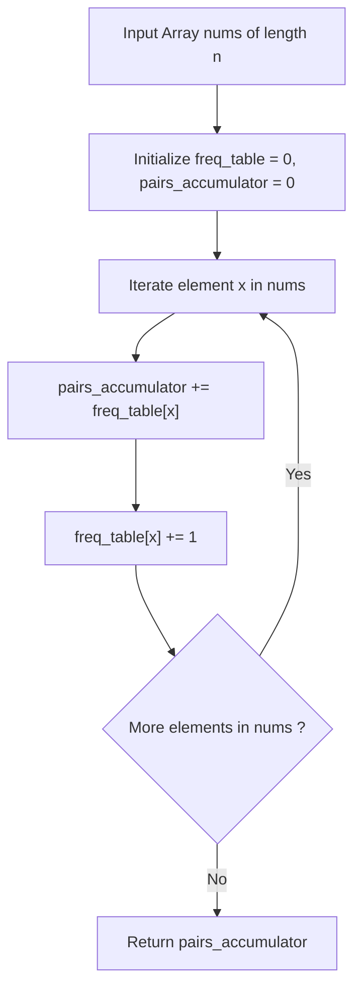

# Guided Example: Number of Good Pairs

## 1. Instance & Teaching Goal

We are given an array of integers:
$$\text{nums} = [1, 2, 3, 1, 1, 3]$$

Our teaching goal is to calculate the total number of "good pairs", defined as index pairs $(i, j)$ such that $0 \le i < j < n$ and $\text{nums}[i] = \text{nums}[j]$. We contrast the quadratic pairwise comparison method with the optimal linear streaming frequency accumulation technique, proving the equivalence of cumulative incremental pairing and the combinatorial combination formula $\binom{c}{2}$.

## 2. Conceptual Foundation & Invariants

A pair $(i, j)$ satisfies the good pair definition if and only if both indices contain identical values and the first precedes the second.
1. **Combinatorial Frequency View**:
   Suppose a value $v$ appears $c$ times across the entire array.
   Any two distinct positions among these $c$ occurrences form a unique ordered pair $(i, j)$ with $i < j$.
   The total number of good pairs formed by value $v$ is given by the binomial coefficient:
   $$\binom{c}{2} = \frac{c(c - 1)}{2}$$
   Summing over all distinct values in the array yields:
   $$\text{Total Pairs} = \sum_{v \in \text{distinct}} \frac{c_v(c_v - 1)}{2}$$
2. **Streaming Online Accumulator View**:
   Instead of a two-pass algorithm (counting frequencies first, then summing combinations), we can compute the sum in a single streaming pass.
   As we scan element $x$ at index $j$:
   - Let $\text{count}[x]$ denote the number of times $x$ has appeared at prior indices $i < j$.
   - Element $x$ at position $j$ forms a good pair with each of those $\text{count}[x]$ prior occurrences.
   - We increment the running answer by $\text{count}[x]$, then increment $\text{count}[x]$ by $1$.
   - By the identity:
     $$\sum_{k=0}^{c-1} k = 0 + 1 + 2 + \dots + (c - 1) = \frac{c(c - 1)}{2}$$
     the streaming sum matches the binomial coefficient precisely.

```text
+-------------------------------------------------------------------------------+
|                       STREAMING FREQUENCY ACCUMULATION                        |
|                                                                               |
|  Array: [ 1,  2,  3,  1,  1,  3 ]                                             |
|           ^   ^   ^   ^   ^   ^                                               |
|  x = 1:  Prior count = 0 -> ans += 0 -> count[1] becomes 1                    |
|  x = 2:  Prior count = 0 -> ans += 0 -> count[2] becomes 1                    |
|  x = 3:  Prior count = 0 -> ans += 0 -> count[3] becomes 1                    |
|  x = 1:  Prior count = 1 -> ans += 1 -> count[1] becomes 2  (Pair: 0, 3)      |
|  x = 1:  Prior count = 2 -> ans += 2 -> count[1] becomes 3  (Pairs: 0,4; 3,4) |
|  x = 3:  Prior count = 1 -> ans += 1 -> count[3] becomes 2  (Pair: 2, 5)      |
|                                                                               |
|  Final Total Pairs: 0 + 0 + 0 + 1 + 2 + 1 = 4                                 |
+-------------------------------------------------------------------------------+
```

The algorithm maintains the following state variables:

| State Variable | Domain | Initial Value | Transition / Role |
|---|---|---|---|
| `scan_cursor` | Integer $\in [0, n-1]$ | $0$ | Current index $j$ scanning through `nums`. |
| `active_val` | Integer $\in [1, 100]$ | $\text{nums}[0]$ | Value of the element $\text{nums}[j]$ being evaluated. |
| `freq_table` | Hash map or array of size $101$ | All zeros | Tracks cumulative frequency $\text{count}[v]$ of elements seen so far. |
| `pairs_accumulator` | Integer $\ge 0$ | $0$ | Running total of good pairs discovered so far. |

> [!IMPORTANT]
> **Incremental Pairing Invariant**: When visiting the $k$-th occurrence of value $x$ (where $k-1$ occurrences were already processed), exactly $k-1$ new good pairs are introduced, each terminating at current index $j$.



## 3. Step-by-Step Worked Execution

We walk through the representative instance $\text{nums} = [1, 2, 3, 1, 1, 3]$ with $n = 6$.

### Step 1: Index $j = 0$, Value $x = 1$
- Prior occurrences in `freq_table`: $\text{count}[1] = 0$.
- New pairs created: $0$.
- Update running total: $\text{pairs\_accumulator} = 0 + 0 = 0$.
- Increment frequency: $\text{count}[1] \leftarrow 1$.

### Step 2: Index $j = 1$, Value $x = 2$
- Prior occurrences in `freq_table`: $\text{count}[2] = 0$.
- New pairs created: $0$.
- Update running total: $\text{pairs\_accumulator} = 0 + 0 = 0$.
- Increment frequency: $\text{count}[2] \leftarrow 1$.

### Step 3: Index $j = 2$, Value $x = 3$
- Prior occurrences in `freq_table`: $\text{count}[3] = 0$.
- New pairs created: $0$.
- Update running total: $\text{pairs\_accumulator} = 0 + 0 = 0$.
- Increment frequency: $\text{count}[3] \leftarrow 1$.

### Step 4: Index $j = 3$, Value $x = 1$
- Prior occurrences in `freq_table`: $\text{count}[1] = 1$ (from index $0$).
- New pair created: $(0, 3)$.
- Update running total: $\text{pairs\_accumulator} = 0 + 1 = 1$.
- Increment frequency: $\text{count}[1] \leftarrow 2$.

### Step 5: Index $j = 4$, Value $x = 1$
- Prior occurrences in `freq_table`: $\text{count}[1] = 2$ (from indices $0$ and $3$).
- New pairs created: $(0, 4)$ and $(3, 4)$.
- Update running total: $\text{pairs\_accumulator} = 1 + 2 = 3$.
- Increment frequency: $\text{count}[1] \leftarrow 3$.

### Step 6: Index $j = 5$, Value $x = 3$
- Prior occurrences in `freq_table`: $\text{count}[3] = 1$ (from index $2$).
- New pair created: $(2, 5)$.
- Update running total: $\text{pairs\_accumulator} = 3 + 1 = 4$.
- Increment frequency: $\text{count}[3] \leftarrow 2$.

All elements have been processed. Total good pairs discovered: $4$.

## 4. Complete Execution Trace

We collect the complete streaming step trace below.

| Step $j$ | Element $\text{nums}[j]$ | Prior Frequency $\text{count}[x]$ | Pairs Added to Accumulator | Specific Pairs Formed | Updated $\text{count}[x]$ | Running Total Pairs |
|---|---|---|---|---|---|---|
| $0$ | $1$ | $0$ | $0$ | None | $1$ | $0$ |
| $1$ | $2$ | $0$ | $0$ | None | $1$ | $0$ |
| $2$ | $3$ | $0$ | $0$ | None | $1$ | $0$ |
| $3$ | $1$ | $1$ | $+1$ | $(0, 3)$ | $2$ | $1$ |
| $4$ | $1$ | $2$ | $+2$ | $(0, 4), (3, 4)$ | $3$ | $3$ |
| $5$ | $3$ | $1$ | $+1$ | $(2, 5)$ | $2$ | **$4$** |

### Combinatorial Verification

Using global frequencies:
- Value $1$: occurs $c_1 = 3$ times $\implies \binom{3}{2} = \frac{3 \times 2}{2} = 3$ pairs.
- Value $2$: occurs $c_2 = 1$ time $\implies \binom{1}{2} = \frac{1 \times 0}{2} = 0$ pairs.
- Value $3$: occurs $c_3 = 2$ times $\implies \binom{2}{2} = \frac{2 \times 1}{2} = 1$ pair.
- Total $= 3 + 0 + 1 = 4$.
The combinatorial tally identically confirms the streaming result.

## 5. Algorithmic Correctness

### Soundness

Every increment to $\text{pairs\_accumulator}$ at step $j$ corresponds to pairing the current index $j$ with a previously observed index $i < j$ where $\text{nums}[i] = \text{nums}[j]$.
Since $\text{count}[x]$ strictly counts indices $i < j$ with $\text{nums}[i] = x$, each of the $\text{count}[x]$ pairs $(i, j)$ satisfies $i < j$ and $\text{nums}[i] = \text{nums}[j]$, making it a valid good pair.
Because the second element of the pair is fixed to the current index $j$, pairs formed at step $j$ have distinct right endpoints from pairs formed at any step $j' \ne j$, guaranteeing zero duplicate pairs.

### Completeness

Suppose $(i, j)$ is any arbitrary good pair in the array, so $i < j$ and $\text{nums}[i] = \text{nums}[j] = x$.
When the loop reaches index $j$, index $i$ has already been processed because $i < j$.
Index $i$ contributed $+1$ to $\text{count}[x]$.
Hence, the occurrence at index $i$ is counted in $\text{count}[x]$ when index $j$ is evaluated.
Summing across all $j \in [0, n-1]$ ensures every valid pair $(i, j)$ is counted exactly once, proving completeness.

## 6. Traps This Instance Exposes

- **Double-Counting by Unordered Iteration**: Enumerating all pairs $(i, j)$ with $i \ne j$ without enforcing $i < j$ counts both $(i, j)$ and $(j, i)$, producing double the true answer unless divided by 2.
- **Self-Pairing Error**: Including $i = j$ when scanning without checking $i < j$ treats an element as a good pair with itself.
- **Frequency Update Before Accumulation**: Executing `count[x] += 1` before `ans += count[x]` includes self-pairing in the running count, adding $1$ extra pair on every element.
- **Integer Overflow on Large Inputs**: Although $n \le 100$ in this problem (yielding at most $\binom{100}{2} = 4,950$ pairs), for larger constraints like $n = 10^5$, an array of all identical elements yields $\approx 5 \times 10^9$ pairs, requiring a 64-bit integer to prevent overflow.

## 7. Complexity Derivation

### Time Complexity

- **Single Pass**: The algorithm iterates through the array of length $n$ once.
- **Lookup and Update**: Checking and incrementing the frequency table (either a direct fixed array of size $101$ or a hash map) takes $\mathcal{O}(1)$ time per element.
- Total time complexity is strictly $\mathcal{O}(n)$, an optimal improvement over naive $\mathcal{O}(n^2)$ pairwise checking.

### Auxiliary Space Complexity

- The frequency table stores counts for unique values.
- With constraints $\text{nums}[i] \le 100$, an array of size $101$ consumes $\mathcal{O}(1)$ auxiliary space.
- In general, with arbitrary values, a hash map takes at most $\mathcal{O}(\min(n, U))$ space, where $U$ is the number of unique elements.
- Auxiliary space complexity is $\mathcal{O}(1)$ (bounded by $101$ entries).
