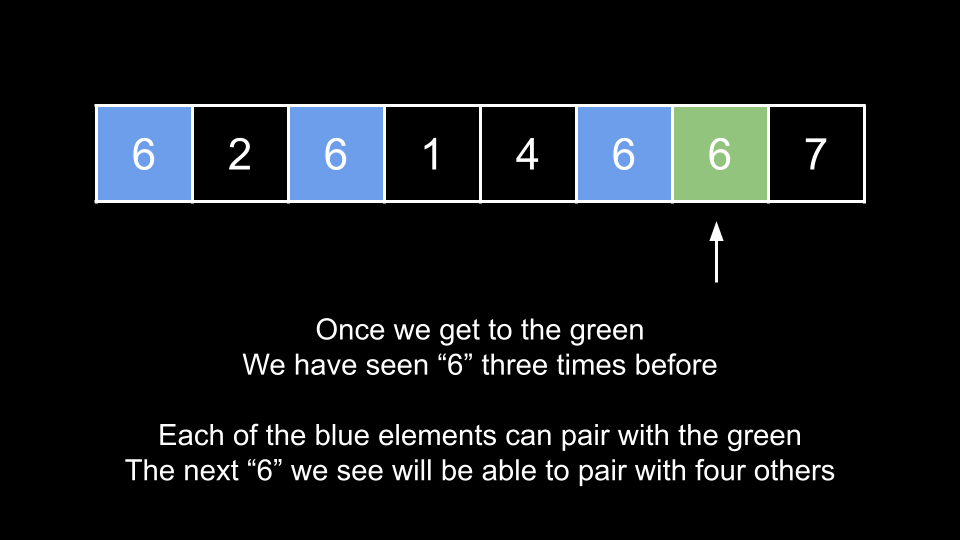

[TOC]

## Solution

---

### Approach 1: Check All Pairs

**Intuition**

The problem description defines a pair `(i, j)` as needing to have `i < j`. We can simply check all these pairs and count the number of pairs where $\text{nums}[i] = \text{nums}[j]$.

Iterate `i` over the indices of `nums`. For each `i`, iterate over all `j` greater than `i`. If the numbers at the indices match, increment the answer.

**Algorithm**

1. Initialize $ans = 0$.
2. Iterate `i` from `0` until `nums.length`:
- Iterate `j` from $i + 1$ until `nums.length`:
- If $\text{nums}[i] = \text{nums}[j]$, increment `ans`.
3. Return `ans`.

**Implementation**

```python
class Solution:
    def numIdenticalPairs(self, nums: List[int]) -> int:
        ans = 0
        for i in range(len(nums)):
            for j in range(i + 1, len(nums)):
                if nums[i] == nums[j]:
                    ans += 1

        return ans
```

**Complexity Analysis**

Given $n$ as the length of `nums`,

* Time complexity: $O(n^2)$

    We have a nested loop over the length of the input. The total iterations is 1 + 2 + 3 + 4 + ... + n, which is the partial sum of <a href="https://en.wikipedia.org/wiki/1_%2B_2_%2B_3_%2B_4_%2B_%E2%8B%AF#Partial_sums" target="_blank">this series</a>, which is equal to $\frac{n \cdot (n + 1)}{2}$ = $\frac{n^2 + n}{2}$. In big O, this is $O(n^2)$ because the addition term in the numerator and the constant term in the denominator are both ignored.

* Space complexity: $O(1)$

    We aren't using any extra space except for a few integers.

<br/>

---

### Approach 2: Hash Map

**Intuition**

We can improve our performance by using a hash map to count the frequency of the encountered numbers during the traversal.

Let's say that we are iterating over the input, and we encounter a number $x = 6$. We also know that we have seen `6` three times before the current index. The current `6` could pair with any of the previous three to form a good pair.

In general, whenever we encounter a number, it can form `k` good pairs with previously traversed numbers, where `k` is the number of times we have seen the number previously.

Different from approach 1, while this approach doesn't track the indices of each number, we keep a count of their occurrences. This ensures that all good pairs are considered, and because the counts of each number are accumulated as it's traversed, it guarantees that good pairs are counted only once. This way, we avoid both undercounting and overcounting.


<br>

**Algorithm**

1. Initialize $ans = 0$ and a hash map `counts`.
2. Iterate over the input. For each `num`:
- Increment `ans` by $\text{counts}[num]$.
- Increment $\text{counts}[num]$.
3. Return `ans`.

**Implementation**

```python
class Solution:
    def numIdenticalPairs(self, nums: List[int]) -> int:
        counts = defaultdict(int)
        ans = 0

        for num in nums:
            ans += counts[num]
            counts[num] += 1

        return ans
```

**Complexity Analysis**

Given $n$ as the length of `nums`,

* Time complexity: $O(n)$

    We iterate over the input once. At each iteration, we perform $O(1)$ work since hash map operations run in constant time.

* Space complexity: $O(n)$

    In the worst case, the array contains at most $n$ unique numbers, then `counts` will grow to a size of $n$.

<br/>

---