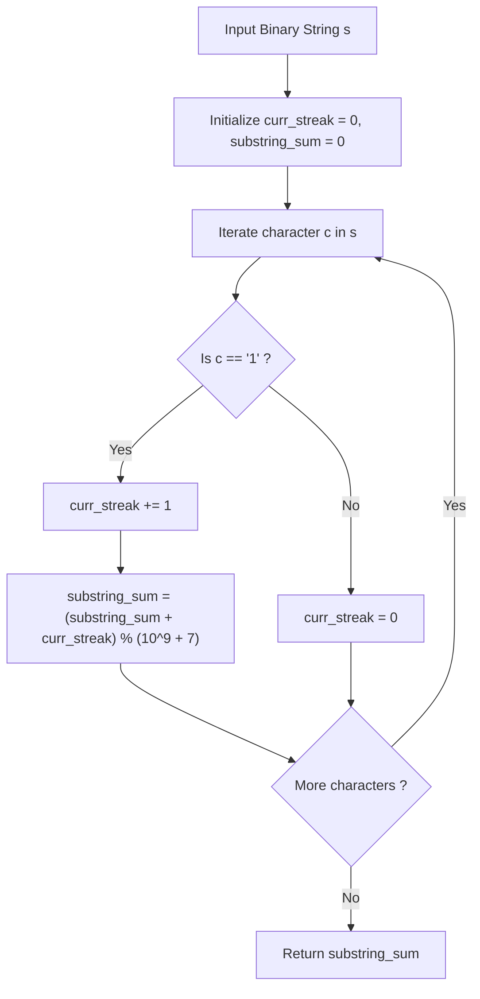

# Guided Example: Number of Substrings With Only 1s

## 1. Instance & Teaching Goal

We are given a binary string of length $n = 7$:
$$s = \text{"0110111"}$$

Our teaching goal is to compute the total number of non-empty substrings composed exclusively of character `'1'`, returning the result modulo $10^9 + 7$. We examine the mathematical decomposition of contiguous monochromatic blocks, proving why a streak of length $L$ yields exactly $\frac{L(L+1)}{2}$ valid substrings, and trace both the block-based combinatorial aggregation and the streaming single-pass accumulator.

## 2. Conceptual Foundation & Invariants

A substring of $s$ is defined by a pair of boundary indices $[l, r]$ ($0 \le l \le r < n$).
1. **Monochromatic Block Decomposition**:
   A binary string naturally decomposes into alternating maximal contiguous runs of `'0'`s and `'1'`s.
   Substrings consisting only of `'1'`s cannot cross any `'0'` character.
   Therefore, each maximal contiguous segment of `'1'`s of length $L$ contributes independently to the total count.
2. **Combinatorial Substring Count**:
   Within a contiguous run of $L$ consecutive `'1'`s:
   - There are $L$ substrings of length $1$.
   - There are $L - 1$ substrings of length $2$.
   - $\dots$
   - There is $1$ substring of length $L$.
   Summing across all permissible lengths yields the $L$-th triangular number:
   $$T(L) = \sum_{k=1}^{L} (L - k + 1) = \sum_{j=1}^{L} j = \frac{L(L + 1)}{2}$$
3. **Streaming Single-Pass Recurrence**:
   Alternatively, we can track the count dynamically as characters arrive:
   - Let `cur` denote the length of the uninterrupted streak of `'1'`s terminating at the active index.
   - When encountering `'0'`: `cur` resets to $0$.
   - When encountering `'1'`: `cur` increments by $1$.
   - The current `'1'` at position $i$ forms the right endpoint of exactly `cur` valid substrings (spanning lengths $1, 2, \dots, \text{cur}$).
   - We accumulate `cur` into `ans` at each step modulo $10^9 + 7$.

```text
+-------------------------------------------------------------------------------+
|                       STREAK ACCUMULATION & SUBSTRING COUNT                   |
|                                                                               |
|  String:    0   1   1   0   1   1   1                                         |
|             |   |   |   |   |   |   |                                         |
|  Streak:    0   1   2   0   1   2   3                                         |
|  Added:    +0  +1  +2  +0  +1  +2  +3                                         |
|                                                                               |
|  Running:   0   1   3   3   4   6   9  (mod 10^9 + 7)                         |
|                                                                               |
|  Block Decomposition:                                                         |
|    Block 1: "11"  (L = 2) -> 2 * 3 / 2 = 3 substrings                         |
|    Block 2: "111" (L = 3) -> 3 * 4 / 2 = 6 substrings                         |
|    Total Substrings: 3 + 6 = 9                                                |
+-------------------------------------------------------------------------------+
```

The algorithm maintains the following state variables:

| State Variable | Domain | Initial Value | Transition / Role |
|---|---|---|---|
| `char_index` | Integer $\in [0, n-1]$ | $0$ | Scanning pointer traversing string $s$. |
| `active_char` | Character $\in \{'0', '1'\}$ | $s[0]$ | Current character evaluated. |
| `curr_streak` | Integer $\ge 0$ | $0$ | Length of the active contiguous run of `'1'`s ending at `char_index`. |
| `substring_sum` | Integer $\ge 0$ | $0$ | Running cumulative count of all valid substrings modulo $10^9 + 7$. |

> [!IMPORTANT]
> **Subproblem Independence Invariant**: Because a substring cannot contain character `'0'`, valid substrings from different maximal blocks of `'1'`s are mutually disjoint. The global count is strictly the sum of counts per block.



## 3. Step-by-Step Worked Execution

We walk through the representative instance $s = \text{"0110111"}$ of length $n = 7$.
The modulus is $M = 10^9 + 7$.

### Step 1: Index $0$, Character `'0'`
- The character is `'0'`.
- Streak breaks: $\text{curr\_streak} = 0$.
- Contribution: $+0$.
- Running sum: $\text{substring\_sum} = 0$.

### Step 2: Index $1$, Character `'1'`
- The character is `'1'`.
- Streak extends: $\text{curr\_streak} = 0 + 1 = 1$.
- New substrings ending at index 1: $[1 \dots 1]$ (length 1).
- Contribution: $+1$.
- Running sum: $\text{substring\_sum} = 0 + 1 = 1$.

### Step 3: Index $2$, Character `'1'`
- The character is `'1'`.
- Streak extends: $\text{curr\_streak} = 1 + 1 = 2$.
- New substrings ending at index 2: $[2 \dots 2]$ (length 1), $[1 \dots 2]$ (length 2).
- Contribution: $+2$.
- Running sum: $\text{substring\_sum} = 1 + 2 = 3$.

### Step 4: Index $3$, Character `'0'`
- The character is `'0'`.
- Streak breaks: $\text{curr\_streak} = 0$.
- Contribution: $+0$.
- Running sum: $\text{substring\_sum} = 3$.

### Step 5: Index $4$, Character `'1'`
- The character is `'1'`.
- Streak extends: $\text{curr\_streak} = 0 + 1 = 1$.
- New substrings ending at index 4: $[4 \dots 4]$ (length 1).
- Contribution: $+1$.
- Running sum: $\text{substring\_sum} = 3 + 1 = 4$.

### Step 6: Index $5$, Character `'1'`
- The character is `'1'`.
- Streak extends: $\text{curr\_streak} = 1 + 1 = 2$.
- New substrings ending at index 5: $[5 \dots 5]$ (length 1), $[4 \dots 5]$ (length 2).
- Contribution: $+2$.
- Running sum: $\text{substring\_sum} = 4 + 2 = 6$.

### Step 7: Index $6$, Character `'1'`
- The character is `'1'`.
- Streak extends: $\text{curr\_streak} = 2 + 1 = 3$.
- New substrings ending at index 6: $[6 \dots 6]$ (length 1), $[5 \dots 6]$ (length 2), $[4 \dots 6]$ (length 3).
- Contribution: $+3$.
- Running sum: $\text{substring\_sum} = 6 + 3 = 9$.

Traversed entire string. Total valid substrings: $9$.

## 4. Complete Execution Trace

We collect the character transitions and cumulative progression in the execution trace table below.

| Index $i$ | Character $s[i]$ | Active Run Type | Updated `curr_streak` | Substrings Ending at $i$ | Incremental Addition | Cumulative Total ($\bmod 10^9+7$) |
|---|---|---|---|---|---|---|
| $0$ | `'0'` | Reset run | $0$ | None | $+0$ | $0$ |
| $1$ | `'1'` | Block 1 start | $1$ | `"1"` (at 1) | $+1$ | $1$ |
| $2$ | `'1'` | Block 1 continuation | $2$ | `"1"` (at 2), `"11"` (at 1..2) | $+2$ | $3$ |
| $3$ | `'0'` | Reset run | $0$ | None | $+0$ | $3$ |
| $4$ | `'1'` | Block 2 start | $1$ | `"1"` (at 4) | $+1$ | $4$ |
| $5$ | `'1'` | Block 2 continuation | $2$ | `"1"` (at 5), `"11"` (at 4..5) | $+2$ | $6$ |
| $6$ | `'1'` | Block 2 continuation | $3$ | `"1"` (at 6), `"11"` (at 5..6), `"111"` (at 4..6) | $+3$ | **$9$** |

### Breakdown by Length

The $9$ identified substrings consist of:
- Substring `"1"`: $5$ occurrences (indices $1, 2, 4, 5, 6$)
- Substring `"11"`: $3$ occurrences (indices $1\dots 2, 4\dots 5, 5\dots 6$)
- Substring `"111"`: $1$ occurrence (indices $4\dots 6$)
Total count: $5 + 3 + 1 = 9$.

## 5. Algorithmic Correctness

### Soundness

Every substring counted is of the form $s[j \dots i]$ where $i - \text{curr\_streak} < j \le i$.
By definition of $\text{curr\_streak}$, every character from index $i - \text{curr\_streak} + 1$ up to $i$ is strictly `'1'`.
Thus, for any $j$ in this range, the substring $s[j \dots i]$ consists entirely of `'1'`s.
Because each valid substring has a unique right endpoint $i$ and a unique left endpoint $j$, no substring is counted twice, ensuring soundness.

### Completeness

Suppose $s[a \dots b]$ is any non-empty substring containing only `'1'`s.
Then all characters from $a$ to $b$ are `'1'`.
When the algorithm scans index $b$, the contiguous streak of `'1'`s ending at $b$ must have length at least $b - a + 1$.
Therefore, $\text{curr\_streak} \ge b - a + 1$.
The loop increments the accumulator by $\text{curr\_streak}$, which accounts for all lengths from $1$ up to $\text{curr\_streak}$, including length $b - a + 1$.
Hence, every valid substring is accounted for, ensuring completeness.

## 6. Traps This Instance Exposes

- **Modulo Application Delay**: Adding the closed-form triangular counts $\frac{L(L+1)}{2}$ at the end of each run without taking modulo $10^9 + 7$. For a string of $10^5$ consecutive `'1'`s, $L = 10^5$, and $\frac{L(L+1)}{2} \approx 5 \times 10^9$, exceeding standard 32-bit signed integer capacity. Modulo must be applied at each addition.
- **Missing Final Streak Flush**: In algorithms that accumulate streak length $L$ and only compute $\frac{L(L+1)}{2}$ upon encountering a `'0'`, forgetting to process the final streak if the string ends with `'1'` (e.g. $s = \text{"111"}$) completely drops the largest block. The streaming accumulator avoids this trap entirely by accumulating on the fly.
- **Substring Generation Quadratic Time**: Storing or generating explicit substring slices $s[j:i+1]$ creates $\mathcal{O}(n^2)$ time and space bottlenecks. We only need the scalar count.

## 7. Complexity Derivation

### Time Complexity

- **Single Linear Scan**: The algorithm iterates through the string of length $n$ exactly once.
- **Constant Time Per Character**: Each character triggers an $O(1)$ conditional check, an integer increment, and an integer addition with modulo.
- Total time complexity is strictly $\mathcal{O}(n)$, which is optimal since reading the input takes $\Omega(n)$ time.

### Auxiliary Space Complexity

- The algorithm maintains two scalar integer registers (`cur`, `ans`) and the modulus constant.
- No dynamic memory, auxiliary buffers, or recursion stacks are allocated.
- Auxiliary space complexity is strictly $\mathcal{O}(1)$.
