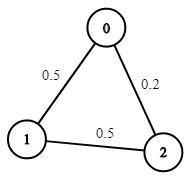
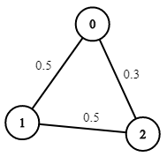
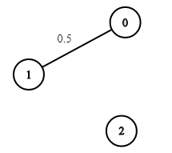

### 1. Description

You are given an undirected weighted graph of `n` nodes (0-indexed), represented by an edge list where $\text{edges}[i] = [a, b]$ is an undirected edge connecting the nodes `a` and `b` with a probability of success of traversing that edge $\text{succProb}[i]$.

Given two nodes `start` and `end`, find the path with the maximum probability of success to go from `start` to `end` and return its success probability.

If there is no path from `start` to `end`, **return 0**. Your answer will be accepted if it differs from the correct answer by at most **1e-5**.

### 2. Function Contract

**Inputs**

- `n`: Input parameter (`int`).
- `edges`: Input parameter (`List[List[int]]`).
- `succProb`: Input parameter (`List[float]`).
- `start_node`: Input parameter (`int`).
- `end_node`: Input parameter (`int`).

**Return value**

- Returns `float`.

### 3. Examples

#### Example 1

**

**

- **Input:** $n = 3, edges = [[0,1],[1,2],[0,2]], succProb = [0.5,0.5,0.2], start = 0, end = 2$
- **Output:** `0.25000`
- **Explanation:** There are two paths from start to end, one having a probability of success = 0.2 and the other has 0.5 * 0.5 = 0.25.

#### Example 2

**

**

- **Input:** $n = 3, edges = [[0,1],[1,2],[0,2]], succProb = [0.5,0.5,0.3], start = 0, end = 2$
- **Output:** `0.30000`

#### Example 3

**

**

- **Input:** $n = 3, edges = [[0,1]], succProb = [0.5], start = 0, end = 2$
- **Output:** `0.00000`
- **Explanation:** There is no path between 0 and 2.

### 4. Constraints

- $2 \le n \le 10^{4}$

- $0 \le start, end < n$

- $start \neq end$

- $0 \le a, b < n$

- $a \neq b$

- $0 \le \text{succProb.length} = \text{edges.length} \le 2*10^{4}$

- $0 \le \text{succProb}[i] \le 1$

- There is at most one edge between every two nodes.
