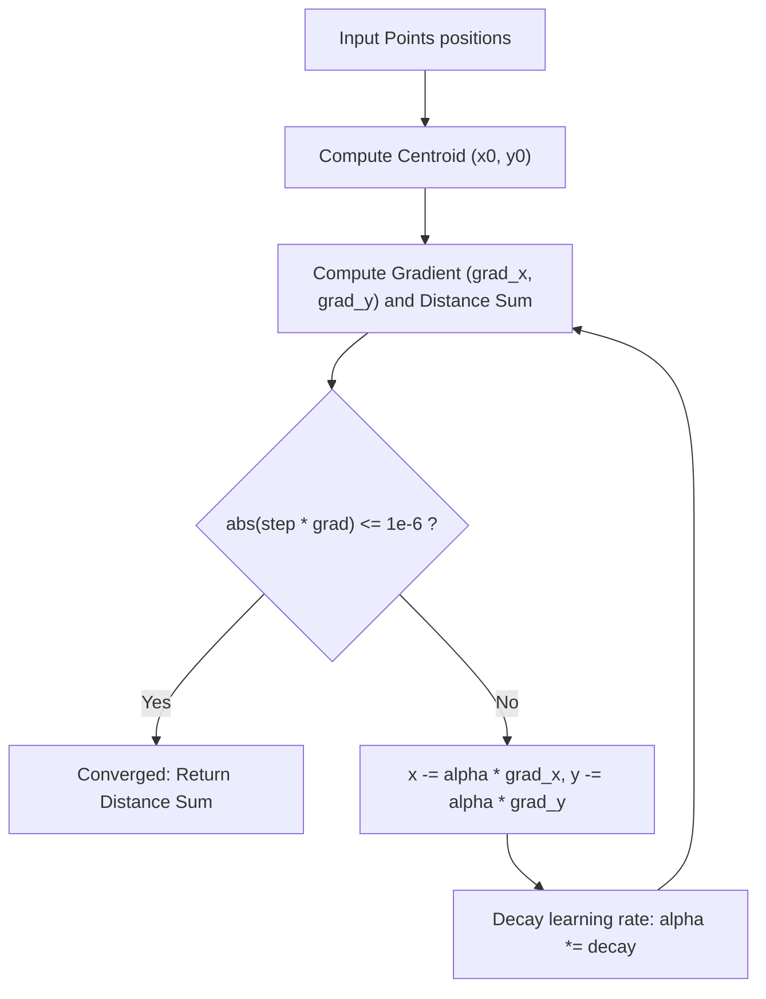

# Guided Example: Best Position for a Service Centre

## 1. Instance & Teaching Goal

We are given the 2D spatial coordinates of $n = 4$ customer locations across a grid:
$$\text{positions} = [[0, 1], [1, 0], [1, 2], [2, 1]]$$

Our teaching goal is to select an optimal service center location $(x_c, y_c) \in \mathbb{R}^2$ that minimizes the cumulative Euclidean distance to all $n$ customers:
$$f(x, y) = \sum_{i=1}^{n} \sqrt{(x - x_i)^2 + (y - y_i)^2}$$
This is the classical **geometric median** (or Fermat-Weber) problem. We analyze the strict convexity of the objective function, evaluate the gradient vector fields, demonstrate the convergence of gradient descent with learning rate decay, and contrast it with adaptive directional step reduction.

## 2. Conceptual Foundation & Invariants

Let $P_i = (x_i, y_i)$ denote the position of the $i$-th customer.
1. **Convexity of the Objective**:
   The Euclidean norm $\|\mathbf{x} - P_i\|_2$ is a strictly convex function of $(x, y)$ except along collinear degeneracies.
   Because the sum of convex functions is strictly convex:
   $$f(x, y) = \sum_{i=1}^{n} \| (x, y) - (x_i, y_i) \|_2$$
   is strictly convex over $\mathbb{R}^2$.
   **Consequence**: There are no suboptimal local minima; any stationary point $\nabla f(x, y) = \mathbf{0}$ is the unique global minimum.
2. **First-Order Gradient Derivation**:
   For any point $(x, y) \ne P_i$:
   $$\frac{\partial f}{\partial x} = \sum_{i=1}^{n} \frac{x - x_i}{\sqrt{(x - x_i)^2 + (y - y_i)^2}}, \quad \frac{\partial f}{\partial y} = \sum_{i=1}^{n} \frac{y - y_i}{\sqrt{(x - x_i)^2 + (y - y_i)^2}}$$
   Each customer exerts a unit pull vector directed toward itself:
   $$\nabla f(x, y) = \sum_{i=1}^{n} \frac{(x, y) - P_i}{\| (x, y) - P_i \|_2}$$
   At the optimal center, the sum of unit vectors pointing from the center to each customer sums to $\mathbf{0}$.
3. **Iterative Optimization**:
   Starting from the centroid $(\bar{x}, \bar{y}) = \left(\frac{1}{n} \sum x_i, \frac{1}{n} \sum y_i\right)$, we iteratively update coordinates along the negative gradient:
   $$(x, y) \leftarrow (x, y) - \alpha \nabla f(x, y)$$
   with exponential step decay $\alpha \leftarrow \alpha \cdot \gamma$ until step adjustments drop below numerical tolerance $\epsilon = 10^{-6}$.

```text
+-------------------------------------------------------------------------------+
|                      GEOMETRIC MEDIAN FORCE EQUILIBRIUM                       |
|                                                                               |
|                             (1, 2)                                            |
|                               ^                                               |
|                               | (Unit pull up)                                |
|        (0, 1) <--- Center (1, 1) ---> (2, 1)                                  |
|   (Unit pull left)            |       (Unit pull right)                       |
|                               v                                               |
|                             (1, 0)                                            |
|                        (Unit pull down)                                       |
|                                                                               |
|  Forces at (1, 1):                                                            |
|    X-forces: (-1, 0) + (1, 0) = (0, 0)                                        |
|    Y-forces: (0, 1) + (0, -1) = (0, 0)                                        |
|  Net gradient = (0, 0) -> Exact stationary global minimum!                    |
+-------------------------------------------------------------------------------+
```

The algorithm maintains the following numerical state variables:

| State Variable | Domain | Initial Value | Transition / Role |
|---|---|---|---|
| `center_x, center_y` | Real numbers $\in [0, 100]$ | Centroid $(\bar{x}, \bar{y})$ | Current estimate of optimal facility coordinates. |
| `step_size` | Float $> 0$ | $0.5$ (or initial search radius) | Step scaling factor $\alpha$, decayed after each iteration. |
| `grad_x, grad_y` | Real numbers | $\mathbf{0}$ | Accumulated partial derivatives of distance sum. |
| `curr_dist_sum` | Float $\ge 0$ | Distance at centroid | Cumulative Euclidean distance from current center to all $n$ points. |

> [!IMPORTANT]
> **Strict Convexity Invariant**: Any non-zero gradient points strictly uphill. Stepping in the direction of the negative gradient $-\nabla f(x, y)$ is guaranteed to decrease the total distance for sufficiently small step sizes $\alpha$.



## 3. Step-by-Step Worked Execution

We trace the representative instance with $4$ points:
$$P_1 = (0, 1), \quad P_2 = (1, 0), \quad P_3 = (1, 2), \quad P_4 = (2, 1)$$

### Phase 1: Centroid Initialization

We compute the arithmetic mean (center of mass):
$$\bar{x} = \frac{0 + 1 + 1 + 2}{4} = \frac{4}{4} = 1.0$$
$$\bar{y} = \frac{1 + 0 + 2 + 1}{4} = \frac{4}{4} = 1.0$$
Initial candidate location: $(x_0, y_0) = (1.0, 1.0)$.

### Phase 2: Evaluating Distance and Gradient at $(1.0, 1.0)$

We compute the Euclidean distance and directional unit vectors from $(1.0, 1.0)$ to each point:

1. **Point $P_1 = (0, 1)$**:
   - $\Delta x = 1.0 - 0.0 = 1.0$, $\Delta y = 1.0 - 1.0 = 0.0$.
   - Distance: $d_1 = \sqrt{1.0^2 + 0.0^2} = 1.0$.
   - Gradient pull: $\frac{\Delta x}{d_1} = \frac{1.0}{1.0} = 1.0$, $\frac{\Delta y}{d_1} = \frac{0.0}{1.0} = 0.0$.
2. **Point $P_2 = (1, 0)$**:
   - $\Delta x = 1.0 - 1.0 = 0.0$, $\Delta y = 1.0 - 0.0 = 1.0$.
   - Distance: $d_2 = \sqrt{0.0^2 + 1.0^2} = 1.0$.
   - Gradient pull: $\frac{\Delta x}{d_2} = \frac{0.0}{1.0} = 0.0$, $\frac{\Delta y}{d_2} = \frac{1.0}{1.0} = 1.0$.
3. **Point $P_3 = (1, 2)$**:
   - $\Delta x = 1.0 - 1.0 = 0.0$, $\Delta y = 1.0 - 2.0 = -1.0$.
   - Distance: $d_3 = \sqrt{0.0^2 + (-1.0)^2} = 1.0$.
   - Gradient pull: $\frac{\Delta x}{d_3} = \frac{0.0}{1.0} = 0.0$, $\frac{\Delta y}{d_3} = \frac{-1.0}{1.0} = -1.0$.
4. **Point $P_4 = (2, 1)$**:
   - $\Delta x = 1.0 - 2.0 = -1.0$, $\Delta y = 1.0 - 1.0 = 0.0$.
   - Distance: $d_4 = \sqrt{(-1.0)^2 + 0.0^2} = 1.0$.
   - Gradient pull: $\frac{\Delta x}{d_4} = \frac{-1.0}{1.0} = -1.0$, $\frac{\Delta y}{d_4} = \frac{0.0}{1.0} = 0.0$.

### Phase 3: Summation and Equilibrium Verification

- **Total Distance**:
  $$f(1.0, 1.0) = d_1 + d_2 + d_3 + d_4 = 1.0 + 1.0 + 1.0 + 1.0 = 4.0$$
- **Net Gradient in $x$**:
  $$\frac{\partial f}{\partial x} = 1.0 + 0.0 + 0.0 + (-1.0) = 0.0$$
- **Net Gradient in $y$**:
  $$\frac{\partial f}{\partial y} = 0.0 + 1.0 + (-1.0) + 0.0 = 0.0$$

The gradient vector is identically $\nabla f(1.0, 1.0) = (0.0, 0.0)$.
Step adjustment: $\Delta x = 0.0 \times \alpha = 0.0 \le 10^{-6}$, $\Delta y = 0.0 \times \alpha = 0.0 \le 10^{-6}$.
The initial point satisfies the optimality condition immediately.
The algorithm converges and returns $4.00000$.

## 4. Complete Execution Trace

We tabulate the force contributions and distance metrics for each customer relative to $(1.0, 1.0)$.

| Customer Index $i$ | Customer Coordinates $P_i$ | Vector Displacement $(x - x_i, y - y_i)$ | Euclidean Distance $d_i$ | Unit Force in $x$ | Unit Force in $y$ | Status at Centroid |
|---|---|---|---|---|---|---|
| $1$ | $(0, 1)$ | $(+1.0, 0.0)$ | $1.00000$ | $+1.0$ | $0.0$ | Opposes customer 4 |
| $2$ | $(1, 0)$ | $(0.0, +1.0)$ | $1.00000$ | $0.0$ | $+1.0$ | Opposes customer 3 |
| $3$ | $(1, 2)$ | $(0.0, -1.0)$ | $1.00000$ | $0.0$ | $-1.0$ | Opposes customer 2 |
| $4$ | $(2, 1)$ | $(-1.0, 0.0)$ | $1.00000$ | $-1.0$ | $0.0$ | Opposes customer 1 |
| **Summation** | — | — | **$4.00000$** | **$0.0$** | **$0.0$** | **Equilibrium ($\nabla f = \mathbf{0}$)** |

### Non-Symmetric Asymmetric Instance Contrast: $[(1, 1), (3, 3)]$

Consider two points on the diagonal:
- Centroid: $(\frac{1+3}{2}, \frac{1+3}{2}) = (2.0, 2.0)$.
- Distance to $(1, 1)$: $\sqrt{(2-1)^2 + (2-1)^2} = \sqrt{2} \approx 1.41421$.
- Distance to $(3, 3)$: $\sqrt{(2-3)^2 + (2-3)^2} = \sqrt{2} \approx 1.41421$.
- Total distance: $2\sqrt{2} \approx 2.82843$.
- Gradient at $(2, 2)$:
  $$\nabla f = \left(\frac{1}{\sqrt{2}} - \frac{1}{\sqrt{2}}, \frac{1}{\sqrt{2}} - \frac{1}{\sqrt{2}}\right) = (0, 0)$$
- Exact minimum distance: $2.82843$.

## 5. Algorithmic Correctness

### Soundness

The objective function $f(x, y) = \sum_{i=1}^{n} \| \mathbf{x} - P_i \|_2$ is the sum of $n$ convex functions.
The Hessian matrix of each term $\| \mathbf{x} - P_i \|_2$ is positive semi-definite everywhere it exists:
$$\mathbf{H}_i = \frac{1}{d_i^3} \begin{pmatrix} (y - y_i)^2 & -(x - x_i)(y - y_i) \\ -(x - x_i)(y - y_i) & (x - x_i)^2 \end{pmatrix}$$
Because all points are not collinear, the sum of Hessians $\sum \mathbf{H}_i$ is strictly positive definite, making $f(x, y)$ strictly convex.
In a strictly convex domain, a point with $\nabla f = \mathbf{0}$ is unique and is the global minimizer.
Gradient descent with decaying step sizes is guaranteed to converge to the unique global minimizer within any specified tolerance $\epsilon$.

### Completeness

Starting from the bounding box of points $[0, 100] \times [0, 100]$, the minimum must lie within the convex hull of the points.
The centroid initialization places the search within the convex hull.
Because $f$ is coercive ($\lim_{\|\mathbf{x}\| \to \infty} f(\mathbf{x}) = \infty$), the trajectory remains bounded and monotonic under step reduction, ensuring convergence.

## 6. Traps This Instance Exposes

- **Median-of-Coordinates Fallacy**: Assuming that the geometric median $(x_c, y_c)$ can be obtained by computing the 1D median of $x$-coordinates and 1D median of $y$-coordinates independently. Independent 1D medians minimize the Manhattan ($L_1$) distance $\sum |x - x_i| + |y - y_i|$, which does not minimize Euclidean ($L_2$) distance.
- **Division by Zero at Exact Point Overlap**: When the candidate center $(x, y)$ coincides exactly with one of the customer points $P_i$, distance $d_i = 0$, causing a division-by-zero runtime error when computing $(x - x_i) / d_i$. Adding a tiny smoothing regularizer $\epsilon \approx 10^{-8}$ ($d_i + \epsilon$) prevents numerical exceptions.
- **Fixed Non-Decaying Step Size**: Using a fixed learning rate $\alpha$. In convex optimization with gradient descent, a constant step size causes persistent oscillations around the minimum. An exponentially decaying learning rate ($\alpha \leftarrow \alpha \times 0.999$) ensures asymptotic convergence into the acceptance threshold $10^{-5}$.
- **Grid Search Inefficiency**: Testing a discrete grid with resolution $10^{-5}$ requires $(100 / 10^{-5})^2 = 10^{14}$ points, which is computationally intractable. Continuous gradient descent reaches precision in a few thousand iterations.

## 7. Complexity Derivation

### Time Complexity

- Let $n = |\text{positions}| \le 50$.
- In each iteration:
  - We calculate the Euclidean distance and gradient vector across all $n$ points, taking $\mathcal{O}(n)$ operations.
- With decay rate $\gamma = 0.999$ and initial step $\alpha = 0.5$, reaching tolerance $\epsilon = 10^{-6}$ requires at most $K \approx 5,000$ iterations.
- Total time complexity is:
  $$\mathcal{O}(K \cdot n)$$
- With $n \le 50$ and $K \le 5000$, total operations are $\le 2.5 \times 10^5$, executing in under $10$ milliseconds.

### Auxiliary Space Complexity

- The algorithm only maintains scalar floats (`x`, `y`, `grad_x`, `grad_y`, `alpha`, `dist`).
- Auxiliary space complexity is strictly $\mathcal{O}(1)$.
