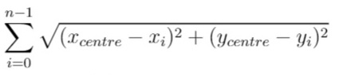
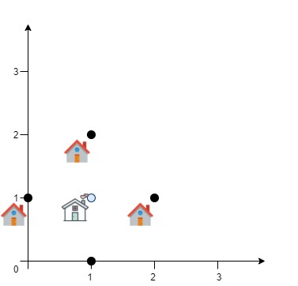
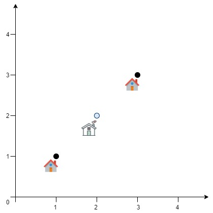

### 1. Description

A delivery company wants to build a new service center in a new city. The company knows the positions of all the customers in this city on a 2D-Map and wants to build the new center in a position such that **the sum of the euclidean distances to all customers is minimum**.

Given an array `positions` where $\text{positions}[i] = [x_{i}, y_{i}]$ is the position of the `ith` customer on the map, return *the minimum sum of the euclidean distances* to all customers.

In other words, you need to choose the position of the service center `[x_centre, y_centre]` such that the following formula is minimized:

Answers within $10^{-5}$ of the actual value will be accepted.

### 2. Function Contract

- `n`: Input parameter.
- Returns expected result.

### 3. Examples

#### Example 1

- **Input:** $positions = [[0,1],[1,0],[1,2],[2,1]]$
- **Output:** `4.00000`
- **Explanation:** As shown, you can see that choosing [x_centre, y_centre] = [1, 1] will make the distance to each customer = 1, the sum of all distances is 4 which is the minimum possible we can achieve.
#### Example 2

- **Input:** $positions = [[1,1],[3,3]]$
- **Output:** `2.82843`
- **Explanation:** The minimum possible sum of distances = sqrt(2) + sqrt(2) = 2.82843

### 4. Constraints

- $1 \le \text{positions.length} \le 50$

- $\text{positions}[i].length = 2$

- $0 \le x_{i}, y_{i} \le 100$