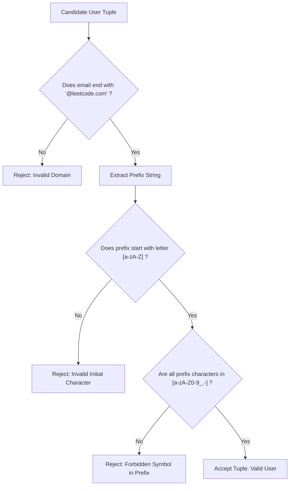

# Guided Example: Find Users With Valid E-Mails

## 1. Instance & Teaching Goal

We are presented with a user database containing accounts with varied email address formats:

```text
Table: Users
+---------+-----------+-------------------------+
| user_id | name      | mail                    |
+---------+-----------+-------------------------+
| 1       | Winston   | winston@leetcode.com    |
| 2       | Jonathan  | jonathanisgreat         |
| 3       | Annabelle | bella-@leetcode.com     |
| 4       | Sally     | sally.come@leetcode.com |
| 5       | Marwan    | quarz#2020@leetcode.com |
| 6       | David     | david69@gmail.com       |
| 7       | Shapiro   | .shapo@leetcode.com     |
+---------+-----------+-------------------------+
```

Our teaching goal is to extract all tuples belonging to users who possess a structurally valid email address according to the platform specification:
1. The prefix must begin with an alphabetic letter ($[a-zA-Z]$).
2. The remaining characters in the prefix may only contain letters, digits, underscores, periods, and hyphens ($[a-zA-Z0-9\_.-]$).
3. The domain must match exactly `@leetcode.com` in lowercase.

We formulate the validation rules using formal language regular expressions and relational selection algebra, tracing each account record against the lexical constraints.

## 2. Conceptual Foundation & Invariants

An email string $S$ is valid if and only if it is generated by the regular grammar:
$$S \in \mathcal{L}\left( [a-zA-Z][a-zA-Z0-9\_.-]^* \mathbin{\Vert} \text{"@leetcode.com"} \right)$$

1. **Structural Segmentation**:
   Every candidate string is divided into two distinct components by the final `@` delimiter:
   $$S = \text{prefix} \mathbin{\Vert} \text{"@"} \mathbin{\Vert} \text{domain}$$
2. **Prefix Lexical Constraints**:
   - Initial character: $\text{prefix}[0] \in \{'a' \dots 'z', 'A' \dots 'Z'\}$.
   - Suffix of prefix: for all $i \ge 1$, $\text{prefix}[i] \in \{'a' \dots 'z', 'A' \dots 'Z', '0' \dots '9', '\_', '.', '-'\}$.
   - Any character outside this allowed alphabet (such as `\#`, `!`, `$`, `\space`) immediately invalidates the prefix.
3. **Domain Literal Invariant**:
   - The domain portion must be character-for-character identical to `@leetcode.com`.
   - The check is case-sensitive: domains such as `@Leetcode.com` or `@LEETCODE.COM` fail validation.
4. **Relational Algebra Specification**:
   Let $\sigma_{\mathcal{R}}$ denote the relational selection operator with regular expression predicate $\mathcal{R}$:
   $$\text{Result} = \sigma_{\text{is\_valid}(\text{mail})}(\text{Users})$$
   where the selection predicate $\text{is\_valid}(s)$ evaluates whether string $s$ matches the pattern `^[a-zA-Z][a-zA-Z0-9_.-]*@leetcode\.com$`.

```text
+-------------------------------------------------------------------------------+
|                      EMAIL GRAMMAR VALIDATION SCHEMA                          |
|                                                                               |
|   ^[a-zA-Z]             [a-zA-Z0-9_.-]*              @leetcode\.com$          |
|   |                     |                            |                        |
|   +-> Must start with   +-> Allowed body characters  +-> Exact domain anchor  |
|       an English letter     (letters, digits, _, ., -)   (lowercase only)     |
|                                                                               |
|  Counter-Examples:                                                            |
|    - ".shapo@..."   -> Leading character is '.' (not a letter)                |
|    - "quarz#2020.." -> Character '#' is prohibited in prefix                  |
|    - "david69@g..." -> Domain is "@gmail.com" instead of "@leetcode.com"     |
|    - "jonathan..."  -> Missing '@' delimiter and domain                       |
+-------------------------------------------------------------------------------+
```

The evaluation maintains the following relational state attributes:

| Evaluation Component | Scope | Verification Rule | Invariant Property |
|---|---|---|---|
| Domain Suffix Anchor | End of string | Must match literal `@leetcode.com` | Prevents foreign or missing email domains. |
| Prefix Initial Token | First character | Must be in range $[a-zA-Z]$ | Prohibits digits or punctuation at start. |
| Prefix Body Alphabet | Positions $1 \dots k$ | Characters in $[a-zA-Z0-9\_.-]$ | Excludes special symbols like `\#`, `!`, `@`. |
| Relational Filter | Full `Users` relation | Retain tuple if and only if all hold | Preserves entire row schema `(user_id, name, mail)`. |

> [!IMPORTANT]
> **Domain Case Sensitivity Invariant**: The domain must match `@leetcode.com` in strictly lowercase form. In database engines with case-insensitive default collations, a binary collation cast must be enforced to reject uppercase variants like `@Leetcode.com`.



## 3. Step-by-Step Worked Execution

We walk through each of the 7 account records from the sample database.

### Account 1: User 1 (Winston)
- Email: `winston@leetcode.com`
- Domain check: ends with `@leetcode.com`. (Passes).
- Prefix extraction: `"winston"`.
- Initial character: `'w'` is an alphabetic letter. (Passes).
- Prefix body: `'i', 'n', 's', 't', 'o', 'n'` are all valid letters. (Passes).
- Verdict: **Valid**.

---

### Account 2: User 2 (Jonathan)
- Email: `jonathanisgreat`
- Domain check: does not contain `@leetcode.com`.
- Verdict: **Invalid** (Missing domain).

---

### Account 3: User 3 (Annabelle)
- Email: `bella-@leetcode.com`
- Domain check: ends with `@leetcode.com`. (Passes).
- Prefix extraction: `"bella-"`.
- Initial character: `'b'` is an alphabetic letter. (Passes).
- Prefix body: `'e', 'l', 'l', 'a'` are letters; `'-'` is an allowed hyphen. (Passes).
- Verdict: **Valid**.

---

### Account 4: User 4 (Sally)
- Email: `sally.come@leetcode.com`
- Domain check: ends with `@leetcode.com`. (Passes).
- Prefix extraction: `"sally.come"`.
- Initial character: `'s'` is an alphabetic letter. (Passes).
- Prefix body: `'a', 'l', 'l', 'y', '.', 'c', 'o', 'm', 'e'`; `'.'` is an allowed period. (Passes).
- Verdict: **Valid**.

---

### Account 5: User 5 (Marwan)
- Email: `quarz#2020@leetcode.com`
- Domain check: ends with `@leetcode.com`. (Passes).
- Prefix extraction: `"quarz#2020"`.
- Initial character: `'q'` is an alphabetic letter. (Passes).
- Prefix body check: contains character `'\#'`.
- Test: `'\#' \notin [a-zA-Z0-9\_.-]`.
- Verdict: **Invalid** (Illegal character `'\#'`).

---

### Account 6: User 6 (David)
- Email: `david69@gmail.com`
- Domain check: domain is `@gmail.com` $\ne$ `@leetcode.com`.
- Verdict: **Invalid** (Foreign domain).

---

### Account 7: User 7 (Shapiro)
- Email: `.shapo@leetcode.com`
- Domain check: ends with `@leetcode.com`. (Passes).
- Prefix extraction: `".shapo"`.
- Initial character check: character at index $0$ is `'.'`.
- Test: `'.' \notin [a-zA-Z]`. The prefix does not start with an alphabetic letter.
- Verdict: **Invalid** (Non-letter initial character).

## 4. Complete Execution Trace

We collect the complete record evaluation matrix in the trace table below.

| User ID | Customer Name | Email String | Domain Valid? | Initial Char Valid? | Allowed Characters Only? | Decision | Explanation |
|---|---|---|---|---|---|---|---|
| $1$ | Winston | `winston@leetcode.com` | Yes (`@leetcode.com`) | Yes (`'w'`) | Yes (all letters) | **Accepted** | Fully conforms to specification |
| $2$ | Jonathan | `jonathanisgreat` | No (none) | — | — | Rejected | Missing `@` and domain |
| $3$ | Annabelle | `bella-@leetcode.com` | Yes (`@leetcode.com`) | Yes (`'b'`) | Yes (`'-'` allowed) | **Accepted** | Hyphen permitted in prefix |
| $4$ | Sally | `sally.come@leetcode.com` | Yes (`@leetcode.com`) | Yes (`'s'`) | Yes (`'.'` allowed) | **Accepted** | Period permitted in prefix |
| $5$ | Marwan | `quarz#2020@leetcode.com` | Yes (`@leetcode.com`) | Yes (`'q'`) | No (`'#'` present) | Rejected | Symbol `'\#'` forbidden |
| $6$ | David | `david69@gmail.com` | No (`@gmail.com`) | — | — | Rejected | Unapproved domain provider |
| $7$ | Shapiro | `.shapo@leetcode.com` | Yes (`@leetcode.com`) | No (`'.'`) | — | Rejected | Initial character is not a letter |

Final projected output relation:
```text
+---------+-----------+-------------------------+
| user_id | name      | mail                    |
+---------+-----------+-------------------------+
| 1       | Winston   | winston@leetcode.com    |
| 3       | Annabelle | bella-@leetcode.com     |
| 4       | Sally     | sally.come@leetcode.com |
+---------+-----------+-------------------------+
```

## 5. Algorithmic Correctness

### Soundness

Every selected user tuple satisfies the composite predicate:
1. `mail` contains the literal substring `@leetcode.com` anchored at the end of the string.
2. The substring preceding the domain consists of at least one character, starts with an ASCII letter, and contains only characters from $\{a \dots z, A \dots Z, 0 \dots 9, \_, ., -\}$.
No illegal punctuation, unauthorized domain, or digit-initial prefix can pass the regular expression match against pattern `^[a-zA-Z][a-zA-Z0-9_.-]*@leetcode\.com$`.
Thus, every returned tuple strictly satisfies the business contract.

### Completeness

Every row in the `Users` table is scanned independently.
The regular expression is deterministic and recognizes the entire regular language defined by the specification.
Any valid email must belong to this language, ensuring no valid user record is mistakenly filtered out.

## 6. Traps This Instance Exposes

- **Unescaped Period in Regular Expression**: Writing `@leetcode.com` in regex without escaping the dot (`\.`). In regex syntax, an unescaped dot matches **any** single character, which would erroneously accept addresses like `user@leetcodeXcom` or `user@leetcode0com`.
- **Missing End-of-String Anchor**: Omitting the end anchor `$`. An expression without `$` matches strings with trailing garbage after the domain, such as `user@leetcode.com.org` or `user@leetcode.com/malicious`.
- **Permissive Initial Character**: Using `^[a-zA-Z0-9_.-]+` which allows digits, periods, or underscores at the start of the prefix (like `.shapo@leetcode.com`). The first character class must be strictly `[a-zA-Z]`.
- **Case-Insensitive Domain Collusion**: In MySQL/PostgreSQL environments with case-insensitive collations, matching against `@leetcode.com` without a binary cast might accept `@LEETCODE.COM`, violating the explicit lowercase requirement.

## 7. Complexity Derivation

### Time Complexity

Let $N = |\text{Users}|$ denote the number of users, and $L$ denote the maximum length of an email address string ($L \le 100$).
- For each row, evaluating a deterministic finite automaton (DFA) constructed from the regular expression takes time linear in the length of the string:
  $$\mathcal{O}(L)$$
- Across all $N$ rows in the table:
  $$\text{Total Time} = \mathcal{O}(N \cdot L)$$
- For realistic database sizes ($N \le 10^5$), scanning takes $< 0.1$ seconds.

### Auxiliary Space Complexity

- The compiled DFA state machine requires $\mathcal{O}(1)$ static state transitions.
- Filter evaluation occurs in a streaming pipelined fashion without materializing intermediate tables beyond the output buffer.
- Auxiliary space complexity is strictly $\mathcal{O}(1)$ working memory.
