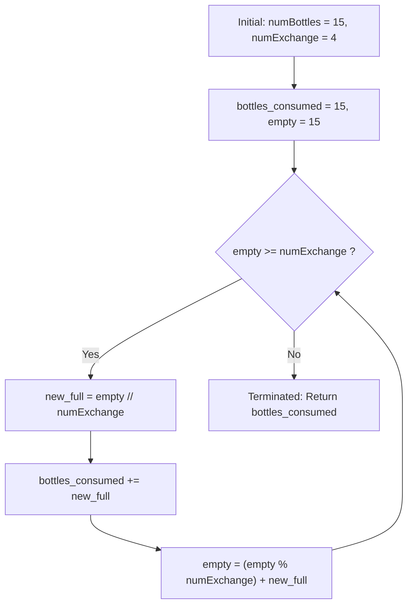

# Guided Example: Water Bottles

## 1. Instance & Teaching Goal

We are provided an initial supply of $b = 15$ full water bottles:
$$\text{numBottles} = 15, \quad \text{numExchange} = 4$$
Drinking any full bottle produces an empty bottle. Every batch of $e = 4$ empty bottles can be exchanged at the market for $1$ full bottle.

Our teaching goal is to determine the maximum cumulative number of water bottles a person can drink. We trace the iterative exchange simulation step by step and derive the closed-form mathematical identity based on net empty-bottle depreciation:
$$\text{Total Drunk} = b + \left\lfloor \frac{b - 1}{e - 1} \right\rfloor$$

## 2. Conceptual Foundation & Invariants

Let $b$ denote the initial full bottles and $e$ denote the exchange rate $\text{numExchange}$.
1. **Initial Consumption**:
   The person immediately drinks all $b$ full bottles, yielding $b$ units of consumed beverage and leaving $b$ empty bottles.
2. **Iterative Exchange Cycles**:
   As long as the current supply of empty bottles satisfies $\text{empty} \ge e$:
   - We exchange as many multiples of $e$ as possible:
     $$k = \left\lfloor \frac{\text{empty}}{e} \right\rfloor$$
   - The unexchanged remainder is:
     $$\text{rem} = \text{empty} \bmod e$$
   - We receive and immediately consume $k$ new full bottles, adding $k$ to the total drink count.
   - Consuming those $k$ bottles produces $k$ new empty bottles, updating our inventory:
     $$\text{empty} \leftarrow \text{rem} + k$$
3. **Net Cost & Closed-Form Derivation**:
   Each exchange consumes $e$ empty bottles and yields $1$ full bottle, which after consumption becomes $1$ empty bottle.
   Thus, the **net cost** of drinking an extra bottle is:
   $$\Delta_{\text{cost}} = e - 1 \text{ empty bottles}$$
   However, we cannot enter a debt: to initiate any exchange, we must possess at least $e$ bottles before the transaction.
   Reserving the final empty bottle (which can never be returned before drinking the last one), we have $b - 1$ disposable empty bottles.
   Therefore, the total number of extra exchanges possible is:
   $$\text{extra} = \left\lfloor \frac{b - 1}{e - 1} \right\rfloor$$
   Yielding the total bottles drunk:
   $$\text{Total} = b + \left\lfloor \frac{b - 1}{e - 1} \right\rfloor$$

```text
+-------------------------------------------------------------------------------+
|                       WATER BOTTLE EXCHANGE CYCLES                            |
|                                                                               |
|  Initial Supply: 15 full bottles -> Drink 15 -> 15 empty bottles              |
|                                                                               |
|  Round 1: 15 / 4 = 3 full bottles (rem = 3) -> Drink 3 -> 3 + 3 = 6 empty    |
|  Round 2:  6 / 4 = 1 full bottle  (rem = 2) -> Drink 1 -> 2 + 1 = 3 empty    |
|  Round 3:  3 < 4 (Cannot exchange further)                                    |
|                                                                               |
|  Total Bottles Drunk: 15 + 3 + 1 = 19                                         |
|  Closed-Form: 15 + floor((15 - 1) / (4 - 1)) = 15 + floor(14 / 3) = 19       |
+-------------------------------------------------------------------------------+
```

The algorithm tracks the following state parameters:

| State Parameter | Domain | Initial Value | Transition / Role |
|---|---|---|---|
| `empty_inventory` | Integer $\ge 0$ | $b$ | Current pool of empty bottles available for exchange. |
| `bottles_consumed` | Integer $\ge 0$ | $b$ | Cumulative tally of all bottles drunk so far. |
| `exchange_rate` | Integer $\ge 2$ | $e$ | Number of empty bottles required to obtain one new full bottle. |
| `new_bottles` | Integer $\ge 0$ | $0$ | Number of full bottles acquired in the active transaction $\lfloor \text{empty} / e \rfloor$. |

> [!IMPORTANT]
> **Net Depreciation Invariant**: Each exchange event consumes $e$ empty bottles and replenishes $1$ empty bottle, reducing the net empty inventory by exactly $e - 1$ while increasing total consumption by $1$.



## 3. Step-by-Step Worked Execution

We walk through the representative instance $b = 15$, $e = 4$.

### Initialization Phase
- Drink all $15$ initial bottles.
- $\text{bottles\_consumed} = 15$.
- $\text{empty\_inventory} = 15$.

---

### Exchange Round 1
- Current empty inventory: $15 \ge 4$.
- Number of full bottles obtained:
  $$\text{new\_full} = \left\lfloor \frac{15}{4} \right\rfloor = 3$$
- Unexchanged empty bottles:
  $$\text{rem} = 15 \bmod 4 = 3$$
- Drink the $3$ new bottles:
  $$\text{bottles\_consumed} \leftarrow 15 + 3 = 18$$
- New empty inventory:
  $$\text{empty\_inventory} \leftarrow \text{rem} + \text{new\_full} = 3 + 3 = 6$$

---

### Exchange Round 2
- Current empty inventory: $6 \ge 4$.
- Number of full bottles obtained:
  $$\text{new\_full} = \left\lfloor \frac{6}{4} \right\rfloor = 1$$
- Unexchanged empty bottles:
  $$\text{rem} = 6 \bmod 4 = 2$$
- Drink the $1$ new bottle:
  $$\text{bottles\_consumed} \leftarrow 18 + 1 = 19$$
- New empty inventory:
  $$\text{empty\_inventory} \leftarrow \text{rem} + \text{new\_full} = 2 + 1 = 3$$

---

### Exchange Round 3
- Current empty inventory: $3 < 4$.
- Cannot perform further market exchanges.
- The loop terminates.

Total bottles consumed: $19$.

## 4. Complete Execution Trace

We collect the complete inventory progression and exchange transactions in the trace table below.

| Iteration Stage | Empty Bottles at Start | Div Mod Analysis | New Full Bottles Acquired | Bottles Drunk in Round | Remaining Empties Before Drinking | Updated Empty Pool | Cumulative Consumption |
|---|---|---|---|---|---|---|---|
| Initialization | $0$ (Start) | Direct consumption | $15$ | $15$ | $0$ | $15$ | $15$ |
| Round 1 | $15$ | $15 = 3 \times 4 + 3$ | $3$ | $3$ | $3$ | $3 + 3 = 6$ | $18$ |
| Round 2 | $6$ | $6 = 1 \times 4 + 2$ | $1$ | $1$ | $2$ | $2 + 1 = 3$ | **$19$** |
| Termination | $3$ | $3 < 4$ (Insufficient) | $0$ | $0$ | $3$ | $3$ | **$19$** |

### Mathematical Closed-Form Evaluation

Applying the net depreciation formula:
$$\begin{aligned}
\text{Total} &= b + \left\lfloor \frac{b - 1}{e - 1} \right\rfloor \\
             &= 15 + \left\lfloor \frac{15 - 1}{4 - 1} \right\rfloor \\
             &= 15 + \left\lfloor \frac{14}{3} \right\rfloor \\
             &= 15 + 4 \\
             &= 19
\end{aligned}$$
The closed-form arithmetic calculation matches the simulation output with precision.

## 5. Algorithmic Correctness

### Soundness

Every bottle counted in `bottles_consumed` is either an initial bottle or acquired via a legitimate market transaction with $\text{numExchange}$ empty bottles.
No empty bottle is double-counted, as $k \times e$ bottles are deducted from the inventory whenever $k$ full bottles are received.
Because the simulation halts as soon as $\text{empty} < e$, no illegal exchanges are made.
Thus, the computed consumption is physically realizable and sound.

### Completeness

At any point where $\text{empty} \ge e$, exchanging $\lfloor \text{empty} / e \rfloor$ bottles maximizes the immediate beverage intake without reducing future exchange opportunities (since delaying an exchange cannot increase the total number of bottles obtained).
Because the exchange relation is strictly monotone, the greedy exchange strategy attains the maximum possible total consumption, proving completeness.

## 6. Traps This Instance Exposes

- **Borrowing Trap**: Assuming you can borrow an empty bottle from a friend, exchange, drink, and return the empty bottle. Under standard problem rules, you cannot borrow bottles; you must possess $e$ empty bottles before making an exchange. The closed-form $\lfloor b / (e - 1) \rfloor$ assumes borrowing is permitted, which yields $15 + \lfloor 15/3 \rfloor = 20$ (an overcount by 1). The correct non-borrowing formula is $\lfloor (b - 1) / (e - 1) \rfloor$.
- **Modulo Remainder Neglect**: Forgetting to add the unexchanged remainder $\text{empty} \bmod e$ back to the new empties. For $b = 15, e = 4$, if the $3$ remaining bottles from round 1 were discarded, the inventory in round 2 would only be $3$ instead of $3 + 3 = 6$, missing the second exchange entirely.
- **Infinite Loop When $e = 1$**: If $e = 1$, drinking a bottle gives $1$ empty, which trades for $1$ full bottle, running indefinitely. The problem constraints guarantee $e \ge 2$, ensuring strictly decreasing empty inventories and guaranteed termination.

## 7. Complexity Derivation

### Time Complexity

- **Simulation Method**:
  In each exchange round, the inventory decreases from $E$ to approximately $E / e + (E \bmod e) \approx E / e$.
  Because $e \ge 2$, the number of empty bottles decreases geometrically:
  $$E_{k+1} \le \frac{E_k}{2} + 1$$
  The while-loop executes at most $\mathcal{O}(\log_e b)$ iterations.
  With $b \le 100$ and $e \ge 2$, the loop runs at most $7$ times.
- **Closed-Form Method**:
  Evaluating $b + (b - 1) // (e - 1)$ requires $\mathcal{O}(1)$ basic arithmetic operations.
- Overall time complexity is strictly $\mathcal{O}(1)$ or $\mathcal{O}(\log b)$.

### Auxiliary Space Complexity

- The algorithm maintains scalar integer registers (`ans`, `numBottles`, `numExchange`).
- Auxiliary space complexity is strictly $\mathcal{O}(1)$.
