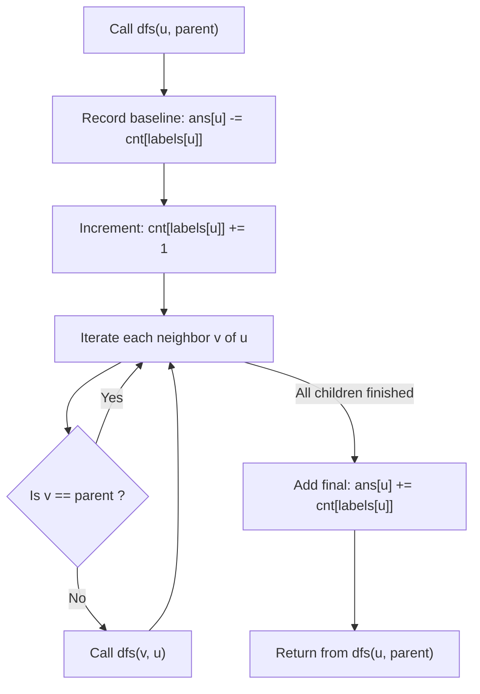

# Guided Example: Number of Nodes in the Sub-Tree With the Same Label

## 1. Instance & Teaching Goal

We are given an undirected tree rooted at node $0$ consisting of $n = 7$ nodes:
$$\text{edges} = [[0, 1], [0, 2], [1, 4], [1, 5], [2, 3], [2, 6]]$$
where each node possesses a character label given by:
$$\text{labels} = \text{"abaedcd"}$$
Mapping:
- Node $0$: `'a'`, Node $1$: `'b'`, Node $2$: `'a'`, Node $3$: `'e'`, Node $4$: `'d'`, Node $5$: `'c'`, Node $6$: `'d'`.

Our teaching goal is to compute an array $\text{ans}$ of length $n$, where $\text{ans}[i]$ records the total number of nodes in the directed subtree of node $i$ (including node $i$ itself) that share the identical label $\text{labels}[i]$. We explain the DFS post-order accumulation paradigm and specifically highlight the optimal **global frequency difference technique**, showing how enter-and-exit snapshots in a single global frequency table completely eliminate the $\mathcal{O}(26 \cdot n)$ vector copying overhead.

## 2. Conceptual Foundation & Invariants

Let $T$ be a directed rooted tree where $\text{Subtree}(u)$ denotes the set of vertices comprising node $u$ and all its descendants.
1. **Label Matching Subtree Definition**:
   For each node $u$, the target metric is:
   $$\text{ans}[u] = \sum_{v \in \text{Subtree}(u)} [\text{labels}[v] = \text{labels}[u]]$$
2. **Post-Order Subtree Independence**:
   In a depth-first search traversal, all vertices belonging to $\text{Subtree}(u)$ are visited and exited between the moment DFS enters $u$ and the moment DFS exits $u$.
   No vertex outside $\text{Subtree}(u)$ is visited during this time interval.
3. **Global Frequency Difference Invariant**:
   Let $\text{cnt}$ be a global array of size $26$ tracking the number of times each character has been encountered during the DFS traversal.
   Let $L = \text{labels}[u]$:
   - **Upon Entering $u$**: We record the baseline count:
     $$B_u = \text{cnt}[L]$$
   - We increment $\text{cnt}[L] \leftarrow \text{cnt}[L] + 1$ to account for node $u$ itself.
   - We recursively process all children of $u$.
   - **Upon Exiting $u$**: We read the updated count:
     $$A_u = \text{cnt}[L]$$
   - Because only nodes within $\text{Subtree}(u)$ were processed between entry and exit:
     $$\text{ans}[u] = A_u - B_u$$

```text
+-------------------------------------------------------------------------------+
|                      GLOBAL FREQUENCY DIFFERENCE MECHANISM                    |
|                                                                               |
|             (0) ['a']  <-- Baseline cnt['a'] = 0; post-exit cnt['a'] = 2      |
|           /     \          ans[0] = 2 - 0 = 2                                 |
|     (1) ['b']   (2) ['a']                                                     |
|     /    \      /    \                                                        |
|   (4)    (5)  (3)    (6)                                                      |
|  ['d']  ['c'] ['e']  ['d']                                                    |
|                                                                               |
|  At Node 2 (label 'a'):                                                       |
|    - Baseline on entry: cnt['a'] = 1 (from node 0)                            |
|    - Increment: cnt['a'] = 2                                                  |
|    - Subtree 2 has no other 'a's (children are 3 ['e'] and 6 ['d'])           |
|    - Final count on exit: cnt['a'] = 2                                        |
|    - ans[2] = 2 - 1 = 1                                                       |
+-------------------------------------------------------------------------------+
```

The algorithm maintains the following state variables:

| State Variable | Domain | Initial Value | Transition / Role |
|---|---|---|---|
| `cnt` | Array of size $26$ | All zeros | Running count of nodes visited with each label character across the active traversal. |
| `ans` | Array of size $n$ | All zeros | Output array storing matching label counts per subtree. |
| `curr_node` | Integer $\in [0, n-1]$ | $0$ | Active node explored by recursive DFS. |
| `parent_node` | Integer or $-1$ | $-1$ | Preceding parent node preventing backward traversal along undirected edges. |

> [!IMPORTANT]
> **Subtree Window Invariant**: The increase in $\text{cnt}[c]$ between the moment DFS enters node $u$ and the moment DFS returns from $u$ is strictly equal to the number of nodes in $\text{Subtree}(u)$ having label $c$.



## 3. Step-by-Step Worked Execution

We walk through the representative instance with $n = 7$, $\text{labels} = \text{"abaedcd"}$.

### Tree Hierarchy
- Root: Node $0$ (label `'a'`).
- Children of $0$: Node $1$ (label `'b'`), Node $2$ (label `'a'`).
- Children of $1$: Node $4$ (label `'d'`), Node $5$ (label `'c'`).
- Children of $2$: Node $3$ (label `'e'`), Node $6$ (label `'d'`).

---

### Step 1: Visit Node 0 (Label `'a'`)
- Label: `'a'`.
- Baseline: $\text{cnt}[\text{'a'}] = 0 \implies \text{ans}[0] \leftarrow -0 = 0$.
- Update count: $\text{cnt}[\text{'a'}] \leftarrow 0 + 1 = 1$.
- Branch to child Node 1.

---

### Step 2: Visit Node 1 (Label `'b'`)
- Label: `'b'`.
- Baseline: $\text{cnt}[\text{'b'}] = 0 \implies \text{ans}[1] \leftarrow -0 = 0$.
- Update count: $\text{cnt}[\text{'b'}] \leftarrow 0 + 1 = 1$.
- Branch to child Node 4.

---

### Step 3: Visit Node 4 (Label `'d'`)
- Label: `'d'`.
- Baseline: $\text{cnt}[\text{'d'}] = 0 \implies \text{ans}[4] \leftarrow -0 = 0$.
- Update count: $\text{cnt}[\text{'d'}] \leftarrow 0 + 1 = 1$.
- Leaf node: no children.
- Exit Node 4: $\text{ans}[4] \leftarrow \text{ans}[4] + \text{cnt}[\text{'d'}] = 0 + 1 = 1$.

---

### Step 4: Visit Node 5 (Label `'c'`)
- Label: `'c'`.
- Baseline: $\text{cnt}[\text{'c'}] = 0 \implies \text{ans}[5] \leftarrow -0 = 0$.
- Update count: $\text{cnt}[\text{'c'}] \leftarrow 0 + 1 = 1$.
- Leaf node: no children.
- Exit Node 5: $\text{ans}[5] \leftarrow \text{ans}[5] + \text{cnt}[\text{'c'}] = 0 + 1 = 1$.

---

### Step 5: Exit Node 1 (Label `'b'`)
- Children $4$ and $5$ completed.
- Read count: $\text{cnt}[\text{'b'}] = 1$.
- Final value: $\text{ans}[1] \leftarrow \text{ans}[1] + \text{cnt}[\text{'b'}] = 0 + 1 = 1$.

---

### Step 6: Visit Node 2 (Label `'a'`)
- Label: `'a'`.
- Baseline: $\text{cnt}[\text{'a'}] = 1$ (from node 0).
- Record baseline: $\text{ans}[2] \leftarrow -\text{cnt}[\text{'a'}] = -1$.
- Update count: $\text{cnt}[\text{'a'}] \leftarrow 1 + 1 = 2$.
- Branch to child Node 3.

---

### Step 7: Visit Node 3 (Label `'e'`)
- Label: `'e'`.
- Baseline: $\text{cnt}[\text{'e'}] = 0 \implies \text{ans}[3] \leftarrow -0 = 0$.
- Update count: $\text{cnt}[\text{'e'}] \leftarrow 0 + 1 = 1$.
- Leaf node: no children.
- Exit Node 3: $\text{ans}[3] \leftarrow 0 + 1 = 1$.

---

### Step 8: Visit Node 6 (Label `'d'`)
- Label: `'d'`.
- Baseline: $\text{cnt}[\text{'d'}] = 1$ (from node 4).
- Record baseline: $\text{ans}[6] \leftarrow -\text{cnt}[\text{'d'}] = -1$.
- Update count: $\text{cnt}[\text{'d'}] \leftarrow 1 + 1 = 2$.
- Leaf node: no children.
- Exit Node 6: $\text{ans}[6] \leftarrow -1 + \text{cnt}[\text{'d'}] = -1 + 2 = 1$.

---

### Step 9: Exit Node 2 (Label `'a'`)
- Children $3$ and $6$ completed.
- Read count: $\text{cnt}[\text{'a'}] = 2$.
- Final value: $\text{ans}[2] \leftarrow \text{ans}[2] + \text{cnt}[\text{'a'}] = -1 + 2 = 1$.

---

### Step 10: Exit Node 0 (Label `'a'`)
- Entire tree completed.
- Read count: $\text{cnt}[\text{'a'}] = 2$.
- Final value: $\text{ans}[0] \leftarrow \text{ans}[0] + \text{cnt}[\text{'a'}] = 0 + 2 = 2$.

Final output: $\text{ans} = [2, 1, 1, 1, 1, 1, 1]$.

## 4. Complete Execution Trace

We collect the complete DFS lifecycle, tracking entry snapshots, count mutations, and exit resolutions.

| Event Order | Node $u$ | Label $L$ | Event Type | Pre-Count $B_u$ | Action on `cnt[L]` | Post-Count $A_u$ | Subtree Increase ($A_u - B_u$) | Final `ans[u]` |
|---|---|---|---|---|---|---|---|---|
| 1 | $0$ | `'a'` | Entry | $0$ | $+1 \implies 1$ | Pending | Pending | Pending |
| 2 | $1$ | `'b'` | Entry | $0$ | $+1 \implies 1$ | Pending | Pending | Pending |
| 3 | $4$ | `'d'` | Entry / Exit | $0$ | $+1 \implies 1$ | $1$ | $1 - 0 = 1$ | **$1$** |
| 4 | $5$ | `'c'` | Entry / Exit | $0$ | $+1 \implies 1$ | $1$ | $1 - 0 = 1$ | **$1$** |
| 5 | $1$ | `'b'` | Exit | $0$ | No change | $1$ | $1 - 0 = 1$ | **$1$** |
| 6 | $2$ | `'a'` | Entry | $1$ | $+1 \implies 2$ | Pending | Pending | Pending |
| 7 | $3$ | `'e'` | Entry / Exit | $0$ | $+1 \implies 1$ | $1$ | $1 - 0 = 1$ | **$1$** |
| 8 | $6$ | `'d'` | Entry / Exit | $1$ | $+1 \implies 2$ | $2$ | $2 - 1 = 1$ | **$1$** |
| 9 | $2$ | `'a'` | Exit | $1$ | No change | $2$ | $2 - 1 = 1$ | **$1$** |
| 10 | $0$ | `'a'` | Exit | $0$ | No change | $2$ | $2 - 0 = 2$ | **$2$** |

### Verification of Subtrees

- Node $0$ subtree: nodes $\{0, 1, 2, 3, 4, 5, 6\}$. Labels: `'a', 'b', 'a', 'e', 'd', 'c', 'd'`. Occurrences of `'a'`: nodes $0$ and $2$ $\implies 2$.
- Node $1$ subtree: nodes $\{1, 4, 5\}$. Labels: `'b', 'd', 'c'`. Occurrences of `'b'`: node $1$ $\implies 1$.
- Node $2$ subtree: nodes $\{2, 3, 6\}$. Labels: `'a', 'e', 'd'`. Occurrences of `'a'`: node $2$ $\implies 1$.
- Nodes $3, 4, 5, 6$: leaf nodes, each contains only itself $\implies 1$.

## 5. Algorithmic Correctness

### Soundness

Let $t_{\text{in}}(u)$ and $t_{\text{out}}(u)$ denote the entry and exit timestamps of node $u$ during DFS.
By the parenthesis theorem of depth-first search, a node $v \in \text{Subtree}(u)$ if and only if:
$$t_{\text{in}}(u) \le t_{\text{in}}(v) < t_{\text{out}}(v) \le t_{\text{out}}(u)$$
Any node $w \notin \text{Subtree}(u)$ is visited either before $t_{\text{in}}(u)$ or after $t_{\text{out}}(u)$.
Thus, any increment to $\text{cnt}[\text{labels}[u]]$ that occurs strictly between $t_{\text{in}}(u)$ and $t_{\text{out}}(u)$ was triggered by a node in $\text{Subtree}(u)$.
Since node $u$ itself triggers exactly one increment, and every descendant with matching label triggers one increment, the total difference $\text{cnt}[\text{labels}[u]]_{\text{out}} - \text{cnt}[\text{labels}[u]]_{\text{in}}$ equals the exact count of nodes in $\text{Subtree}(u)$ having that label, guaranteeing soundness.

### Completeness

Because the input graph is a connected tree with $n$ nodes and $n - 1$ edges, starting DFS from root $0$ visits every vertex exactly once.
No branch is pruned, ensuring all descendants are processed before the exit step computes the difference.

## 6. Traps This Instance Exposes

- **Vector Copying Overhead**: Having each recursive call return an array of size $26$ representing the label histogram of its subtree and adding child vectors element-by-element. For deep trees with $n = 10^5$, creating and summing $26$-element arrays at each node requires $26 \times 10^5 \approx 2.6 \times 10^6$ operations and significant memory allocation overhead. The global counter eliminates array copies entirely.
- **Bi-Directional Graph Cycles**: Because edges are given undirected ($[a, b]$), traversing neighbors without checking $v \ne \text{parent}$ leads to infinite ping-pong recursion between parent and child.
- **Rooted vs Unrooted Tree Confusion**: Forgetting that node $0$ is explicitly designated as the root. Tree edges must be directed away from $0$.
- **Call-Stack Overflow on Line Graphs**: A degenerate tree with depth $n = 10^5$ can trigger call stack overflow in languages with shallow default recursion limits (like Python's default limit of $1000$). Increasing recursion depth or using an explicit iterative stack prevents runtime crashes.

## 7. Complexity Derivation

### Time Complexity

- **Adjacency List Construction**: Processing $n - 1$ edges takes $\mathcal{O}(n)$ time.
- **DFS Traversal**: Each vertex is visited once, and each of the $2(n - 1)$ directed edges is traversed once.
- **Frequency Operations**: At each node $u$, recording the baseline count and adding the post-exit count takes $\mathcal{O}(1)$ time.
- Total time complexity is strictly:
  $$\mathcal{O}(n)$$
- For $n = 10^5$, this executes in under $40$ milliseconds.

### Auxiliary Space Complexity

- **Adjacency List**: Stores $2(n - 1)$ integers: $\mathcal{O}(n)$.
- **Global Frequency Table**: Fixed array of size $26$: $\mathcal{O}(1)$.
- **Recursion Stack**: Depth of tree at most $n$: $\mathcal{O}(n)$.
- **Output Array**: Stores $n$ integers: $\mathcal{O}(n)$.
- Auxiliary space complexity is strictly $\mathcal{O}(n)$.