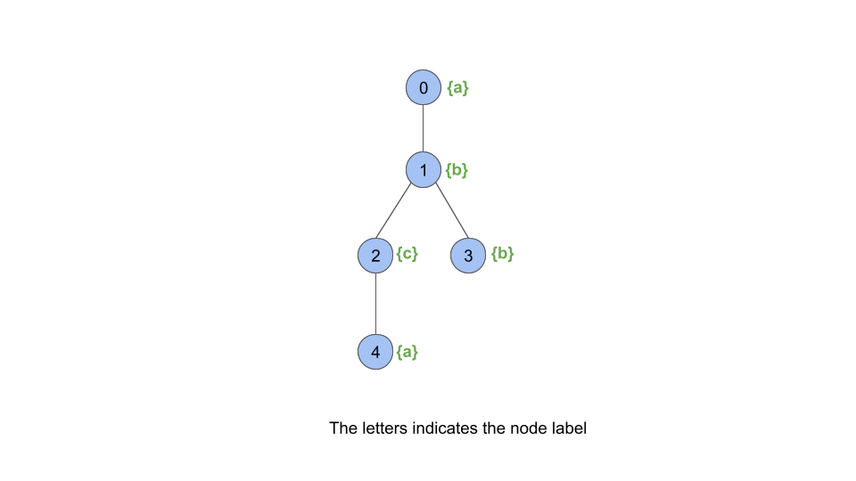
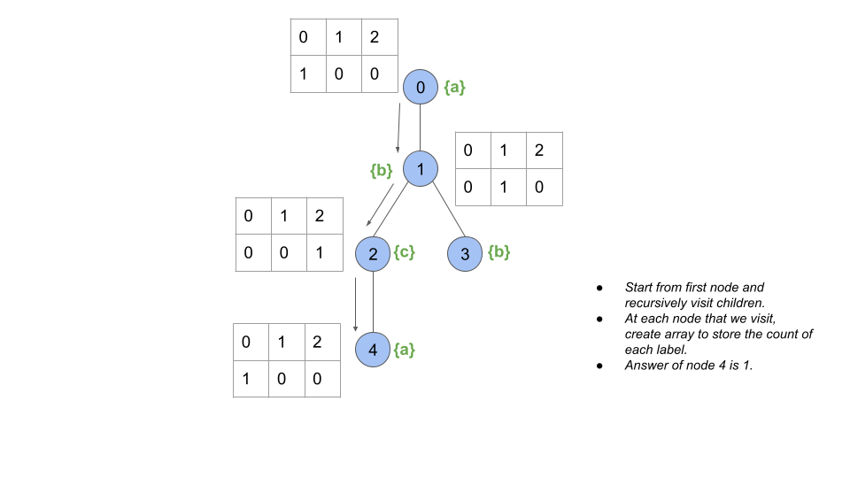
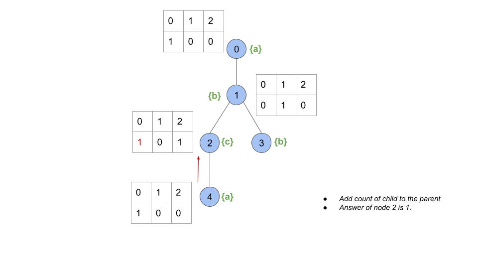
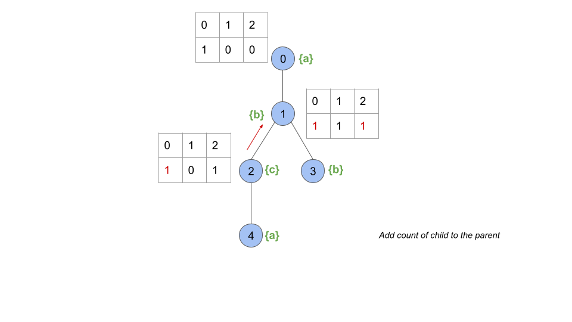
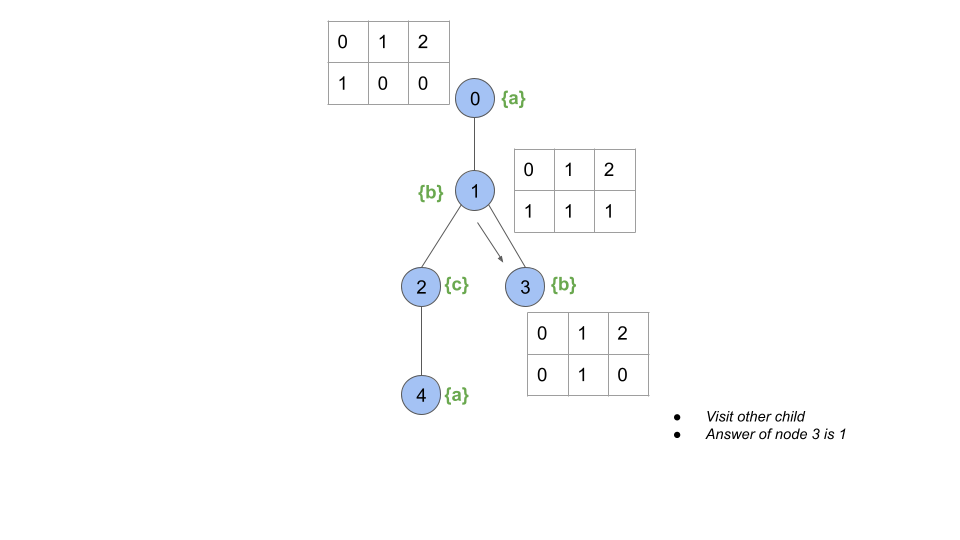
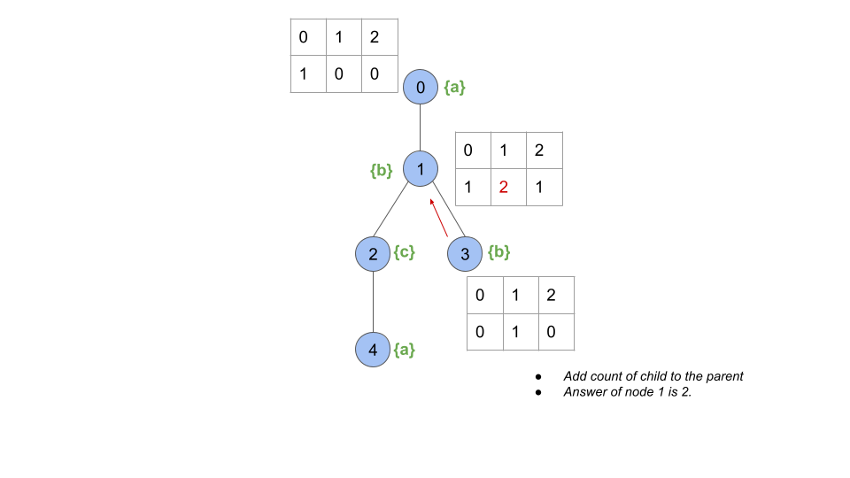
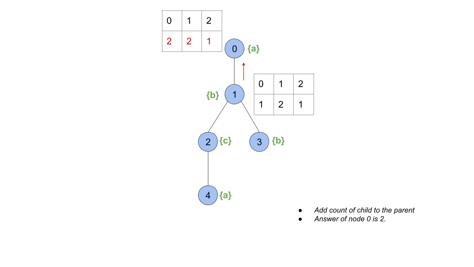

## Solution

---

### Overview

The problem presents an undirected tree with `n` nodes. Each node of the tree has a label associated to it. Our task is to return an array `ans` of size `n` where $\text{ans}[i]$ is the number of nodes in the subtree of $i^{th}$ node that have the same label as node `i`.

---

### Approach 1: Depth First Search

#### Intuition

One brute force approach that we might think of is to explore every subtree of each node and count how many labels similar to the node exist in its subtree. However, this would take $O(N^2)$ time because we would have to traverse the entire subtree of each node.

Intuitively, we can consider computing the answer of a parent node from its child nodes. Let's say there is a node `p`, that has two children, `c1` and `c2`. If nodes `c1` and `c2` have the total count of each label (`a` to `z`) in their respective subtrees, then it would be easy to compute the answer for node `p`. Using the count of each label in `c1` and `c2`, we can compute the count in `p`'s subtree.

So, to compute the answer of a node, first we have to find the count of each label in every child node subtree. Then, we use it to find the answer for the parent node.

A depth-first search is a good algorithm for such a situation. In DFS, we explore nodes as far as possible along each branch. Upon reaching the end of the current branch, we backtrack to the next possible branch and continue exploring.

Once we encounter an unvisited node, we will take one of its neighbor nodes (if exists) as the next node on this branch. Recursively call the function to take the next node as the 'starting node' and solve the subproblem. If we reach the end of this branch, we backtrack to the previous node and visit the next neighbor node (if exists), and repeat the process.

If you are new to DFS, please see our [Leetcode Explore Card](https://leetcode.com/explore/featured/card/graph/619/depth-first-search-in-graph/3882/) for more information on it!

Following from the above discussion, the idea is to visit all the children of every node recursively, compute the count of each label in every child's subtree, and use it to compute the answer of the parent node.

Let's take an example. Let's say we have a node `c` which is a child of a node `p`. Let's also create an array $\text{nodeCount}[26]$ to store the count of each label in the subtree of `p`. $\text{nodeCount}[0]$ will store the count of label `a`, $\text{nodeCount}[1]$ will store the count for `b` and so on. We count one for the node label itself, i.e., $nodeCount[\text{labels}[p] -$a$] = 1$.

Now, we iterate over the child `c` and get the count of each label in the subtree of `c`, let's store it in another array $\text{childCount}[26]$. For each label, we add the count in the subtree of `c` to the count in the subtree of `p` i.e., $\text{nodeCount}[i] += \text{childCount}[i]$. After iterating over all the children (if there are more) of `p`, the answer of node `p` would be $nodeCount[\text{labels}[p] - 'a']$.

Refer to the following slides for a step-by-step visual example:















#### Algorithm

1. Create an adjacency list where $\text{adj}[X]$ contains all the neighbors of node `X`.
2. Initialize an array `ans`, storing the answer of each node. Initialize it with `0` for every node.
3. Start a DFS traversal.
- We use a `dfs` function to perform the traversal. For each call, pass `node`, `parent`, `adj`, `labels` and `ans` as the parameters. It returns an array which stores the count of each label in the `node`'s subtree. We start with node `0`. We also keep track of the `parent` node of the current `node` so that we don’t visit the node’s parent as it has already been visited.
- Initialize an array `nodeCounts` to store the count of each label in the `node`'s subtree. Initialize it with `0` except for the `node` label, which should be `1`.
- Iterate over all the children of the `node` (nodes that share an edge) and check if any `child` is equal to the `parent`. If the `child` is equal to the `parent`, we will not visit it again.
- If the `child` is not equal to the `parent`, recursively call the dfs function with the node as `child` and the parent as `node`. Store the count of all labels in its subtree in `childCounts`.
- Add `childCounts` to `nodeCounts`.
- After looping through all the children, set the $\text{ans}[node]$ to  $\text{ans}[node] = nodeCounts[\text{labels}[node]]$.
- Return `nodeCounts`.
4. Return `ans`.

#### Implementation

```cpp
class Solution {
public:
    vector<int> dfs(int node, int parent, vector<vector<int>>& adj, string& labels,
                    vector<int>& ans) {
        // Store count of all alphabets in the subtree of the node.
        vector<int> nodeCounts(26);
        nodeCounts[labels[node] - 'a'] = 1;

        for (auto& child : adj[node]) {
            if (child == parent) {
                continue;
            }
            vector<int> childCounts = dfs(child, node, adj, labels, ans);
            // Add frequencies of the child node in the parent node's frequency array.
            for (int i = 0; i < 26; i++) {
                nodeCounts[i] += childCounts[i];
            }
        }

        ans[node] = nodeCounts[labels[node] - 'a'];
        return nodeCounts;
    }

    vector<int> countSubTrees(int n, vector<vector<int>>& edges, string labels) {
        vector<vector<int>> adj(n);
        for (auto& edge : edges) {
            adj[edge[0]].push_back(edge[1]);
            adj[edge[1]].push_back(edge[0]);
        }

        vector<int> ans(n, 0);
        dfs(0, -1, adj, labels, ans);

        return ans;
    }
};
```

#### Complexity Analysis

Here, $n$ is the number of nodes.

* Time complexity: $O(26 * n) = O(n)$

- Each node is visited by the `dfs` function once, which takes $O(n)$ time in total. We also iterate over the edges of every node once (since we don't visit a node more than once, we don't iterate its edges more than once), which adds $O(n)$ time since we have $n - 1$ edges.
- For each child of a node, we also add the counts of each label in the child's subtree to the node, which comes with a $26$ factor. Since there are $n - 1$ edges, there are $n - 1$ children. So, we would take up $O(26 * n)$ time to perform all these operations.
- Additionally, we need $O(n)$ time to initialize the adjacency list and the `ans` array.

* Space complexity: $O(26 * n) = O(n)$

- The recursion call stack used by `dfs` can have no more than $n$ elements in the worst-case scenario. Storing each element comes with a $26$ factor because we create an array `nodeCounts` of size $26$ for each node. So, we would take up $O(26 * n)$ space in the worst case.
- We also need $O(n)$ memory for the adjacency list and the `ans` array.

---

### Approach 2: Breadth First Search

#### Intuition

As we discussed in the first approach, the idea is to visit all the children of every node, compute the count of each label in every child's subtree, and use it to compute the answer of the parent node.

We can use a modified breadth-first search (BFS) traversal over the graph to compute the count of each label in the parent node from its children.

A breadth-first search (BFS) is an algorithm for traversing or searching a graph. It traverses in a level-wise manner, i.e., all the nodes at the present level (say `l`) are explored before moving on to the nodes at the next level ($l + 1$), where a level's number is the distance from a starting node. BFS is implemented with a queue.

If you are not familiar with BFS traversal, we suggest you read our [Leetcode Explore Card](https://leetcode.com/explore/featured/card/graph/620/breadth-first-search-in-graph/) for more information on it!

In this approach, we traverse from the leaf nodes to the root node. Rather than visiting all the nodes at the present level (say `l`) and then moving on to the nodes at the next level ($l + 1$), we move from level `l+1` to `l` i.e., bottom to top.

We start a traversal from all the leaf nodes, then move to their parents, then to their parents, and so on till the root. If we are at level `l`, we must have the count of each label in the subtrees of all the nodes at level $l + 1$.

As we know, BFS is implemented with a queue, so we initialize a queue storing the next nodes to be visited. We start by inserting all the leaf nodes into the queue. A leaf node can be figured out by checking the number of nodes it is connected to. If the node is not a root node and the number of nodes to which it is connected is one (leaf nodes just have a parent and no children), it is a leaf node.

We also initialize a count array $\text{count}[n][26]$, where $\text{count}[i]$ stores the count of each label in the subtree of node `i`.

Next, we perform the BFS traversal until the queue is empty. We pop out the first element, say `node` from the queue. We fetch the parent of the node, let's call it `parent`.

We add the count of each label in the subtree of `node` to that of the `parent` ($\text{count}[parent] += \text{count}[node]$). Similarly, we pop other elements and count of each label in the children to their parents. After traversing over all the children of the `parent`, the $\text{count}[parent]$ stores the count of each label in the subtree of the `parent`. Next, we push the `parent` into the queue and repeat the process until the queue is empty.

Once the queue is empty, we iterate over all the nodes, and for each `node` answer is $\text{count}[node][\text{labels}[node] - 'a']$.

The important thing in this approach is to figure out the parent of a node and how to compute the count of each label in its subtree using its children. Let's understand this a bit more. We declare a map called adj, where $\text{adj}[X]$ contains a set of all the neighbors (nodes that share an edge) of node `X`. As we know, we start with leaf nodes by pushing them into the queue first. The leaf nodes will have just one node in the set $adj[\text{leaf}_{node}]$ which is the parent since they have no children. Let's say we start with leaf node `lf` and its parent is `p`. Parent node `p` will be obtained from $\text{adj}[lf]$. We will add the count of each label in `lf` to that of `p`.

Now, we will delete `lf` from `p`, so that we don't traverse back to `lf` from `p`. Similarly, if there are other leaf nodes that are children of node `p`, we will pop them out of the queue, add the count of each label in them in `p` and delete them from $\text{adj}[p]$. Finally, $\text{adj}[p]$ would not have any children and just have a parent of `p`. This means we have added the count of each label in all the children of `p`. Node `p` would behave as a leaf node and can be pushed into the queue to help its parent compute the count of each label.

#### Algorithm

1. Create a mapping `adj` where $\text{adj}[X]$ contains a set of all the neighbors of node `X`.
2. Initialize an array $\text{counts}[26]$ for every node, storing the count of each label in the node's subtree. Initialize it with `0` for every node.
3. Initialize a queue.
4. Iterate over all the nodes and for each `node` mark $\text{counts}[node][\text{labels}[node] - 'a'] = 1$. Also, check if `node` is a leaf node. It is a leaf node, if $node \neq 0 \&\& \text{adj}[node].size() = 1$. Push `node` into the queue.
5. Then, while the queue is not empty:
- Dequeue the first `node` from the queue.
- Get the `parent` of the `node` from $\text{adj}[node]$.
- For the `parent`, we remove `node` from $\text{adj}[parent]$ to avoid traversing back to `node` from `parent`.
- Add $\text{counts}[node]$ to $\text{counts}[parent]$.
- If the size of $\text{adj}[parent] = 1 \&\& parent \neq 0$ (root has no parent), which means we added the count of each label in all subtrees of its children and deleted the children. The node present in $\text{adj}[parent]$ is its parent. In such a case, push the `parent` into the queue.
6. Iterate over all the nodes and for each `node` return $\text{counts}[node][\text{labels}[node] -$a`]`.

#### Implementation

```cpp
class Solution {
public:
    vector<int> countSubTrees(int n, vector<vector<int>>& edges, string labels) {
        unordered_map<int, unordered_set<int>> adj;
        for (auto& edge : edges) {
            adj[edge[0]].insert(edge[1]);
            adj[edge[1]].insert(edge[0]);
        }

        // Store count of all alphabets of subtree of each node.
        vector<vector<int>> counts(n, vector<int>(26));
        queue<int> q;

        for (int node = 0; node < n; ++node) {
            counts[node][labels[node] - 'a'] = 1;
            // Store all leaf nodes in the queue.
            if (node != 0 && adj[node].size() == 1) {
                q.push(node);
            }
        }

        while (q.size()) {
            int curr = q.front();
            q.pop();

            // Each node will have only one element which will be its parent.
            int parent = *adj[curr].begin();
            // Remove current node from adjency list of parent node
            // so current node is not traversed again by parent node.
            // (due to this step, we remove all child nodes from a parent, at end parent node will only have its parent in adjacency list)
            adj[parent].erase(curr);

            // Add counts of current node in parent's frequency array.
            for (int i = 0; i < 26; ++i) {
                counts[parent][i] += counts[curr][i];
            }

            // If parent adj size is 1, it has only it's parent in the adjacency list so,
            // it means current node is last child of parent so we insert it in queue now.
            if (parent != 0 && adj[parent].size() == 1) {
                q.push(parent);
            }
        }

        vector<int> ans(n);
        for (int node = 0; node < n; ++node) {
            ans[node] = counts[node][labels[node] - 'a'];
        }

        return ans;
    }
};
```

#### Complexity Analysis

Here, $n$ is the number of nodes.

* Time complexity: $O(26 * n) = O(n)$

- Each node is only queued once, which takes $O(1)$ time for each node. We also iterate over the edges of every node once. Since we only visit each node once, we won't iterate over a node's edges multiple times. There are $n - 1$ edges, so we need $O(n)$ time.
- For each child of a node, we also add the count of each label in the child's subtree to the parent node, which comes with a $26$ factor. Since there are $n - 1$ edges, there are $n - 1$ children. So, we would take up $O(26 * n)$ time to perform all these operations.
- Additionally, we need $O(n)$ time to initialize the adjacency list `adj` and the `ans` array. On average, the unordered map and unordered set take $O(1)$ time for each operation.

* Space complexity: $O(26 * n) = O(n)$

- In the worst case, the queue can grow to a size linear with `N`.
- We also need $O(26 * n)$ memory for the `counts` array.
- We also need $O(n)$ memory for the adjacency list and the `ans` array.