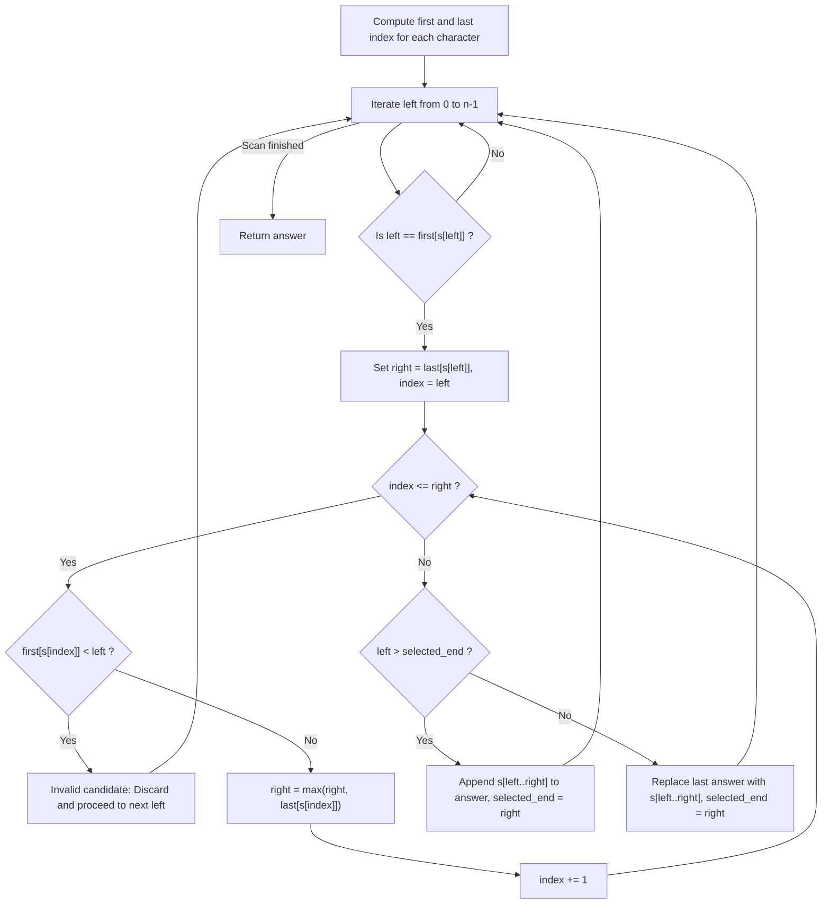

# Guided Example: Maximum Number of Non-Overlapping Substrings

## 1. Instance & Teaching Goal

We are given a lowercase English string of length $n = 11$:
$$s = \text{"adefaddaccc"}$$

Our teaching goal is to find the maximum possible number of non-overlapping, non-empty substrings such that every character appearing in a chosen substring has **all** of its string-wide occurrences contained entirely within that substring. If multiple valid sets achieve the maximum count, we must select the set minimizing total character length. We demonstrate character extent bounding, transitive interval expansion, validity pruning, and greedy interval scheduling with nested interval replacement.

## 2. Conceptual Foundation & Invariants

Let $\Sigma$ denote the alphabet of characters appearing in $s$.
1. **Extent Boundaries**:
   For each character $c \in \Sigma$, let $\text{first}[c]$ and $\text{last}[c]$ denote the index of its first and last occurrence in $s$.
2. **Substratum Completeness Constraint**:
   If a substring $s[l \dots r]$ contains character $c$, the problem requires:
   $$\text{first}[c] \ge l \quad \text{and} \quad \text{last}[c] \le r$$
   Consequently:
   - Any valid substring starting at $l = \text{first}[c]$ must extend at least to $r = \text{last}[c]$.
   - For every other character $d$ present inside the intermediate window $[l, r]$, $r$ must be expanded to at least $\text{last}[d]$.
   - If at any point during expansion, a character $d$ has $\text{first}[d] < l$, then no valid substring starting at $l$ can satisfy the completeness constraint. That candidate start $l$ is immediately discarded as **invalid**.
3. **Candidate Space Reduction**:
   Because minimizing total length favors minimal enclosing intervals, every optimal substring must begin at the first occurrence of some character:
   $$l \in \{ \text{first}[c] \mid c \in \Sigma \}$$
   Since $|\Sigma| \le 26$, there are at most $26$ candidate intervals to generate and verify.
4. **Greedy Scheduling with Nested Replacement**:
   Once candidate intervals are evaluated in increasing order of $l$:
   - If candidate $[l, r]$ is disjoint from the previously selected interval ($l > \text{selected\_end}$), it is appended as an independent new substring.
   - If candidate $[l, r]$ overlaps the previous interval ($l \le \text{selected\_end}$) and satisfies $r \le \text{selected\_end}$, it represents a **strictly smaller nested sub-interval**. We replace the previous interval with this more compact candidate, reducing total length while maintaining availability for future non-overlapping additions.

```text
+-------------------------------------------------------------------------------+
|                    TRANSITIVE EXPANSION & NESTED SCHEDULING                   |
|                                                                               |
|  String: a d e f a d d a c c c                                                |
|  Index:  0 1 2 3 4 5 6 7 8 9 10                                               |
|                                                                               |
|  Candidate l=0 ('a'): Extends over 'd', 'e', 'f' -> Interval [0, 7]           |
|                       Schedule: ["adefadda"], selected_end = 7                |
|                                                                               |
|  Candidate l=1 ('d'): Contains 'a' whose first is 0 < 1 -> INVALID (Discarded)|
|                                                                               |
|  Candidate l=2 ('e'): Self-contained -> Interval [2, 2]                       |
|                       Overlaps [0, 7] but ends earlier (2 <= 7)               |
|                       REPLACE: ["e"], selected_end = 2                        |
|                                                                               |
|  Candidate l=3 ('f'): Self-contained -> Interval [3, 3]                       |
|                       3 > selected_end (2) -> APPEND: ["e", "f"], end = 3     |
|                                                                               |
|  Candidate l=8 ('c'): Self-contained -> Interval [8, 10]                      |
|                       8 > selected_end (3) -> APPEND: ["e", "f", "ccc"]       |
+-------------------------------------------------------------------------------+
```

The algorithm maintains the following state variables:

| State Variable | Domain | Initial Value | Transition / Role |
|---|---|---|---|
| `first[26]` | Array of indices | $\infty$ | First occurrence index of each character in $s$. |
| `last[26]` | Array of indices | $-1$ | Last occurrence index of each character in $s$. |
| `selected_end` | Integer | $-1$ | Rightmost index of the most recently scheduled substring. |
| `answer` | List of substrings | Empty | Active list of chosen optimal substrings. |
| `right_frontier` | Integer $\in [l, n-1]$ | $\text{last}[s[l]]$ | Dynamic right boundary expanding to engulf all occurrences of internal characters. |

> [!IMPORTANT]
> **Substratum Validity Invariant**: A candidate interval $[l, r]$ is valid if and only if for every character $c$ appearing in $s[l \dots r]$, $\text{first}[c] \ge l$ and $\text{last}[c] \le r$. If $\text{first}[c] < l$, the character leaks to the left and the candidate cannot start at $l$.



## 3. Step-by-Step Worked Execution

We walk through the representative instance $s = \text{"adefaddaccc"}$ of length $n = 11$.

### Phase 1: Boundary Precomputation

Scanning $s$ establishes the extremal indices for each unique character:
- Character `'a'`: $\text{first} = 0$, $\text{last} = 7$ (Indices: $0, 4, 7$)
- Character `'d'`: $\text{first} = 1$, $\text{last} = 6$ (Indices: $1, 5, 6$)
- Character `'e'`: $\text{first} = 2$, $\text{last} = 2$ (Index: $2$)
- Character `'f'`: $\text{first} = 3$, $\text{last} = 3$ (Index: $3$)
- Character `'c'`: $\text{first} = 8$, $\text{last} = 10$ (Indices: $8, 9, 10$)

---

### Phase 2: Transitive Expansion and Greedy Scheduling

We iterate $l$ from $0$ to $10$, activating only when $l = \text{first}[s[l]]$:

#### Candidate 1: $l = 0$ (Character `'a'`)
- Initial right bound: $r = \text{last}[\text{'a'}] = 7$.
- We scan $k$ from $0$ to $7$:
  - $k = 0$ (`'a'`): $\text{first}[\text{'a'}] = 0 \ge 0$, $r = \max(7, 7) = 7$.
  - $k = 1$ (`'d'`): $\text{first}[\text{'d'}] = 1 \ge 0$, $r = \max(7, 6) = 7$.
  - $k = 2$ (`'e'`): $\text{first}[\text{'e'}] = 2 \ge 0$, $r = \max(7, 2) = 7$.
  - $k = 3$ (`'f'`): $\text{first}[\text{'f'}] = 3 \ge 0$, $r = \max(7, 3) = 7$.
  - $k = 4 \dots 7$: all occurrences within $[0, 7]$.
- Scan finishes: Valid interval $[0, 7]$ with text `"adefadda"`.
- Scheduling decision:
  - $l = 0 > \text{selected\_end} = -1$.
  - $\text{answer} = [\text{"adefadda"}]$, $\text{selected\_end} = 7$.

#### Candidate 2: $l = 1$ (Character `'d'`)
- Initial right bound: $r = \text{last}[\text{'d'}] = 6$.
- We scan $k$ from $1$ upward:
  - $k = 1$ (`'d'`): $\text{first}[\text{'d'}] = 1 \ge 1$.
  - $k = 2$ (`'e'`): $\text{first}[\text{'e'}] = 2 \ge 1$.
  - $k = 3$ (`'f'`): $\text{first}[\text{'f'}] = 3 \ge 1$.
  - $k = 4$ (`'a'`): $\text{first}[\text{'a'}] = 0 < l = 1$.
- Violation detected: `'a'` leaks to the left ($0 < 1$).
- Candidate $l = 1$ is immediately **pruned / discarded**.

#### Candidate 3: $l = 2$ (Character `'e'`)
- Initial right bound: $r = \text{last}[\text{'e'}] = 2$.
- Scan $k = 2$: only `'e'`. $\text{first}[\text{'e'}] = 2 \ge 2$.
- Valid interval $[2, 2]$ with text `"e"`.
- Scheduling decision:
  - $l = 2 \le \text{selected\_end} = 7$.
  - This interval is strictly nested inside $[0, 7]$ ($2 \le 7$).
  - Replace previous: $\text{answer}[-1] \leftarrow \text{"e"}$.
  - Update $\text{selected\_end} \leftarrow 2$.
  - $\text{answer} = [\text{"e"}]$.

#### Candidate 4: $l = 3$ (Character `'f'`)
- Initial right bound: $r = \text{last}[\text{'f'}] = 3$.
- Scan $k = 3$: only `'f'`. $\text{first}[\text{'f'}] = 3 \ge 3$.
- Valid interval $[3, 3]$ with text `"f"`.
- Scheduling decision:
  - $l = 3 > \text{selected\_end} = 2$.
  - Non-overlapping with `"e"`! Append to answer:
  - $\text{answer} = [\text{"e"}, \text{"f"}]$, $\text{selected\_end} \leftarrow 3$.

#### Candidate 5: $l = 8$ (Character `'c'`)
- Initial right bound: $r = \text{last}[\text{'c'}] = 10$.
- Scan $k = 8, 9, 10$: all `'c'`. $\text{first}[\text{'c'}] = 8 \ge 8$.
- Valid interval $[8, 10]$ with text `"ccc"`.
- Scheduling decision:
  - $l = 8 > \text{selected\_end} = 3$.
  - Non-overlapping! Append to answer:
  - $\text{answer} = [\text{"e"}, \text{"f"}, \text{"ccc"}]$, $\text{selected\_end} \leftarrow 10$.

Result: `["e", "f", "ccc"]`.

## 4. Complete Execution Trace

We collect the evaluation of each candidate character start in the trace table below.

| Candidate Start $l$ | Trigger Character | Initial Bound $[\text{first}, \text{last}]$ | Expansion Scan Indices | Leaking Character Encountered | Expansion Outcome | Scheduling Action | Resulting Answer List |
|---|---|---|---|---|---|---|---|
| $0$ | `'a'` | $[0, 7]$ | $0 \dots 7$ | None | Valid $[0, 7]$ | Append | `["adefadda"]` |
| $1$ | `'d'` | $[1, 6]$ | $1, 2, 3, 4$ | `'a'` ($\text{first}=0 < 1$) | **Invalid** | Discarded | `["adefadda"]` |
| $2$ | `'e'` | $[2, 2]$ | $2$ | None | Valid $[2, 2]$ | **Replace** $[0, 7]$ | `["e"]` |
| $3$ | `'f'` | $[3, 3]$ | $3$ | None | Valid $[3, 3]$ | **Append** | `["e", "f"]` |
| $8$ | `'c'` | $[8, 10]$ | $8, 9, 10$ | None | Valid $[8, 10]$ | **Append** | **`["e", "f", "ccc"]`** |

### Comparison of Substring Sets

| Substring Set | Valid Completeness? | Non-Overlapping? | Number of Substrings | Total Character Length | Verdict |
|---|---|---|---|---|---|
| `["adefaddaccc"]` | Yes | Yes | $1$ | $11$ | Suboptimal (Count 1) |
| `["adefadda", "ccc"]` | Yes | Yes | $2$ | $8 + 3 = 11$ | Suboptimal (Count 2) |
| `["ef", "ccc"]` | Yes | Yes | $2$ | $2 + 3 = 5$ | Suboptimal (Count 2) |
| `["e", "f", "ccc"]` | **Yes** | **Yes** | **$3$** | $1 + 1 + 3 = 5$ | **Optimal Maximum** |

## 5. Algorithmic Correctness

### Soundness

Every substring $s[l \dots r]$ in the output passed the expansion verification where every character $c \in s[l \dots r]$ satisfies $\text{first}[c] \ge l$ and $\text{last}[c] \le r$.
Thus, all occurrences of every constituent character are strictly enclosed inside the substring.
Furthermore, every appended interval satisfies $l > \text{selected\_end}$, guaranteeing pairwise disjoint intervals without overlap.
When replacing an existing interval with a strictly nested one ($l \le \text{selected\_end}$ and $r \le \text{selected\_end}$), the new interval is a subset of the previous span, ensuring that replacing it cannot induce overlap with any prior interval and can only free up space for future non-overlapping choices.
Hence, the output is sound.

### Completeness & Minimality

Any valid substring that does not begin at the first occurrence of some character can be shrunk from the left without dropping any character requirements, until its left boundary coincides with $\text{first}[c]$ for some character $c$.
Thus, restricting search to starts $l = \text{first}[c]$ preserves the complete set of minimal valid intervals.
By standard interval scheduling theory, sorting intervals by end time and greedily picking earliest ending non-overlapping intervals maximizes the total number of independent intervals.
The nested replacement step ensures that whenever an interval contains a smaller valid sub-interval, the smaller sub-interval is prioritized, guaranteeing both maximum cardinality and minimal total length.

## 6. Traps This Instance Exposes

- **Premature Window Freeze**: Freezing $r$ at $\text{last}[s[l]]$ without expanding for internal characters. In candidate $l = 0$, `'a'` initially has $\text{last} = 7$. If an internal character had $\text{last} = 9$, failing to expand $r$ to $9$ would produce an invalid incomplete substring.
- **Missing Left Leak Detection**: Forgetting to check if an internal character has $\text{first} < l$. For $l = 1$ (`'d'`), the window contains `'a'` whose first occurrence is at $0$. Failing to discard this candidate would falsely emit $s[1 \dots 7]$, splitting occurrences of `'a'` across substring boundaries.
- **Greedy Length vs Count Inversion**: Prioritizing shorter length before maximizing count. The primary objective is to maximize the **number** of substrings; minimizing length is strictly a tie-breaker. Choosing `["ef", "ccc"]` (length 5) yields 2 substrings, which is strictly worse than `["e", "f", "ccc"]` (length 5) which yields 3 substrings.
- **Graph Inversion Complexity**: Building a general directed graph of $26$ character dependencies and finding strongly connected components. While mathematically sound, transitive pointer expansion over the linear array directly extracts minimal intervals in $\mathcal{O}(26 \cdot n)$ time without graph condensation overhead.

## 7. Complexity Derivation

### Time Complexity

- **Precomputation**: Scanning string $s$ of length $n$ once to record `first` and `last` for all $26$ characters takes $\mathcal{O}(n)$ time.
- **Candidate Expansion**:
  - There are at most $26$ characters in the alphabet, hence at most $26$ starting positions where $l = \text{first}[s[l]]$.
  - For each such start $l$, the expansion loop scans at most $n$ characters from $l$ to $r$.
  - Total time for all expansions is at most $26 \times \mathcal{O}(n) = \mathcal{O}(|\Sigma| \cdot n)$.
- With $|\Sigma| = 26$ and $n \le 10^5$, total operations are $\le 2.6 \times 10^6$, executing in approximately $30$ milliseconds.

### Auxiliary Space Complexity

- Arrays `first` and `last` each require $26$ integer entries: $\mathcal{O}(|\Sigma|) = \mathcal{O}(1)$.
- The output `answer` stores at most $26$ substring references whose combined length cannot exceed $n$.
- Auxiliary space complexity is $\mathcal{O}(n)$ to store the output substrings (and $\mathcal{O}(1)$ working memory beyond the output).
