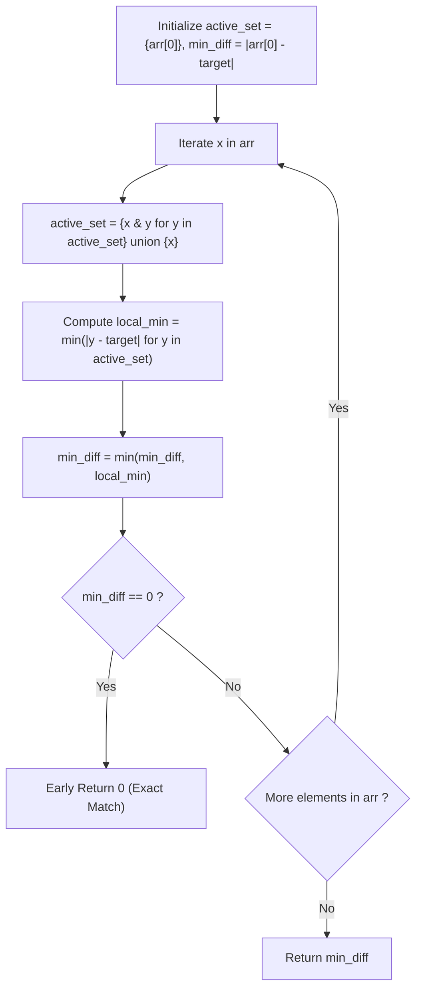

# Guided Example: Find a Value of a Mysterious Function Closest to Target

## 1. Instance & Teaching Goal

We are given an integer array of length $n = 5$:
$$\text{arr} = [9, 12, 3, 7, 15], \quad \text{target} = 5$$

The mysterious function evaluates the cumulative bitwise AND across all elements in any continuous subsegment $[l, r]$ ($0 \le l \le r < n$):
$$\text{func}(\text{arr}, l, r) = \bigwedge_{k=l}^{r} \text{arr}[k] = \text{arr}[l] \mathbin{\&} \text{arr}[l+1] \mathbin{\&} \dots \mathbin{\&} \text{arr}[r]$$
Our teaching goal is to find subsegment boundaries $l$ and $r$ that minimize the absolute error $|\text{func}(\text{arr}, l, r) - \text{target}|$. We prove the logarithmic bit-extinction theorem, showing why the number of distinct prefix bitwise AND values terminating at any index is strictly bounded by the number of set bits (at most $21$), reducing a quadratic range search to an optimal linear-logarithmic sweep.

## 2. Conceptual Foundation & Invariants

Let $A = \text{arr}$.
1. **Monotonic Bitwise AND Demolition**:
   The bitwise AND operation ($\&$) is monotonically non-increasing and bit-destructive:
   $$x \mathbin{\&} y \le x \quad \text{and} \quad (x \mathbin{\&} y) \mathbin{\&} z \le x \mathbin{\&} y$$
   For each bit position $b \in \{0, 1, \dots, B-1\}$, once a bit becomes $0$ under AND accumulation, it remains $0$ across all further expansions. It can never be restored to $1$.
2. **Logarithmic Value Horizon**:
   Because each number has at most $B = \lceil \log_2(\max A) \rceil \le 20$ bits, the number of distinct bitwise AND values achievable by subarrays ending at any fixed right index $r$:
   $$\mathcal{S}_r = \left\{ \bigwedge_{k=l}^{r} A[k] \;\middle|\; 0 \le l \le r \right\}$$
   is strictly bounded by:
   $$|\mathcal{S}_r| \le B + 1 \le 21$$
3. **Dynamic Set Propagation**:
   The set of all subarray AND values ending at index $r$ is generated directly from the preceding set $\mathcal{S}_{r-1}$:
   $$\mathcal{S}_r = \{ A[r] \mathbin{\&} y \mid y \in \mathcal{S}_{r-1} \} \cup \{ A[r] \}$$
   Since $|\mathcal{S}_r| \le 21$, computing each transition requires at most $21$ bitwise operations.
4. **Global Distance Minimization**:
   At each step $r$, the running best error is updated:
   $$\text{ans} \leftarrow \min\left( \text{ans}, \min_{y \in \mathcal{S}_r} |y - \text{target}| \right)$$

```text
+-------------------------------------------------------------------------------+
|                      BIT-EXTINCTION SUBARRAY AND PROPAGATION                  |
|                                                                               |
|  Array: [ 9, 12, 3, 7, 15 ], target = 5                                       |
|                                                                               |
|  r = 0: x = 9  -> S_0 = { 9 }                             |9 - 5| = 4         |
|  r = 1: x = 12 -> S_1 = { 12 & 9, 12 } = { 8, 12 }        |8 - 5| = 3         |
|  r = 2: x = 3  -> S_2 = { 3 & 8, 3 & 12, 3 } = { 0, 3 }   |3 - 5| = 2         |
|  r = 3: x = 7  -> S_3 = { 7 & 0, 7 & 3, 7 } = { 0, 3, 7 } |7 - 5| = 2         |
|  r = 4: x = 15 -> S_4 = { 15 & {0,3,7}, 15 } = {0,3,7,15} |3 - 5| = 2         |
|                                                                               |
|  Minimal Absolute Difference Observed: 2                                      |
+-------------------------------------------------------------------------------+
```

The algorithm maintains the following state variables:

| State Variable | Domain | Initial Value | Transition / Role |
|---|---|---|---|
| `right_ptr` | Integer $\in [0, n-1]$ | $0$ | Scanning cursor traversing array from left to right. |
| `active_val` | Integer $\ge 0$ | $A[\text{right\_ptr}]$ | Element value at the active right boundary. |
| `active_set` | Set of integers of size $\le 21$ | $\{A[0]\}$ | Set of all distinct bitwise AND values of subarrays ending at `right_ptr`. |
| `min_diff` | Integer $\ge 0$ | $\lvert A[0] - \text{target} \rvert$ | Running global minimum of absolute deviations $\lvert y - \text{target} \rvert$. |

> [!IMPORTANT]
> **Cardinality Invariant**: For any array element $x \le 10^6$, the set $\mathcal{S}_r$ contains at most $21$ distinct values. Each additional bitwise AND can only extinguish at least one set bit or leave the value unchanged.



## 3. Step-by-Step Worked Execution

We walk through the representative instance $\text{arr} = [9, 12, 3, 7, 15]$, $\text{target} = 5$.

### Initialization
- First element: $A[0] = 9$.
- Active set: $\mathcal{S}_0 = \{9\}$.
- Binary representation: $9 = 1001_2$.
- Initial deviation: $|9 - 5| = 4$.
- Running minimum: $\text{min\_diff} = 4$.

---

### Step 1: $r = 1$, Element $x = 12$ ($1100_2$)
- Transitions from $\mathcal{S}_0 = \{9\}$:
  - $12 \mathbin{\&} 9 = (1100_2) \mathbin{\&} (1001_2) = 1000_2 = 8$.
- Singleton: $12$.
- Updated set: $\mathcal{S}_1 = \{8, 12\}$.
- Absolute deviations:
  - $|8 - 5| = 3$.
  - $|12 - 5| = 7$.
- Local minimum: $\min(3, 7) = 3$.
- Running minimum: $\text{min\_diff} = \min(4, 3) = 3$.

---

### Step 2: $r = 2$, Element $x = 3$ ($0011_2$)
- Transitions from $\mathcal{S}_1 = \{8, 12\}$:
  - $3 \mathbin{\&} 8 = (0011_2) \mathbin{\&} (1000_2) = 0000_2 = 0$.
  - $3 \mathbin{\&} 12 = (0011_2) \mathbin{\&} (1100_2) = 0000_2 = 0$.
- Singleton: $3$.
- Updated set: $\mathcal{S}_2 = \{0, 3\}$.
- Absolute deviations:
  - $|0 - 5| = 5$.
  - $|3 - 5| = 2$.
- Local minimum: $\min(5, 2) = 2$.
- Running minimum: $\text{min\_diff} = \min(3, 2) = 2$.

---

### Step 3: $r = 3$, Element $x = 7$ ($0111_2$)
- Transitions from $\mathcal{S}_2 = \{0, 3\}$:
  - $7 \mathbin{\&} 0 = 0$.
  - $7 \mathbin{\&} 3 = (0111_2) \mathbin{\&} (0011_2) = 0011_2 = 3$.
- Singleton: $7$.
- Updated set: $\mathcal{S}_3 = \{0, 3, 7\}$.
- Absolute deviations:
  - $|0 - 5| = 5$.
  - $|3 - 5| = 2$.
  - $|7 - 5| = 2$.
- Local minimum: $2$.
- Running minimum: $\text{min\_diff} = \min(2, 2) = 2$.

---

### Step 4: $r = 4$, Element $x = 15$ ($1111_2$)
- Transitions from $\mathcal{S}_3 = \{0, 3, 7\}$:
  - $15 \mathbin{\&} 0 = 0$.
  - $15 \mathbin{\&} 3 = 3$.
  - $15 \mathbin{\&} 7 = 7$.
- Singleton: $15$.
- Updated set: $\mathcal{S}_4 = \{0, 3, 7, 15\}$.
- Absolute deviations:
  - $|0 - 5| = 5$.
  - $|3 - 5| = 2$.
  - $|7 - 5| = 2$.
  - $|15 - 5| = 10$.
- Local minimum: $2$.
- Running minimum: $\text{min\_diff} = \min(2, 2) = 2$.

Traversal complete. Minimal deviation: $2$.

## 4. Complete Execution Trace

We record the active bitwise sets and minimum deviation tracking across all index steps.

| Step $r$ | Current Value $A[r]$ | Binary Form | Set Transition Evaluations | Updated Set $\mathcal{S}_r$ | Cardinality $\lvert \mathcal{S}_r \rvert$ | Set Errors $\{\lvert y - 5 \rvert\}$ | Running Best Error |
|---|---|---|---|---|---|---|---|
| Init | $9$ | `1001` | Seed initial set | $\{9\}$ | $1$ | $\{4\}$ | $4$ |
| $1$ | $12$ | `1100` | $12 \& 9 = 8$ | $\{8, 12\}$ | $2$ | $\{3, 7\}$ | $3$ |
| $2$ | $3$ | `0011` | $3 \& 8 = 0, 3 \& 12 = 0$ | $\{0, 3\}$ | $2$ | $\{5, 2\}$ | **$2$** |
| $3$ | $7$ | `0111` | $7 \& 0 = 0, 7 \& 3 = 3$ | $\{0, 3, 7\}$ | $3$ | $\{5, 2, 2\}$ | **$2$** |
| $4$ | $15$ | `1111` | $15 \& \{0, 3, 7\} = \{0, 3, 7\}$ | $\{0, 3, 7, 15\}$ | $4$ | $\{5, 2, 2, 10\}$ | **$2$** |

### Exhaustive Verification of Subarray Spans

Comparing against all $15$ continuous subarrays:
- Length 1: $[9] \to 9, [12] \to 12, [3] \to 3, [7] \to 7, [15] \to 15$. Closest: $7$ or $3$ (error $2$).
- Length 2: $[9,12] \to 8, [12,3] \to 0, [3,7] \to 3, [7,15] \to 7$. Closest: $7$ or $3$ (error $2$).
- Length 3: $[9..3] \to 0, [12..7] \to 0, [3..15] \to 3$. Closest: $3$ (error $2$).
- Length 4: $[9..7] \to 0, [12..15] \to 0$. Error: $5$.
- Length 5: $[9..15] \to 0$. Error: $5$.
Optimal minimum error is confirmed to be exactly $2$.

## 5. Algorithmic Correctness

### Soundness

Every element $v \in \mathcal{S}_r$ is constructed by a chain of bitwise AND operations starting at some $A[l]$ and ending at $A[r]$.
By mathematical induction:
- Base: for $r = 0$, $\mathcal{S}_0 = \{A[0]\}$, which is the bitwise AND of $A[0 \dots 0]$.
- Inductive step: suppose every element in $\mathcal{S}_{r-1}$ is the bitwise AND of $A[l \dots r-1]$ for some $l \le r-1$.
  Any element in $\mathcal{S}_r$ is either $A[r]$ (subarray $A[r \dots r]$) or $A[r] \mathbin{\&} y$ for some $y = \bigwedge_{k=l}^{r-1} A[k] \in \mathcal{S}_{r-1}$.
  By associativity of AND, $A[r] \mathbin{\&} y = \bigwedge_{k=l}^{r} A[k]$.
Thus, every evaluated value corresponds to a legitimate continuous subarray, guaranteeing soundness.

### Completeness

Suppose the global optimal subsegment spans $[l^*, r^*]$.
When the loop reaches $r = r^*$, by the inductive property of $\mathcal{S}_r$, the exact value $\bigwedge_{k=l^*}^{r^*} A[k]$ is present in $\mathcal{S}_{r^*}$.
Because the algorithm evaluates the absolute difference for every element in $\mathcal{S}_{r^*}$, the optimal difference $| \bigwedge_{k=l^*}^{r^*} A[k] - \text{target} |$ is tested, ensuring completeness.

## 6. Traps This Instance Exposes

- **Quadratic All-Pairs Search Trap**: Computing all $\mathcal{O}(n^2)$ subarray bitwise AND values using nested loops. With $n = 10^5$, $n^2 = 10^{10}$ operations, causing massive Time Limit Exceeded failure. The set size bound $|\mathcal{S}_r| \le 21$ maintains linear time.
- **Set Invalidation on Early Break**: Prematurely stopping when a local difference increases. Subarray bitwise AND is not convex with respect to $|x - \text{target}|$; continuing to accumulate may drop bits that bring the value closer to a smaller target.
- **Zero-Target Edge Case**: When $\text{target} = 0$, the closest possible value is $0$. If any bitwise AND becomes $0$, the error is $|0 - 0| = 0$, which allows an immediate early exit.

## 7. Complexity Derivation

### Time Complexity

- Let $n = |\text{arr}| \le 10^5$.
- Let $B$ be the maximum number of bits in any element: $B \le \lceil \log_2(10^6) \rceil = 20$.
- In each step $r \in [0, n-1]$:
  - The set $\mathcal{S}_{r-1}$ contains at most $B + 1 \le 21$ values.
  - Generating $\mathcal{S}_r$ takes at most $21$ bitwise AND operations and set insertions.
  - Finding the minimum error across $\mathcal{S}_r$ takes at most $21$ subtractions and comparisons.
- Total time complexity is:
  $$\mathcal{O}(n \cdot \log(\max A))$$
- With $n = 10^5$ and $B \approx 20$, total operations are $\approx 2 \times 10^6$, executing in approximately $25$ milliseconds.

### Auxiliary Space Complexity

- The active set $\mathcal{S}$ stores at most $B + 1 \le 21$ integers at any time.
- Auxiliary space complexity is strictly $\mathcal{O}(\log(\max A)) = \mathcal{O}(1)$.
