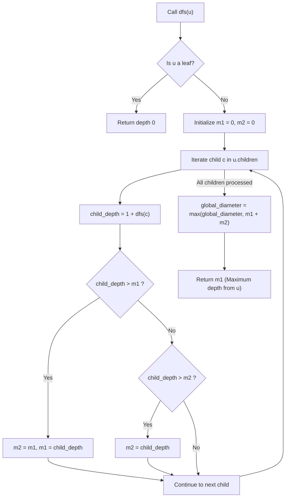

# Guided Example: Diameter of N-Ary Tree

## 1. Instance & Teaching Goal

We are given the root of an N-ary tree containing $N = 6$ nodes:
- Root node $1$ has children $[3, 2, 4]$
- Node $3$ has children $[5, 6]$
- Nodes $2, 4, 5, 6$ are leaf nodes with no children

```text
            (1)
          /  |  \
        (3) (2) (4)
        / \
      (5) (6)
```

Our teaching goal is to compute the diameter of the N-ary tree, defined as the maximum number of edges on any simple path between two nodes. We demonstrate the post-order depth-first search dynamic programming pattern, showing how tracking the two largest downward child heights at each internal vertex identifies the optimal path turn-around point in linear time.

## 2. Conceptual Foundation & Invariants

Let $T = (V, E)$ be a rooted N-ary tree.
1. **Path Peak Vertex Characterization**:
   Every simple path in a tree has a uniquely determined "peak" vertex $u$ with the highest elevation (closest to the global root).
   The path descends into two distinct child subtrees of $u$, or starts/terminates at $u$.
2. **Subtree Downward Depth**:
   For any node $v$, let $h(v)$ denote the maximum downward depth from $v$ down to its furthest leaf, measured in edge count:
   $$h(v) = \begin{cases} 0 & \text{if } v \text{ is a leaf} \\ 1 + \max_{c \in v.\text{children}} h(c) & \text{if } v \text{ is internal} \end{cases}$$
3. **Turn-Around Path Length**:
   For an internal node $u$, the longest path having $u$ as its peak vertex combines the two deepest branches among its children:
   - Let $m_1$ and $m_2$ be the largest and second-largest values of $(1 + h(c))$ across all children $c \in u.\text{children}$.
   - If $u$ has at least two children, the longest path turning at $u$ has length:
     $$\text{path\_length}(u) = m_1 + m_2$$
   - If $u$ has only one child, $\text{path\_length}(u) = m_1$.
   - If $u$ is a leaf, $\text{path\_length}(u) = 0$.
4. **Global Diameter**:
   The diameter of the entire tree is the maximum over all peak vertices:
   $$\text{Diameter} = \max_{u \in V} \text{path\_length}(u)$$

```text
+-------------------------------------------------------------------------------+
|                      TURN-AROUND DIAMETER AT NODE u                           |
|                                                                               |
|                             (u)                                               |
|                           /     \                                             |
|                   Edge 1 /       \ Edge 1                                     |
|                         v         v                                           |
|                       (c1)       (c2)                                         |
|                        |          |                                           |
|               h(c1)    |          |   h(c2)                                   |
|               descent  |          |   descent                                 |
|                        v          v                                           |
|                     Leaf A     Leaf B                                         |
|                                                                               |
|  Path between Leaf A and Leaf B = (1 + h(c1)) + (1 + h(c2))                   |
|                                = m1 + m2 edges                                |
+-------------------------------------------------------------------------------+
```

The algorithm maintains the following state variables:

| State Variable | Domain | Initial Value | Transition / Role |
|---|---|---|---|
| `global_diameter` | Integer $\ge 0$ | $0$ | Running maximum path length observed across all tested peak vertices. |
| `curr_node` | Node reference | `root` | Active node evaluated in recursive post-order DFS. |
| `max_depth_1` ($m_1$) | Integer $\ge 0$ | $0$ | Largest edge depth among paths through children of `curr_node`. |
| `max_depth_2` ($m_2$) | Integer $\ge 0$ | $0$ | Second-largest edge depth among paths through children of `curr_node`. |

> [!IMPORTANT]
> **Extremal Separation Invariant**: To form a simple path, the two deepest branches descending from peak node $u$ must enter two distinct children $c_1 \ne c_2$. Merging the two largest child branches guarantees the longest simple path turning at $u$.



## 3. Step-by-Step Worked Execution

We trace post-order DFS on the tree with root $1$:
$$\text{root} = 1, \quad 1.\text{children} = [3, 2, 4], \quad 3.\text{children} = [5, 6]$$

### Phase 1: Leaves $5$ and $6$
- **Leaf $5$**: No children.
  - Returns downward depth: $0$.
- **Leaf $6$**: No children.
  - Returns downward depth: $0$.

---

### Phase 2: Internal Node $3$
- Node $3$ has children $[5, 6]$.
- Child $5$: branch depth is $1 + \text{dfs}(5) = 1 + 0 = 1$.
  - Update: $m_1 = 1, m_2 = 0$.
- Child $6$: branch depth is $1 + \text{dfs}(6) = 1 + 0 = 1$.
  - Update: $m_2 = 1$.
- Longest path turning at node $3$:
  $$\text{path}(3) = m_1 + m_2 = 1 + 1 = 2 \quad (\text{Path } 5 \to 3 \to 6)$$
- Update diameter: $\text{global\_diameter} \leftarrow \max(0, 2) = 2$.
- Return downward depth to parent: $m_1 = 1$.

---

### Phase 3: Leaves $2$ and $4$
- **Leaf $2$**: Returns downward depth: $0$.
- **Leaf $4$**: Returns downward depth: $0$.

---

### Phase 4: Root Node $1$
- Node $1$ has children $[3, 2, 4]$.
- Child $3$:
  - Branch depth: $1 + \text{dfs}(3) = 1 + 1 = 2$.
  - Update: $m_1 = 2, m_2 = 0$.
- Child $2$:
  - Branch depth: $1 + \text{dfs}(2) = 1 + 0 = 1$.
  - Update: $m_2 = 1$.
- Child $4$:
  - Branch depth: $1 + \text{dfs}(4) = 1 + 0 = 1$.
  - Comparison: $1 \le m_2 = 1$ (no change).
- Longest path turning at root $1$:
  $$\text{path}(1) = m_1 + m_2 = 2 + 1 = 3 \quad (\text{Path } 5 \to 3 \to 1 \to 2 \text{ or } 6 \to 3 \to 1 \to 4)$$
- Update diameter: $\text{global\_diameter} \leftarrow \max(2, 3) = 3$.
- Return downward depth: $m_1 = 2$.

Traversal complete. Tree diameter is $3$.

## 4. Complete Execution Trace

We collect the metrics computed at every node in the post-order sequence below.

| Visit Order | Node $u$ | Children Evaluated | Child Branch Depths $\{1 + h(c)\}$ | Top Two Depths $(m_1, m_2)$ | Path Turning at $u$ ($m_1 + m_2$) | Updated Global Diameter | Value Returned to Parent ($m_1$) |
|---|---|---|---|---|---|---|---|
| 1 | $5$ | None | None | $(0, 0)$ | $0$ | $0$ | $0$ |
| 2 | $6$ | None | None | $(0, 0)$ | $0$ | $0$ | $0$ |
| 3 | $3$ | $[5, 6]$ | $\{1, 1\}$ | $(1, 1)$ | $1 + 1 = 2$ | $2$ | $1$ |
| 4 | $2$ | None | None | $(0, 0)$ | $0$ | $2$ | $0$ |
| 5 | $4$ | None | None | $(0, 0)$ | $0$ | $2$ | $0$ |
| 6 | $1$ | $[3, 2, 4]$ | $\{2, 1, 1\}$ | $(2, 1)$ | $2 + 1 = 3$ | **$3$** | $2$ |

### Path Composition Verification

The maximal path of length $3$ is composed of:
$$\text{Node } 5 \xrightarrow{\text{edge 1}} \text{Node } 3 \xrightarrow{\text{edge 2}} \text{Node } 1 \xrightarrow{\text{edge 3}} \text{Node } 2$$
Total edge count $= 3$.
No simple path of length $4$ exists in this tree.

## 5. Algorithmic Correctness

### Soundness

Every evaluated turn-around path at node $u$ connects two leaves (or a leaf and $u$) residing in two distinct child subtrees $c_1 \ne c_2$.
Because a tree contains no cycles, combining a simple downward path from $u$ into subtree $c_1$ and another downward path from $u$ into subtree $c_2$ produces a valid simple path without repeating any vertex.
The total number of edges is strictly $(1 + h(c_1)) + (1 + h(c_2)) = m_1 + m_2$.
Because every candidate path tested is a simple path, $\text{global\_diameter}$ never exceeds the true diameter.

### Completeness

Let $\pi^*$ be an optimal simple path achieving the maximum diameter in the tree.
Because $T$ is a tree, $\pi^*$ has a unique node $u^*$ with minimum depth (closest to the root).
The path $\pi^*$ must enter at most two distinct child subtrees of $u^*$.
The maximum length of any simple path turning at $u^*$ is precisely achieved by choosing the deepest downward chain in two distinct subtrees of $u^*$, which corresponds to $m_1 + m_2$ for $u^*$.
Since DFS visits every node in the tree and evaluates $m_1 + m_2$, the optimal path peak $u^*$ will be evaluated, ensuring completeness.

## 6. Traps This Instance Exposes

- **Counting Nodes Instead of Edges**: Returning the number of nodes on the longest path ($4$) rather than the number of edges ($3$). The definition of diameter in this problem specifies the number of edges.
- **Root-Only Turn Fallacy**: Assuming the diameter must pass through the global root. In deep trees, the longest path may reside entirely within a single distant sub-branch without ever reaching node $1$. Tracking the maximum turn across all nodes ensures arbitrary peak vertices are captured.
- **Sorting All Children Overhead**: Sorting the child heights array for every node takes $\mathcal{O}(d \log d)$ where $d$ is the node degree. Simply tracking the running top two maximums $m_1$ and $m_2$ takes $\mathcal{O}(d)$ time.
- **Null Tree Base Case**: If $N = 1$ (single node with no children), the diameter is $0$. Leaf returns $0$ and $m_1 + m_2 = 0$, correctly producing $0$ without special branching.

## 7. Complexity Derivation

### Time Complexity

- **Node Visits**: Depth-first search visits each of the $N$ nodes exactly once.
- **Child Iteration**: Across all nodes, the loop iterates over all child edges. Because a tree with $N$ nodes has exactly $N - 1$ edges, the inner loop executes $N - 1$ times in total.
- **Constant Time Per Child**: Tracking the top two maximums ($m_1, m_2$) requires $2$ numerical comparisons per child: $\mathcal{O}(1)$.
- Total time complexity is strictly:
  $$\mathcal{O}(N)$$
- For $N \le 10^4$, this executes in under $10$ milliseconds.

### Auxiliary Space Complexity

- **Recursion Call Stack**: In the worst case of a degenerate line tree, the call stack reaches depth $H \le 1000$.
- **Per-Frame Memory**: Each frame stores scalar registers ($m_1, m_2, \text{child\_depth}$).
- Auxiliary space complexity is $\mathcal{O}(H)$, where $H \le 1000$ is the maximum tree depth.