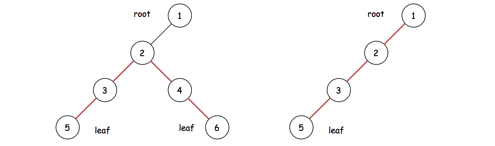
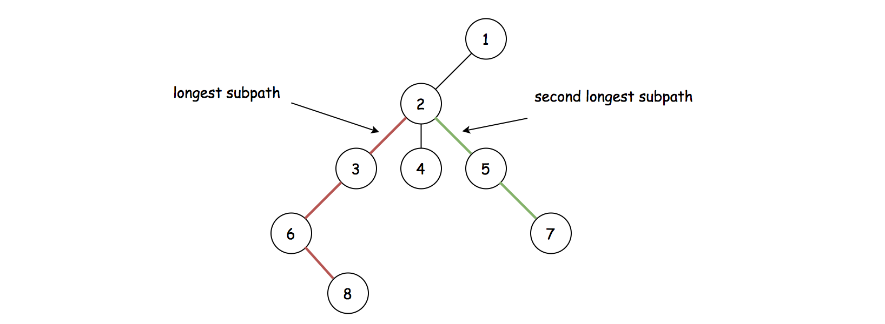
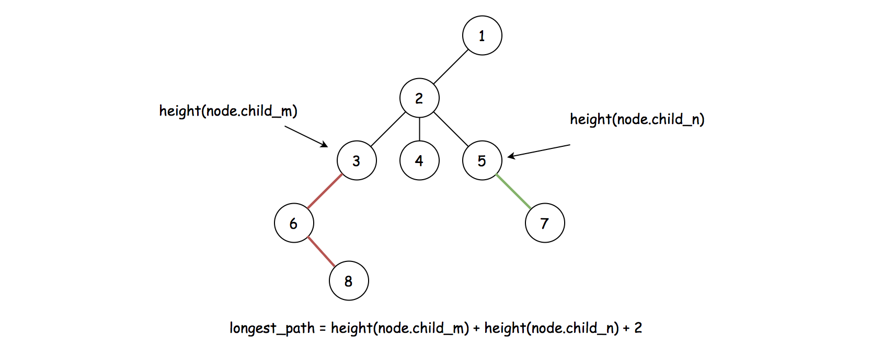
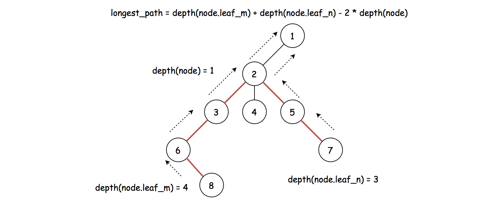

## Solution

---
### Overview

We are asked to calculate the diameter of a N-ary tree, which is defined as the **longest path** between any two nodes in the tree.

At first glance, it seems that we might have to enumerate all pairs of nodes, in order to find out the longest path.

Yet, there are certain insights that would allow us to dramatically reduce the scope of enumeration.

>The first insight is that the longest path in a tree can only happen between two **leaves** nodes or between a leaf node and the **root** node.



>The second insight is that each non-leaf node acts as a **bridge** for the paths between its **_descendant leaves_** nodes.
If we pick two longest sub-paths from a non-leaf node to its descendant leaves nodes, and combine them together, then the resulting path would be the longest path among all possible ones that are _bridged_ by this non-leaf node.



As one could see from the above graph, the longest path of the tree would be one of the combined paths from the top two longest sub-paths _bridged_ by a non-leaf node (node `2` in the above graph).

>With the above insights, to find the diameter of the tree, it suffices to enumerate all non-leaf nodes and select the top two longest sub-paths bridged by each non-leaf node.

The above idea could be implemented with the help of two important concepts in the tree data structure, namely the **[height](https://en.wikipedia.org/wiki/Tree_(data_structure)#Terminology)** and **[depth](https://en.wikipedia.org/wiki/Tree_(data_structure)#Terminology)** of a node.

In this article, we will present two algorithms with regards to the concept of height and depth respectively.

---
### Approach 1: Distance with Height

**Intuition**

>The **_height_** of a node is defined as the length of the longest downward path to a leaf node from that node.

Based on the above definition, a leaf node will have a height of zero.

As we explained in the overview section, the longest path that is bridged by a non-leaf node will come from the combination of two longest **sub-paths** downward to the leaves nodes from this non-leaf node.

As one might see now, the _sub-paths_ that we mentioned above consist of the top two largest heights of the children nodes.

If we define the top two largest heights of the children nodes as $height(node.\text{child}_{m})$ and $height(node.\text{child}_{n})$, then the longest path bridged by this node would be $height(node.\text{child}_{m}) + height(node.\text{child}_{n}) + 2$.



**Algorithm**

Let us first define a function called `height(node)` which returns the height of the node.
The function can be implemented via recursion, based on the following formula:

$\text{height(node)} = \max\big(\text{height(child)}\big) + 1, \space \forall \text{child} \in \text{node.children}$

More importantly, within the function of `height(node)`, we need to select the top two largest _heights_ of its children nodes.
With these top two largest heights, we calculate the length of the combined path, which would be the candidate as the _diameter_ of the entire tree.

There are two ways to select the top two largest heights:

- A straight-forward way would be that we keep the heights of all children nodes in an array, and then we **sort** the array and select the top two largest elements.

- A constant-space solution would be that we use only two variables which keep track of the current top two largest elements respectively. While we iterate through all the heights, we **_update_** the two variables accordingly.

In the following implementation, we opt for the second approach.

```python
"""
# Definition for a Node.
class Node:
    def __init__(self, val=None, children=None):
        self.val = val
        self.children = children if children is not None else []
"""
class Solution:
    def diameter(self, root: 'Node') -> int:
        diameter = 0

        def height(node):
            """ return the height of the node """
            nonlocal diameter

            if len(node.children) == 0:
                return 0

            # select the top two heights
            max_height_1, max_height_2 = 0, 0
            for child in node.children:
                parent_height = height(child) + 1
                if parent_height > max_height_1:
                    max_height_1, max_height_2 = parent_height, max_height_1
                elif parent_height > max_height_2:
                    max_height_2 = parent_height

            # calculate the distance between the two farthest leaves nodes.
            distance = max_height_1 + max_height_2
            diameter = max(diameter, distance)

            return max_height_1

        height(root)
        return diameter
```

**Complexity Analysis**

Let $N$ be the number of nodes in the tree.

- Time Complexity: $\mathcal{O}(N)$

- We enumerate each node in the tree once and only once via recursion.

- Space Complexity: $\mathcal{O}(N)$

- We employed only constant-sized variables in the algorithm.

- On the other hand, we used recursion which will incur additional memory consumption in the function call stack.
    In the worst case where all the nodes are chained up in a single path, the recursion will pile up $N$ times.

- As a result, the overall space complexity of the algorithm is $\mathcal{O}(N)$.

---
### Approach 2: Distance with Depth

**Intuition**

>The **depth** of a node is the length of the path to the **root** node.

Still, we would like to know the longest path between two leaves nodes _bridged_ by a non-leaf node.
But this time we could calculate it with the concept of depth, rather than height.

If we know the top two largest depths among two leaves nodes starting from the node, namely $depth(node.\text{leaf}_{m})$ and $depth(node.\text{leaf}_{n})$, then this longest path could be calculated as the sum of top two largest depths minus the depth of the parent node, namely
$depth(node.\text{leaf}_{m}) + depth(node.\text{leaf}_{n}) - 2 * depth(node)$.



**Algorithm**

Let us define a function called `maxDepth(node)` which returns the maximum depth of the leaves nodes starting from the node.

Again, we could implement it with recursion, with the following formula:

$\text{maxDepth(node)} = \max\big(\text{maxDepth(node.child)}\big), \space \forall \text{child} \in \text{node.children}$

Similarly, within the function, we will also select the top two largest depths.
With these top two largest depths, we will update the diameter accordingly.

```python
"""
# Definition for a Node.
class Node:
    def __init__(self, val=None, children=None):
        self.val = val
        self.children = children if children is not None else []
"""
class Solution:
    def diameter(self, root: 'Node') -> int:
        """
        :type root: 'Node'
        :rtype: int
        """
        diameter = 0

        def maxDepth(node, curr_depth):
            """ return the maximum depth of leaves nodes
                 descending from the current node
            """
            nonlocal diameter

            if len(node.children) == 0:
                return curr_depth

            # select the top 2 depths from its children
            max_depth_1, max_depth_2 = curr_depth, 0
            for child in node.children:
                depth = maxDepth(child, curr_depth+1)
                if depth > max_depth_1:
                    max_depth_1, max_depth_2 = depth, max_depth_1
                elif depth > max_depth_2:
                    max_depth_2 = depth

            # calculate the distance between the two farthest leaves nodes
            distance = max_depth_1 + max_depth_2 - 2 * curr_depth
            diameter = max(diameter, distance)

            return max_depth_1

        maxDepth(root, 0)
        return diameter
```

**Complexity Analysis**

Let $N$ be the number of nodes in the tree.

- Time Complexity: $\mathcal{O}(N)$

- We enumerate each node in the tree once and only once via recursion.

- Space Complexity: $\mathcal{O}(N)$

- We employed only constant-sized variables in the algorithm.

- On the other hand, we used recursion which will incur additional memory consumption in the function call stack.
    In the worst case where all the nodes are chained up in a single path, the recursion will pile up $N$ times.

- As a result, the overall space complexity of the algorithm is $\mathcal{O}(N)$.

---