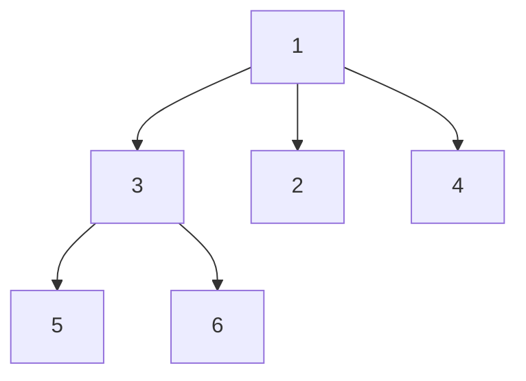
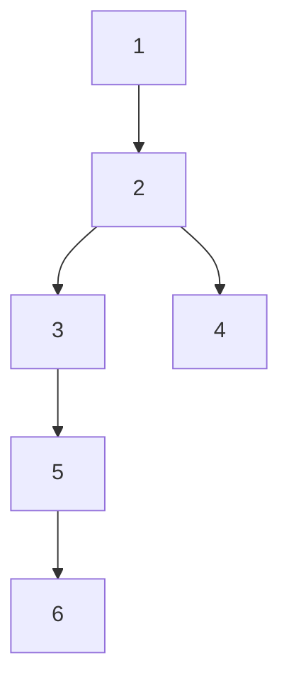

## Examples

**Example 1**

- **Input:** `root = [1,null,3,2,4,null,5,6]`

- **Output:** `3`
- **Explanation:** A longest path connects node `5` (or `6`) to node `2` (or `4`) via node `3` and root `1`, containing 3 edges.

**Example 2**

- **Input:** `root = [1,null,2,null,3,4,null,5,null,6]`

- **Output:** `4`
- **Explanation:** The path from node `6` to node `4` contains 4 edges (6 -> 5 -> 3 -> 2 -> 4).

**Example 3**

- **Input:** `root = [1]`
- **Output:** `0`
- **Explanation:** A single node has no edges, so the diameter is 0.
