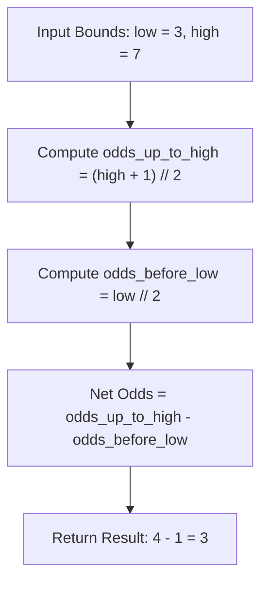

# Guided Example: Count Odd Numbers in an Interval Range

## 1. Instance & Teaching Goal

We are given two non-negative integers defining a closed inclusive interval:
$$low = 3, \quad high = 7$$

Our teaching goal is to determine the exact number of odd integers lying within the range $[low, high]$. We formulate the counting problem through prefix difference arithmetic, proving why computing odd counts over the half-open rays $[0, x]$ yields an exact $\mathcal{O}(1)$ time closed-form expression:
$$\text{countOdds}(low, high) = \left\lfloor \frac{high + 1}{2} \right\rfloor - \left\lfloor \frac{low}{2} \right\rfloor$$

## 2. Conceptual Foundation & Invariants

Integers alternate strictly between even and odd parities along the number line:
$$\dots, \text{even}, \text{odd}, \text{even}, \text{odd}, \dots$$

1. **Prefix Odd Counting Function**:
   Let $f(n)$ denote the number of positive odd integers in the range $[1, n]$:
   - For $n = 0$: $f(0) = 0$.
   - For $n = 1$: $\{1\} \implies f(1) = 1$.
   - For $n = 2$: $\{1\} \implies f(2) = 1$.
   - For $n = 3$: $\{1, 3\} \implies f(3) = 2$.
   - For $n = 4$: $\{1, 3\} \implies f(4) = 2$.
   In general, exactly half of the integers in any even length interval $[1, 2k]$ are odd. When $n$ is odd, the final integer is odd.
   This is captured in the closed-form prefix function:
   $$f(n) = \left\lfloor \frac{n + 1}{2} \right\rfloor = (n + 1) \gg 1$$
2. **Interval Difference Property**:
   By the principle of prefix subtraction, the count of odd numbers in $[low, high]$ equals:
   $$\text{count}(low, high) = f(high) - f(low - 1)$$
   Substituting $f(n)$:
   $$f(low - 1) = \left\lfloor \frac{(low - 1) + 1}{2} \right\rfloor = \left\lfloor \frac{low}{2} \right\rfloor = low \gg 1$$
   Therefore:
   $$\text{count}(low, high) = \left\lfloor \frac{high + 1}{2} \right\rfloor - \left\lfloor \frac{low}{2} \right\rfloor = ((high + 1) \gg 1) - (low \gg 1)$$

```text
+-------------------------------------------------------------------------------+
|                       PREFIX PARITY DECOMPOSITION                             |
|                                                                               |
|  Full Ray [0, 7]:                                                             |
|    0   [1]   2   [3]   4   [5]   6   [7]                                      |
|    Odds in [0, 7]: { 1, 3, 5, 7 } -> Count = floor((7 + 1) / 2) = 4           |
|                                                                               |
|  Excluded Prefix [0, 2]:                                                      |
|    0   [1]   2                                                                |
|    Odds in [0, 2]: { 1 }          -> Count = floor(3 / 2) = 1                 |
|                                                                               |
|  Target Range [3, 7]:                                                         |
|    { 1, 3, 5, 7 } - { 1 } = { 3, 5, 7 } -> Net Count = 4 - 1 = 3              |
+-------------------------------------------------------------------------------+
```

The algorithm maintains the following state variables:

| State Variable | Domain | Initial Value | Transition / Role |
|---|---|---|---|
| `high_bound` | Integer $\ge 0$ | $high$ | Upper endpoint of the inclusive interval. |
| `low_bound` | Integer $\ge 0$ | $low$ | Lower endpoint of the inclusive interval. |
| `odds_up_to_high` | Integer $\ge 0$ | $(high + 1) \gg 1$ | Cumulative count of odd numbers in $[0, high]$. |
| `odds_before_low` | Integer $\ge 0$ | $low \gg 1$ | Cumulative count of odd numbers in $[0, low - 1]$. |

> [!IMPORTANT]
> **Boundary Exclusivity Invariant**: To count elements in the inclusive range $[low, high]$, subtracting the prefix count at $low - 1$ preserves the element at $low$. The formula $\lfloor low / 2 \rfloor$ precisely counts odd numbers strictly strictly preceding $low$.



## 3. Step-by-Step Worked Execution

We walk through the representative instance $low = 3, high = 7$.

### Step 1: Evaluate Odd Numbers up to $high = 7$

We calculate the number of odd numbers in $[1, 7]$:
$$\text{odds\_up\_to\_high} = \left\lfloor \frac{7 + 1}{2} \right\rfloor = \left\lfloor \frac{8}{2} \right\rfloor = 4$$
Explicit odd elements in $[1, 7]$:
$$\{1, 3, 5, 7\} \implies 4 \text{ odd numbers}$$

### Step 2: Evaluate Odd Numbers Strictly Preceding $low = 3$

We calculate the number of odd numbers in $[1, low - 1] = [1, 2]$:
$$\text{odds\_before\_low} = \left\lfloor \frac{low}{2} \right\rfloor = \left\lfloor \frac{3}{2} \right\rfloor = 1$$
Explicit odd elements in $[1, 2]$:
$$\{1\} \implies 1 \text{ odd number}$$

### Step 3: Prefix Difference

We subtract the excluded prefix count from the cumulative total:
$$\text{ans} = \text{odds\_up\_to\_high} - \text{odds\_before\_low} = 4 - 1 = 3$$

The odd numbers in $[3, 7]$ are $\{3, 5, 7\}$, totaling $3$.

## 4. Complete Execution Trace

We collect the evaluation steps and contrast them against different parity boundary combinations.

| Test Interval $[low, high]$ | $low$ Parity | $high$ Parity | Total Integers | `odds_up_to_high` $\lfloor (high+1)/2 \rfloor$ | `odds_before_low` $\lfloor low/2 \rfloor$ | Difference Result | Explicit Odd Elements |
|---|---|---|---|---|---|---|---|
| $[3, 7]$ | Odd | Odd | $5$ | $\lfloor 8/2 \rfloor = 4$ | $\lfloor 3/2 \rfloor = 1$ | $4 - 1 = \mathbf{3}$ | $\{3, 5, 7\}$ |
| $[8, 10]$ | Even | Even | $3$ | $\lfloor 11/2 \rfloor = 5$ | $\lfloor 8/2 \rfloor = 4$ | $5 - 4 = \mathbf{1}$ | $\{9\}$ |
| $[3, 6]$ | Odd | Even | $4$ | $\lfloor 7/2 \rfloor = 3$ | $\lfloor 3/2 \rfloor = 1$ | $3 - 1 = \mathbf{2}$ | $\{3, 5\}$ |
| $[4, 7]$ | Even | Odd | $4$ | $\lfloor 8/2 \rfloor = 4$ | $\lfloor 4/2 \rfloor = 2$ | $4 - 2 = \mathbf{2}$ | $\{5, 7\}$ |
| $[0, 0]$ | Even | Even | $1$ | $\lfloor 1/2 \rfloor = 0$ | $\lfloor 0/2 \rfloor = 0$ | $0 - 0 = \mathbf{0}$ | $\emptyset$ |

### Mathematical Parity Exhaustion Analysis

Let $L = high - low + 1$ denote the length of the interval $[low, high]$:
- If $L$ is even: exactly half the numbers are odd, so count is $\frac{L}{2}$.
- If $L$ is odd:
  - If $low$ and $high$ are both odd: the interval starts and ends with an odd number, containing $\frac{L - 1}{2} + 1$ odds.
  - If $low$ and $high$ are both even: the interval starts and ends with an even number, containing $\frac{L - 1}{2}$ odds.
The single closed-form $\lfloor (high + 1) / 2 \rfloor - \lfloor low / 2 \rfloor$ unifies all four parity cases without requiring conditional branching.

## 5. Algorithmic Correctness

### Soundness

The function $f(x) = \lfloor (x + 1) / 2 \rfloor$ satisfies:
$$f(x) = \sum_{k=1}^{x} [k \text{ is odd}]$$
By the fundamental theorem of finite differences:
$$\sum_{k=low}^{high} [k \text{ is odd}] = \sum_{k=1}^{high} [k \text{ is odd}] - \sum_{k=1}^{low-1} [k \text{ is odd}] = f(high) - f(low - 1)$$
Substituting $low - 1$ into $f$:
$$f(low - 1) = \left\lfloor \frac{(low - 1) + 1}{2} \right\rfloor = \left\lfloor \frac{low}{2} \right\rfloor$$
Thus, $f(high) - f(low - 1) = \lfloor (high + 1) / 2 \rfloor - \lfloor low / 2 \rfloor$ is exact and sound.

### Completeness

The derivation makes no assumptions regarding bounds beyond $0 \le low \le high$, handling all parity combinations, zero endpoints ($low = 0$), and singleton intervals ($low = high$).

## 6. Traps This Instance Exposes

- **Linear Iteration TLE**: Looping from $low$ to $high$ with `for i in range(low, high + 1): if i % 2: count += 1`. When $high = 10^9$ and $low = 0$, a loop executes $10^9$ iterations, resulting in Time Limit Exceeded. The constant-time formula executes in 1 clock cycle.
- **Prefix Off-by-One Error**: Using $f(low)$ instead of $f(low - 1)$. Subtracting $f(low)$ would exclude $low$ from the count if $low$ is odd, missing the first valid odd number.
- **Floating-Point Division Inaccuracy**: Using float division `/` instead of integer floor division `//` or bitwise right-shift `>>`. For numbers near $10^9$, float division can lose integer precision in lower bits.

## 7. Complexity Derivation

### Time Complexity

- Computing $(high + 1) \gg 1$ takes $1$ addition and $1$ bitwise shift: $\mathcal{O}(1)$.
- Computing $low \gg 1$ takes $1$ bitwise shift: $\mathcal{O}(1)$.
- Subtracting the two values takes $1$ subtraction: $\mathcal{O}(1)$.
- Total time complexity is strictly $\mathcal{O}(1)$.

### Auxiliary Space Complexity

- The calculation uses only the input registers.
- Auxiliary space complexity is strictly $\mathcal{O}(1)$.
