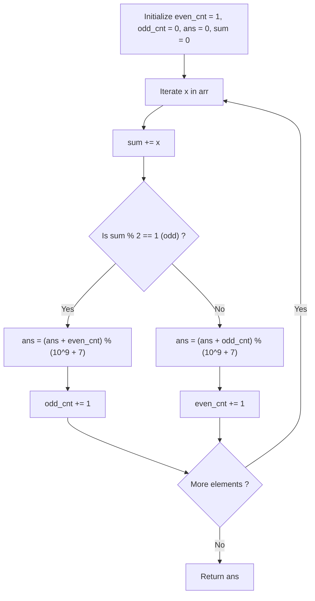

# Guided Example: Number of Sub-arrays With Odd Sum

## 1. Instance & Teaching Goal

We are given an array of positive integers:
$$\text{arr} = [1, 3, 5]$$

Our teaching goal is to compute the total number of continuous subsegments whose elements sum to an odd number, returning the result modulo $10^9 + 7$. We examine the parity duality of prefix sums, demonstrating why an odd subsegment is formed if and only if its bounding prefix sums have opposing parities, and trace the optimal single-pass $\mathcal{O}(n)$ streaming counter.

## 2. Conceptual Foundation & Invariants

Let $A = \text{arr}$ be an array of length $n$.
1. **Prefix Sum Parity Duality**:
   Let $P[k] = \sum_{i=0}^{k-1} A[i]$ denote the prefix sum of the first $k$ elements, with base $P[0] = 0$ (which is even).
   The sum of any contiguous subarray spanning indices $[l, r]$ ($0 \le l \le r < n$) is given by:
   $$\text{Sum}(l, r) = P[r + 1] - P[l]$$
2. **Parity Difference Rule**:
   The difference between two integers is odd if and only if they have different parities:
   $$\text{Sum}(l, r) \equiv 1 \pmod 2 \iff P[r + 1] \not\equiv P[l] \pmod 2$$
   - If $P[r + 1]$ is odd, any preceding $P[l]$ that is even yields an odd subarray sum.
   - If $P[r + 1]$ is even, any preceding $P[l]$ that is odd yields an odd subarray sum.
3. **Streaming Parity Counters**:
   We maintain two frequency counters:
   - $\text{cnt}[0]$: Number of observed prefix sums with even parity.
   - $\text{cnt}[1]$: Number of observed prefix sums with odd parity.
   Initial base: before reading any elements, the empty prefix $P[0] = 0$ is even, so $\text{cnt}[0] = 1$ and $\text{cnt}[1] = 0$.
   For each incoming element $A[r]$:
   - Update running prefix sum $s \leftarrow s + A[r]$.
   - Let $p = s \bmod 2$ denote the parity of $P[r+1]$.
   - The number of valid odd subarrays terminating at index $r$ is exactly the count of previously seen prefixes having opposite parity $p \oplus 1$:
     $$\Delta_{\text{ans}} = \text{cnt}[p \oplus 1]$$
   - We accumulate $\Delta_{\text{ans}}$ into `ans` modulo $10^9 + 7$, and increment $\text{cnt}[p] \leftarrow \text{cnt}[p] + 1$.

```text
+-------------------------------------------------------------------------------+
|                       PREFIX SUM PARITY COMPLEMENTARITY                       |
|                                                                               |
|  Prefix Array: P[0]=0 (even)                                                  |
|                                                                               |
|  Index r = 0: x = 1 -> P[1] = 1 (odd)                                         |
|    Opposing prior prefixes: Even prefixes -> cnt[0] = 1                       |
|    Odd subarrays terminating at 0: P[1] - P[0] = 1 - 0 = 1 (Odd)              |
|                                                                               |
|  Index r = 1: x = 3 -> P[2] = 4 (even)                                        |
|    Opposing prior prefixes: Odd prefixes -> cnt[1] = 1                        |
|    Odd subarrays terminating at 1: P[2] - P[1] = 4 - 1 = 3 (Odd)              |
|                                                                               |
|  Index r = 2: x = 5 -> P[3] = 9 (odd)                                         |
|    Opposing prior prefixes: Even prefixes -> cnt[0] = 2 (P[0], P[2])          |
|    Odd subarrays terminating at 2:                                            |
|      - P[3] - P[0] = 9 - 0 = 9 (Odd)                                          |
|      - P[3] - P[2] = 9 - 4 = 5 (Odd)                                          |
+-------------------------------------------------------------------------------+
```

The algorithm maintains the following state variables:

| State Variable | Domain | Initial Value | Transition / Role |
|---|---|---|---|
| `running_sum` | Integer $\ge 0$ | $0$ | Running cumulative sum of array elements. |
| `even_prefixes` | Integer $\ge 0$ | $1$ | Count of prefix sums with parity $0$ (initialized to $1$ for $P[0]=0$). |
| `odd_prefixes` | Integer $\ge 0$ | $0$ | Count of prefix sums with parity $1$. |
| `total_odd_subarrays` | Integer $\ge 0$ | $0$ | Cumulative sum of odd subarrays discovered modulo $10^9 + 7$. |

> [!IMPORTANT]
> **Empty Prefix Base Invariant**: The base prefix $P[0] = 0$ is an even number. Omitting this initial count $\text{cnt}[0] = 1$ fails to detect odd subarrays that originate at index $0$.



## 3. Step-by-Step Worked Execution

We walk through the representative instance $\text{arr} = [1, 3, 5]$ with modulus $M = 10^9 + 7$.

### Initialization
- Parity counters: $\text{cnt}[0] = 1$ (even), $\text{cnt}[1] = 0$ (odd).
- Accumulator: $\text{ans} = 0$, $\text{sum} = 0$.

---

### Step 1: Index $0$, Value $x = 1$
- Update running sum: $\text{sum} = 0 + 1 = 1$.
- Parity: $p = 1 \bmod 2 = 1$ (odd).
- Complementary parity count: $\text{cnt}[0] = 1$.
- New odd subarrays ending at index $0$:
  - Subarray $[0 \dots 0]$ (sum $1$).
- Update answer: $\text{ans} \leftarrow 0 + 1 = 1$.
- Update parity frequency: $\text{cnt}[1] \leftarrow 0 + 1 = 1$.
- Active state: $\text{cnt} = [1, 1]$.

---

### Step 2: Index $1$, Value $x = 3$
- Update running sum: $\text{sum} = 1 + 3 = 4$.
- Parity: $p = 4 \bmod 2 = 0$ (even).
- Complementary parity count: $\text{cnt}[1] = 1$.
- New odd subarrays ending at index $1$:
  - Subarray $[1 \dots 1]$ (sum $3$).
- Update answer: $\text{ans} \leftarrow 1 + 1 = 2$.
- Update parity frequency: $\text{cnt}[0] \leftarrow 1 + 1 = 2$.
- Active state: $\text{cnt} = [2, 1]$.

---

### Step 3: Index $2$, Value $x = 5$
- Update running sum: $\text{sum} = 4 + 5 = 9$.
- Parity: $p = 9 \bmod 2 = 1$ (odd).
- Complementary parity count: $\text{cnt}[0] = 2$.
- New odd subarrays ending at index $2$:
  - Subarray $[2 \dots 2]$ (sum $5$).
  - Subarray $[0 \dots 2]$ (sum $1 + 3 + 5 = 9$).
- Update answer: $\text{ans} \leftarrow 2 + 2 = 4$.
- Update parity frequency: $\text{cnt}[1] \leftarrow 1 + 1 = 2$.
- Active state: $\text{cnt} = [2, 2]$.

Traversal complete. Total odd-sum subarrays: $4$.

## 4. Complete Execution Trace

We collect the state progression across all elements in the trace table below.

| Step Index $r$ | Element $A[r]$ | Running Sum $P[r+1]$ | Current Parity $p$ | Complementary Count $\text{cnt}[p \oplus 1]$ | Subarrays Added to Total | Updated Parities $(\text{even}, \text{odd})$ | Running Answer ($\bmod 10^9+7$) |
|---|---|---|---|---|---|---|---|
| Init | — | $P[0] = 0$ | $0$ | — | — | $(1, 0)$ | $0$ |
| $0$ | $1$ | $1$ | $1$ (Odd) | $\text{cnt}[0] = 1$ | $[0 \dots 0]$ ($1$) | $(1, 1)$ | $1$ |
| $1$ | $3$ | $4$ | $0$ (Even) | $\text{cnt}[1] = 1$ | $[1 \dots 1]$ ($3$) | $(2, 1)$ | $2$ |
| $2$ | $5$ | $9$ | $1$ (Odd) | $\text{cnt}[0] = 2$ | $[2 \dots 2]$ ($5$), $[0 \dots 2]$ ($9$) | $(2, 2)$ | **$4$** |

### Complete Subarray Parity Verification

The $6$ possible contiguous subarrays in $[1, 3, 5]$:
- $[1]$: sum $1$ $\implies$ **Odd**
- $[1, 3]$: sum $4$ $\implies$ Even
- $[1, 3, 5]$: sum $9$ $\implies$ **Odd**
- $[3]$: sum $3$ $\implies$ **Odd**
- $[3, 5]$: sum $8$ $\implies$ Even
- $[5]$: sum $5$ $\implies$ **Odd**
Total odd sub-arrays: $4$.
The trace matches exhaustive evaluation.

## 5. Algorithmic Correctness

### Soundness

For every pair of indices $(l, r)$ with $0 \le l \le r < n$, the sum of elements from $l$ to $r$ is $P[r+1] - P[l]$.
An integer subtraction $a - b$ is odd if and only if $a \not\equiv b \pmod 2$.
At step $r$, the algorithm adds $\text{cnt}[P[r+1] \bmod 2 \oplus 1]$ to the accumulator.
By definition, this counts all prior indices $l \le r$ such that $P[l] \not\equiv P[r+1] \pmod 2$.
Thus, each counted instance corresponds to an authentic odd-sum subarray terminating at $r$.
Because subarrays terminating at distinct right endpoints are disjoint, no subarray is double-counted, ensuring soundness.

### Completeness

Every valid subarray has a unique right endpoint $r \in [0, n-1]$ and a unique left endpoint $l \in [0, r]$.
Because the algorithm iterates through all $r \in [0, n-1]$ and tests all previously encountered prefix parities up to $r$, all valid pairs $(l, r)$ are included in the tally, guaranteeing completeness.

## 6. Traps This Instance Exposes

- **Missing Empty Prefix Initialization**: Starting with $\text{cnt} = [0, 0]$ instead of $\text{cnt} = [1, 0]$. If the running sum after the first element is odd (e.g. $A[0] = 1$), it needs an even prefix $P[0] = 0$ to subtract from. Without $\text{cnt}[0] = 1$, the first element itself will not be counted.
- **Unbounded Sum Overflow**: Accumulating $s += x$ for $10^5$ elements each up to $100$. The sum can reach $10^7$, which fits inside integers, but accumulating parity `s = (s + x) % 2` or `s += x & 1` directly prevents any growth beyond $[0, 1]$.
- **Quadratic Double Loop**: Recomputing subarray sums with nested loops takes $\mathcal{O}(n^2)$ time, causing TLE on $n = 10^5$. The parity bucket counter achieves $\mathcal{O}(n)$ time.

## 7. Complexity Derivation

### Time Complexity

- **Single Linear Pass**: The loop iterates through the array of length $n$ exactly once.
- **Constant Time Per Step**: Updating the running parity, performing an array lookup, a modular addition, and an array update each takes $\mathcal{O}(1)$ time.
- Total time complexity is strictly $\mathcal{O}(n)$, which is optimal.

### Auxiliary Space Complexity

- The algorithm maintains a static array `cnt` of size $2$ and scalar accumulators (`ans`, `s`).
- Auxiliary space complexity is strictly $\mathcal{O}(1)$.