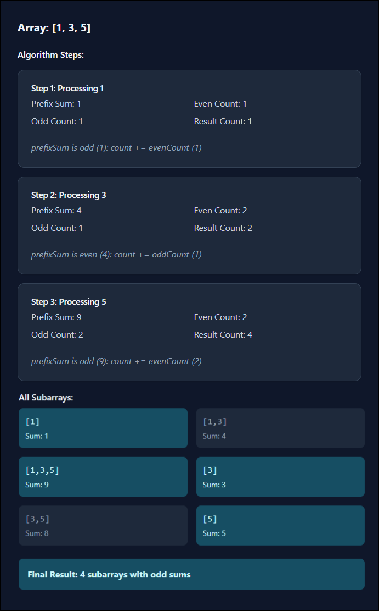

## Solution

---

### Overview

We are given an array of integers, and our task is to count the number of subarrays whose sums are odd. Since the number of possible subarrays can be large, we return the count modulo $10^9 + 7$.

A subarray is a contiguous portion of the array, meaning we must consider all possible starting and ending indices. The sum of a subarray is simply the sum of its elements.

For example, given `arr = [1,3,5]`, the possible subarrays are:
- $[1] → sum = 1 (odd)$
- $[1,3] → sum = 4 (even)$
- $[1,3,5] → sum = 9 (odd)$
- $[3] → sum = 3 (odd)$
- $[3,5] → sum = 8 (even)$
- $[5] → sum = 5 (odd)$

Here, the subarrays with an odd sum are `[1]`, `[1,3,5]`, `[3]`, and `[5]`, giving us the answer `4`.

A sliding window approach is generally useful when dealing with subarrays, but in this case, we cannot use it effectively. The problem requires counting all valid subarrays, not just maintaining a fixed window of size `k` or optimizing a contiguous segment. Since the valid subarrays are scattered across different positions and lengths, sliding window techniques do not provide any direct optimization here.

---

### Approach 1: Brute Force (TLE)

#### Intuition

The most direct way to solve this problem is to explicitly generate all possible subarrays and check which ones have an odd sum.

To do this, we iterate over every possible starting index in the array. For each start, we extend the subarray one element at a time, maintaining a running sum as we go. Each time we add a new element to the sum, we check if it is odd. If it is, we increment our count.

Since we check all possible start and end pairs, the number of subarrays we examine is proportional to the square of the array size, leading to a time complexity of $O(n^2)$. This means that for large arrays, the approach becomes too slow to be practical, leading to a Time Limit Exceeded (TLE) error.

#### Algorithm

- Define a constant `MOD` with a value of $10^9 + 7$ to handle large numbers.
- Initialize `n` to store the size of the array and `count` to keep track of the number of subarrays with an odd sum.

- Iterate over each possible starting index `startIndex` in the array:
  - Initialize `currentSum` to `0`, which will store the sum of the current subarray.

  - Iterate over each possible ending index `endIndex`, extending the subarray:
- Add $\text{arr}[endIndex]$ to `currentSum`.
- If `currentSum` is odd, increment `count`.

- Return `count % MOD` to ensure the result stays within bounds.

#### Implementation

```python
class Solution:
    def numOfSubarrays(self, arr: List[int]) -> int:
        MOD = 1e9 + 7
        n = len(arr)
        count = 0

        # Generate all possible subarrays
        for start_index in range(n):
            current_sum = 0
            # Iterate through each subarray starting at start_index
            for end_index in range(start_index, n):
                current_sum += arr[end_index]
                # Check if the sum is odd
                if current_sum % 2 != 0:
                    count += 1

        return int(count % MOD)
```

#### Complexity Analysis

Let $n$ be the size of the input array `arr`.

- Time complexity: $O(n^2)$

    The algorithm uses a nested loop to generate all possible subarrays. The outer loop runs $n$ times, and for each iteration of the outer loop, the inner loop runs up to $n$ times in the worst case. Therefore, the total number of iterations is $n \times n = n^2$. Each iteration involves a constant amount of work (addition and modulo operation), so the time complexity is $O(n^2)$.

- Space complexity: $O(1)$

    The space used by the algorithm is constant, as it only uses a few integer variables (`count`, `currentSum`, `startIndex`, `endIndex`, and `MOD`). No additional data structures that scale with the input size are used. Therefore, the space complexity is $O(1)$.

---

### Approach 2: Dynamic Programming

#### Intuition

The key insight is that we do not need to compute the sum of every subarray explicitly. Instead, we only need to track the counts for the previous index and update them accordingly.

To achieve this, we observe how adding a number affects the parity of a sum:
- Adding an odd number flips the parity (even sum becomes odd, odd sum becomes even).
- Adding an even number preserves the parity (even sum stays even, odd sum stays odd).

To implement this efficiently, we use a 2×2 DP table, $\text{dp}[2][2]$, where $\text{dp}[0][idx]$ represents the number of subarrays ending at index `i` with an even sum, and $\text{dp}[1][idx]$ represents the number of subarrays ending at index `i` with an odd sum. As we iterate through the array, we determine the parity of the current element and update these counts accordingly. If the element is odd, it flips the parity of previous subarrays, meaning that the count of new odd subarrays comes from the number of even subarrays from the previous index plus the current element itself. If the element is even, it preserves the parity, meaning that the count of even and odd subarrays remains the same as before, except for the inclusion of the new single-element subarray.

At the end of our iteration, the total number of subarrays with an odd sum is simply the sum of all values in $\text{dp}[1][idx]$, since these represent subarrays that end at various indices and have an odd sum.

> For a more comprehensive understanding of dynamic programming, check out the [Dynamic Programming Explore Card 🔗](https://leetcode.com/explore/learn/card/dynamic-programming/).

#### Algorithm

- Define `MOD` as $1e9 + 7$ for handling large numbers modulo constraint.
- Initialize `n` as the size of `arr`.
- Use a 2x2 `dp` array to track counts of even and odd sum subarrays.
- Initialize `count` to track the total number of odd sum subarrays.

- Iterate over `arr` using index `i`:
  - Compute `idx` as `i & 1` to alternate between 0 and 1 for even/odd index tracking.
  - Compute `parity` as $\text{arr}[i] \& 1$ to determine if the current element is odd (`1`) or even (`0`).
  - If the element is odd, update $\text{dp}[1][idx]$ to $1 + \text{dp}[0][!idx]$ since an odd element flips the sum parity.
  - If the element is even, update $\text{dp}[0][idx]$ to $\text{dp}[1][!idx]$ since an even element maintains the previous sum parity.
  - Accumulate $\text{dp}[1][idx]$ into `count` since it represents the number of subarrays ending at `i` with an odd sum.

- Return `count`, which holds the total count of odd sum subarrays modulo `MOD`.

#### Implementation

```python
class Solution:
    def numOfSubarrays(self, arr: List[int]) -> int:
        MOD = 10**9 + 7
        n = len(arr)

        # dp to track counts for even and odd sum subarrays
        dp = [[0, 0], [0, 0]]

        # Stores the final count of subarrays with an odd sum
        count = dp[1][0]

        for i in range(n):
            # Alternates between 0 and 1 for even/odd index tracking
            idx = i & 1
            # Determines if the current element is odd (1) or even (0)
            parity = arr[i] & 1

            # If the current element is odd, it contributes to odd subarrays
            # If the current element is even, it contributes to even subarrays
            dp[parity][idx] = (1 + dp[0][1 - idx]) % MOD
            dp[1 - parity][idx] = dp[1][1 - idx] % MOD

            # Accumulate the count of odd subarrays
            count = (count + dp[1][idx]) % MOD

        return count
```

#### Complexity Analysis

Let $n$ be the size of the input array `arr`.

- Time complexity: $O(n)$

    The algorithm processes the array in a single pass, iterating through each element exactly once. During each iteration, we perform constant-time operations, including updating the `dp` table and computing the count of odd-sum subarrays. Since all operations inside the loop are $O(1)$, the overall time complexity remains $O(n)$.

- Space complexity: $O(n)$

    The algorithm maintains only a fixed-size $\text{dp}[2][2]$ table. Since this table occupies only constant space regardless of $n$, the overall space complexity is $O(1)$. All other variables also use constant space.

---

### Approach 3: Prefix Sum with Odd-Even Counting

#### Intuition

Instead of computing the sum of every possible subarray from scratch, we can leverage prefix sums to speed things up. The key insight is that the sum of any subarray can be determined by the difference between two prefix sums.

To understand this, consider the prefix sum at an index, which represents the cumulative sum of elements from the start of the array up to that index. The sum of a subarray starting at index `i` and ending at `j` is simply the difference between the prefix sum at `j` and the prefix sum at $i - 1$. This means that whether a subarray sum is odd or even depends only on the parity (odd/even property) of these two prefix sums.

From this, we can make a crucial observation:
- If two prefix sums have the same parity (both even or both odd), their difference will be **even**, meaning the subarray sum is even.
- If two prefix sums have different parity (one is even, the other is odd), their difference will be **odd**, meaning the subarray sum is odd.

This leads to an efficient way to count odd subarrays as we traverse the array. We maintain a cumulative `prefixSum` while keeping track of how many times we've seen an even or odd prefix sum before the current index. As we process each element:
- If `prefixSum` is even, it means the subarray sum from the start to the current index is even. To form an odd subarray, we need to subtract a previously seen **odd** prefix sum. So, we add the count of previously seen odd prefix sums to our answer.
- If `prefixSum` is odd, the subarray sum from the start to the current index is odd. To form another odd subarray, we need to subtract a previously seen **even** prefix sum. So, we add the count of previously seen even prefix sums to our answer.

Finally, after each update, we apply the modulo operation to ensure the result stays within the bounds.

The algorithm is visualized below:



#### Algorithm

- Initialize constants and variables:
  - `MOD` is set to $10^9 + 7$ to handle large results.
  - `count` is initialized to `0`, which will store the result.
  - `prefixSum` is initialized to `0`, which will hold the running sum of the elements.
  - `oddCount` is initialized to `0`, to count the number of subarrays with odd prefix sums.
  - `evenCount` is initialized to `1`, since the sum starting at `0` is even.

- Iterate through each number `num` in the array `arr`:
  - Add `num` to `prefixSum`.
  - If `prefixSum` is even, add `oddCount` to `count` and increment `evenCount` (since the sum is now even).
  - If `prefixSum` is odd, add `evenCount` to `count` and increment `oddCount` (since the sum is now odd).
  - Apply modulo operation `count %= MOD` to prevent overflow.

- Return the final value of `count`, which represents the total number of subarrays with odd sums.

#### Implementation

```python
class Solution:
    def numOfSubarrays(self, arr: List[int]) -> int:
        MOD = 10**9 + 7
        count = prefix_sum = 0
        # even_count starts as 1 since the initial sum (0) is even
        odd_count = 0
        even_count = 1

        for num in arr:
            prefix_sum += num
            # If current prefix sum is even, add the number of odd subarrays
            if prefix_sum % 2 == 0:
                count += odd_count
                even_count += 1
            else:
                # If current prefix sum is odd, add the number of even
                # subarrays
                count += even_count
                odd_count += 1

            count %= MOD  # To handle large results

        return count
```

#### Complexity Analysis

Let $n$ be the size of the input array `arr`.

- Time complexity: $O(n)$

    The algorithm processes the array in a single pass. For each element in the array, it updates the `prefixSum`, checks whether the current prefix sum is even or odd, and updates the `count`, `oddCount`, and `evenCount` variables accordingly. Each of these operations takes constant time. Since the loop iterates through the array once, the overall time complexity is $O(n)$.

- Space complexity: $O(1)$

    The algorithm uses a constant amount of extra space. It only maintains a few integer variables (`count`, `prefixSum`, `oddCount`, and `evenCount`), regardless of the size of the input array. No additional data structures that scale with the input size are used. Therefore, the space complexity is $O(1)$.

---