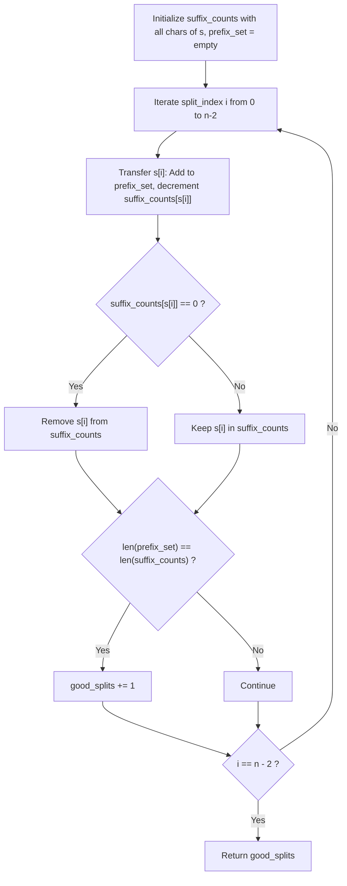

# Guided Example: Number of Good Ways to Split a String

## 1. Instance & Teaching Goal

We are given a string of length $n = 6$:
$$s = \text{"aacaba"}$$

A split partitions $s$ into two non-empty substrings $s_{\text{left}} = s[0 \dots i]$ and $s_{\text{right}} = s[i+1 \dots n-1]$ for some boundary index $0 \le i < n - 1$. The split is defined as **good** if both halves contain the exact same number of unique characters:
$$|\text{Distinct}(s_{\text{left}})| = |\text{Distinct}(s_{\text{right}})|$$
Our teaching goal is to count all valid split points. We demonstrate the two-pointer prefix-suffix distinct frequency sweep, showing how a single sliding cut updates distinct character counts in $\mathcal{O}(1)$ time per partition.

## 2. Conceptual Foundation & Invariants

Let $n$ be the length of $s$. There are exactly $n - 1$ candidate split points.
1. **Prefix and Suffix Distinct Counting**:
   For any partition index $i \in [0, n - 2]$:
   - Prefix: $s_{\text{left}} = s[0 \dots i]$
   - Suffix: $s_{\text{right}} = s[i+1 \dots n - 1]$
   A naive recount of unique letters in each half takes $\mathcal{O}(n)$ per cut, resulting in $\mathcal{O}(n^2)$ total operations.
2. **Sliding Partition Invariant**:
   As the partition boundary $i$ advances from left to right:
   - Character $c = s[i]$ moves from the suffix into the prefix.
   - **Prefix State**: $c$ is inserted into the prefix character set $\text{vis}$. The prefix distinct count increases by $1$ if $c$ was not already in $\text{vis}$.
   - **Suffix State**: The occurrence count of $c$ in the suffix frequency table $\text{cnt}$ decreases by $1$. If $\text{cnt}[c]$ drops to $0$, $c$ no longer exists in the suffix, decrementing the suffix distinct count by $1$.
   - **Good Split Test**: If $|\text{vis}| = |\text{cnt}|$, the current boundary $i$ constitutes a good split.
3. **Monotonic Distinct Cross-Over**:
   The number of distinct characters in the prefix $|\text{vis}|$ is monotonically non-decreasing with $i$, while the number of distinct characters in the suffix $|\text{cnt}|$ is monotonically non-increasing with $i$. Good splits correspond to the contiguous plateau where the two monotonic curves intersect.

```text
+-------------------------------------------------------------------------------+
|                      SLIDING PARTITION DIVERSITY PROFILE                      |
|                                                                               |
|  String: a a c a b a                                                          |
|                                                                               |
|  Split after index 0: ("a", "acaba")    Prefix = {a} (1), Suffix = {a,b,c} (3)|
|  Split after index 1: ("aa", "caba")    Prefix = {a} (1), Suffix = {a,b,c} (3)|
|  Split after index 2: ("aac", "aba")    Prefix = {a,c} (2), Suffix = {a,b} (2)|
|                       -> MATCH: 2 == 2 (Good Split 1)                         |
|  Split after index 3: ("aaca", "ba")    Prefix = {a,c} (2), Suffix = {a,b} (2)|
|                       -> MATCH: 2 == 2 (Good Split 2)                         |
|  Split after index 4: ("aacab", "a")    Prefix = {a,b,c} (3), Suffix = {a} (1)|
|                                                                               |
|  Total Good Splits: 2                                                         |
+-------------------------------------------------------------------------------+
```

The algorithm maintains the following state variables:

| State Variable | Domain | Initial Value | Transition / Role |
|---|---|---|---|
| `prefix_set` | Set of characters | $\emptyset$ | Unique characters present in $s[0 \dots i]$. |
| `suffix_counts` | Frequency map | Full histogram of $s$ | Frequency of each character in $s[i+1 \dots n-1]$. |
| `split_index` | Integer $\in [0, n-2]$ | $0$ | Boundary after which the string is sliced. |
| `good_splits` | Integer $\ge 0$ | $0$ | Running count of valid partitions where $|\text{prefix\_set}| = |\text{suffix\_counts}|$. |

> [!IMPORTANT]
> **Partition Completeness Invariant**: Both substrings must be strictly non-empty ($s_{\text{left}} \ne \emptyset$ and $s_{\text{right}} \ne \emptyset$). Slicing before index $0$ or after index $n-1$ is strictly forbidden.



## 3. Step-by-Step Worked Execution

We walk through the representative instance $s = \text{"aacaba"}$ of length $n = 6$.

### Initialization
- Full histogram of $s$:
  $$\text{suffix\_counts} = \{\text{'a'}: 4, \text{'c'}: 1, \text{'b'}: 1\}$$
- Initial distinct counts: suffix has $3$ distinct characters.
- Prefix set: $\text{prefix\_set} = \emptyset$ ($0$ distinct characters).
- Accumulator: $\text{good\_splits} = 0$.

---

### Step 1: Split after Index $i = 0$ (Character `'a'`)
- Character migrating: $s[0] = \text{'a'}$.
- Add to prefix: $\text{prefix\_set} = \{\text{'a'}\} \implies |\text{prefix\_set}| = 1$.
- Decrement suffix: $\text{suffix\_counts}[\text{'a'}] \leftarrow 4 - 1 = 3$.
- Suffix distinct count: $3$ (keys: `'a'`, `'c'`, `'b'`).
- Comparison: $|\text{prefix\_set}| = 1 \ne |\text{suffix\_counts}| = 3$.
- Status: Suboptimal ($1 \ne 3$).

---

### Step 2: Split after Index $i = 1$ (Character `'a'`)
- Character migrating: $s[1] = \text{'a'}$.
- Add to prefix: $\text{prefix\_set} = \{\text{'a'}\} \implies |\text{prefix\_set}| = 1$.
- Decrement suffix: $\text{suffix\_counts}[\text{'a'}] \leftarrow 3 - 1 = 2$.
- Suffix distinct count: $3$ (keys: `'a'`, `'c'`, `'b'`).
- Comparison: $|\text{prefix\_set}| = 1 \ne |\text{suffix\_counts}| = 3$.
- Status: Suboptimal ($1 \ne 3$).

---

### Step 3: Split after Index $i = 2$ (Character `'c'`)
- Character migrating: $s[2] = \text{'c'}$.
- Add to prefix: $\text{prefix\_set} = \{\text{'a'}, \text{'c'}\} \implies |\text{prefix\_set}| = 2$.
- Decrement suffix: $\text{suffix\_counts}[\text{'c'}] \leftarrow 1 - 1 = 0$.
- Zero frequency reached: remove `'c'` from suffix map.
- Suffix distinct count: $2$ (keys: `'a'`, `'b'`).
- Comparison: $|\text{prefix\_set}| = 2 == |\text{suffix\_counts}| = 2$.
- Status: **Match!** $\text{good\_splits} \leftarrow 0 + 1 = 1$.
  - Substrings: $s_{\text{left}} = \text{"aac"}$, $s_{\text{right}} = \text{"aba"}$.

---

### Step 4: Split after Index $i = 3$ (Character `'a'`)
- Character migrating: $s[3] = \text{'a'}$.
- Add to prefix: $\text{prefix\_set} = \{\text{'a'}, \text{'c'}\} \implies |\text{prefix\_set}| = 2$.
- Decrement suffix: $\text{suffix\_counts}[\text{'a'}] \leftarrow 2 - 1 = 1$.
- Suffix distinct count: $2$ (keys: `'a'`, `'b'`).
- Comparison: $|\text{prefix\_set}| = 2 == |\text{suffix\_counts}| = 2$.
- Status: **Match!** $\text{good\_splits} \leftarrow 1 + 1 = 2$.
  - Substrings: $s_{\text{left}} = \text{"aaca"}$, $s_{\text{right}} = \text{"ba"}$.

---

### Step 5: Split after Index $i = 4$ (Character `'b'`)
- Character migrating: $s[4] = \text{'b'}$.
- Add to prefix: $\text{prefix\_set} = \{\text{'a'}, \text{'c'}, \text{'b'}\} \implies |\text{prefix\_set}| = 3$.
- Decrement suffix: $\text{suffix\_counts}[\text{'b'}] \leftarrow 1 - 1 = 0$.
- Zero frequency reached: remove `'b'` from suffix map.
- Suffix distinct count: $1$ (keys: `'a'`).
- Comparison: $|\text{prefix\_set}| = 3 \ne |\text{suffix\_counts}| = 1$.
- Status: Suboptimal ($3 \ne 1$).

All $n - 1 = 5$ candidate cuts evaluated. Total good splits: $2$.

## 4. Complete Execution Trace

We collect the complete boundary evaluation trace in the table below.

| Split Index $i$ | Substrings $(s_{\text{left}}, s_{\text{right}})$ | Prefix Distinct Set | Prefix Unique Count | Suffix Active Map | Suffix Unique Count | Equality Test | Decision |
|---|---|---|---|---|---|---|---|
| $0$ | $(\text{"a"}, \text{"acaba"})$ | $\{\text{'a'}\}$ | $1$ | $\{\text{'a'}:3, \text{'c'}:1, \text{'b'}:1\}$ | $3$ | $1 == 3$ (False) | Rejected |
| $1$ | $(\text{"aa"}, \text{"caba"})$ | $\{\text{'a'}\}$ | $1$ | $\{\text{'a'}:2, \text{'c'}:1, \text{'b'}:1\}$ | $3$ | $1 == 3$ (False) | Rejected |
| $2$ | $(\text{"aac"}, \text{"aba"})$ | $\{\text{'a'}, \text{'c'}\}$ | $2$ | $\{\text{'a'}:2, \text{'b'}:1\}$ | $2$ | $2 == 2$ (**True**) | **Good Split 1** |
| $3$ | $(\text{"aaca"}, \text{"ba"})$ | $\{\text{'a'}, \text{'c'}\}$ | $2$ | $\{\text{'a'}:1, \text{'b'}:1\}$ | $2$ | $2 == 2$ (**True**) | **Good Split 2** |
| $4$ | $(\text{"aacab"}, \text{"a"})$ | $\{\text{'a'}, \text{'c'}, \text{'b'}\}$ | $3$ | $\{\text{'a'}:1\}$ | $1$ | $3 == 1$ (False) | Rejected |

### Discrete Trajectory Profile

The progression of distinct counts across split indices:
- Prefix count: $1 \to 1 \to 2 \to 2 \to 3$ (Monotonically non-decreasing)
- Suffix count: $3 \to 3 \to 2 \to 2 \to 1$ (Monotonically non-increasing)
The intersection occurs precisely at indices $i = 2$ and $i = 3$, giving exactly $2$ good splits.

## 5. Algorithmic Correctness

### Soundness

At each step $i$, the prefix set $\text{prefix\_set}$ contains the set of characters $\{s[0], \dots, s[i]\}$, which is by definition $\text{Distinct}(s_{\text{left}})$.
Simultaneously, $\text{suffix\_counts}$ holds the exact positive frequencies of characters appearing in $\{s[i+1], \dots, s[n-1]\}$, so $|\text{suffix\_counts}|$ equals $|\text{Distinct}(s_{\text{right}})|$.
Because $i$ ranges strictly over $[0, n-2]$, both $s_{\text{left}}$ and $s_{\text{right}}$ are guaranteed to be non-empty strings whose concatenation equals $s$.
Comparing the two sizes accurately determines whether the split is good.

### Completeness

Any partition of $s$ into two non-empty substrings is uniquely identified by the split boundary $i \in [0, n-2]$.
Because the loop iterates exhaustively through all valid boundary indices $i \in [0, n-2]$, every valid split configuration is evaluated without omission.

## 6. Traps This Instance Exposes

- **Inclusive Boundary Overflow**: Allowing $i$ to reach $n - 1$. Splitting after index $n - 1$ leaves $s_{\text{right}}$ as the empty string `""`, violating the non-empty requirement.
- **Retaining Zero-Frequency Keys**: Decrementing the suffix count without removing the key when the count drops to $0$. A dictionary holding `'c': 0` still counts `'c'` toward `len(dict)` unless explicitly deleted, falsely inflating the suffix distinct count.
- **Substring Slice Recomputation**: Generating explicit string slices $s[:i+1]$ and $s[i+1:]$ and constructing `set()` on each slice in every iteration. Slicing creates $\mathcal{O}(n^2)$ time and memory overhead, resulting in TLE on $n = 10^5$.
- **Alphabet Bounds**: Assuming only specific letters can appear. The sliding table works seamlessly across the entire lowercase English alphabet ($26$ characters).

## 7. Complexity Derivation

### Time Complexity

- **Initial Frequency Map**: Scanning string $s$ of length $n$ to build the initial frequency histogram takes $\mathcal{O}(n)$ time.
- **Sliding Partition Loop**:
  - The loop runs $n - 1$ times.
  - In each step, inserting into the prefix set, decrementing a hash map counter, conditionally deleting a key, and comparing lengths takes $\mathcal{O}(1)$ time.
  - Total time for the sliding loop is $\mathcal{O}(n)$.
- Overall time complexity is strictly $\mathcal{O}(n)$, which is optimal.

### Auxiliary Space Complexity

- The prefix set holds at most $|\Sigma| \le 26$ distinct characters.
- The suffix frequency table holds at most $|\Sigma| \le 26$ key-value pairs.
- Auxiliary space complexity is strictly $\mathcal{O}(|\Sigma|) = \mathcal{O}(1)$.